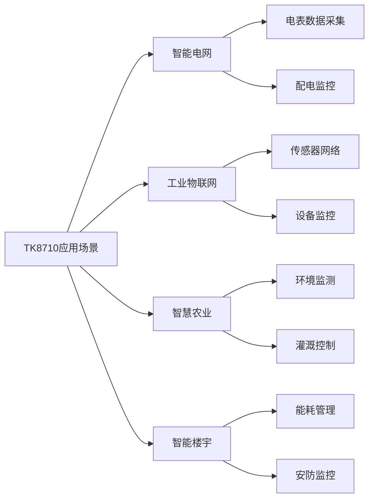
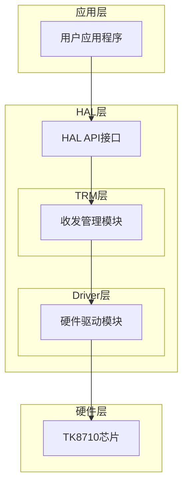
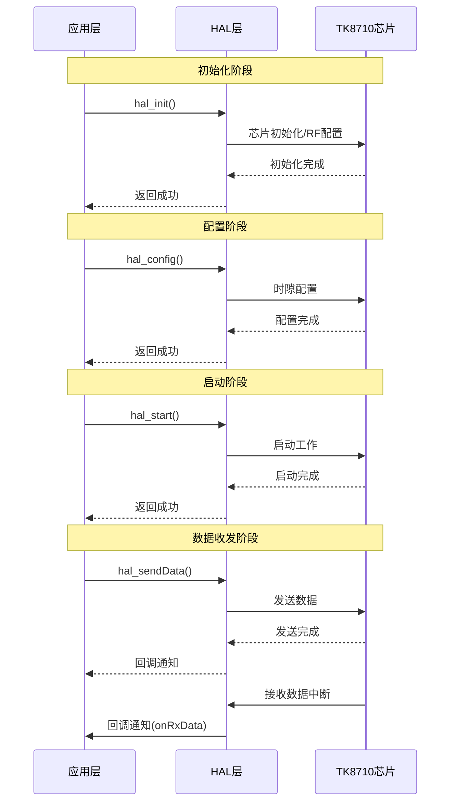
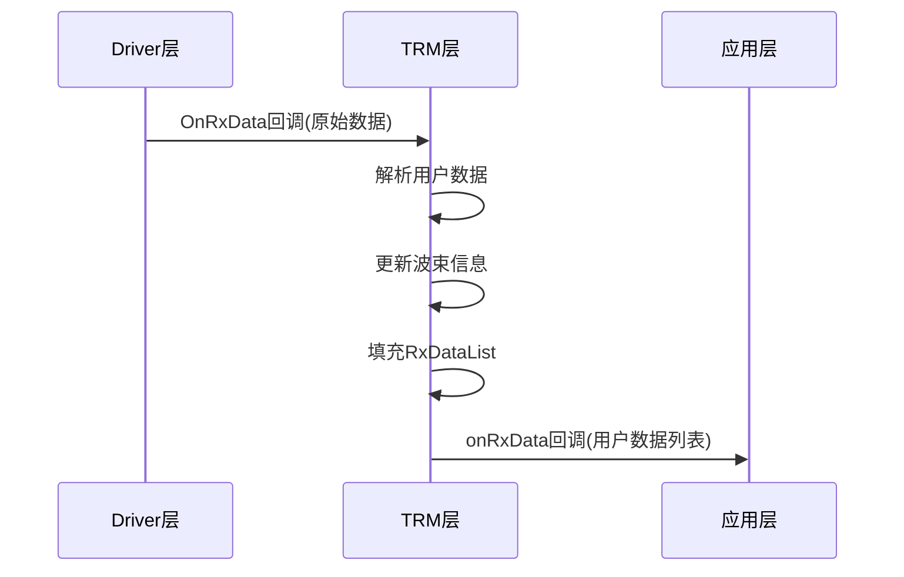
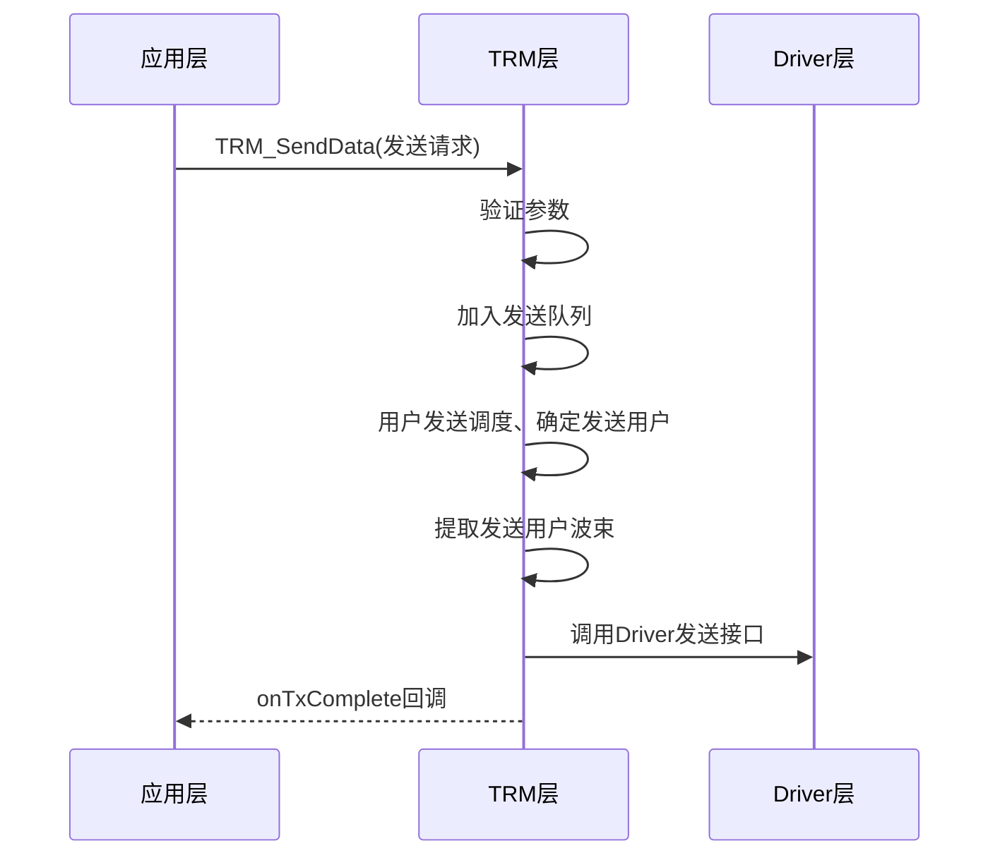
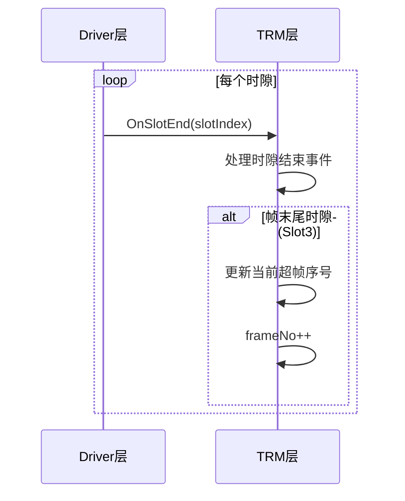
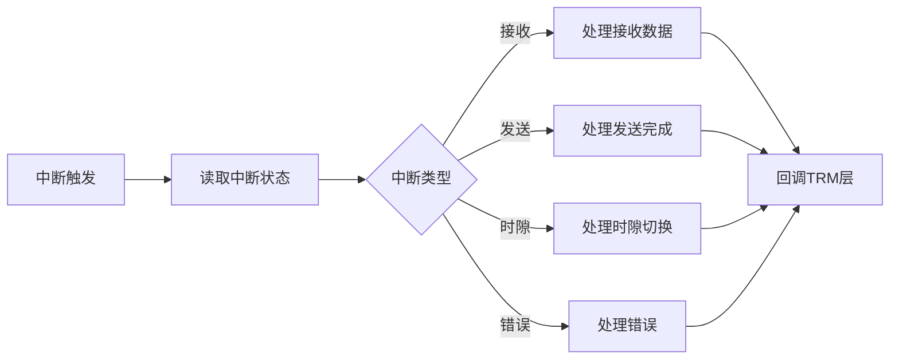
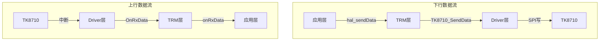

# TK8710 HAL 编程指南

目录

- [1. 8710简介](#1-8710简介)
  - [1.1 芯片概述](#11-芯片概述)
  - [1.2 主要特性](#12-主要特性)
  - [1.3 封装与引脚](#13-封装与引脚)
  - [1.4 时钟与电源](#14-时钟与电源)
  - [1.5 应用场景](#15-应用场景)
- [2. 8710 HAL概述](#2-8710-hal概述)
  - [2.1 软件架构](#21-软件架构)
  - [2.2 HAL层功能说明](#22-hal层功能说明)
  - [2.3 开发环境要求](#23-开发环境要求)
- [3. HAL API定义](#3-hal-api定义)
  - [3.1 API汇总表](#31-api汇总表)
  - [3.2 API详细说明](#32-api详细说明)
- [4. HAL概要设计](#4-hal概要设计)
  - [4.1 设计目标与原则](#41-设计目标与原则)
  - [4.2 TRM层设计](#42-trm层设计)
  - [4.3 Driver层设计](#43-driver层设计)
  - [4.4 层间接口设计](#44-层间接口设计)
- [5. 编程指南](#5-编程指南)
  - [5.1 快速入门](#51-快速入门)
  - [5.2 初始化流程](#52-初始化流程)
  - [5.3 配置流程](#53-配置流程)
  - [5.4 数据收发流程](#54-数据收发流程)
  - [5.5 状态查询](#55-状态查询)
  - [5.6 调试方法](#56-调试方法)
  - [5.7 完整工作流程示例](#57-完整工作流程示例)
- [6. 附录](#6-附录)
  - [6.1 错误码参考](#61-错误码参考)
  - [6.2 常见问题FAQ](#62-常见问题faq)
  - [6.3 术语表](#63-术语表)
  - [6.4 参考资料](#64-参考资料)

---

## 1. 8710简介

### 1.1 芯片概述

TKG8710是一款纯数字的多天线收发器，最多可以支持8个射频通道，128个用户同时收发。外部主控芯片可以通过SPI接口来控制和访问TK8710。TK8710最多可以外接8个RF，支持的RF：SX1255、SX1257。芯片需要外灌电源（3.3V）和时钟（32MHz）。

该芯片集成了先进的数字信号处理单元、多天线波束成形技术和灵活的时分双工（TDD）通信机制，能够在复杂的无线环境中提供稳定、高效的数据传输能力。TK8710采用SPI接口与主控芯片通信，支持中断驱动的异步数据处理模式，可与多种嵌入式平台无缝集成。

### 1.2 主要特性

| 特性类别           | 详细说明                                |
| ------------------ | --------------------------------------- |
| **芯片封装** | BGA324，尺寸15x15 mm                    |
| **通信频段** | 400MHz~510MHz / 862MHz~960MHz          |
| **天线配置** | 支持1、2、4、8天线配置              |
| **用户容量** | 最大支持128个用户同时收发               |
| **灵敏度**   | -146 dBm（mode5 @69Kbps，PER=5%）       |
| **信号带宽** | 62.5 kHz ~ 500kHz                       |
| **接口类型** | 4线SPI slave接口，最大16Mbps            |
| **时隙结构** | 支持4时隙TDD帧结构（BCN + 3个数据时隙） |
| **调制方式** | 支持多种速率模式（Rate 5-11, 18）       |
| **工作模式** | 主模式（Master）/ 从模式（Slave）       |

### 1.3 封装与引脚

#### 1.3.1 封装信息

TKG8710采用BGA324封装，尺寸15x15 mm。

#### 1.3.2 主要引脚定义


| 引脚编号 | 名称        | 类型 | 功能说明                 |
| -------- | ----------- | ---- | ------------------------ |
| 1        | CLK         | I    | 32MHz系统时钟            |
| 2        | TEST        | I    | DFT模式enable            |
| 3        | RSTN        | I    | 异步复位，低有效         |
| 48       | IRQ         | O    | 8710中断接口             |
| 73       | RF_SPI_CLK  | O    | 所有RF公用的SPI CLK接口  |
| 74       | RF_SPI_MOSI | O    | 所有RF公用的SPI MOSI接口 |
| 75       | SPI_CSN     | I    | 主机接口，SPI CS         |
| 76       | SPI_CLK     | I    | 主机接口，SPI CLK        |
| 77       | SPI_MOSI    | I    | 主机接口，SPI MOSI       |
| 78       | SPI_MISO    | O    | 主机接口，SPI MISO       |
| 4-12     | RF0_*       | I/O  | 射频0的接口              |
| 15-23    | RF1_*       | I/O  | 射频1的接口              |
| 26-34    | RF2_*       | I/O  | 射频2的接口              |
| 37-45    | RF3_*       | I/O  | 射频3的接口              |
| 51-59    | RF4_*       | I/O  | 射频4的接口              |
| 62-70    | RF5_*       | I/O  | 射频5的接口              |
| 79-87    | RF6_*       | I/O  | 射频6的接口              |
| 90-98    | RF7_*       | I/O  | 射频7的接口              |

### 1.4 时钟与电源

#### 1.4.1 时钟要求

| 参数         | 符号     | 典型值 | 单位 |
| ------------ | -------- | ------ | ---- |
| 晶体频率     | FXTAL    | 32     | MHz  |
| 晶体频率容差 | ppm XTAL | 10     | ppm  |

#### 1.4.2 电源要求

| 参数         | 符号 | 最小值 | 典型值 | 最大值 | 单位 |
| ------------ | ---- | ------ | ------ | ------ | ---- |
| 运行电源电压 | VDD  | 1.8    | 3.3    | 3.7    | V    |
| 运行温度     | TOP  | -40    | 25     | 85     | ℃   |

#### 1.4.3 功耗参数

| 参数     | 符号 | 条件         | 典型值 | 单位 |
| -------- | ---- | ------------ | ------ | ---- |
| 接收电流 | IRx  | 上行时隙电流 | 20     | mA   |
| 发射电流 | ITx  | 下行时隙电流 | 100    | mA   |

### 1.5 应用场景



- **智能电网**: 电表数据采集、配电网络监控
- **工业物联网**: 工厂传感器网络、设备状态监控
- **智慧农业**: 环境参数监测、自动灌溉控制
- **智能楼宇**: 能耗管理、安防监控系统

---

## 2. 8710 HAL概述

### 2.1 软件架构

TK8710 HAL（Hardware Abstraction Layer，硬件抽象层）为应用开发者提供了一套简洁、统一的编程接口，屏蔽了底层硬件的复杂性。HAL内部采用分层架构设计，由**TRM层**和**Driver层**两个核心模块组成。



#### 2.1.1 HAL分层架构

| 层级 | 模块 | 定位 | 说明 |
|------|------|------|------|
| **HAL API** | 统一接口层 | 对外接口 | 提供简洁的API供应用层调用 |
| **TRM层** | 收发管理层 | 业务逻辑 | 负责数据发送调度、超帧管理、波束管理等业务逻辑 |
| **Driver层** | 硬件驱动层 | 硬件抽象 | 负责SPI通信、中断处理、寄存器操作等硬件交互 |

#### 2.1.2 TRM层定位

TRM（Transceiver Resource Manager，收发资源管理器）是HAL的业务逻辑核心，位于HAL API和Driver层之间：

- **向上**: 接收HAL API的调用请求，处理业务逻辑
- **向下**: 调用Driver层接口完成硬件操作

> **注**: TRM层的详细功能和机制说明见后续《HAL概要设计》章节。

#### 2.1.3 Driver层定位

Driver层是HAL的硬件抽象核心，直接与TK8710芯片交互：

- **向上**: 为TRM层提供硬件操作接口
- **向下**: 通过SPI接口与TK8710芯片通信

> **注**: Driver层的详细功能和机制说明见后续《HAL概要设计》章节。

**架构特点**:

- **接口简洁**: 仅需6个核心API即可完成所有操作
- **分层设计**: TRM层处理业务逻辑，Driver层处理硬件交互
- **屏蔽复杂性**: 自动处理底层通信协议、中断管理、资源调度
- **易于集成**: 标准C接口，可移植到多种嵌入式平台
- **回调机制**: 支持异步数据接收和发送完成通知

### 2.2 HAL层功能说明

HAL层提供以下核心功能：

| 功能模块             | 说明                                            |
| -------------------- | ----------------------------------------------- |
| **初始化管理** | 芯片初始化、射频配置、日志系统配置              |
| **时隙配置**   | TDD帧结构配置、速率模式设置、天线配置           |
| **数据发送**   | 广播数据发送、用户专用数据发送                  |
| **状态监控**   | 运行状态查询、统计信息获取                      |
| **系统控制**   | 芯片启动、复位、调试（寄存器读写、TRM和Driver） |

**数据流向**:（放到后面合适位置）



### 2.3 开发环境要求

#### 硬件要求

| 项目               | 要求                             |
| ------------------ | -------------------------------- |
| **主控芯片** | 支持SPI接口的MCU/MPU（如RK3506） |
| **SPI接口**  | 最高16MHz，Mode 0                |
| **GPIO**     | 至少1个中断输入引脚              |
| **内存**     | RAM ≥ 64KB（推荐128KB）（待定） |

#### 软件要求

| 项目               | 要求                  |
| ------------------ | --------------------- |
| **编译器**   | GCC 4.8+ 或兼容编译器 |
| **C标准**    | C99或更高             |
| **操作系统** | 裸机 / Linux / RTOS   |

#### 支持平台

| 平台                   | 说明               |
| ---------------------- | ------------------ |
| **RK3506 Linux** | 使用交叉编译工具链 |

---

## 3. HAL API定义

### 3.1 API汇总表（首字母大写）

| API函数           | 功能描述  | 参数             | 返回值        |
| ----------------- | --------- | ---------------- | ------------- |
| `hal_init`      | HAL初始化 | 配置结构体指针   | 成功/失败状态 |
| `hal_config`    | HAL配置   | 时隙配置指针     | 成功/失败状态 |
| `hal_start`     | 启动HAL   | 无               | 成功/失败状态 |
| `hal_reset`     | 复位HAL   | 无               | 成功/失败状态 |
| `hal_sendData`  | 发送数据  | 完整的发送参数   | 成功/失败状态 |
| `hal_getStatus` | 获取状态  | 统计信息输出指针 | 成功/失败状态 |
| `hal_debug`     | 调试接口  | 调试类型和参数   | 成功/失败状态 |
| hal_cali          | 校准接口  | 自定义           | 成功/失败     |

### 3.2 API详细说明

#### 3.2.1 hal_init - HAL初始化(qdm 注册两个回调OnRxData OnTxComplete)

```c
TK8710_HalError hal_init(const TK8710_HalInitConfig* config);
```

**功能**: 初始化HAL层，分配资源，准备硬件接口

**参数**:

| 参数名 | 类型                        | 说明                             |
| ------ | --------------------------- | -------------------------------- |
| config | const TK8710_HalInitConfig* | 初始化配置指针，NULL使用默认配置 |

**参数结构体定义**:

```c
/* HAL初始化配置结构体 */
typedef struct {
    ChipConfig* tk8710Init;           /* 芯片配置，NULL使用默认值 */
    ChiprfConfig* rfConfig;           /* RF配置，NULL使用默认值 */
    struct {
        TK8710LogLevel logLevel;      /* 日志级别 */
        uint32_t moduleMask;          /* 模块掩码 */
    } driverLogConfig;
    TRM_InitConfig* trmInitConfig;    /* TRM配置，NULL使用默认值 */
    struct {
        uint8_t logLevel;             /* TRM日志级别 */
        bool enableStats;             /* 是否启用统计 */
    } trmLogConfig;
} TK8710_HalInitConfig;

/* 芯片配置结构体 */
typedef struct {
    uint32_t bcn_agc;       /* BCN AGC长度, 默认32 */
    uint32_t interval;      /* Intval长度, 默认32 */
    uint8_t  tx_dly;        /* 下行发送时延, 默认1 */
    uint8_t  tx_fix_info;   /* TX是否固定频点, 默认0 */
    int32_t  offset_adj;    /* BCN sync窗口微调, 单位us */
    int32_t  tx_pre;        /* 发送数据窗口调整, 单位us */
    uint8_t  conti_mode;    /* 连续工作模式使能, 默认1 */
    uint8_t  bcn_scan;      /* BCN SCAN模式使能, 默认0 */
    uint8_t  ant_en;        /* 天线使能, 默认0xFF */
    uint8_t  rf_sel;        /* 射频使能, 默认0xFF */
    uint8_t  tx_bcn_en;     /* 发送BCN使能, 默认1 */
    uint8_t  ts_sync;       /* 本地同步, 默认0 */
    uint8_t  rf_model;      /* 射频芯片型号: 1=SX1255, 2=SX1257 */
    uint8_t  bcnbits;       /* 信标标识位, 共5bit */
    uint32_t anoiseThe1;    /* 用户检测门限, 默认0 */
    uint32_t power2rssi;    /* RSSI换算 */
    uint32_t irq_ctrl0;     /* 中断使能 */
    uint32_t irq_ctrl1;     /* 中断清理 */
} ChipConfig;

/* RF配置结构体 */
typedef struct {
    rfType_e rftype;        /* 射频类型 */
    uint32_t Freq;          /* 射频中心频率, 单位Hz */
    uint8_t  rxgain;        /* 射频接收增益 */
    uint8_t  txgain;        /* 射频发送增益 */
    TxAdcConfig txadc[8];   /* 射频发送直流, 8天线 */
} ChiprfConfig;

typedef struct {
    int16_t i;              /* I路直流, 16bit */
    int16_t q;              /* Q路直流, 16bit */
} TxAdcConfig;
```

**返回值**:

| 返回值                 | 说明       |
| ---------------------- | ---------- |
| TK8710_HAL_OK          | 初始化成功 |
| TK8710_HAL_ERROR_PARAM | 参数错误   |
| TK8710_HAL_ERROR_INIT  | 初始化失败 |

**使用示例**:

```c
/* 使用默认配置初始化 */
TK8710_HalError ret = hal_init(NULL);
if (ret != TK8710_HAL_OK) {
    printf("HAL初始化失败: %d\n", ret);
    return -1;
}

/* 使用自定义配置初始化 */
TK8710_HalInitConfig config = {
    .tk8710Init = NULL,              /* 使用默认芯片配置 */
    .rfConfig = NULL,                /* 使用默认RF配置 */
    .driverLogConfig = {
        .logLevel = TK8710_LOG_INFO,
        .moduleMask = 0xFFFFFFFF
    },
    .trmInitConfig = NULL,           /* 使用默认系统配置 */
    .trmLogConfig = {
        .logLevel = 2,
        .enableStats = true
    }
};

ret = hal_init(&config);
```

---

#### 3.2.2 hal_config - HAL配置 （qdm 函数内部调用时隙计算器，获得N_sync for硬件控制）

```c
TK8710_HalError hal_config(const slotCfg_t* slotConfig);
```

**功能**: 配置HAL参数，设置时隙和工作模式

**参数**:

| 参数名     | 类型             | 说明                           |
| ---------- | ---------------- | ------------------------------ |
| slotConfig | const slotCfg_t* | 时隙配置指针，NULL使用当前配置 |

**参数结构体定义**:

```c
/* 时隙配置结构体 */
typedef struct {
    msMode_e   msMode;          /* 主从模式 */
    uint8_t    plCrcEn;         /* Payload CRC使能 */
    uint8_t    rateCount;       /* 速率个数，范围1~4 */
    rateMode_e rateModes[4];    /* 各时隙速率模式 */
    uint8_t    brdUserNum;      /* 广播时隙用户数, 范围1~16 */
    float      brdFreq[16];     /* 广播时隙发送用户的频率 */
    uint8_t    antEn;           /* 天线使能, 默认0xFF */
    uint8_t    rfSel;           /* RF天线选择, 默认0xFF */
    uint8_t    txAutoMode;      /* 下行发送模式: 0=自动, 1=指定 */
    uint8_t    txBcnEn;         /* BCN发送使能 */
    uint32_t   rx_delay;        /* RX delay, 默认0 */
    uint32_t   md_agc;          /* DATA AGC长度, 默认1024 */
    uint8_t    local_sync;      /* 本地同步 */
    SlotConfig s0Cfg[4];        /* 时隙0(BCN)配置 */
    SlotConfig s1Cfg[4];        /* 时隙1配置 */
    SlotConfig s2Cfg[4];        /* 时隙2配置 */
    SlotConfig s3Cfg[4];        /* 时隙3配置 */
    uint32_t   frameTimeLen;    /* TDD周期总时间长度, 单位us */
} slotCfg_t;

/* 单时隙配置结构体 */
typedef struct {
    uint16_t byteLen;       /* 时隙字节数 */
    uint32_t timeLen;       /* 时隙时间长度, 单位us */
    uint32_t centerFreq;    /* 时隙中心频点 */
    uint32_t FreqOffset;    /* 相较于中心频点的偏移 */
    uint32_t da_m;          /* 内部DAC参数 */
} SlotConfig;

/* 主从模式枚举 */
typedef enum {
    TK8710_MS_MASTER = 0,   /* 主模式 */
    TK8710_MS_SLAVE  = 1    /* 从模式 */
} msMode_e;

/* 速率模式枚举 */
typedef enum {
    TK8710_RATE_MODE_5  = 5,   /* 62.5kHz带宽 */
    TK8710_RATE_MODE_6  = 6,   /* 125kHz带宽 */
    TK8710_RATE_MODE_7  = 7,   /* 250kHz带宽 */
    TK8710_RATE_MODE_8  = 8,   /* 500kHz带宽 */
    TK8710_RATE_MODE_9  = 9,   /* 500kHz带宽, 64用户 */
    TK8710_RATE_MODE_10 = 10,  /* 500kHz带宽, 32用户 */
    TK8710_RATE_MODE_11 = 11,  /* 500kHz带宽, 16用户 */
    TK8710_RATE_MODE_18 = 18   /* 500kHz带宽, 16用户 */
} rateMode_e;
```

**返回值**:

| 返回值                  | 说明     |
| ----------------------- | -------- |
| TK8710_HAL_OK           | 配置成功 |
| TK8710_HAL_ERROR_CONFIG | 配置失败 |

**使用示例**:

```c
/* 使用当前配置 */
TK8710_HalError ret = hal_config(NULL);

/* 使用自定义时隙配置 */
slotCfg_t slotConfig = {
    .msMode = TK8710_MS_MASTER,      /* 主模式 */
    .rateCount = 1,                  /* 1个速率模式 */
    .rateModes = {TK8710_RATE_MODE_7},
    .brdUserNum = 4,                 /* 4个广播用户 */
    .antEn = 0xFF,                   /* 8天线使能 */
    .frameTimeLen = 100000,          /* 100ms帧周期 */
    /* ... 其他配置 */
};

ret = hal_config(&slotConfig);
if (ret != TK8710_HAL_OK) {
    printf("HAL配置失败: %d\n", ret);
}
```

---

#### 3.2.3 hal_start - 启动HAL （qdm 如果没有本地同步模式，8710立即开始第1帧，us延迟）

```c
TK8710_HalError hal_start(void);
```

**功能**: 启动HAL，开始硬件工作，可以收发数据

**参数**: 无

**返回值**:

| 返回值                 | 说明     |
| ---------------------- | -------- |
| TK8710_HAL_OK          | 启动成功 |
| TK8710_HAL_ERROR_START | 启动失败 |

**说明**:

- 使用主模式（Master）和连续工作模式启动
- 启动成功后可以进行数据收发操作

**使用示例**:

```c
TK8710_HalError ret = hal_start();
if (ret != TK8710_HAL_OK) {
    printf("HAL启动失败: %d\n", ret);
    return -1;
}
printf("HAL启动成功，可以开始收发数据\n");
```

---

#### 3.2.4 hal_reset - 复位HAL (qdm 停止8710，不工作，等待以下顺序init  config start；是否可以和init合并)

```c
TK8710_HalError hal_reset(void);
```

**功能**: 复位HAL，重新初始化硬件状态

**参数**: 无

**返回值**:

| 返回值                 | 说明     |
| ---------------------- | -------- |
| TK8710_HAL_OK          | 复位成功 |
| TK8710_HAL_ERROR_RESET | 复位失败 |

**说明**:

- 完全复位状态机和寄存器
- 清理系统资源
- 复位后需要重新调用 `hal_init()` 才能使用

**使用示例**:

```c
TK8710_HalError ret = hal_reset();
if (ret != TK8710_HAL_OK) {
    printf("HAL复位失败: %d\n", ret);
    return -1;
}
printf("HAL复位完成，需要重新初始化\n");
```

---

#### 3.2.5 hal_sendData - 发送数据（qdm 功率单位）

```c
TK8710_HalError hal_sendData(
    TK8710DownlinkType downlinkType,
    uint32_t userIdOrIndex,  （`userId_brdIndex`: 用户ID或广播索引 (qdm)）
    const uint8_t* data,
    uint16_t len,
    uint8_t txPower,
    uint32_t frameNo,
    uint8_t targetRateMode,
    uint8_t dataType
);
```

**功能**: 发送数据到目标设备

**参数**:

| 参数名          | 类型               | 说明                                                           |
| --------------- | ------------------ | -------------------------------------------------------------- |
| downlinkType    | TK8710DownlinkType | 下行类型：TK8710_DOWNLINK_A=广播，TK8710_DOWNLINK_B=用户数据   |
| userId_brdIndex | uint32_t           | 用户ID（用户数据）或广播索引（广播数据）                       |
| data            | const uint8_t*     | 数据指针                                                       |
| len             | uint16_t           | 数据长度（字节）                                               |
| txPower         | uint8_t            | 发送功率                                                       |
| frameNo         | uint32_t           | 帧号（仅用户数据使用，广播时忽略）                             |
| targetRateMode  | uint8_t            | 目标速率模式（仅用户数据使用，广播时忽略）                     |
| dataType        | uint8_t            | 数据类型：TK8710_DATA_TYPE_BRD=广播，TK8710_DATA_TYPE_DED=专用 |

**参数枚举定义**:

```c
/* 下行类型枚举 */
typedef enum {
    TK8710_DOWNLINK_A = 0,  /* slot1时隙发送 */
    TK8710_DOWNLINK_B = 1,  /* slot3时隙发送 */
} TK8710DownlinkType;

/* 数据波束类型定义 */
#define TK8710_DATA_TYPE_BRD     0   /* 广播波束 - 使用广播式波束发送数据 */
#define TK8710_DATA_TYPE_DED     1   /* 指定波束 - 使用针对性的波束 */
```

**返回值**:

| 返回值                | 说明                       |
| --------------------- | -------------------------- |
| TK8710_HAL_OK         | 发送成功（已加入发送队列） |
| TK8710_HAL_ERROR_SEND | 发送失败                   |

**说明**:

- 发送是异步的，数据加入发送队列后立即返回
- 实际发送结果通过回调函数通知

**使用示例**:

```c
/* 发送广播数据 */
uint8_t broadcastData[] = {0x01, 0x02, 0x03, 0x04};
TK8710_HalError ret = hal_sendData(
    TK8710_DOWNLINK_A,        /* 广播类型 */
    0,                        /* 广播索引 */
    broadcastData,            /* 数据 */
    sizeof(broadcastData),    /* 数据长度 */
    35,                       /* 发送功率 */
    0,                        /* 帧号（广播忽略） */
    0,                        /* 速率模式（广播忽略） */
    TK8710_DATA_TYPE_BRD      /* 广播数据类型 */
);

/* 发送用户专用数据 */
uint8_t userData[] = {0x11, 0x12, 0x13, 0x14, 0x15};
ret = hal_sendData(
    TK8710_DOWNLINK_B,        /* 用户数据类型 */
    0x30000001,               /* 用户ID */
    userData,                 /* 数据 */
    sizeof(userData),         /* 数据长度 */
    30,                       /* 发送功率 */
    100,                      /* 帧号 */
    TK8710_RATE_MODE_7,       /* 速率模式 */
    TK8710_DATA_TYPE_DED      /* 专用数据类型 */
);

if (ret != TK8710_HAL_OK) {
    printf("数据发送失败: %d\n", ret);
}
```

---

#### 3.2.6 hal_getStatus - 获取状态

```c
TK8710_HalError hal_getStatus(TRM_Stats* stats);
```

**功能**: 获取HAL当前状态信息

**参数**:

| 参数名 | 类型       | 说明             |
| ------ | ---------- | ---------------- |
| stats  | TRM_Stats* | 状态信息输出指针 |

**参数结构体定义**:

```c
/* 统计信息结构体 */
typedef struct {
    TrmState    state;             /* TRM运行状态 */
    uint32_t    txCount;           /* 总发送次数 */
    uint32_t    txSuccessCount;    /* 发送成功次数 */
    uint32_t    txFailureCount;    /* 发送失败次数 */
    uint32_t    txRetryCount;      /* 发送重试次数 */
    uint32_t    rxCount;           /* 总接收次数 */
    uint32_t    rxDataCount;       /* 接收数据次数 */
    uint32_t    beamCount;         /* 当前波束数量 */
    uint32_t    memAllocCount;     /* 内存分配次数 */
    uint32_t    memFreeCount;      /* 内存释放次数 */
    uint32_t    txQueueRemaining;  /* 剩余发送队列数量 */
} TRM_Stats;

/* TRM状态枚举 */
typedef enum {
    TRM_STATE_UNINIT = 0,    /* 未初始化 */
    TRM_STATE_INITED,        /* 已初始化 */
    TRM_STATE_RUNNING,       /* 运行中 */
    TRM_STATE_STOPPED,       /* 已停止 */
    TRM_STATE_ERROR          /* 错误状态 */
} TrmState;
```

**返回值**:

| 返回值                  | 说明                    |
| ----------------------- | ----------------------- |
| TK8710_HAL_OK           | 获取成功                |
| TK8710_HAL_ERROR_PARAM  | 参数错误（stats为NULL） |
| TK8710_HAL_ERROR_STATUS | 状态查询失败            |

**说明**:

- 提供完整的系统状态信息
- 包括发送、接收、内存、队列等统计

**使用示例**:

```c
TRM_Stats stats;
TK8710_HalError ret = hal_getStatus(&stats);
if (ret == TK8710_HAL_OK) {
    printf("=== HAL状态信息 ===\n");
    printf("运行状态: %d\n", stats.state);
    printf("发送成功: %u\n", stats.txSuccessCount);
    printf("发送失败: %u\n", stats.txFailureCount);
    printf("接收数据: %u\n", stats.rxDataCount);
    printf("剩余队列: %u\n", stats.txQueueRemaining);
} else {
    printf("获取状态失败: %d\n", ret);
}
```

---

#### 3.2.7 hal_debug - 调试接口

```c
TK8710_HalError hal_debug(uint32_t type, void* para);
```

**功能**: 提供HAL层调试功能

**参数**:

| 参数名 | 类型     | 说明                                                     |
| ------ | -------- | -------------------------------------------------------- |
| type   | uint32_t | 调试类型：0=系统调试，1=硬件调试，2=通信调试，3=中断调试 |
| para   | void*    | 调试参数指针，根据type不同而变化                         |

**返回值**:

| 返回值                 | 说明                       |
| ---------------------- | -------------------------- |
| TK8710_HAL_OK          | 调试操作成功               |
| TK8710_HAL_ERROR_PARAM | 参数错误或不支持的调试类型 |

**说明**:

- 提供灵活的调试接口，支持多种调试功能
- 通过type参数指定调试操作类型
- 主要用于开发调试和问题诊断

**使用示例**:

```c
/* 系统调试 */
TK8710_HalError ret = hal_debug(0, NULL);

/* 硬件调试 */
ret = hal_debug(1, NULL);

/* 通信调试 */
ret = hal_debug(2, NULL);

/* 中断调试 */
ret = hal_debug(3, NULL);
```

---

## 4. 编程指南

### 4.1 快速入门

以下是使用HAL API的最简示例，展示了从初始化到发送数据的基本流程：

```c
#include "8710_hal_api.h"
#include <stdio.h>

int main(void)
{
    TK8710_HalError ret;
  
    /* 1. 初始化HAL（使用默认配置） */
    ret = hal_init(NULL);
    if (ret != TK8710_HAL_OK) {
        printf("初始化失败: %d\n", ret);
        return -1;
    }
  
    /* 2. 配置HAL（使用默认时隙配置） */
    ret = hal_config(NULL);
    if (ret != TK8710_HAL_OK) {
        printf("配置失败: %d\n", ret);
        return -1;
    }
  
    /* 3. 启动HAL */
    ret = hal_start();
    if (ret != TK8710_HAL_OK) {
        printf("启动失败: %d\n", ret);
        return -1;
    }
  
    /* 4. 发送数据 */
    uint8_t data[] = {0x01, 0x02, 0x03};
    ret = hal_sendData(TK8710_DOWNLINK_A, 0, data, sizeof(data), 35, 0, 0, TK8710_DATA_TYPE_BRD);
    if (ret == TK8710_HAL_OK) {
        printf("数据发送成功\n");
    }
  
    /* 5. 获取状态 */
    TRM_Stats stats;
    hal_getStatus(&stats);
    printf("发送次数: %u\n", stats.txCount);
  
    return 0;
}
```

### 4.2 初始化流程

#### 4.2.1 使用默认配置

最简单的初始化方式，适用于大多数应用场景：

```c
TK8710_HalError ret = hal_init(NULL);
if (ret != TK8710_HAL_OK) {
    printf("HAL初始化失败: %d\n", ret);
    return -1;
}
printf("HAL初始化成功\n");
```

#### 4.2.2 使用自定义配置

当需要自定义芯片参数、RF配置或日志级别时：

```c
/* 自定义芯片配置 */
ChipConfig chipConfig = {
    .bcn_agc = 32,
    .interval = 32,
    .tx_dly = 1,
    .conti_mode = 1,
    .ant_en = 0xFF,
    .rf_sel = 0xFF,
    .tx_bcn_en = 1,
    .rf_model = 2,              /* SX1257 */
    .irq_ctrl0 = 0xFFFFFFFF,
    .irq_ctrl1 = 0
};

/* 自定义RF配置 */
ChiprfConfig rfConfig = {
    .rftype = TK8710_RF_TYPE_1257_32M,
    .Freq = 470000000,         /* 2.4GHz */
    .rxgain = 1,
    .txgain = 20
};

/* 组合配置 */
TK8710_HalInitConfig config = {
    .tk8710Init = &chipConfig,
    .rfConfig = &rfConfig,
    .driverLogConfig = {
        .logLevel = TK8710_LOG_DEBUG,   /* 调试级别 */
        .moduleMask = 0xFFFFFFFF
    },
    .trmInitConfig = NULL,
    .trmLogConfig = {
        .logLevel = 3,
        .enableStats = true
    }
};

TK8710_HalError ret = hal_init(&config);
```

### 4.3 配置流程

#### 4.3.1 使用默认时隙配置

```c
TK8710_HalError ret = hal_config(NULL);
if (ret != TK8710_HAL_OK) {
    printf("配置失败: %d\n", ret);
}
```

#### 4.3.2 自定义时隙配置

```c
slotCfg_t slotConfig = {
    .msMode = TK8710_MS_MASTER,     /* 主模式 */
    .plCrcEn = 1,                   /* 使能Payload CRC */
    .rateCount = 1,                 /* 1个速率模式 */
    .rateModes = {TK8710_RATE_MODE_7, 0, 0, 0},
    .brdUserNum = 4,                /* 4个广播用户 */
    .antEn = 0xFF,                  /* 8天线使能 */
    .rfSel = 0xFF,
    .txAutoMode = 0,                /* 自动发送模式 */
    .txBcnEn = 1,                   /* 使能BCN发送 */
    .local_sync = 1,                /* 本地同步 */
    .frameTimeLen = 100000,         /* 100ms帧周期 */
  
    /* 时隙0配置（BCN） */
    .s0Cfg = {
        {.byteLen = 32, .centerFreq = 470000000, .FreqOffset = 0}
    },
    /* 时隙1配置 */
    .s1Cfg = {
        {.byteLen = 64, .centerFreq = 470000000, .FreqOffset = 0}
    },
    /* 时隙2配置 */
    .s2Cfg = {
        {.byteLen = 64, .centerFreq = 470000000, .FreqOffset = 0}
    },
    /* 时隙3配置 */
    .s3Cfg = {
        {.byteLen = 64, .centerFreq = 470000000, .FreqOffset = 0}
    }
};

TK8710_HalError ret = hal_config(&slotConfig);
```

### 4.4 数据收发流程

#### 4.4.1 发送广播数据

广播数据发送给所有设备：

```c
uint8_t broadcastData[] = {0xAA, 0xBB, 0xCC, 0xDD};

TK8710_HalError ret = hal_sendData(
    TK8710_DOWNLINK_A,            /* 广播类型 */ （qdm：时隙选择）
    0,                            /* 广播索引（0-15） */
    broadcastData,                /* 数据 */
    sizeof(broadcastData),        /* 长度 */
    35,                           /* 发送功率 */
    0,                            /* 帧号（广播忽略） */
    0,                            /* 速率模式（广播忽略） */
    TK8710_DATA_TYPE_BRD          /* 广播数据类型 */
);

if (ret == TK8710_HAL_OK) {
    printf("广播数据已加入发送队列\n");
}
```

#### 4.4.2 发送用户专用数据

用户专用数据发送给指定用户：

```c
uint32_t userId = 0x30000001;     /* 目标用户ID */
uint8_t userData[] = {0x01, 0x02, 0x03, 0x04, 0x05};

TK8710_HalError ret = hal_sendData(
    TK8710_DOWNLINK_B,            /* 用户数据类型 */
    userId,                       /* 用户ID */
    userData,                     /* 数据 */
    sizeof(userData),             /* 长度 */
    30,                           /* 发送功率 */
    100,                          /* 目标帧号 */
    TK8710_RATE_MODE_7,           /* 速率模式 */
    TK8710_DATA_TYPE_DED          /* 专用数据类型 */
);

if (ret == TK8710_HAL_OK) {
    printf("用户数据已加入发送队列\n");
}
```

#### 4.4.3 数据接收

数据接收通过回调函数实现，需要在初始化时配置回调：

```c
/* 接收数据回调函数 */
void OnRxData(uint32_t userId, const uint8_t* data, uint16_t len, void* context) （qdm context）
{
    printf("收到用户 0x%08X 的数据，长度=%u\n", userId, len);
  
    /* 处理接收到的数据 */
    for (uint16_t i = 0; i < len; i++) {
        printf("%02X ", data[i]);
    }
    printf("\n");
}

/* 发送完成回调函数 */
void OnTxComplete(uint32_t userId, int result, void* context)
{
    if (result == 0) {
        printf("用户 0x%08X 数据发送成功\n", userId);
    } else {
        printf("用户 0x%08X 数据发送失败: %d\n", userId, result);
    }
}

/* 配置回调 */
TRM_InitConfig trmConfig = {
    .beamMode = TRM_BEAM_MODE_FULL_STORE,  （qdm 是什么？trm管理波束还是8710管理波束）
    .beamMaxUsers = 3000,
    .beamTimeoutMs = 10000,
    .callbacks = {
        .onRxData = OnRxData,
        .onTxComplete = OnTxComplete
    },
    .platformConfig = NULL
};

TK8710_HalInitConfig config = {
    .trmInitConfig = &trmConfig,
    /* ... 其他配置 */
};

hal_init(&config);
```

**说明**:

- 回调函数用于异步接收数据和发送完成通知
- 配置结构体定义了系统运行参数

### 4.5 状态查询

#### 4.5.1 获取运行状态

```c
TRM_Stats stats;
TK8710_HalError ret = hal_getStatus(&stats);

if (ret == TK8710_HAL_OK) {
    /* 检查运行状态 */
    switch (stats.state) {
        case TRM_STATE_UNINIT:
            printf("状态: 未初始化\n");
            break;
        case TRM_STATE_INITED:
            printf("状态: 已初始化\n");
            break;
        case TRM_STATE_RUNNING:
            printf("状态: 运行中\n");
            break;
        case TRM_STATE_STOPPED:
            printf("状态: 已停止\n");
            break;
        case TRM_STATE_ERROR:
            printf("状态: 错误\n");
            break;
    }
}
```

#### 4.5.2 获取统计信息

```c
TRM_Stats stats;
TK8710_HalError ret = hal_getStatus(&stats);

if (ret == TK8710_HAL_OK) {
    printf("========== HAL统计信息 ==========\n");
    printf("发送统计:\n");
    printf("  总发送次数:     %u\n", stats.txCount);
    printf("  发送成功次数:   %u\n", stats.txSuccessCount);
    printf("  发送失败次数:   %u\n", stats.txFailureCount);
    printf("  发送重试次数:   %u\n", stats.txRetryCount);
    printf("接收统计:\n");
    printf("  总接收次数:     %u\n", stats.rxCount);
    printf("  接收数据次数:   %u\n", stats.rxDataCount);
    printf("资源统计:\n");
    printf("  当前波束数量:   %u\n", stats.beamCount);
    printf("  内存分配次数:   %u\n", stats.memAllocCount);
    printf("  内存释放次数:   %u\n", stats.memFreeCount);
    printf("  剩余发送队列:   %u\n", stats.txQueueRemaining);
    printf("==================================\n");
}
```

### 4.6 调试方法

#### 4.6.1 使用调试接口

```c
/* 系统调试 */
hal_debug(0, NULL);

/* 硬件调试 */
hal_debug(1, NULL);

/* 通信调试 */
hal_debug(2, NULL);

/* 中断调试 */
hal_debug(3, NULL);
```

#### 4.6.2 日志级别配置

在初始化时配置日志级别：

```c
TK8710_HalInitConfig config = {
    .driverLogConfig = {
        .logLevel = TK8710_LOG_DEBUG,   /* 调试级别，输出最详细信息 */
        .moduleMask = 0xFFFFFFFF        /* 所有模块 */
    },
    .trmLogConfig = {
        .logLevel = 4,                  /* TRM调试级别 */
        .enableStats = true
    },
    /* ... 其他配置 */
};

hal_init(&config);
```

**日志级别说明**:

| 级别  | 值 | 说明                     |
| ----- | -- | ------------------------ |
| ERROR | 0  | 仅输出错误信息           |
| WARN  | 1  | 输出警告和错误信息       |
| INFO  | 2  | 输出一般信息、警告和错误 |
| DEBUG | 3  | 输出调试信息及以上       |
| TRACE | 4  | 输出所有信息（最详细）   |

### 4.7 完整工作流程示例

以下是一个完整的应用示例，展示了HAL API的典型使用方式：

```c
/**
 * @file hal_example.c
 * @brief TK8710 HAL API完整使用示例
 */

#include "8710_hal_api.h"
#include <stdio.h>
#include <string.h>
#include <unistd.h>

/* 全局变量 */
static volatile int g_running = 1;

/*============================================================================
                              回调函数实现
============================================================================*/

/**
 * @brief 数据接收回调
 */
void OnRxData(uint32_t userId, const uint8_t* data, uint16_t len, void* context)
{
    printf("[RX] 用户ID=0x%08X, 长度=%u, 数据: ", userId, len);
    for (uint16_t i = 0; i < len && i < 16; i++) {
        printf("%02X ", data[i]);
    }
    if (len > 16) printf("...");
    printf("\n");
}

/**
 * @brief 发送完成回调
 */
void OnTxComplete(uint32_t userId, int result, void* context)
{
    if (result == 0) {
        printf("[TX] 用户ID=0x%08X 发送成功\n", userId);
    } else {
        printf("[TX] 用户ID=0x%08X 发送失败: %d\n", userId, result);
    }
}

/*============================================================================
                                主程序
============================================================================*/

int main(void)
{
    TK8710_HalError ret;
  
    printf("========== TK8710 HAL示例程序 ==========\n\n");
  
    /*------------------------------------------------------------------------
                              第1步：初始化HAL
    ------------------------------------------------------------------------*/
    printf("[1] 初始化HAL...\n");
  
    /* 配置系统回调 */
    TRM_InitConfig trmConfig = {
        .beamMode = TRM_BEAM_MODE_FULL_STORE,
        .beamMaxUsers = 3000,
        .beamTimeoutMs = 10000,
        .callbacks = {
            .onRxData = OnRxData,
            .onTxComplete = OnTxComplete
        },
        .platformConfig = NULL
    };
  
    /* 配置HAL初始化参数 */
    TK8710_HalInitConfig initConfig = {
        .tk8710Init = NULL,              /* 使用默认芯片配置 */
        .rfConfig = NULL,                /* 使用默认RF配置 */
        .driverLogConfig = {
            .logLevel = TK8710_LOG_INFO,
            .moduleMask = 0xFFFFFFFF
        },
        .trmInitConfig = &trmConfig,
        .trmLogConfig = {
            .logLevel = 2,
            .enableStats = true
        }
    };
  
    ret = hal_init(&initConfig);
    if (ret != TK8710_HAL_OK) {
        printf("[ERROR] HAL初始化失败: %d\n", ret);
        return -1;
    }
    printf("[OK] HAL初始化成功\n\n");
  
    /*------------------------------------------------------------------------
                              第2步：配置HAL
    ------------------------------------------------------------------------*/
    printf("[2] 配置HAL...\n");
  
    ret = hal_config(NULL);  /* 使用默认时隙配置 */
    if (ret != TK8710_HAL_OK) {
        printf("[ERROR] HAL配置失败: %d\n", ret);
        return -1;
    }
    printf("[OK] HAL配置成功\n\n");
  
    /*------------------------------------------------------------------------
                              第3步：启动HAL
    ------------------------------------------------------------------------*/
    printf("[3] 启动HAL...\n");
  
    ret = hal_start();
    if (ret != TK8710_HAL_OK) {
        printf("[ERROR] HAL启动失败: %d\n", ret);
        return -1;
    }
    printf("[OK] HAL启动成功\n\n");
  
    /*------------------------------------------------------------------------
                              第4步：数据收发
    ------------------------------------------------------------------------*/
    printf("[4] 开始数据收发...\n\n");
  
    /* 发送广播数据 */
    uint8_t broadcastData[] = {0xAA, 0xBB, 0xCC, 0xDD};
    ret = hal_sendData(
        TK8710_DOWNLINK_A,
        0,
        broadcastData,
        sizeof(broadcastData),
        35,
        0, 0,
        TK8710_DATA_TYPE_BRD
    );
    if (ret == TK8710_HAL_OK) {
        printf("[TX] 广播数据已发送\n");
    }
  
    /* 发送用户数据 */
    uint8_t userData[] = {0x01, 0x02, 0x03, 0x04, 0x05};
    ret = hal_sendData(
        TK8710_DOWNLINK_B,
        0x30000001,
        userData,
        sizeof(userData),
        30,
        100,
        TK8710_RATE_MODE_7,
        TK8710_DATA_TYPE_DED
    );
    if (ret == TK8710_HAL_OK) {
        printf("[TX] 用户数据已发送\n");
    }
  
    /*------------------------------------------------------------------------
                              第5步：主循环
    ------------------------------------------------------------------------*/
    printf("\n[5] 进入主循环（按Ctrl+C退出）...\n\n");
  
    int loopCount = 0;
    while (g_running && loopCount < 10) {
        /* 获取并打印状态 */
        TRM_Stats stats;
        ret = hal_getStatus(&stats);
        if (ret == TK8710_HAL_OK) {
            printf("[STATUS] 发送=%u, 接收=%u, 队列=%u\n",
                   stats.txCount, stats.rxCount, stats.txQueueRemaining);
        }
      
        /* 等待1秒 */
        sleep(1);
        loopCount++;
    }
  
    /*------------------------------------------------------------------------
                              第6步：清理资源
    ------------------------------------------------------------------------*/
    printf("\n[6] 清理资源...\n");
  
    ret = hal_reset();
    if (ret == TK8710_HAL_OK) {
        printf("[OK] HAL复位成功\n");
    }
  
    printf("\n========== 程序结束 ==========\n");
    return 0;
}
```

---

## 5. HAL概要设计

本章从概要设计角度详细说明HAL内部TRM层和Driver层的功能定义、工作机制及层间接口设计。

### 5.1 设计目标与原则

#### 5.1.1 设计目标

| 目标 | 说明 |
|------|------|
| **简化开发** | 为应用层提供简洁统一的API，屏蔽底层复杂性 |
| **分层解耦** | TRM层与Driver层职责分离，便于独立开发和维护 |
| **高效通信** | 优化数据收发流程，减少延迟和资源占用 |
| **可扩展性** | 支持不同硬件平台和RF配置的适配 |

#### 5.1.2 设计原则

- **分层架构**: TRM层处理业务逻辑，Driver层处理硬件交互
- **回调驱动**: 采用回调机制实现异步通知，避免阻塞
- **资源复用**: 统一内存管理，减少动态分配
- **状态机管理**: 使用状态机管理系统运行状态

### 5.2 TRM层设计（qdm TRM自己生成广播包？TRM需要理解广播包（不仅仅载荷）除帧号之外的其它部分么？每次广播都需要MAC，还是TRM会自动重复广播？公共广播0和其它广播有什么区别？）

TRM（Transceiver Resource Manager）是HAL的业务逻辑核心，负责数据发送调度、无线资源管理、波束管理、超帧管理等功能。

#### 5.2.1 功能定义

| 功能模块 | 说明 |
|----------|------|
| **数据接收管理** | 管理上行数据接收、波束 存储更新等 |
| **数据发送管理** | 管理下行数据发送队列、数据发送调度 |
| **数据发送调度** | 管理下行数据发送队列、用户发送调度 |
| **超帧管理** | 管理TDD帧结构、时隙调度 |
| **广播发送管理** | 管理广播时隙的数据发送 |
| **内存管理** | 管理数据缓冲区的分配和释放 |
| **统计管理** | 收集和维护收发统计信息 |

#### 5.2.2 数据收发机制（qdm 图上没有HAL？）

**接收流程**:



**发送流程**:



#### 5.2.3 超帧管理

TRM负责管理超帧序号，在时间事件驱动模式下工作。

**超帧配置**:

应用层通过`hal_config`中参数配置超帧大小（帧数），TRM根据配置维护超帧计数。

**帧结构**:

| 时隙 | 类型 | 说明 |
|------|------|------|
| Slot0 | BCN | 信标时隙，用于与终端时间、频率同步 |
| Slot1 | 下行 | 主站向终端发送数据 |
| Slot2 | 上行 | 终端向主站发送数据 |
| Slot3 | 下行 | 主站向终端发送数据 |

**时间事件驱动工作机制**:

8710启动后，TRM在driver时间事件驱动下工作。Driver层通过时隙结束回调（`OnSlotEnd`）通知TRM每个slot的结束事件。



**超帧序号更新**:

- TRM在帧末尾时隙（Slot3）的结束中断中更新当前超帧序号
- 超帧序号用于数据发送调度和帧同步

#### 5.2.4 广播发送管理

广播发送用于向多个终端同时发送相同数据：

- **广播用户配置**: 支持1~16个广播用户
- **广播频率管理**: 管理各广播用户的发送频率
- **广播队列**: 独立的广播数据发送队列

#### 5.2.5 内存管理

TRM采用预分配+池化的内存管理策略：

| 资源 | 管理方式 | 说明 |
|------|----------|------|
| **用户数据缓冲** | 预分配数组 | 固定大小的用户数据存储 |
| **发送队列** | 环形缓冲区 | 管理待发送数据 |
| **波束信息** | 静态数组 | 存储用户波束信息 |

### 5.3 Driver层设计

Driver层是HAL的硬件抽象核心，负责与TK8710芯片的直接交互。

#### 5.3.1 功能定义

| 功能模块 | 说明 |
|----------|------|
| **SPI通信** | 管理与TK8710的SPI数据传输 |
| **中断处理** | 处理TK8710产生的各类中断 |
| **寄存器操作** | 读写TK8710内部寄存器 |
| **芯片配置** | 配置芯片工作参数 |
| **RF控制** | 控制射频模块参数 |

#### 5.3.2 SPI通信机制

Driver通过SPI接口与TK8710通信：

| 参数 | 值 | 说明 |
|------|-----|------|
| **模式** | Mode 0 | CPOL=0, CPHA=0 |
| **速率** | 最高16MHz | 根据平台配置 |
| **字长** | 8bit | 标准SPI传输 |

**通信流程**:
1. 拉低CS片选信号
2. 发送命令字节
3. 发送/接收数据
4. 拉高CS片选信号

#### 5.3.3 中断处理机制

Driver处理TK8710产生的中断事件：

| 中断类型 | 说明 | 处理方式 |
|----------|------|----------|
| **接收中断** | 有数据接收完成 | 读取数据，回调TRM |
| **发送中断** | 数据发送完成 | 通知TRM发送结果 |
| **时隙中断** | 时隙切换事件 | 通知TRM进行时隙处理 |
| **错误中断** | 硬件错误事件 | 记录错误，通知上层 |



#### 5.3.4 配置管理

Driver负责管理芯片和RF的配置：

- **芯片配置**: AGC参数、中断使能、工作模式等
- **RF配置**: 频率、增益、直流校准等
- **时隙配置**: 时隙长度、速率模式、帧周期等

### 5.4 层间接口设计

TRM层与Driver层之间通过定义良好的接口进行交互。

#### 5.4.1 Driver向TRM提供的接口

| 接口 | 说明 |
|------|------|
| `TK8710_Init()` | 芯片初始化 |
| `TK8710_Config()` | 芯片配置 |
| `TK8710_Start()` | 启动芯片 |
| `TK8710_Reset()` | 复位芯片 |
| `TK8710_SendData()` | 发送数据 |
| `TK8710_ReadReg()` | 读寄存器 |
| `TK8710_WriteReg()` | 写寄存器 |

#### 5.4.2 TRM向Driver注册的回调

| 回调 | 触发时机 | 说明 |
|------|----------|------|
| `OnRxData` | 接收到数据 | Driver将接收数据传递给TRM |
| `OnTxComplete` | 发送完成 | Driver通知TRM发送结果 |
| `OnSlotEnd` | 时隙结束 | Driver通知TRM时隙切换 |
| `OnError` | 发生错误 | Driver通知TRM错误事件 |

#### 5.4.3 数据流向



---


## 6. 附录

### 6.1 错误码参考

| 错误码                  | 数值 | 描述         | 可能原因                | 处理建议              |
| ----------------------- | ---- | ------------ | ----------------------- | --------------------- |
| TK8710_HAL_OK           | 0    | 操作成功     | -                       | -                     |
| TK8710_HAL_ERROR_PARAM  | -1   | 参数错误     | 传入NULL指针或无效参数  | 检查参数有效性        |
| TK8710_HAL_ERROR_INIT   | -2   | 初始化失败   | SPI通信失败、芯片无响应 | 检查硬件连接和SPI配置 |
| TK8710_HAL_ERROR_CONFIG | -3   | 配置失败     | 配置参数无效            | 检查时隙配置参数      |
| TK8710_HAL_ERROR_START  | -4   | 启动失败     | 芯片状态异常            | 尝试复位后重新初始化  |
| TK8710_HAL_ERROR_SEND   | -5   | 发送失败     | 发送队列满、参数无效    | 检查队列状态和参数    |
| TK8710_HAL_ERROR_STATUS | -6   | 状态查询失败 | 系统未初始化            | 确保已调用hal_init    |
| TK8710_HAL_ERROR_RESET  | -7   | 复位失败     | 硬件异常                | 检查硬件状态          |

### 6.2 常见问题FAQ

#### Q1: hal_init返回ERROR_INIT，如何排查？

**A**: 按以下步骤排查：

1. 检查SPI硬件连接是否正确
2. 确认SPI时钟频率不超过16MHz
3. 检查芯片供电是否正常
4. 使用示波器检查SPI信号波形

#### Q2: 发送数据后没有收到回调通知？

**A**: 可能原因：

1. 回调函数未正确注册，检查配置结构体中的callbacks配置
2. 目标设备不在线或无法接收
3. 发送功率过低，尝试增大txPower参数

#### Q3: 如何提高数据吞吐量？

**A**: 建议：

1. 使用更高的速率模式（如RATE_MODE_11）
2. 减小帧周期（frameTimeLen）
3. 批量发送数据，减少API调用次数
4. 确保发送队列不会满

#### Q4: 如何处理芯片异常？

**A**: 推荐流程：

```c
/* 1. 获取状态检查 */
TRM_Stats stats;
hal_getStatus(&stats);
if (stats.state == TRM_STATE_ERROR) {
    /* 2. 复位HAL */
    hal_reset();
  
    /* 3. 重新初始化 */
    hal_init(NULL);
    hal_config(NULL);
    hal_start();
}
```

#### Q5: 支持哪些平台？

**A**: 目前支持：

- **RK3506 Linux**: 使用交叉编译工具链

移植到其他平台需要实现HAL移植层接口，参考 `port/tk8710_rk3506.c`。

### 6.3 术语表

| 术语 | 全称                               | 说明             |
| ---- | ---------------------------------- | ---------------- |
| HAL  | Hardware Abstraction Layer         | 硬件抽象层       |
| TDD  | Time Division Duplex               | 时分双工         |
| BCN  | Beacon                             | 信标，用于同步   |
| SPI  | Serial Peripheral Interface        | 串行外设接口     |
| GPIO | General Purpose Input/Output       | 通用输入输出     |
| RF   | Radio Frequency                    | 射频             |
| AGC  | Automatic Gain Control             | 自动增益控制     |
| RSSI | Received Signal Strength Indicator | 接收信号强度指示 |
| SNR  | Signal-to-Noise Ratio              | 信噪比           |
| CRC  | Cyclic Redundancy Check            | 循环冗余校验     |
| IRQ  | Interrupt Request                  | 中断请求         |

### 6.4 参考资料

1. **TK8710数据手册** - 芯片硬件规格和寄存器定义
2. **TK8710_HAL_API.md** - HAL API详细接口文档
3. **Porting_Guide.md** - 平台移植指南

---

*文档版本: v1.0*
*最后更新: 2026年3月4日*
