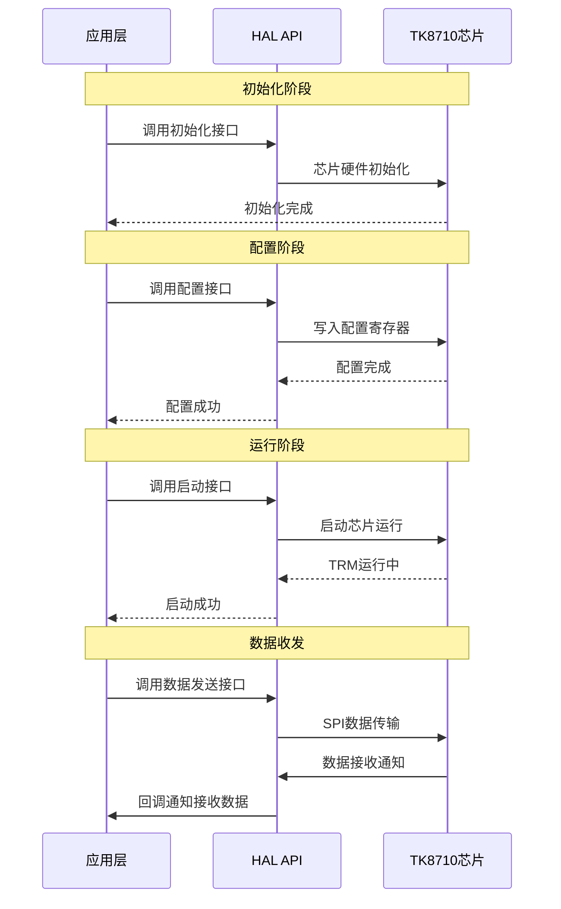
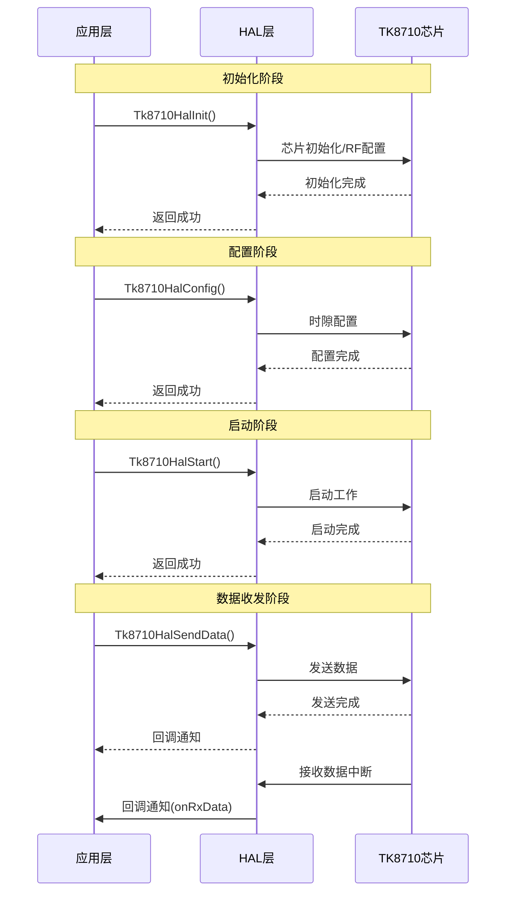

# TK8710 HAL 编程指南

版本：v0.04


</div>

## 文档目的

本文档旨在为开发者提供TK8710 HAL层的完整编程指南，涵盖芯片简介、HAL架构设计、API接口定义、概要设计及编程示例。通过本文档，开发者可快速了解HAL层的功能模块、接口调用方法和数据收发流程、HAL内部的TRM层与PHY driver层实现机制，实现与TK8710芯片的高效集成开发。

## 修订记录

| 修订时间   | 修订版本 | 修订描述                                                    | 修订人 |
| ---------- | -------- | ----------------------------------------------------------- | ------ |
| 2026/03/09 | V0.04    | - 调整章节安排<br />- 统一API命名风格                       | 黄家豪 |
| 2026/03/06 | V0.03    | - 调整部分内容描述<br />- 新增第5章节TK8710 PHY API接口定义 | 黄家豪 |
| 2026/03/05 | V0.02    | - 删除第5章节HAL概要设计内容，将内容移动到2.4章节中         | 黄家豪 |
| 2026/03/05 | V0.01    | - 初始版本                                                  | 黄家豪 |

## 目录

[toc]

## 1. TK8710简介

### 1.1 芯片概述

TK8710是一款纯数字的多天线收发器，支持8组射频通道、128个数据包（用户）的并发处理。外部主控可以通过SPI接口来控制和访问TK8710，实现数据收发。

该芯片集成了先进的数字信号处理单元、多天线信号处理、波束成形处理技术，能够在复杂的无线环境中提供稳定、高效的数据传输能力。TK8710采用SPI接口与主控芯片通信，支持中断方式下的异步调用，可与多种嵌入式平台无缝集成。

### 1.2 主要特性

| 特性类别           | 详细说明                                |
| ------------------ | --------------------------------------- |
| **芯片封装** | BGA324，尺寸15x15 mm                    |
| **通信频段** | 400MHz~510MHz / 862MHz~960MHz          |
| **天线配置** | 支持1、2、4、8天线配置                  |
| **用户容量** | 最大支持128个用户同时收发               |
| **灵敏度**   | -146 dBm（mode5 @0.9Kbps，PER=5%）     |
| **信号带宽** | 62.5 kHz ~ 500kHz                       |
| **接口类型** | 4线SPI slave接口，最大16Mbps            |
| **时隙结构** | 支持4时隙TDD帧结构（BCN + 3个数据时隙） |
| **调制方式** | 支持多种速率模式（Rate 5-11, 18）       |
| **工作模式** | 主模式（Master）/ 从模式（Slave）       |
| **工作时钟** | 32MHz                                   |
| **工作电压** | 1.8 ~ 3.6 V                             |
| **典型功耗** | ≤ 100 mA                               |

## 2. TK8710 HAL概述

### 2.1 软件架构

TK8710 HAL（Hardware Abstraction Layer，硬件抽象层）为应用开发者提供了一套简洁、统一的编程接口，屏蔽了底层硬件的复杂性。


**架构特点**:

- **接口简洁**: 仅需6个核心API即可完成所有操作
- **屏蔽复杂性**: 自动处理底层通信协议、中断管理、资源调度
- **易于集成**: 标准C接口，可移植到多种嵌入式平台
- **回调机制**: 支持异步数据接收和发送完成通知

### 2.2 HAL层功能说明

HAL提供以下核心功能：

| 功能模块             | 说明                                                |
| -------------------- | --------------------------------------------------- |
| **初始化管理** | 芯片初始化、射频配置、日志系统配置                  |
| **时隙配置**   | TDD帧结构配置、速率模式设置、天线配置、超帧配置     |
| **数据发送**   | 广播数据发送、用户专用数据发送                      |
| **状态监控**   | 运行状态查询、统计信息获取                          |
| **系统控制**   | 芯片启动、复位、调试（寄存器读写、PHY driver） |

### 2.3 开发环境要求

HAL层主要运行在RK3506芯片平台上，该平台提供了完整的硬件支持环境。

| 项目               | 要求                                   |
| ------------------ | -------------------------------------- |
| **主控芯片** | RK3506（支持SPI接口）                  |
| **SPI接口**  | 最高16MHz，Mode 0                      |
| **GPIO**     | 至少1个中断输入引脚                    |
| **内存**     | 256MB/512MB LPDDR3L（支持最高1GB扩展） |
| **编译器**   | GCC 4.8+ 或兼容编译器                  |
| **操作系统** | Linux（使用交叉编译工具链）            |
| **C标准**    | C99或更高                              |

### 2.4 HAL工作流程

HAL层采用分层架构设计，通过TRM层和PHY driver层的协同工作实现高效的硬件抽象和业务逻辑处理。

HAL的整体工作流程可以分为初始化、配置、运行三个主要阶段：




## 3. TK8710 HAL API说明

### 3.1 概述

TK8710 PHY API层功能划分

| 功能类别       | 具体功能                                       | 说明                       |
| -------------- | ---------------------------------------------- | -------------------------- |
| **硬件初始化** | 芯片初始化、SPI接口配置、时钟配置              | 完成TK8710芯片的硬件初始化 |
| **寄存器操作** | 寄存器读写、配置寄存器操作                     | 提供芯片寄存器的读写接口   |
| **数据传输**   | SPI数据传输、接收/发送缓冲区管理、接收数据处理 | 处理与芯片的数据交换       |
| **中断管理**   | 中断处理、中断事件上报、中断状态管理           | 处理芯片中断和事件通知     |
| **状态监控**   | 芯片状态监控、硬件状态查询                     | 监控芯片的硬件状态         |
| **配置管理**   | 时隙配置、RF参数配置、芯片参数配置             | 配置芯片的工作参数         |
| **错误处理**   | 硬件错误检测、错误恢复、异常处理               | 处理硬件相关的错误         |
| **调试支持**   | 寄存器调试、硬件调试接口                       | 提供硬件调试功能           |

TK8710 HAL API层功能划分

| 功能类别 | 具体功能 | 说明 |
|---------|---------|------|
| **初始化管理** | HAL层初始化、资源分配、硬件接口准备 | 完成HAL层的启动和资源初始化 |
| **配置管理** | 时隙参数配置、工作模式设置 | 配置HAL的工作参数和运行模式 |
| **数据管理** | 广播数据处理、用户数据调度、发送队列管理 | 管理数据的发送和接收 |
| **状态管理** | 运行状态监控、统计信息收集、状态查询 | 提供HAL层的运行状态信息 |
| **系统控制** | HAL启动、复位、调试、校准 | 提供系统级的控制功能 |
| **资源调度** | 时隙资源分配、用户资源管理、超帧管理 | 管理和调度系统资源 |
| **中断处理** | PHY driver中断处理、事件分发 | 处理硬件中断和事件 |
| **波束管理** | 用户波束信息维护、广播波束管理 | 管理天线波束配置 |

### 3.2 TK8710 API汇总表

#### 3.2.1 TK8710 PHY API汇总

| 接口                   | 功能描述                     |
| -------------------- | ------------------------ |
| Tk8710Init          | 初始化TK8710芯片，配置基本工作参数 |
| Tk8710Config        | 配置芯片工作时隙和通信参数 |
| Tk8710Start         | 启动芯片                 |
| Tk8710Reset         | 复位芯片                 |
| Tk8710SendData      | 发送数据                 |
| Tk8710ReadReg       | 读寄存器                 |
| Tk8710WriteReg      | 写寄存器                 |
| Tk8710RegisterCallbacks | 注册中断回调函数       |

#### 3.2.2 TK8710 HAL API汇总

| API 函数             | 功能描述                |
| ------------------ | ------------------- |
| Tk8710HalInit      | 初始化HAL层，分配资源，准备硬件接口 |
| Tk8710HalConfig    | 配置HAL参数，设置时隙和工作模式   |
| Tk8710HalStart     | 启动HAL，开始硬件工作，可以收发数据  |
| Tk8710HalReset     | 复位HAL，重新初始化硬件状态  |
| Tk8710HalSendData  | 发送数据                |
| Tk8710HalGetStatus | 获取HAL当前状态信息 |
| Tk8710HalDebug     | 提供HAL层调试功能   |
| Tk8710HalCali      | 提供校准功能   |

### 3.3 TK8710 PHY API详细说明

PHY driver层为TRM层/应用层提供基础的硬件操作接口，主要包括芯片初始化、配置、数据收发等功能。

#### 3.3.1 Tk8710Init - 芯片初始化

```c
int Tk8710Init(const ChiprfConfig* rfConfig, const ChipConfig* chipConfig);
```

**功能**: 初始化TK8710芯片，配置基本工作参数

**参数**:

- `rfConfig`: RF配置结构体指针
- `chipConfig`: 芯片配置结构体指针

**返回值**: TK8710HAL_OK成功，其他失败

**说明**: 完成芯片硬件初始化，包括SPI接口、时钟、基本寄存器配置等

#### 3.3.2 Tk8710Config - 芯片配置

```c
int Tk8710Config(const slotCfg_t* slotConfig);
```

**功能**: 配置芯片工作时隙和通信参数

**参数**:

- `slotConfig`: 时隙配置结构体指针

**返回值**: TK8710HAL_OK成功，其他失败

**说明**: 配置TDD帧结构、速率模式、天线参数等

#### 3.3.3 Tk8710Start - 启动芯片

```c
int Tk8710Start(void);
```

**功能**: 启动芯片开始工作

**返回值**: TK8710HAL_OK成功，其他失败

**说明**: 启动芯片的时隙同步和数据收发功能

#### 3.3.4 Tk8710SendData - 发送数据

```c
int Tk8710SendData(TK8710DownlinkType downlinkType, uint8_t userId_brdIndex, 
                   const uint8_t* data, uint16_t len, uint8_t txPower, uint8_t BeamType);
```

**功能**: 发送数据到TK8710芯片

**参数**:

- `downlinkType`: 下行时隙位置（slot1/3时隙）
- `userId_brdIndex`: 用户ID或广播索引
- `data`: 数据指针
- `len`: 数据长度
- `txPower`: 发送功率
- `BeamType`: 波束类型

**返回值**: TK8710HAL_OK成功，其他失败

**说明**: 通过SPI接口将数据发送到芯片的发送缓冲区

#### 3.3.5 Tk8710ReadReg/Tk8710WriteReg - 寄存器读写

```c
int Tk8710ReadReg(uint32_t regAddr, uint32_t* regData);
int Tk8710WriteReg(uint32_t regAddr, uint32_t regData);
```

**功能**: 读写芯片寄存器

**参数**:

- `regAddr`: 寄存器地址
- `regData`: 寄存器数据（读操作为输出，写操作为输入）

**返回值**: TK8710HAL_OK成功，其他失败

**说明**: 用于调试和特殊配置场景

#### 3.3.6 Tk8710RegisterCallbacks - 注册回调函数

```c
void Tk8710RegisterCallbacks(const TK8710DriverCallbacks* callbacks);
```

**功能**: 注册PHY driver层的回调函数，用于处理硬件中断和事件通知

**参数**:

| 参数名     | 类型                        | 说明                 |
| ---------- | --------------------------- | -------------------- |
| callbacks  | const TK8710DriverCallbacks* | 回调函数结构体指针 |

**回调函数结构体定义**:

```c
/* 专用回调函数类型 */
typedef void (*TK8710RxDataCallback)(TK8710IrqResult* irqResult);
typedef void (*TK8710TxSlotCallback)(TK8710IrqResult* irqResult);
typedef void (*TK8710SlotEndCallback)(TK8710IrqResult* irqResult);
typedef void (*TK8710ErrorCallback)(TK8710IrqResult* irqResult);

/* Driver回调结构体 */
typedef struct {
    TK8710RxDataCallback onRxData;      /* 接收数据回调 */
    TK8710TxSlotCallback onTxSlot;      /* 发送时隙回调 */
    TK8710SlotEndCallback onSlotEnd;    /* 时隙结束回调 */
    TK8710ErrorCallback onError;        /* 错误处理回调 */
} TK8710DriverCallbacks;
```

**支持的回调类型**:

| 回调函数        | 触发条件                              | 参数说明                     | 说明                     |
| --------------- | ------------------------------------- | ---------------------------- | ------------------------ |
| onRxData        | 接收到数据时触发                      | irqResult: 包含接收数据信息  | 处理接收到的数据         |
| onTxSlot        | 发送时隙完成时触发                    | irqResult: 包含发送结果信息  | 处理发送完成事件         |
| onSlotEnd       | 时隙结束时触发                        | irqResult: 包含时隙状态信息  | 处理时隙切换事件         |
| onError         | 硬件错误或通信失败时触发              | irqResult: 包含错误信息      | 处理错误恢复             |

**使用示例**:

```c
/* 定义接收数据回调 */
void OnRxData(TK8710IrqResult* irqResult)
{
    printf("接收到数据，用户索引: %u, 长度: %u\n", 
           irqResult->userIndex, irqResult->dataLen);
    
    if (irqResult->data && irqResult->dataLen > 0) {
        printf("数据内容: ");
        for (uint16_t i = 0; i < irqResult->dataLen && i < 16; i++) {
            printf("%02X ", irqResult->data[i]);
        }
        if (irqResult->dataLen > 16) printf("...");
        printf("\n");
    }
}

/* 定义发送时隙回调 */
void OnTxSlot(TK8710IrqResult* irqResult)
{
    printf("发送时隙完成，用户索引: %u, 状态: %u\n", 
           irqResult->userIndex, irqResult->status);
}

/* 定义时隙结束回调 */
void OnSlotEnd(TK8710IrqResult* irqResult)
{
    printf("时隙结束，时隙类型: %u\n", irqResult->slotType);
}

/* 定义错误处理回调 */
void OnError(TK8710IrqResult* irqResult)
{
    printf("硬件错误，状态: %u, 用户索引: %u\n", 
           irqResult->status, irqResult->userIndex);
    /* 执行错误恢复操作 */
}

/* 注册回调函数 */
TK8710DriverCallbacks callbacks = {
    .onRxData = OnRxData,
    .onTxSlot = OnTxSlot,
    .onSlotEnd = OnSlotEnd,
    .onError = OnError
};

Tk8710RegisterCallbacks(&callbacks);
```

**说明**:

- 回调函数在中断上下文中执行，应保持简短高效
- 支持注册多个回调函数，后注册的会覆盖先注册的
- 所有回调函数都通过`TK8710IrqResult`结构体传递事件信息
- 主要用于需要直接处理硬件事件的场景

### 3.4 TK8710 HAL API详细说明

#### 3.4.1 Tk8710HalInit - 初始化

```c
Tk8710HalError Tk8710HalInit(const Tk8710HalInitConfig* config);
```

**功能**: 初始化HAL层，分配资源，准备硬件接口

**参数**:

| 参数名 | 类型                        | 说明                             |
| ------ | --------------------------- | -------------------------------- |
| config | const Tk8710HalInitConfig* | 初始化配置指针，NULL使用默认配置 |

**输入参数定义**:

| 名称         | 类型     | 含义                                    | 默认值                          |
| ------------ | -------- | --------------------------------------- | ------------------------------- |
| ant_en       | uint8_t  | 数字处理天线数使能，8bit对应8根天线配置 | 0xFF                            |
| rf_en        | uint8_t  | 射频天线使能，8bit对应8根天线配置       | 0xFF                            |
| tx_bcnant_en | uint8_t  | 发送BCN天线使能，8bit对应8根天线配置    | 0xFF                            |
| tx_sync      | uint8_t  | 本地同步；                              | 0                               |
| conti_mode   | uint8_t  | 单次工作模式或者连续工作模式            | 1                               |
| rf_model     | uint8_t  | 射频芯片型号：1=SX1255, 2=SX1257        | 1                               |
| bcn_bits     | uint8_t  | bcn携带信息                             | 0**（来源于网络配置）**         |
| Freq         | uint32_t | 射频中心频率，单位hz                    | 503100000**（来源于网络配置）** |
| rxgain       |          | 射频接收增益                            | 0x7e                            |
| txgain       |          | 射频发送增益                            | 0x2a                            |
| OnRxData     | void     | 接收数据回调                            |                                 |
| OnTxComplete | void     | 发送完成回调                            |                                 |

**返回值**:

| 返回值                       | 说明       |
| ---------------------------- | ---------- |
| TK8710HAL_OK                 | 初始化成功 |
| TK8710HAL_ERROR_PARAM        | 参数错误   |
| TK8710HAL_ERROR_INIT         | 初始化失败 |

**使用示例**:

```c
/* 使用默认配置初始化 */
Tk8710HalError ret = Tk8710HalInit(NULL);
if (ret != TK8710HAL_OK) {
    printf("HAL初始化失败: %d\n", ret);
    return -1;
}

/* 使用自定义配置初始化 */

ret = Tk8710HalInit(&config);
```

#### 3.4.2 Tk8710HalConfig - 配置

```c
Tk8710HalError Tk8710HalConfig(const slotCfg_t* slotConfig, uint32_t N_sync);
```

**功能**: 配置HAL参数，设置时隙和工作模式

**参数**:

| 参数名     | 类型             | 说明                                  |
| ---------- | ---------------- | ------------------------------------- |
| slotConfig | const slotCfg_t* | 时隙配置指针，NULL使用HAL内部默认配置 |
| N_sync     | uint32_t         | 配置时隙后，输出的超帧周期，单位ms    |

**输入参数定义**

| 名称            | 类型    | 含义                                                | 默认值                  |
| --------------- | ------- | --------------------------------------------------- | ----------------------- |
| msMode          | uint8_t | 主/从模式（主：发送bcn，从：接收bcn），0：主，1：从 | 0                       |
| plCrcEn         | uint8_t | Payload CRC使能，0：disable，1：enable              | 0                       |
| rateCount       | uint8_t | 速率个数                                            | 1**（来源于网络配置）** |
| rateModes[4]    | uint8_t | 每个速率的模式                                      | 6**（来源于网络配置）** |
| upBlockNum[4]   | uint8_t | 每个模式上行（slot2）包块数                         | 1**（来源于网络配置）** |
| downBlockNum[4] | uint8_t | 每个模式下行（slot3）包块数                         | 1**（来源于网络配置）** |
| FrameNum        | uint8_t | 超帧个数                                            | 1**（来源于网络配置）** |
| freqGroupNum    | uint8_t | 频域分区总数                                        | 0**（来源于网络配置）** |
| pointFreqNum    | uint8_t | 指定频率总数                                        | 0                       |
| frametype       | uint8_t | 时隙结构配置                                        | 0                       |
|                 |         |                                                     |                         |

**返回值**:

| 返回值                        | 说明     |
| ----------------------------- | -------- |
| TK8710HAL_OK                  | 配置成功 |
| TK8710HAL_ERROR_CONFIG        | 配置失败 |

**使用示例**:

```c
/* 使用当前配置 */
Tk8710HalError ret = Tk8710HalConfig(NULL);

/* 使用自定义时隙配置 */

ret = Tk8710HalConfig(&slotConfig);
if (ret != TK8710HAL_OK) {
    printf("HAL配置失败: %d\n", ret);
}
```

---

#### 3.4.3 Tk8710HalStart - 启动

```c
Tk8710HalError Tk8710HalStart(void);
```

**功能**: 启动HAL，开始硬件工作，可以收发数据

**参数**: 无

**返回值**:

| 返回值                       | 说明     |
| ---------------------------- | -------- |
| TK8710HAL_OK                  | 启动成功 |
| TK8710HAL_ERROR_START         | 启动失败 |

**说明**:

- 使用主模式（Master）和连续工作模式启动
- 启动成功后可以进行数据收发操作

**使用示例**:

```c
Tk8710HalError ret = Tk8710HalStart();
if (ret != TK8710HAL_OK) {
    printf("HAL启动失败: %d\n", ret);
    return -1;
}
printf("HAL启动成功，可以开始收发数据\n");
```

---

#### 3.4.4 Tk8710HalReset - 复位

```c
Tk8710HalError Tk8710HalReset(void);
```

**功能**: 复位HAL，重新初始化硬件状态

**参数**: 无

**返回值**:

| 返回值                       | 说明     |
| ---------------------------- | -------- |
| TK8710HAL_OK                  | 复位成功 |
| TK8710HAL_ERROR_RESET         | 复位失败 |

**说明**:

- 完全复位状态机和寄存器
- 清理系统资源
- 复位后需要重新调用 `Tk8710HalInit()` 才能使用

**使用示例**:

```c
Tk8710HalError ret = Tk8710HalReset();
if (ret != TK8710HAL_OK) {
    printf("HAL复位失败: %d\n", ret);
    return -1;
}
printf("HAL复位完成，需要重新初始化\n");
```

---

#### 3.4.5 Tk8710HalSendData - 发送数据

```c
Tk8710HalError Tk8710HalSendData(
    TK8710DownlinkType downlinkType,
    uint32_t userId_brdIndex,
    const uint8_t* data,
    uint16_t len,
    uint8_t txPower,
    uint32_t frameNo,
    uint8_t targetRateMode,
    uint8_t beamType
);
```

**功能**: 发送数据到目标设备

**参数**:

| 参数名          | 类型               | 说明                                                           |
| --------------- | ------------------ | -------------------------------------------------------------- |
| downlinkType    | TK8710DownlinkType | 下行发送位置：TK8710_DOWNLINK_A=slot1，TK8710_DOWNLINK_B=slot3 |
| userId_brdIndex | uint32_t           | 用户ID（用户数据）或广播索引（广播数据）                       |
| data            | const uint8_t*     | 数据指针                                                       |
| len             | uint16_t           | 数据长度（字节）                                               |
| txPower         | uint8_t            | 发送功率                                                       |
| frameNo         | uint32_t           | 帧号（仅用户数据使用，广播时忽略）                             |
| targetRateMode  | uint8_t            | 目标速率模式（仅用户数据使用，广播时忽略）                     |
| beamType        | uint8_t            | 波束类型：TK8710_DATA_TYPE_BRD=广播，TK8710_DATA_TYPE_DED=专用 |

**参数枚举定义**:

```c
/* 下行类型枚举 */
typedef enum {
    TK8710_DOWNLINK_A = 0,  /* slot1时隙发送 */
    TK8710_DOWNLINK_B = 1,  /* slot3时隙发送 */
} TK8710DownlinkType;

/* 数据波束类型定义 */
#define TK8710_DATA_TYPE_BRD     0   /* 广播波束 - 使用广播式波束发送数据 */
#define TK8710_DATA_TYPE_DED     1   /* 指定波束 - 使用针对性的波束 */
```

**返回值**:

| 返回值                      | 说明                       |
| --------------------------- | -------------------------- |
| TK8710HAL_OK                 | 发送成功（已加入发送队列） |
| TK8710HAL_ERROR_SEND         | 发送失败                   |

**说明**:

- 发送是异步的，数据加入发送队列后立即返回
- 实际发送结果通过回调函数通知

**使用示例**:

```c
/* 发送广播数据 */
uint8_t broadcastData[] = {0x01, 0x02, 0x03, 0x04};
Tk8710HalError ret = Tk8710HalSendData(
    TK8710_DOWNLINK_A,        /* slot1时隙发送 */
    0,                        /* 广播索引 */
    broadcastData,            /* 数据 */
    sizeof(broadcastData),    /* 数据长度 */
    35,                       /* 发送功率 */
    0,                        /* 帧号（广播忽略） */
    0,                        /* 速率模式（广播忽略） */
    TK8710_DATA_TYPE_BRD      /* 广播波束 */
);

/* 发送用户专用数据 */
uint8_t userData[] = {0x11, 0x12, 0x13, 0x14, 0x15};
ret = Tk8710HalSendData(
    TK8710_DOWNLINK_B,        /* slot3时隙发送 */
    0x30000001,               /* 用户ID */
    userData,                 /* 数据 */
    sizeof(userData),         /* 数据长度 */
    30,                       /* 发送功率 */
    100,                      /* 帧号 */
    TK8710_RATE_MODE_7,       /* 速率模式 */
    TK8710_DATA_TYPE_DED      /* 专用数据波束 */
);

if (ret != TK8710HAL_OK) {
    printf("数据发送失败: %d\n", ret);
}
```

---

#### 3.4.6 Tk8710HalGetStatus - 获取状态

```c
Tk8710HalError Tk8710HalGetStatus(TRM_Stats* stats);
```

**功能**: 获取HAL当前状态信息

**参数**:

| 参数名 | 类型       | 说明             |
| ------ | ---------- | ---------------- |
| stats  | TRM_Stats* | 状态信息输出指针 |

**参数结构体定义**:

```c
/* 统计信息结构体 */
typedef struct {
    TrmState    state;             /* TRM运行状态 */
    uint32_t    txCount;           /* 总发送次数 */
    uint32_t    txSuccessCount;    /* 发送成功次数 */
    uint32_t    txFailureCount;    /* 发送失败次数 */
    uint32_t    txRetryCount;      /* 发送重试次数 */
    uint32_t    rxCount;           /* 总接收次数 */
    uint32_t    rxDataCount;       /* 接收数据次数 */
    uint32_t    beamCount;         /* 当前波束数量 */
    uint32_t    memAllocCount;     /* 内存分配次数 */
    uint32_t    memFreeCount;      /* 内存释放次数 */
    uint32_t    txQueueRemaining;  /* 剩余发送队列数量 */
} TRM_Stats;

/* TRM状态枚举 */
typedef enum {
    TRM_STATE_UNINIT = 0,    /* 未初始化 */
    TRM_STATE_INITED,        /* 已初始化 */
    TRM_STATE_RUNNING,       /* 运行中 */
    TRM_STATE_STOPPED,       /* 已停止 */
    TRM_STATE_ERROR          /* 错误状态 */
} TrmState;
```

**返回值**:

| 返回值                        | 说明                    |
| ----------------------------- | ----------------------- |
| TK8710HAL_OK                  | 获取成功                |
| TK8710HAL_ERROR_PARAM         | 参数错误（stats为NULL） |
| TK8710HAL_ERROR_STATUS        | 状态查询失败            |

**说明**:

- 提供完整的系统状态信息
- 包括发送、接收、内存、队列等统计

**使用示例**:

```c
TRM_Stats stats;
Tk8710HalError ret = Tk8710HalGetStatus(&stats);
if (ret == TK8710HAL_OK) {
    printf("=== HAL状态信息 ===\n");
    printf("运行状态: %d\n", stats.state);
    printf("发送成功: %u\n", stats.txSuccessCount);
    printf("发送失败: %u\n", stats.txFailureCount);
    printf("接收数据: %u\n", stats.rxDataCount);
    printf("剩余队列: %u\n", stats.txQueueRemaining);
} else {
    printf("获取状态失败: %d\n", ret);
}
```

---

#### 3.4.7 Tk8710HalDebug - 调试接口

```c
Tk8710HalError Tk8710HalDebug(uint32_t type, void* para1, void* para2);
```

**功能**: 提供HAL层调试功能

**参数**:

| 参数名 | 类型     | 说明                                                   |
| ------ | -------- | ------------------------------------------------------ |
| type   | uint32_t | 调试类型：0=系统调试，1=读寄存器，2=写寄存器，3-10预留 |
| para   | void*    | 调试参数指针，根据type不同而变化                       |

**返回值**:

| 返回值                       | 说明                       |
| ---------------------------- | -------------------------- |
| TK8710HAL_OK                  | 调试操作成功               |
| TK8710HAL_ERROR_PARAM         | 参数错误或不支持的调试类型 |

**说明**:

- 提供灵活的调试接口，支持多种调试功能
- 通过type参数指定调试操作类型
- 主要用于开发调试和问题诊断

**使用示例**:

```c
/* 系统调试 */
Tk8710HalError ret = Tk8710HalDebug(0, NULL，NULL);

/* 读/写取寄存器 */
ret = Tk8710HalDebug(1, regaddr，regData);
```

#### 3.4.8 `OnRxData接收回调说明`

```c
typedef void (*OnRxData)(const RxDataList* rxDataList);
```

**功能**: 接收数据回调函数
**参数**:

- `rxDataList`: 接收数据列表指针

```c
typedef struct {
    uint8_t  slotIndex;         /* 时隙索引 */
    uint8_t  userCount;         /* 用户数量 */
    uint16_t reserved;
    uint32_t frameNo;           /* 帧号 */
    TRM_RxUserData* users;      /* 用户数据数组 */
} TRM_RxDataList;
```

**说明**:

- 当接收到用户数据时调用
- 应用层需要同步处理数据，避免阻塞中断处理
- `rxDataList->users` 包含所有接收到的用户数据
- 处理完成后需要及时释放相关资源

#### 3.4.9 `OnTxComplete发送完成回调说明`

```c
typedef void (*OnTxComplete)(const TxCompleteResult* txResult);
```

**功能**: 发送完成回调函数
**参数**:

- `txResult`: 发送完成结果结构体指针

```c
/* 单个用户发送结果 */
typedef struct {
    uint32_t userId;         /* 用户ID */
    TxResult result;     /* 发送结果 */
} TxUserResult;

/* 发送完成回调结果 */
typedef struct {
    uint32_t totalUsers;           /* 发送用户总数 */
    uint32_t remainingQueue;        /* 剩余发送队列数量 */
    uint32_t userCount;             /* 结果数组中的用户数量 */
    const TxUserResult* users;  /* 用户结果数组指针 */
} TxCompleteResult;
```

```c
typedef enum {
    TX_OK = 0,              /* 发送成功 */
    TX_NO_BEAM,             /* 无波束信息 */
    TX_TIMEOUT,             /* 发送超时 */
    TX_ERROR,               /* 发送错误 */
} TxResult;
```

**说明**:

- 当数据发送完成时调用，一次性通知所有用户的发送结果
- `txResult->totalUsers` 表示本次发送的用户总数
- `txResult->remainingQueue` 表示当前剩余的发送队列数量
- `txResult->users` 数组包含每个用户的详细发送结果
- `txResult->userCount` 表示结果数组中的实际用户数量
- 上层应用可以根据队列状态进行流量控制

#### 3.4.10 HAL API数据流向



## 4. TK8710 HAL API编程指南

### 4.1 快速入门

以下是使用HAL API的最简示例，展示了从初始化到发送数据的基本流程：

```c
#include "Tk8710HalApi.h"
#include <stdio.h>

int main(void)
{
    Tk8710HalError ret;
  
    /* 1. 初始化HAL（使用默认配置） */
    ret = Tk8710HalInit(NULL);
    if (ret != TK8710HAL_OK) {
        printf("初始化失败: %d\n", ret);
        return -1;
    }
  
    /* 2. 配置HAL（使用默认时隙配置） */
    ret = Tk8710HalConfig(NULL);
    if (ret != TK8710HAL_OK) {
        printf("配置失败: %d\n", ret);
        return -1;
    }
  
    /* 3. 启动HAL */
    ret = Tk8710HalStart();
    if (ret != TK8710HAL_OK) {
        printf("启动失败: %d\n", ret);
        return -1;
    }
  
    /* 4. 发送数据 */
    uint8_t data[] = {0x01, 0x02, 0x03};
    ret = Tk8710HalSendData(TK8710_DOWNLINK_A, 0, data, sizeof(data), 35, 0, 0, TK8710_DATA_TYPE_BRD);
    if (ret == TK8710HAL_OK) {
        printf("数据发送成功\n");
    }
  
    /* 5. 获取状态 */
    TRM_Stats stats;
    Tk8710HalGetStatus(&stats);
    printf("发送次数: %u\n", stats.txCount);
  
    return 0;
}
```

### 4.2 初始化流程

#### 4.2.1 使用默认配置

最简单的初始化方式，适用于大多数应用场景：

```c
Tk8710HalError ret = Tk8710HalInit(NULL);
if (ret != TK8710HAL_OK) {
    printf("HAL初始化失败: %d\n", ret);
    return -1;
}
printf("HAL初始化成功\n");
```

#### 4.2.2 使用自定义配置

当需要自定义芯片参数、RF配置或日志级别时：

```c
/* 配置 */
Tk8710HalInitConfig config = {
};

Tk8710HalError ret = Tk8710HalInit(&config);
```

### 4.3 配置流程

#### 4.3.1 使用默认时隙配置

```c
Tk8710HalError ret = Tk8710HalConfig(NULL);
if (ret != TK8710HAL_OK) {
    printf("配置失败: %d\n", ret);
}
```

#### 4.3.2 自定义时隙配置

```c
slotCfg_t slotConfig = {
};

Tk8710HalError ret = Tk8710HalConfig(&slotConfig);
```

### 4.4 数据收发流程

#### 4.4.1 发送广播数据

广播数据发送给所有设备：

```c
uint8_t broadcastData[] = {0xAA, 0xBB, 0xCC, 0xDD};

Tk8710HalError ret = Tk8710HalSendData(
    TK8710_DOWNLINK_A,            /* slot1时隙发送 */
    0,                            /* 广播索引（0-15） */
    broadcastData,                /* 数据 */
    sizeof(broadcastData),        /* 长度 */
    35,                           /* 发送功率 */
    0,                            /* 帧号（广播忽略） */
    0,                            /* 速率模式（广播忽略） */
    TK8710_DATA_TYPE_BRD          /* 广播波束 */
);

if (ret == TK8710HAL_OK) {
    printf("广播数据已加入发送队列\n");
}
```

#### 4.4.2 发送用户专用数据

用户专用数据发送给指定用户：

```c
uint32_t userId = 0x30000001;     /* 目标用户ID */
uint8_t userData[] = {0x01, 0x02, 0x03, 0x04, 0x05};

Tk8710HalError ret = Tk8710HalSendData(
    TK8710_DOWNLINK_B,            /* slot3时隙发送 */
    userId,                       /* 用户ID */
    userData,                     /* 数据 */
    sizeof(userData),             /* 长度 */
    30,                           /* 发送功率 */
    100,                          /* 目标帧号 */
    TK8710_RATE_MODE_7,           /* 速率模式 */
    TK8710_DATA_TYPE_DED          /* 专用数据波束 */
);

if (ret == TK8710HAL_OK) {
    printf("用户数据已加入发送队列\n");
}
```

#### 4.4.3 数据接收

数据接收通过回调函数实现，需要在初始化时配置回调：

```c
/* 接收数据回调函数 */
void OnRxData(uint32_t userId, const uint8_t* data, uint16_t len, void* context)
{
    printf("收到用户 0x%08X 的数据，长度=%u\n", userId, len);
  
    /* 处理接收到的数据 */
    for (uint16_t i = 0; i < len; i++) {
        printf("%02X ", data[i]);
    }
    printf("\n");
}

/* 发送完成回调函数 */
void OnTxComplete(uint32_t userId, int result, void* context)
{
    if (result == 0) {
        printf("用户 0x%08X 数据发送成功\n", userId);
    } else {
        printf("用户 0x%08X 数据发送失败: %d\n", userId, result);
    }
}

/* 配置回调 */
TRM_InitConfig trmConfig = {
    .beamMode = TRM_BEAM_MODE_FULL_STORE,
    .beamMaxUsers = 3000,
    .beamTimeoutMs = 10000,
    .callbacks = {
        .onRxData = OnRxData,
        .onTxComplete = OnTxComplete
    },
    .platformConfig = NULL
};

TK8710HalInitConfig config = {
    .trmInitConfig = &trmConfig,
    /* ... 其他配置 */
};

Tk8710HalInit(&config);
```

**说明**:

- 回调函数用于异步接收数据和发送完成通知
- 配置结构体定义了系统运行参数

### 4.5 状态查询

#### 4.5.1 获取运行状态

```c
TRM_Stats stats;
Tk8710HalError ret = Tk8710HalGetStatus(&stats);

if (ret == TK8710HAL_OK) {
    /* 检查运行状态 */
    switch (stats.state) {
        case TRM_STATE_UNINIT:
            printf("状态: 未初始化\n");
            break;
        case TRM_STATE_INITED:
            printf("状态: 已初始化\n");
            break;
        case TRM_STATE_RUNNING:
            printf("状态: 运行中\n");
            break;
        case TRM_STATE_STOPPED:
            printf("状态: 已停止\n");
            break;
        case TRM_STATE_ERROR:
            printf("状态: 错误\n");
            break;
    }
}
```

#### 4.5.2 获取统计信息

```c
TRM_Stats stats;
Tk8710HalError ret = Tk8710HalGetStatus(&stats);

if (ret == TK8710HAL_OK) {
    printf("========== HAL统计信息 ==========\n");
    printf("发送统计:\n");
    printf("  总发送次数:     %u\n", stats.txCount);
    printf("  发送成功次数:   %u\n", stats.txSuccessCount);
    printf("  发送失败次数:   %u\n", stats.txFailureCount);
    printf("  发送重试次数:   %u\n", stats.txRetryCount);
    printf("接收统计:\n");
    printf("  总接收次数:     %u\n", stats.rxCount);
    printf("  接收数据次数:   %u\n", stats.rxDataCount);
    printf("资源统计:\n");
    printf("  当前波束数量:   %u\n", stats.beamCount);
    printf("  内存分配次数:   %u\n", stats.memAllocCount);
    printf("  内存释放次数:   %u\n", stats.memFreeCount);
    printf("  剩余发送队列:   %u\n", stats.txQueueRemaining);
    printf("==================================\n");
}
```

### 4.6 调试方法

#### 4.6.1 使用调试接口

```c
/* 系统调试 */
Tk8710HalDebug(0, NULL);

/* 硬件调试 */
Tk8710HalDebug(1, NULL);

/* 通信调试 */
Tk8710HalDebug(2, NULL);

/* 中断调试 */
Tk8710HalDebug(3, NULL);
```

#### 4.6.2 日志级别配置

在初始化时配置日志级别：

```c
Tk8710HalInitConfig config = {
};

Tk8710HalInit(&config);
```

**日志级别说明**:

| 级别  | 值 | 说明                     |
| ----- | -- | ------------------------ |
| ERROR | 0  | 仅输出错误信息           |
| WARN  | 1  | 输出警告和错误信息       |
| INFO  | 2  | 输出一般信息、警告和错误 |
| DEBUG | 3  | 输出调试信息及以上       |
| TRACE | 4  | 输出所有信息（最详细）   |

### 4.7 完整工作流程示例

以下是一个完整的应用示例，展示了HAL API的典型使用方式：

```c
/**
 * @file TK8710HAL_example.c
 * @brief TK8710 HAL API完整使用示例
 */

#include "Tk8710HalApi.h"
#include <stdio.h>
#include <string.h>
#include <unistd.h>

/* 全局变量 */
static volatile int g_running = 1;

/*============================================================================
                              回调函数实现
============================================================================*/

/**
 * @brief 数据接收回调
 */
void OnRxData(uint32_t userId, const uint8_t* data, uint16_t len, void* context)
{
    printf("[RX] 用户ID=0x%08X, 长度=%u, 数据: ", userId, len);
    for (uint16_t i = 0; i < len && i < 16; i++) {
        printf("%02X ", data[i]);
    }
    if (len > 16) printf("...");
    printf("\n");
}

/**
 * @brief 发送完成回调
 */
void OnTxComplete(uint32_t userId, int result, void* context)
{
    if (result == 0) {
        printf("[TX] 用户ID=0x%08X 发送成功\n", userId);
    } else {
        printf("[TX] 用户ID=0x%08X 发送失败: %d\n", userId, result);
    }
}

/*============================================================================
                                主程序
============================================================================*/

int main(void)
{
    Tk8710HalError ret;
  
    printf("========== TK8710 HAL示例程序 ==========\n\n");
  
    /*------------------------------------------------------------------------
                              第1步：初始化HAL
    ------------------------------------------------------------------------*/
    printf("[1] 初始化HAL...\n");
  
    /* 配置系统回调 */
    TRM_InitConfig trmConfig = {
        .callbacks = {
            .onRxData = OnRxData,
            .onTxComplete = OnTxComplete
        },
    };
  
    /* 配置HAL初始化参数 */
    Tk8710HalInitConfig initConfig = {
    };
  
    ret = Tk8710HalInit(&initConfig);
    if (ret != TK8710HAL_OK) {
        printf("[ERROR] HAL初始化失败: %d\n", ret);
        return -1;
    }
    printf("[OK] HAL初始化成功\n\n");
  
    /*------------------------------------------------------------------------
                              第2步：配置HAL
    ------------------------------------------------------------------------*/
    printf("[2] 配置HAL...\n");
  
    ret = Tk8710HalConfig(NULL);  /* 使用默认时隙配置 */
    if (ret != TK8710HAL_OK) {
        printf("[ERROR] HAL配置失败: %d\n", ret);
        return -1;
    }
    printf("[OK] HAL配置成功\n\n");
  
    /*------------------------------------------------------------------------
                              第3步：启动HAL
    ------------------------------------------------------------------------*/
    printf("[3] 启动HAL...\n");
  
    ret = Tk8710HalStart();
    if (ret != TK8710HAL_OK) {
        printf("[ERROR] HAL启动失败: %d\n", ret);
        return -1;
    }
    printf("[OK] HAL启动成功\n\n");
  
    /*------------------------------------------------------------------------
                              第4步：数据收发
    ------------------------------------------------------------------------*/
    printf("[4] 开始数据收发...\n\n");
  
    /* 发送广播数据 */
    uint8_t broadcastData[] = {0xAA, 0xBB, 0xCC, 0xDD};
    ret = Tk8710HalSendData(
        TK8710_DOWNLINK_A,
        0,
        broadcastData,
        sizeof(broadcastData),
        35,
        0, 0,
        TK8710_DATA_TYPE_BRD
    );
    if (ret == TK8710HAL_OK) {
        printf("[TX] 广播数据已发送\n");
    }
  
    /* 发送用户数据 */
    uint8_t userData[] = {0x01, 0x02, 0x03, 0x04, 0x05};
    ret = Tk8710HalSendData(
        TK8710_DOWNLINK_B,
        0x30000001,
        userData,
        sizeof(userData),
        30,
        100,
        TK8710_RATE_MODE_7,
        TK8710_DATA_TYPE_DED
    );
    if (ret == TK8710HAL_OK) {
        printf("[TX] 用户数据已发送\n");
    }
  
    /*------------------------------------------------------------------------
                              第5步：主循环
    ------------------------------------------------------------------------*/
    printf("\n[5] 进入主循环（按Ctrl+C退出）...\n\n");
  
    int loopCount = 0;
    while (g_running && loopCount < 10) {
        /* 获取并打印状态 */
        TRM_Stats stats;
        ret = Tk8710HalGetStatus(&stats);
        if (ret == TK8710HAL_OK) {
            printf("[STATUS] 发送=%u, 接收=%u, 队列=%u\n",
                   stats.txCount, stats.rxCount, stats.txQueueRemaining);
        }
  
        /* 等待1秒 */
        sleep(1);
        loopCount++;
    }
  
    /*------------------------------------------------------------------------
                              第6步：清理资源
    ------------------------------------------------------------------------*/
    printf("\n[6] 清理资源...\n");
  
    ret = Tk8710HalReset();
    if (ret == TK8710HAL_OK) {
        printf("[OK] HAL复位成功\n");
    }
  
    printf("\n========== 程序结束 ==========\n");
    return 0;
}
```

## 5. 附录

### 5.1 错误码参考

| 错误码                        | 数值 | 描述         | 可能原因                | 处理建议                 |
| ----------------------------- | ---- | ------------ | ----------------------- | ------------------------ |
| TK8710HAL_OK                  | 0    | 操作成功     | -                       | -                        |
| TK8710HAL_ERROR_PARAM         | -1   | 参数错误     | 传入NULL指针或无效参数  | 检查参数有效性           |
| TK8710HAL_ERROR_INIT          | -2   | 初始化失败   | SPI通信失败、芯片无响应 | 检查硬件连接和SPI配置    |
| TK8710HAL_ERROR_CONFIG        | -3   | 配置失败     | 配置参数无效            | 检查时隙配置参数         |
| TK8710HAL_ERROR_START         | -4   | 启动失败     | 芯片状态异常            | 尝试复位后重新初始化     |
| TK8710HAL_ERROR_SEND          | -5   | 发送失败     | 发送队列满、参数无效    | 检查队列状态和参数       |
| TK8710HAL_ERROR_STATUS        | -6   | 状态查询失败 | 系统未初始化            | 确保已调用Tk8710HalInit  |
| TK8710HAL_ERROR_RESET         | -7   | 复位失败     | 硬件异常                | 检查硬件状态             |

### 5.2 常见问题FAQ

#### Q1: Tk8710HalInit返回ERROR_INIT，如何排查？

**A**: 按以下步骤排查：

1. 检查SPI硬件连接是否正确
2. 确认SPI时钟频率不超过16MHz
3. 检查芯片供电是否正常
4. 使用示波器检查SPI信号波形

#### Q2: 发送数据后没有收到回调通知？

**A**: 可能原因：

1. 回调函数未正确注册，检查配置结构体中的callbacks配置
2. 目标设备不在线或无法接收
3. 发送功率过低，尝试增大txPower参数

#### Q3: 如何提高数据吞吐量？

**A**: 建议：

1. 使用更高的速率模式（如RATE_MODE_11）
2. 减小帧周期（frameTimeLen）
3. 批量发送数据，减少API调用次数
4. 确保发送队列不会满

#### Q4: 如何处理芯片异常？

**A**: 推荐流程：

```c
/* 1. 获取状态检查 */
TRM_Stats stats;
Tk8710HalGetStatus(&stats);
if (stats.state == TRM_STATE_ERROR) {
    /* 2. 复位HAL */
    Tk8710HalReset();
  
    /* 3. 重新初始化 */
    Tk8710HalInit(NULL);
    Tk8710HalConfig(NULL);
    Tk8710HalStart();
}
```

#### Q5: 支持哪些平台？

**A**: 目前支持：

- **RK3506 Linux**: 使用交叉编译工具链

移植到其他平台需要实现HAL移植层接口，参考 `port/tk8710_rk3506.c`。

### 5.3 术语表

| 术语 | 全称                               | 说明             |
| ---- | ---------------------------------- | ---------------- |
| HAL  | Hardware Abstraction Layer         | 硬件抽象层       |
| TDD  | Time Division Duplex               | 时分双工         |
| BCN  | Beacon                             | 信标，用于同步   |
| SPI  | Serial Peripheral Interface        | 串行外设接口     |
| GPIO | General Purpose Input/Output       | 通用输入输出     |
| RF   | Radio Frequency                    | 射频             |
| AGC  | Automatic Gain Control             | 自动增益控制     |
| RSSI | Received Signal Strength Indicator | 接收信号强度指示 |
| SNR  | Signal-to-Noise Ratio              | 信噪比           |
| CRC  | Cyclic Redundancy Check            | 循环冗余校验     |
| IRQ  | Interrupt Request                  | 中断请求         |

### 5.4 参考资料

1. **TK8710数据手册** - 芯片硬件规格和寄存器定义
2. **TK8710HAL_API.md** - HAL API详细接口文档
3. **Porting_Guide.md** - 平台移植指南
