<div align="center">

# TK8710 HAL 设计方案

**Hardware Abstraction Layer Design Specification**

<br/>
<br/>
<br/>

版本：V0.1

日期：2026年3月

<br/>
<br/>
<br/>
<br/>
<br/>
<br/>


</div>

<div style="page-break-after: always;"></div>

---

## 目录

- [1 概述](#1-概述)
  - [1.1 HAL 需求说明](#11-hal-需求说明)
  - [1.2 功能](#12-功能)
  - [1.3 非功能](#13-非功能)
  - [1.4 接口](#14-接口)
    - [1.4.1 PHY API](#141-phy-api)
    - [1.4.2 HAL API](#142-hal-api)
  - [1.5 设计目标](#15-设计目标)
  - [1.6 约束、假设和运行条件](#16-约束假设和运行条件)

- [2 总体架构和设计](#2-总体架构和设计)
  - [2.1 模块功能定义](#21-模块功能定义)
    - [2.1.1 TRM 层](#211-trm-层)
    - [2.1.2 PHY Driver 层](#212-phy-driver-层)
  - [2.2 工作流程](#22-工作流程)
    - [2.2.1 初始化流程](#221-初始化流程)
    - [2.2.2 配置流程](#222-配置流程)
    - [2.2.3 启动流程](#223-启动流程)
    - [2.2.4 发送数据流程](#224-发送数据流程)
    - [2.2.5 接收数据流程](#225-接收数据流程)
    - [2.2.6 异常/事件处理](#226-异常事件处理)
    - [2.2.7 关闭或复位流程](#227-关闭或复位流程)

- [3 详细设计](#3-详细设计)
  - [3.1 子模块划分](#31-子模块划分)
    - [3.1.1 模块职责说明](#311-模块职责说明)
    - [3.1.2 模块依赖关系](#312-模块依赖关系)
  - [3.2 文件结构](#32-文件结构)
    - [3.2.1 文件说明](#321-文件说明)
    - [3.2.2 编译输出](#322-编译输出)
    - [3.2.3 构建系统](#323-构建系统)
  - [3.3 核心数据结构](#33-核心数据结构)
    - [3.3.1 HAL 层数据结构](#331-hal-层数据结构)
    - [3.3.2 TRM 层数据结构](#332-trm-层数据结构)
    - [3.3.3 PHY Driver 层数据结构](#333-phy-driver-层数据结构)
    - [3.3.4 移植层数据结构](#334-移植层数据结构)
  - [3.4 对 OS 和硬件的接口依赖](#34-对-os-和硬件的接口依赖)
    - [3.4.1 SPI 接口](#341-spi-接口)
    - [3.4.2 GPIO 接口](#342-gpio-接口)
    - [3.4.3 Timer 接口](#343-timer-接口)
    - [3.4.4 DMA 接口](#344-dma-接口)
    - [3.4.5 OS 原语接口](#345-os-原语接口)
    - [3.4.6 内存管理接口](#346-内存管理接口)
    - [3.4.7 日志接口](#347-日志接口)
  - [3.5 HAL API 详细设计](#35-hal-api-详细设计)
    - [3.5.1 初始化接口](#351-初始化接口)
    - [3.5.2 配置接口](#352-配置接口)
    - [3.5.3 启动接口](#353-启动接口)
    - [3.5.4 复位接口](#354-复位接口)
    - [3.5.5 发送接口](#355-发送接口)
    - [3.5.6 状态查询接口](#356-状态查询接口)
    - [3.5.7 调试接口](#357-调试接口)
    - [3.5.8 校准接口](#358-校准接口)
  - [3.6 TRM 层详细设计](#36-trm-层详细设计)
    - [3.6.1 超帧管理](#361-超帧管理)
    - [3.6.2 发送调度](#362-发送调度)
    - [3.6.3 接收管理](#363-接收管理)
    - [3.6.4 波束管理](#364-波束管理)
    - [3.6.5 队列管理](#365-队列管理)
    - [3.6.6 统计监控](#366-统计监控)
  - [3.7 PHY Driver 层详细设计](#37-phy-driver-层详细设计)
    - [3.7.1 PHY 驱动模块](#371-phy-驱动模块)
    - [3.7.2 中断处理模块](#372-中断处理模块)
    - [3.7.3 SPI 驱动模块](#373-spi-驱动模块)
    - [3.7.4 寄存器操作模块](#374-寄存器操作模块)
    - [3.7.5 校准管理模块](#375-校准管理模块)
  - [3.8 移植层详细设计](#38-移植层详细设计)
    - [3.8.1 OS 适配层](#381-os-适配层)
    - [3.8.2 硬件适配层](#382-硬件适配层)
    - [3.8.3 FreeRTOS 平台适配](#383-freertos-平台适配)
    - [3.8.4 Linux 平台适配](#384-linux-平台适配)

- [4 关键机制设计](#4-关键机制设计)
  - [4.1 中断处理机制](#41-中断处理机制)
  - [4.2 发送调度机制](#42-发送调度机制)
  - [4.3 接收处理机制](#43-接收处理机制)
  - [4.4 波束管理机制](#44-波束管理机制)
  - [4.5 错误处理机制](#45-错误处理机制)
  - [4.6 资源管理机制](#46-资源管理机制)

- [5 性能优化设计](#5-性能优化设计)
  - [5.1 实时性优化](#51-实时性优化)
  - [5.2 并发性优化](#52-并发性优化)
  - [5.3 内存优化](#53-内存优化)
  - [5.4 CPU 优化](#54-cpu-优化)

- [6 调试和诊断](#6-调试和诊断)
  - [6.1 日志系统](#61-日志系统)
  - [6.2 统计信息](#62-统计信息)
  - [6.3 调试接口](#63-调试接口)
  - [6.4 故障诊断](#64-故障诊断)

- [7 附录](#7-附录)
  - [7.1 测试用例清单](#71-测试用例清单)
  - [7.2 错误码列表](#72-错误码列表)

<div style="page-break-after: always;"></div>

---

## 1 概述
TK8710 HAL（Hardware Abstraction Layer，硬件抽象层）是对PHY driver的封装，为应用开发者提供了一套简洁、统一的编程接口，屏蔽了底层硬件的复杂性。

TK8710 HAL 在整体架构中的分层关系如下图所示：

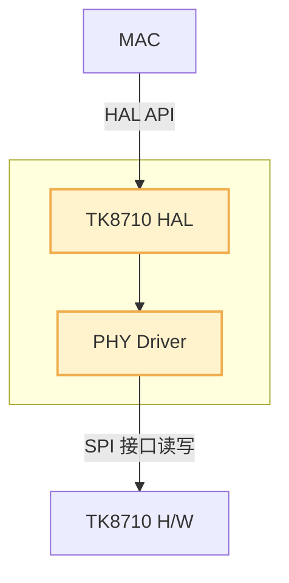
```mermaid
graph TB
    %% 第一层：MAC（单层节点）
    APP["MAC"]

    %% 第二层：HAL + PHY driver（标黄）
    subgraph MID[" "]
        HAL["TK8710 HAL"]
        PHY_DRV["PHY Driver"]
    end

    %% 第三层：TK8710 H/W（单层节点）
    TK8710["TK8710 H/W"]

    %% 调用关系
    APP -->|"HAL API"| HAL
    HAL --> PHY_DRV
    PHY_DRV -->|"SPI 接口读写"| TK8710

    %% 样式：HAL 和 PHY driver 标黄
    classDef halLayer fill:#fff3cd,stroke:#f0ad4e,stroke-width:2px;
    class HAL,PHY_DRV halLayer;
```

### 1.1 HAL 需求说明

- 向上层提供统一接口，屏蔽 TK8710 寄存器和 SPI 细节，抽象 8 通道、128 用户、时隙、频点、功率、波束等传输资源
- 向下层封装 PHY driver，管理 SPI 访问互斥与时序，处理中断事件并异步通知上层
- 满足实时性（中断响应 < 50 µs，端到端延迟 ≤ 100 ms）、并发性（128 用户）、可靠性（错误恢复、故障隔离）要求
- 支持跨平台移植（OS 解耦）、调试诊断（日志、统计、Trace）

### 1.2 功能

- **初始化管理**：芯片初始化、射频配置、日志系统配置
- **时隙配置**：TDD 帧结构配置、速率模式设置、天线配置、超帧配置
- **数据接收**：上行数据接收（支持 128 用户并发）、接收缓冲区管理、数据解析与上报
- **数据发送**：广播数据发送、用户专用数据发送
- **状态监控**：运行状态查询、统计信息获取
- **系统控制**：芯片启动、复位、调试（寄存器读写、PHY driver）

### 1.3 非功能

- **实时性**：中断响应 < 50 µs，单帧处理延迟 < 2 ms，上行端到端延迟 ≤ 100 ms
- **并发性**：支持 128 用户同时接入，避免缓冲区溢出和锁竞争
- **可靠性**：SPI 超时重试、CRC 校验、软复位恢复
- **可移植性**：OS 解耦，适配 FreeRTOS、Linux 等平台
- **可维护性**：日志分级、Trace 开关、统计信息导出

### 1.4 接口

TK8710 HAL 提供两层接口：PHY API 封装芯片底层操作（初始化、配置、数据收发、寄存器读写），HAL API 向上层提供统一抽象接口（初始化、配置、启动、复位、数据发送、状态查询、调试）。

#### 1.4.1 PHY API

| 接口             | 功能描述                 |
| -------------- | -------------------- |
| Tk8710Init     | 初始化TK8710芯片，配置基本工作参数 |
| Tk8710Config   | 配置芯片工作时隙和通信参数 |
| Tk8710Start    | 启动芯片                 |
| Tk8710Reset    | 复位芯片                 |
| Tk8710SendData | 发送数据                 |
| Tk8710ReadReg  | 读寄存器                 |
| Tk8710WriteReg | 写寄存器                 |

#### 1.4.2 HAL API

| API 函数             | 功能描述                |
| ------------------ | ------------------- |
| Tk8710HalInit      | 初始化HAL层，分配资源，准备硬件接口 |
| Tk8710HalConfig    | 配置HAL参数，设置时隙和工作模式   |
| Tk8710HalStart     | 启动HAL，开始硬件工作，可以收发数据  |
| Tk8710HalReset     | 复位HAL，重新初始化硬件状态  |
| Tk8710HalSendData  | 发送数据                |
| Tk8710HalGetStatus | 获取HAL当前状态信息 |
| Tk8710HalDebug     | 提供HAL层调试功能   |
| Tk8710HalCali      | 提供校准功能   |

### 1.5 设计目标

- 硬件解耦，向 MAC 提供稳定、清晰、可扩展的抽象接口
- 实现对 TK8710 的可靠驱动和系统无线资源管理，满足实时性、并发性、稳定性等要求
- 异步非阻塞，支持中断回调（Callback）通知机制
- 支撑调试、测试和后续芯片版本演进
- 架构规范，支持在不同的 OS上快速迁移

### 1.6 约束、假设和运行条件

- **硬件约束**：基于 TK8710 芯片，通过 SPI 接口与主控通信，支持 8 组射频通道、128 用户并发
- **平台约束**：主控芯片需支持 SPI 接口（最高 16 MHz）、GPIO 中断、多线程/多任务调度
- **系统约束**：支持 FreeRTOS 嵌入式操作系统，需提供互斥锁、信号量、定时器等 OS 原语
- **时序约束**：需遵循 TurMass TDD 帧结构，保证中断响应 < 50 µs，单帧处理 < 2 ms
- **资源约束**：需预留足够 RAM 用于 128 用户缓冲区管理（建议 ≥ 512 KB）
- **运行假设**：假设 SPI 通信可靠，PHY driver 接口稳定，上层正确调用 HAL API 初始化和配置流程

## 2 总体架构和设计

TK8710 HAL 采用分层架构设计，由 HAL 层和硬件层组成。HAL 层内部包含 TRM 层和 PHY driver 层，对外提供统一接口。

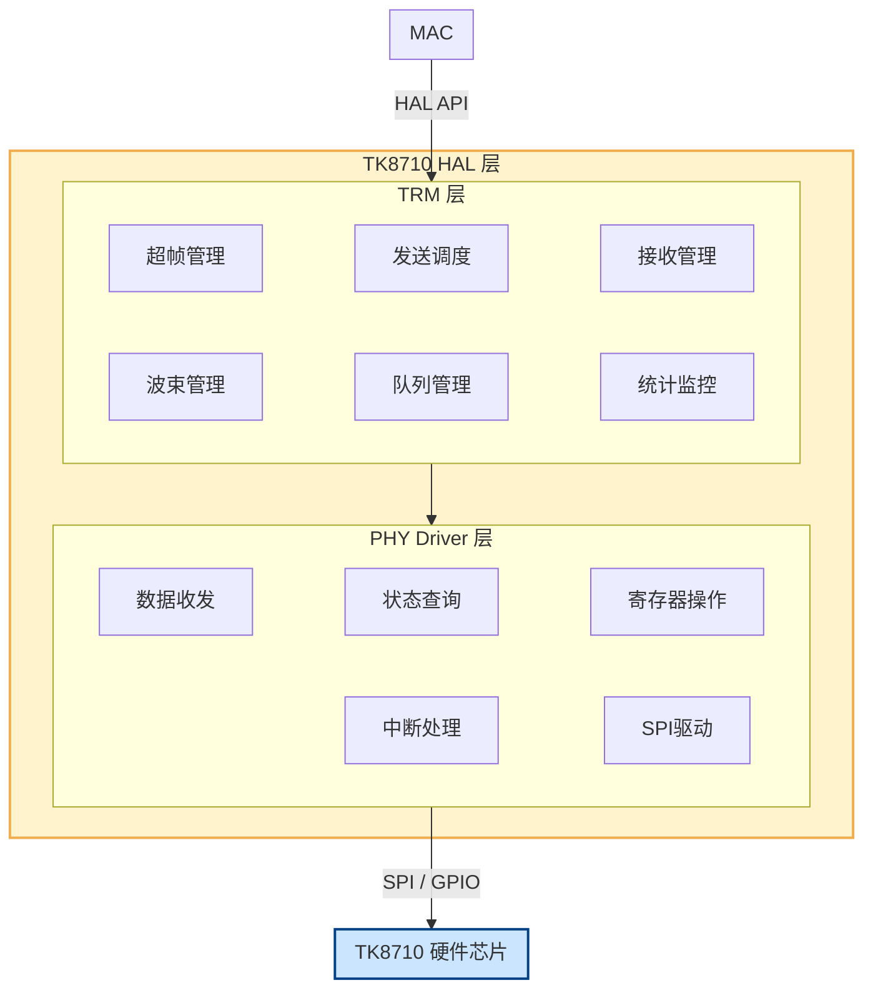
```mermaid
graph TB
    subgraph APP["MAC"]
        direction LR
        
    end
    
    subgraph HAL["TK8710 HAL 层"]
        subgraph TRM["TRM 层"]
            direction LR
            T1["超帧管理"] ~~~ T2["发送调度"] ~~~ T3["接收管理"]
            T4["波束管理"] ~~~ T5["队列管理"] ~~~ T6["统计监控"]
        end
        
        subgraph PHY["PHY Driver 层"]
            direction LR
            P1["数据收发"] ~~~ P2["状态查询"] ~~~ P3["寄存器操作"]
            P4["中断处理"] ~~~ P5["SPI驱动"]
        end
    end
    
    subgraph HW["TK8710 硬件芯片"]
        direction LR
        
    end
    
    APP -->|"HAL API"| TRM
    TRM --> PHY
    PHY -->|"SPI / GPIO"| HW
    
    classDef halStyle fill:#fff3cd,stroke:#f0ad4e,stroke-width:2px
    classDef hwStyle fill:#cce5ff,stroke:#004085,stroke-width:2px
    
    class HAL halStyle
    class HW hwStyle
```

**架构说明**：

| 层级               | 说明                            |
| ---------------- | ----------------------------- |
| **TRM 层**        | 超帧管理、发送调度、接收管理、波束管理、队列管理、统计监控 |
| **PHY Driver 层** | 数据收发、状态查询、寄存器操作、中断处理、SPI 驱动   |

### 2.1 模块功能定义

#### 2.1.1 TRM 层

**模块定位**：TRM（Transmission Resource Management，传输资源管理）层是 HAL 的业务逻辑核心，负责管理和调度无线传输资源。

**核心模块**：

| 模块 | 功能说明 |
|------|----------|
| **超帧管理** | 维护超帧周期、帧号计算、TDD 时隙调度 |
| **发送调度** | 管理发送队列、优先级调度、波束匹配、数据分发 |
| **接收管理** | 上行数据接收、缓冲区管理、数据解析、数据上报 |
| **波束管理** | 波束信息存储、波束与用户映射、波束生命周期管理 |
| **队列管理** | 发送队列维护、队列水位控制、流量调度 |
| **统计监控** | 收发统计、性能监控、状态上报 |

**关键机制**：

1. **超帧管理机制**
   - 维护超帧周期和帧号
   - 计算当前时隙位置
   - 协调 TDD 时隙调度

2. **发送调度机制**
   - 维护发送队列（支持 128 用户并发）
   - 根据帧号和时隙进行数据调度
   - 匹配用户波束信息
   - 调用 PHY Driver 层完成数据发送

3. **接收管理机制**
   - 从 PHY Driver 层接收上行数据
   - 解析用户 ID、帧号、信号质量等信息
   - 提取并存储波束信息
   - 通过回调通知上层应用

4. **波束管理机制**
   - 存储上行接收时获取的波束信息
   - 维护波束与用户 ID 的映射关系
   - 管理波束生命周期（超时清理）
   - 为下行发送提供波束查询

5. **资源抽象机制**
   - 将 8 通道、128 用户、频点、时隙、功率、波束等 PHY 资源抽象为统一的传输资源
   - 向上层提供简化的资源访问接口
   - 屏蔽底层硬件复杂性

#### 2.1.2 PHY Driver 层

**模块定位**：PHY Driver 层是 HAL 的硬件抽象核心，直接与 TK8710 芯片交互，封装底层硬件操作。

**核心模块**：

| 模块 | 功能说明 |
|------|----------|
| **数据收发** | 上行数据读取、下行数据写入、数据缓冲管理 |
| **状态查询** | 芯片状态查询、运行状态监控、错误状态上报 |
| **寄存器操作** | 寄存器读写封装、配置参数下发、状态寄存器查询 |
| **中断处理** | 响应 TK8710 中断信号、中断事件分发、中断上下文管理 |
| **SPI 驱动** | SPI 接口初始化、SPI 读写操作、SPI 互斥保护 |

**关键机制**：

1. **中断处理机制**
   - 注册 GPIO 中断回调
   - 中断上下文中只做轻量操作（读取中断状态、清除中断标志）
   - 将耗时操作（数据读取、解析）放到后台任务
   - 通过事件通知 TRM 层

2. **SPI 驱动机制**
   - 初始化 SPI 接口（最高 16 MHz，Mode 0）
   - 提供 SPI 读写原语
   - 保证多线程环境下的 SPI 访问互斥
   - 支持 DMA 传输（可选）

3. **寄存器操作机制**
   - 封装 TK8710 寄存器读写
   - 提供配置参数批量下发
   - 支持寄存器状态轮询
   - 提供调试用的寄存器直接访问接口

4. **数据收发机制**
   - 上行：中断触发 → SPI 读取数据 → 解析数据 → 上报 TRM 层
   - 下行：TRM 层请求 → 准备数据 → SPI 写入 → 等待发送完成中断
   - 管理收发缓冲区（支持 128 用户并发）
   - 处理 CRC 校验

5. **状态查询机制**
   - 定期查询芯片运行状态
   - 监控 SPI 通信状态
   - 检测异常情况（超时、CRC 错误）
   - 上报错误状态给 TRM 层

**硬件接口**：
- SPI 接口：4 线 SPI（MOSI、MISO、SCK、CS），最高 16 MHz，Mode 0
- GPIO 中断：至少 1 个中断输入引脚，用于接收 TK8710 中断信号
- 电源控制：可选的芯片复位和电源控制引脚

### 2.2 工作流程

#### 2.2.1 初始化流程

**目的**：完成 HAL 层的初始化，准备硬件接口

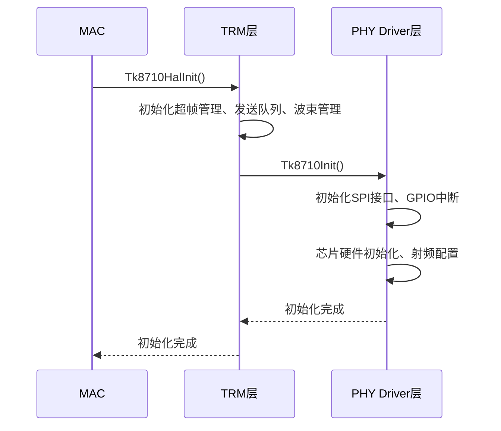
```mermaid
sequenceDiagram
    participant MAC as MAC
    participant TRM as TRM层
    participant PHY as PHY Driver层
  
    MAC->>TRM: Tk8710HalInit()
    TRM->>TRM: 初始化超帧管理、发送队列、波束管理
    TRM->>PHY: Tk8710Init()
    PHY->>PHY: 初始化SPI接口、GPIO中断
    PHY->>PHY: 芯片硬件初始化、射频配置
    PHY-->>TRM: 初始化完成
    TRM-->>MAC: 初始化完成
```

**关键步骤**：
1. MAC 调用 `Tk8710HalInit()` 初始化 HAL
2. TRM 层初始化超帧管理、发送队列、波束管理等内部数据结构
3. TRM 层调用 `Tk8710Init()` 初始化 PHY Driver
4. PHY Driver 层初始化 SPI 接口、GPIO 中断
5. PHY Driver 层完成 TK8710 芯片硬件初始化和射频配置
6. 返回初始化结果给 MAC

#### 2.2.2 配置流程

**目的**：配置 TDD 帧结构、速率模式、超帧参数

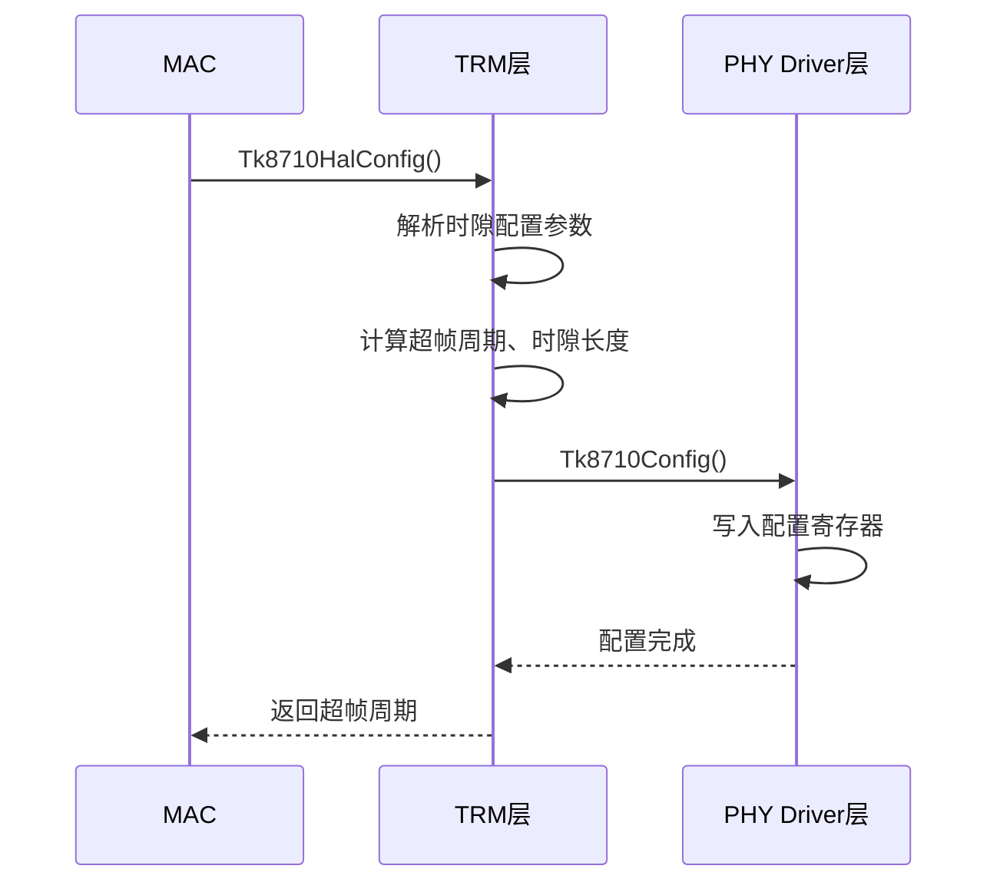
```mermaid
sequenceDiagram
    participant MAC as MAC
    participant TRM as TRM层
    participant PHY as PHY Driver层
  
    MAC->>TRM: Tk8710HalConfig()
    TRM->>TRM: 解析时隙配置参数
    TRM->>TRM: 计算超帧周期、时隙长度
    TRM->>PHY: Tk8710Config()
    PHY->>PHY: 写入配置寄存器
    PHY-->>TRM: 配置完成
    TRM-->>MAC: 返回超帧周期
```

**关键步骤**：
1. MAC 调用 `Tk8710HalConfig()` 配置 HAL
2. TRM 层解析时隙配置参数
3. TRM 层计算超帧周期、时隙长度
4. TRM 层调用 `Tk8710Config()` 配置硬件参数
5. PHY Driver 层写入配置寄存器到 TK8710 芯片
6. 返回超帧周期给 MAC

#### 2.2.3 启动流程

**目的**：启动 HAL，开始硬件工作，可以收发数据

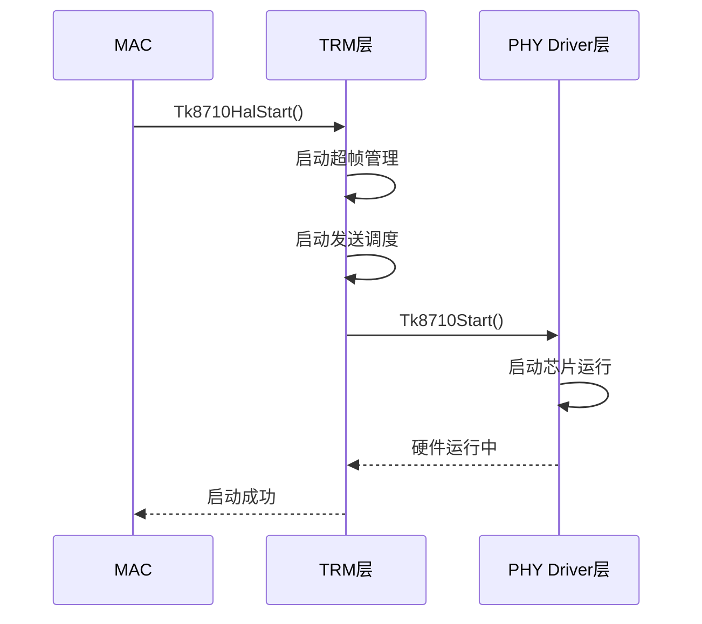
```mermaid
sequenceDiagram
    participant MAC as MAC
    participant TRM as TRM层
    participant PHY as PHY Driver层
  
    MAC->>TRM: Tk8710HalStart()
    TRM->>TRM: 启动超帧管理
    TRM->>TRM: 启动发送调度
    TRM->>PHY: Tk8710Start()
    PHY->>PHY: 启动芯片运行
    PHY-->>TRM: 硬件运行中
    TRM-->>MAC: 启动成功
```

**关键步骤**：
1. MAC 调用 `Tk8710HalStart()` 启动 HAL
2. TRM 层启动超帧管理
3. TRM 层启动发送调度
4. TRM 层调用 `Tk8710Start()` 启动硬件工作
5. PHY Driver 层启动 TK8710 芯片运行
6. 返回启动结果给 MAC

#### 2.2.4 发送数据流程

**目的**：发送广播数据或用户专用数据

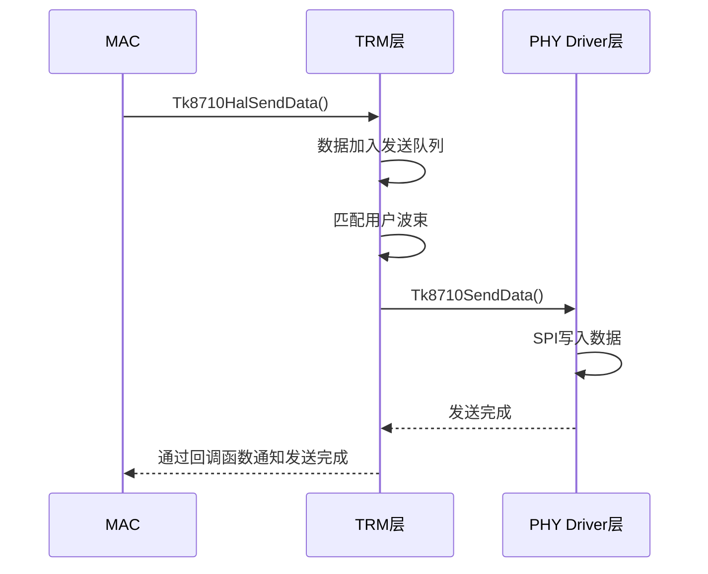
```mermaid
sequenceDiagram
    participant MAC as MAC
    participant TRM as TRM层
    participant PHY as PHY Driver层
  
    MAC->>TRM: Tk8710HalSendData()
    TRM->>TRM: 数据加入发送队列
    TRM->>TRM: 匹配用户波束
    TRM->>PHY: Tk8710SendData()
    PHY->>PHY: SPI写入数据
    PHY-->>TRM: 发送完成
    TRM-->>MAC: 通过回调函数通知发送完成
```

**关键步骤**：
1. MAC 调用 `Tk8710HalSendData()` 发送数据
2. TRM 层将数据加入发送队列
3. TRM 层匹配用户波束信息
4. TRM 层调用 `Tk8710SendData()` 执行硬件发送操作
5. PHY Driver 层通过 SPI 写入数据到 TK8710 芯片
6. 发送完成后通过回调函数通知 MAC 发送完成

#### 2.2.5 接收数据流程

**目的**：接收上行数据并通知应用层

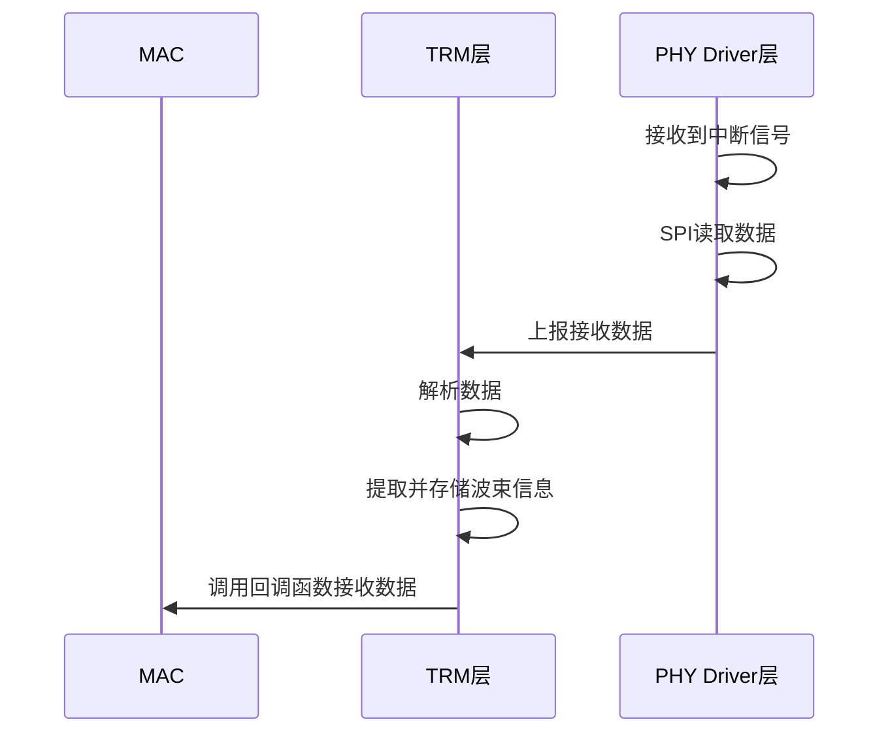
```mermaid
sequenceDiagram
    participant MAC as MAC
    participant TRM as TRM层
    participant PHY as PHY Driver层
  
    PHY->>PHY: 接收到中断信号
    PHY->>PHY: SPI读取数据
    PHY->>TRM: 上报接收数据
    TRM->>TRM: 解析数据
    TRM->>TRM: 提取并存储波束信息
    TRM->>MAC: 调用回调函数接收数据
```

**关键步骤**：
1. PHY Driver 层接收到 TK8710 芯片中断信号
2. PHY Driver 层通过 SPI 读取上行数据
3. PHY Driver 层上报接收数据给 TRM 层
4. TRM 层解析数据（用户 ID、帧号、信号质量等）
5. TRM 层提取并存储波束信息
6. 调用 MAC 回调函数接收数据

#### 2.2.6 异常/事件处理

**目的**：处理异常情况和事件通知

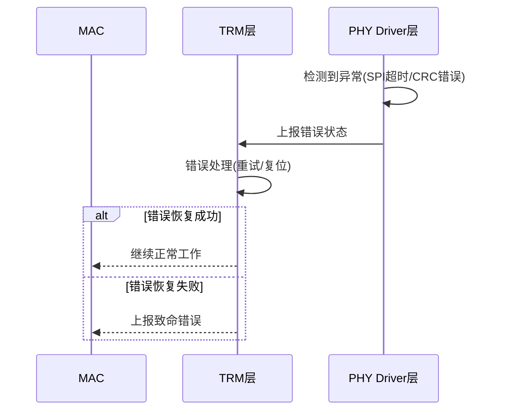
```mermaid
sequenceDiagram
    participant MAC as MAC
    participant TRM as TRM层
    participant PHY as PHY Driver层
  
    PHY->>PHY: 检测到异常(SPI超时/CRC错误)
    PHY->>TRM: 上报错误状态
    TRM->>TRM: 错误处理(重试/复位)
    alt 错误恢复成功
        TRM-->>MAC: 继续正常工作
    else 错误恢复失败
        TRM-->>MAC: 上报致命错误
    end
```

**异常类型**：
- SPI 通信超时/失败
- 中断丢失/延迟
- 发送队列满
- 波束信息缺失

**处理策略**：
- SPI 超时：重试 3 次，失败后上报错误
- 中断延迟：记录延迟统计，超过阈值告警
- 队列满：丢弃低优先级数据或返回错误
- 波束缺失：使用广播波束或返回发送失败

#### 2.2.7 关闭或复位流程

**目的**：复位 HAL，重新初始化硬件状态

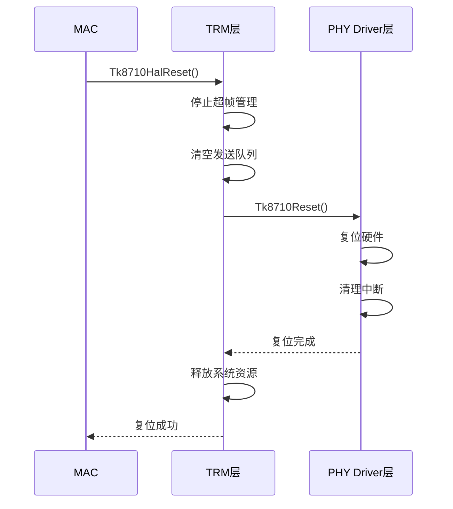
```mermaid
sequenceDiagram
    participant MAC as MAC
    participant TRM as TRM层
    participant PHY as PHY Driver层
  
    MAC->>TRM: Tk8710HalReset()
    TRM->>TRM: 停止超帧管理
    TRM->>TRM: 清空发送队列
    TRM->>PHY: Tk8710Reset()
    PHY->>PHY: 复位硬件
    PHY->>PHY: 清理中断
    PHY-->>TRM: 复位完成
    TRM->>TRM: 释放系统资源
    TRM-->>MAC: 复位成功
```

**关键步骤**：
1. MAC 调用 `Tk8710HalReset()` 复位 HAL
2. TRM 层停止超帧管理
3. TRM 层清空发送队列
4. TRM 层调用 `Tk8710Reset()` 复位芯片
5. PHY Driver 层复位 TK8710 芯片硬件
6. PHY Driver 层清理中断
7. TRM 层释放系统资源
8. 返回复位结果给 MAC

## 3 详细设计

### 3.1 子模块划分

TK8710 HAL 按照功能和职责划分为以下核心模块：

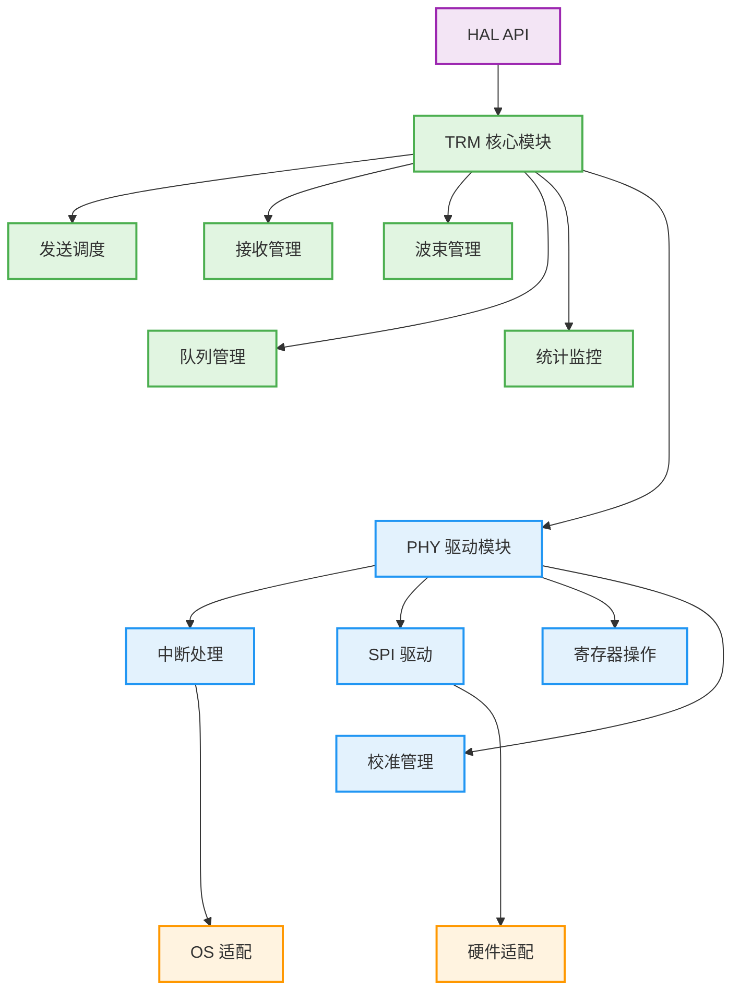
```mermaid
flowchart TD
    HAL_API["HAL API"]
    
    HAL_API --> TRM_CORE["TRM 核心模块"]
    
    TRM_CORE --> TRM_TX["发送调度"]
    TRM_CORE --> TRM_RX["接收管理"]
    TRM_CORE --> TRM_BEAM["波束管理"]
    
    TRM_TX ~~~ TRM_QUEUE["队列管理"]
    TRM_RX ~~~ TRM_QUEUE
    TRM_BEAM ~~~ TRM_QUEUE
    
    TRM_CORE --> TRM_QUEUE
    TRM_CORE --> TRM_STATS["统计监控"]
    
    TRM_TX ~~~ DUMMY1[ ]
    TRM_RX ~~~ DUMMY1
    TRM_BEAM ~~~ DUMMY1
    TRM_QUEUE ~~~ DUMMY1
    TRM_STATS ~~~ DUMMY1
    
    DUMMY1 ~~~ PHY_DRV["PHY 驱动模块"]
    TRM_CORE --> PHY_DRV
    
    PHY_DRV --> PHY_ISR["中断处理"]
    PHY_DRV --> PHY_SPI["SPI 驱动"]
    PHY_DRV --> PHY_REG["寄存器操作"]
    
    PHY_ISR ~~~ PHY_CAL["校准管理"]
    PHY_SPI ~~~ PHY_CAL
    PHY_REG ~~~ PHY_CAL
    
    PHY_DRV --> PHY_CAL
    
    PHY_ISR ~~~ DUMMY2[ ]
    PHY_SPI ~~~ DUMMY2
    PHY_REG ~~~ DUMMY2
    PHY_CAL ~~~ DUMMY2
    
    DUMMY2 ~~~ PORT_OS["OS 适配"]
    DUMMY2 ~~~ PORT_HW["硬件适配"]
    PHY_SPI --> PORT_HW
    PHY_ISR --> PORT_OS
    
    classDef apiStyle fill:#f3e5f5,stroke:#9c27b0,stroke-width:2px
    classDef trmStyle fill:#e1f5e1,stroke:#4caf50,stroke-width:2px
    classDef phyStyle fill:#e3f2fd,stroke:#2196f3,stroke-width:2px
    classDef portStyle fill:#fff3e0,stroke:#ff9800,stroke-width:2px
    classDef invisible fill:none,stroke:none,color:transparent
    
    class HAL_API apiStyle
    class TRM_CORE,TRM_TX,TRM_RX,TRM_BEAM,TRM_QUEUE,TRM_STATS trmStyle
    class PHY_DRV,PHY_ISR,PHY_SPI,PHY_REG,PHY_CAL phyStyle
    class PORT_OS,PORT_HW portStyle
    class DUMMY1,DUMMY2 invisible
```

#### 3.1.1 模块职责说明

**TRM 层模块**

| 模块 | 文件 | 职责 |
|------|------|------|
| TRM 核心模块 | trm_core.c/h | 超帧管理、状态机控制、资源调度协调 |
| 发送调度模块 | trm_tx.c/h | 发送队列管理、优先级调度、波束匹配、数据分发 |
| 接收管理模块 | trm_rx.c/h | 上行数据接收、缓冲区管理、数据解析、数据上报 |
| 波束管理模块 | trm_beam.c/h | 波束信息存储、波束与用户映射、波束生命周期管理 |
| 队列管理模块 | trm_queue.c/h | 环形队列实现、队列水位控制、内存池管理 |
| 统计监控模块 | trm_stats.c/h | 收发统计、性能监控、状态上报 |

**PHY Driver 层模块**

| 模块 | 文件 | 职责 |
|------|------|------|
| PHY 驱动模块 | phy_driver.c/h | PHY 层主控制逻辑、数据收发接口、状态查询 |
| 中断处理模块 | phy_isr.c/h | GPIO 中断响应、中断事件分发、中断上下文管理 |
| SPI 驱动模块 | phy_spi.c/h | SPI 接口初始化、SPI 读写操作、SPI 互斥保护 |
| 寄存器操作模块 | phy_reg.c/h | 寄存器读写封装、配置参数下发、状态寄存器查询 |
| 校准管理模块 | phy_cal.c/h | 校准数据存储、校准参数加载、校准流程控制 |

**移植层模块**

| 模块 | 文件 | 职责 |
|------|------|------|
| OS 适配模块 | port_os.c/h | 互斥锁、信号量、定时器、任务调度等 OS 原语封装 |
| 硬件适配模块 | port_hw.c/h | GPIO、SPI、DMA 等硬件接口封装 |

**公共模块**

| 模块 | 文件 | 职责 |
|------|------|------|
| HAL 初始化 | hal_init.c/h | HAL 层初始化入口、资源分配、模块初始化协调 |
| HAL API | hal_api.c/h | 对外 API 接口实现 |
| 数据类型 | hal_types.h | 公共数据结构、枚举、宏定义 |
| 日志模块 | hal_log.c/h | 日志输出、日志级别控制、日志格式化 |

#### 3.1.2 模块依赖关系

**依赖层次**（从上到下）：
1. HAL API 层：依赖 TRM 核心模块
2. TRM 层：依赖 PHY Driver 层和移植层
3. PHY Driver 层：依赖移植层
4. 移植层：依赖具体平台（FreeRTOS、Linux 等）

**关键依赖**：
- TRM 核心模块 → PHY 驱动模块：调用 PHY API 完成硬件操作
- 发送调度模块 → 波束管理模块：查询用户波束信息
- 接收管理模块 → 波束管理模块：存储上行波束信息
- PHY 驱动模块 → SPI 驱动模块：通过 SPI 与芯片通信
- 中断处理模块 → OS 适配模块：使用信号量通知后台任务
- 队列管理模块 → OS 适配模块：使用互斥锁保护队列

### 3.2 文件结构

```
tk8710_hal/
├── include/                         # 公共头文件目录
│   ├── tk8710_hal_api.h             # HAL API 接口（对 MAC 暴露）
│   ├── tk8710_hal_types.h           # 公共数据结构、枚举、宏定义
│   ├── tk8710_hal_config.h          # HAL 配置参数
│   ├── tk8710_hal_error.h           # 错误码定义
│   └── tk8710_hal_port.h            # 移植层接口定义
│
├── src/                             # 源代码目录
│   ├── common/                      # 公共模块
│   │   ├── hal_init.c               # HAL 初始化实现
│   │   ├── hal_api.c                # HAL API 实现
│   │   └── hal_log.c                # 日志模块实现
│   │
│   ├── trm/                         # TRM 层模块
│   │   ├── trm_core.c               # TRM 核心模块：状态机、超帧管理
│   │   ├── trm_core.h               # TRM 核心模块内部接口
│   │   ├── trm_tx.c                 # 发送调度模块：队列管理、调度策略
│   │   ├── trm_tx.h                 # 发送调度模块内部接口
│   │   ├── trm_rx.c                 # 接收管理模块：数据接收、解析、上报
│   │   ├── trm_rx.h                 # 接收管理模块内部接口
│   │   ├── trm_beam.c               # 波束管理模块：波束存储、查询、超时
│   │   ├── trm_beam.h               # 波束管理模块内部接口
│   │   ├── trm_queue.c              # 队列管理模块：环形队列、内存池
│   │   ├── trm_queue.h              # 队列管理模块内部接口
│   │   ├── trm_stats.c              # 统计监控模块：收发统计、性能监控
│   │   └── trm_stats.h              # 统计监控模块内部接口
│   │
│   ├── phy/                         # PHY Driver 层模块
│   │   ├── phy_driver.c             # PHY 驱动模块：主控制逻辑
│   │   ├── phy_driver.h             # PHY 驱动模块内部接口
│   │   ├── phy_isr.c                # 中断处理模块：中断响应、事件分发
│   │   ├── phy_isr.h                # 中断处理模块内部接口
│   │   ├── phy_spi.c                # SPI 驱动模块：SPI 读写、互斥保护
│   │   ├── phy_spi.h                # SPI 驱动模块内部接口
│   │   ├── phy_reg.c                # 寄存器操作模块：寄存器读写封装
│   │   ├── phy_reg.h                # 寄存器操作模块内部接口
│   │   ├── phy_cal.c                # 校准管理模块：校准数据管理
│   │   └── phy_cal.h                # 校准管理模块内部接口
│   │
│   └── port/                        # 移植层模块
│       ├── port_os.c                # OS 适配实现（互斥锁、信号量等）
│       ├── port_os.h                # OS 适配内部接口
│       ├── port_hw.c                # 硬件适配实现（GPIO、SPI、DMA）
│       ├── port_hw.h                # 硬件适配内部接口
│       ├── freertos/                # FreeRTOS 平台适配
│       │   ├── port_freertos.c      # FreeRTOS 具体实现
│       │   └── port_freertos.h      # FreeRTOS 平台配置
│       └── linux/                   # Linux 平台适配
│           ├── port_linux.c         # Linux 具体实现
│           └── port_linux.h         # Linux 平台配置
│
├── test/                            # 测试代码目录
│   ├── unit_test/                   # 单元测试
│   │   ├── test_trm_core.c
│   │   ├── test_trm_tx.c
│   │   ├── test_trm_rx.c
│   │   ├── test_phy_driver.c
│   │   └── test_phy_spi.c
│   ├── integration_test/            # 集成测试
│   │   ├── test_hal_init.c
│   │   ├── test_hal_tx_rx.c
│   │   └── test_hal_stress.c
│   └── test_main.c                  # 测试主程序
│
├── examples/                        # 示例代码目录
│   ├── example_basic.c              # 基础使用示例
│   ├── example_advanced.c           # 高级功能示例
│   └── example_stress.c             # 压力测试示例
│
├── tools/                           # 工具目录
│   ├── code_generator/              # 代码生成工具
│   ├── test_tools/                  # 测试工具
│   └── debug_tools/                 # 调试工具
│
├── build/                           # 构建输出目录（自动生成）
│   ├── obj/                         # 目标文件
│   └── lib/                         # 库文件
│
├── Makefile                         # 构建脚本
├── CMakeLists.txt                   # CMake 构建配置
├── README.md                        # 项目说明
├── CHANGELOG.md                     # 变更日志
└── LICENSE                          # 许可证
```

#### 3.2.1 文件说明

**头文件（include/）**

| 文件 | 说明 |
|------|------|
| tk8710_hal_api.h | HAL API 接口定义，对 MAC 层暴露的所有函数、数据结构、枚举 |
| tk8710_hal_types.h | 公共数据类型定义，包括结构体、枚举、宏定义 |
| tk8710_hal_config.h | HAL 配置参数，如缓冲区大小、队列长度、超时时间等 |
| tk8710_hal_error.h | 错误码定义，统一的错误码体系 |
| tk8710_hal_port.h | 移植层接口定义，需要平台实现的接口 |

**源代码（src/）**

*公共模块（common/）*
- hal_init.c：HAL 初始化入口，协调各模块初始化
- hal_api.c：HAL API 实现，调用 TRM 层接口
- hal_log.c：日志模块实现，支持多级别日志输出

*TRM 层（trm/）*
- trm_core.c：TRM 核心逻辑，状态机控制、超帧管理
- trm_tx.c：发送调度，队列管理、优先级调度、波束匹配
- trm_rx.c：接收管理，数据接收、解析、上报
- trm_beam.c：波束管理，波束存储、查询、超时清理
- trm_queue.c：队列管理，环形队列实现、内存池管理
- trm_stats.c：统计监控，收发统计、性能监控

*PHY Driver 层（phy/）*
- phy_driver.c：PHY 驱动主控制，数据收发、状态查询
- phy_isr.c：中断处理，GPIO 中断响应、事件分发
- phy_spi.c：SPI 驱动，SPI 读写、互斥保护
- phy_reg.c：寄存器操作，寄存器读写封装
- phy_cal.c：校准管理，校准数据存储、加载

*移植层（port/）*
- port_os.c：OS 适配，互斥锁、信号量、定时器等
- port_hw.c：硬件适配，GPIO、SPI、DMA 等
- freertos/：FreeRTOS 平台具体实现
- linux/：Linux 平台具体实现

**测试代码（test/）**

- unit_test/：单元测试，测试各模块独立功能
- integration_test/：集成测试，测试模块间协作
- test_main.c：测试主程序，运行所有测试用例

**示例代码（examples/）**

- example_basic.c：基础使用示例，演示初始化、配置、收发流程
- example_advanced.c：高级功能示例，演示波束管理、统计监控等
- example_stress.c：压力测试示例，演示高并发场景

**工具（tools/）**

- code_generator/：代码生成工具，自动生成配置代码
- test_tools/：测试工具，自动化测试脚本
- debug_tools/：调试工具，日志分析、性能分析

#### 3.2.2 编译输出

**库文件**：
- libtk8710_hal.a：静态库
- libtk8710_hal.so：动态库（可选）

**头文件安装**：
- 安装 include/ 目录下的所有头文件到系统头文件目录

**示例程序**：
- example_basic：基础示例可执行文件
- example_advanced：高级示例可执行文件
- example_stress：压力测试可执行文件

#### 3.2.3 构建系统

**Makefile 构建**：
```bash
make                    # 编译库和示例
make clean              # 清理编译输出
make test               # 运行测试
make install            # 安装库和头文件
```

**CMake 构建**：
```bash
mkdir build && cd build
cmake ..
make
make test
make install
```

**配置选项**：
- PLATFORM：目标平台（freertos、linux）
- DEBUG：调试模式（ON/OFF）
- LOG_LEVEL：日志级别（0-4）
- ENABLE_DMA：启用 DMA（ON/OFF）

### 3.3 核心数据结构

#### 3.3.1 HAL 层数据结构

**1. HAL 初始化配置结构体**

```c
/* HAL 初始化配置 */
typedef struct {
    uint8_t  ant_en;          /* 数字处理天线数使能，8bit对应8根天线配置 */
    uint8_t  rf_en;           /* 射频天线使能，8bit对应8根天线配置 */
    uint8_t  tx_bcnant_en;    /* 发送BCN天线使能，8bit对应8根天线配置 */
    uint8_t  tx_sync;         /* 本地同步 */
    uint8_t  conti_mode;      /* 单次工作模式或者连续工作模式 */
    uint8_t  rf_model;        /* 射频芯片型号：1=SX1255, 2=SX1257 */
    uint8_t  bcn_bits;        /* bcn携带信息 */
    uint32_t Freq;            /* 射频中心频率，单位hz */
    uint8_t  rxgain;          /* 射频接收增益 */
    uint8_t  txgain;          /* 射频发送增益 */
    void (*OnRxData)(const RxDataList* rxDataList);           /* 接收数据回调 */
    void (*OnTxComplete)(const TxCompleteResult* txResult);   /* 发送完成回调 */
} Tk8710HalInitConfig;
```

**2. 时隙配置结构体**

```c
/* 时隙配置 */
typedef struct {
    uint8_t  msMode;           /* 主/从模式（主：发送bcn，从：接收bcn），0：主，1：从 */
    uint8_t  plCrcEn;          /* Payload CRC使能，0：disable，1：enable */
    uint8_t  rateCount;        /* 速率个数 */
    uint8_t  rateModes[4];     /* 每个速率的模式 */
    uint8_t  upBlockNum[4];    /* 每个模式上行（slot2）包块数 */
    uint8_t  downBlockNum[4];  /* 每个模式下行（slot3）包块数 */
    uint8_t  FrameNum;         /* 超帧个数 */
    uint8_t  freqGroupNum;     /* 频域分区总数 */
    uint8_t  pointFreqNum;     /* 指定频率总数 */
    uint8_t  frametype;        /* 时隙结构配置 */
} SlotCfg;
```

**3. 接收数据结构体**

```c
/* 单个用户接收数据 */
typedef struct {
    uint32_t userId;           /* 用户ID */
    uint8_t  slotIndex;        /* 时隙索引 */
    uint32_t frameNo;          /* 帧号 */
    int8_t   rssi;             /* 信号强度 (dBm) */
    int8_t   snr;              /* 信噪比 */
    uint32_t freq;             /* 频点 (Hz) */
    uint8_t  rateMode;         /* 速率模式 */
    uint8_t  antIndex;         /* 天线索引 */
    uint16_t dataLen;          /* 数据长度 */
    uint8_t* data;             /* 数据指针 */
    void*    beamInfo;         /* 波束信息指针 */
} TrmRxUserData;

/* 接收数据列表 */
typedef struct {
    uint8_t  slotIndex;        /* 时隙索引 */
    uint8_t  userCount;        /* 用户数量 */
    uint16_t reserved;
    uint32_t frameNo;          /* 帧号 */
    TRM_RxUserData* users;     /* 用户数据数组 */
} TrmRxDataList;
```

**4. 发送完成结构体**

```c
/* 发送结果枚举 */
typedef enum {
    TX_OK = 0,              /* 发送成功 */
    TX_NO_BEAM,             /* 无波束信息 */
    TX_TIMEOUT,             /* 发送超时 */
    TX_ERROR,               /* 发送错误 */
} TxResult;

/* 单个用户发送结果 */
typedef struct {
    uint32_t userId;         /* 用户ID */
    TxResult result;         /* 发送结果 */
} TxUserResult;

/* 发送完成回调结果 */
typedef struct {
    uint32_t totalUsers;           /* 发送用户总数 */
    uint32_t remainingQueue;       /* 剩余发送队列数量 */
    uint32_t userCount;            /* 结果数组中的用户数量 */
    const TxUserResult* users;     /* 用户结果数组指针 */
} TxCompleteResult;
```

**5. 统计信息结构体**

```c
/* TRM 状态枚举 */
typedef enum {
    TRM_STATE_UNINIT = 0,    /* 未初始化 */
    TRM_STATE_INITED,        /* 已初始化 */
    TRM_STATE_RUNNING,       /* 运行中 */
    TRM_STATE_STOPPED,       /* 已停止 */
    TRM_STATE_ERROR          /* 错误状态 */
} TrmState;

/* 统计信息结构体 */
typedef struct {
    TrmState state;              /* TRM运行状态 */
    uint32_t txCount;            /* 总发送次数 */
    uint32_t txSuccessCount;     /* 发送成功次数 */
    uint32_t txFailureCount;     /* 发送失败次数 */
    uint32_t txRetryCount;       /* 发送重试次数 */
    uint32_t rxCount;            /* 总接收次数 */
    uint32_t rxDataCount;        /* 接收数据次数 */
    uint32_t beamCount;          /* 当前波束数量 */
    uint32_t memAllocCount;      /* 内存分配次数 */
    uint32_t memFreeCount;       /* 内存释放次数 */
    uint32_t txQueueRemaining;   /* 剩余发送队列数量 */
} TrmStatus;
```

**6. 错误码定义**

```c
/* HAL 错误码 */
typedef enum {
    TK8710_HAL_OK = 0,           /* 成功 */
    TK8710_HAL_ERROR_PARAM,      /* 参数错误 */
    TK8710_HAL_ERROR_INIT,       /* 初始化失败 */
    TK8710_HAL_ERROR_CONFIG,     /* 配置失败 */
    TK8710_HAL_ERROR_START,      /* 启动失败 */
    TK8710_HAL_ERROR_RESET,      /* 复位失败 */
    TK8710_HAL_ERROR_SEND,       /* 发送失败 */
    TK8710_HAL_ERROR_STATUS,     /* 状态查询失败 */
    TK8710_HAL_ERROR_TIMEOUT,    /* 超时 */
    TK8710_HAL_ERROR_NO_MEM,     /* 内存不足 */
    TK8710_HAL_ERROR_BUSY,       /* 系统忙 */
    TK8710_HAL_ERROR_NOT_READY,  /* 未就绪 */
} Tk8710HalError;
```

#### 3.3.2 TRM 层数据结构

**1. 超帧管理结构体**

```c
/* 超帧配置 */
typedef struct {
    uint32_t superFramePeriod;   /* 超帧周期 (ms) */
    uint32_t frameCount;          /* 超帧内帧数 */
    uint32_t currentFrame;        /* 当前帧号 */
    uint32_t slotDuration;        /* 时隙长度 (ms) */
    uint8_t  slotCount;           /* 时隙数量 */
} TrmSuperFrameConfig;
```

**2. 发送队列结构体**

```c
/* 发送队列节点 */
typedef struct {
    uint32_t userId;              /* 用户ID */
    uint8_t  downlinkType;        /* 下行类型：slot1/slot3 */
    uint8_t  txPower;             /* 发送功率 */
    uint8_t  beamType;            /* 波束类型 */
    uint8_t  targetRateMode;      /* 目标速率模式 */
    uint32_t frameNo;             /* 目标帧号 */
    uint16_t dataLen;             /* 数据长度 */
    uint8_t  data[600];           /* 数据缓冲区 */
    uint32_t timestamp;           /* 入队时间戳 */
    uint8_t  retryCount;          /* 重试次数 */
} TrmTxQueueNode;

/* 发送队列 */
typedef struct {
    TRM_TxQueueNode* nodes;       /* 队列节点数组 */
    uint32_t capacity;            /* 队列容量 */
    uint32_t head;                /* 队列头 */
    uint32_t tail;                /* 队列尾 */
    uint32_t count;               /* 当前队列长度 */
    void*    mutex;               /* 互斥锁 */
} TrmTxQueue;
```

**3. 波束管理结构体**

```c
/* 波束信息 */
typedef struct {
    uint32_t userId;              /* 用户ID */
    uint8_t  beamData[64];        /* 波束数据 */
    uint32_t timestamp;           /* 更新时间戳 */
    uint32_t frameNo;             /* 帧号 */
    int8_t   rssi;                /* 信号强度 */
    int8_t   snr;                 /* 信噪比 */
    uint8_t  valid;               /* 有效标志 */
} TrmBeamInfo;

/* 波束管理表 */
typedef struct {
    TRM_BeamInfo* beams;          /* 波束信息数组 */
    uint32_t capacity;            /* 容量 */
    uint32_t count;               /* 当前数量 */
    uint32_t timeoutMs;           /* 超时时间 (ms) */
    void*    mutex;               /* 互斥锁 */
} TrmBeamTable;
```

#### 3.3.3 PHY Driver 层数据结构

**1. PHY 配置结构体**

```c
/* 射频配置 */
typedef struct {
    uint32_t freq;                /* 中心频率 (Hz) */
    uint8_t  rxGain;              /* 接收增益 */
    uint8_t  txGain;              /* 发送增益 */
    uint8_t  rfModel;             /* 射频芯片型号 */
} ChipRfConfig;

/* 芯片配置 */
typedef struct {
    uint8_t  antEn;               /* 天线使能 */
    uint8_t  rfEn;                /* 射频使能 */
    uint8_t  txBcnAntEn;          /* BCN天线使能 */
    uint8_t  txSync;              /* 同步模式 */
    uint8_t  contiMode;           /* 连续工作模式 */
} ChipConfig;
```

**2. 中断事件结构体**

```c
/* 中断类型枚举 */
typedef enum {
    PHY_IRQ_NONE = 0,            /* 无中断 */
    PHY_IRQ_RX_BCN,              /* 接收BCN */
    PHY_IRQ_RX_DATA,             /* 接收数据 */
    PHY_IRQ_TX_DONE,             /* 发送完成 */
    PHY_IRQ_ERROR,               /* 错误中断 */
} PhyIrqType;

/* 中断事件 */
typedef struct {
    PHY_IrqType type;            /* 中断类型 */
    uint32_t    timestamp;       /* 时间戳 */
    uint32_t    param;           /* 参数 */
} PhyIrqEvent;
```

**3. SPI 传输结构体**

```c
/* SPI 传输配置 */
typedef struct {
    uint32_t speed;              /* SPI 速度 (Hz) */
    uint8_t  mode;               /* SPI 模式 */
    uint8_t  bits;               /* 位宽 */
    uint8_t  lsbFirst;           /* 位序 */
    uint8_t  csPin;              /* 片选引脚 */
} PhySpiConfig;

/* SPI 传输请求 */
typedef struct {
    uint8_t* txBuf;              /* 发送缓冲区 */
    uint8_t* rxBuf;              /* 接收缓冲区 */
    uint32_t len;                /* 传输长度 */
    uint32_t timeout;            /* 超时时间 (ms) */
} PhySpiTransfer;
```

#### 3.3.4 移植层数据结构

**1. OS 原语封装**

```c
/* 互斥锁句柄 */
typedef void* HAL_Mutex;

/* 信号量句柄 */
typedef void* HAL_Semaphore;

/* 定时器句柄 */
typedef void* HAL_Timer;

/* 线程句柄 */
typedef void* HAL_Thread;
```

**2. 内存池结构体**

```c
/* 内存块 */
typedef struct MemBlock {
    struct MemBlock* next;       /* 下一个空闲块 */
    uint8_t  data[];             /* 数据区 */
} MemBlock;

/* 内存池 */
typedef struct {
    MemBlock* freeList;          /* 空闲链表 */
    uint32_t  blockSize;         /* 块大小 */
    uint32_t  blockCount;        /* 块数量 */
    uint32_t  freeCount;         /* 空闲块数量 */
    void*     mutex;             /* 互斥锁 */
} MemPool;
```

### 3.4 对 OS 和硬件的接口依赖

HAL 需要依赖底层操作系统和硬件平台提供的基础服务。本节定义了 HAL 对 OS 和硬件的接口依赖，这些接口需要在移植层（port 层）中实现。

#### 3.4.1 SPI 接口

**接口功能**：提供与 TK8710 芯片的 SPI 通信能力

**接口定义**：

```c
/* SPI 初始化 */
int HAL_SPI_Init(const PHY_SpiConfig* config);

/* SPI 传输（阻塞） */
int HAL_SPI_Transfer(const PHY_SpiTransfer* transfer);

/* SPI 传输（非阻塞，DMA） */
int HAL_SPI_TransferDMA(const PHY_SpiTransfer* transfer, void (*callback)(void));

/* SPI 读取 */
int HAL_SPI_Read(uint8_t* rxBuf, uint32_t len, uint32_t timeout);

/* SPI 写入 */
int HAL_SPI_Write(const uint8_t* txBuf, uint32_t len, uint32_t timeout);

/* SPI 去初始化 */
void HAL_SPI_DeInit(void);
```

**接口要求**：
- 支持最高 16 MHz 时钟频率
- 支持 SPI Mode 0（CPOL=0, CPHA=0）
- 支持 8 位数据位宽
- 支持 MSB First 位序
- 支持阻塞和非阻塞（DMA）传输
- 传输超时保护（建议 100 ms）
- 线程安全（多线程环境下需要互斥保护）

**平台适配**：
- FreeRTOS：使用 SPI HAL 库或裸机 SPI 驱动
- Linux：使用 spidev 设备接口（/dev/spidevX.Y）

**调用时序**：

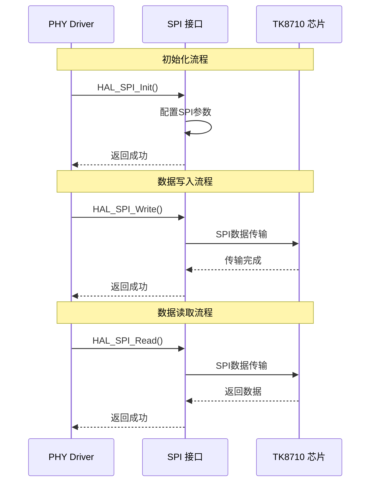
```mermaid
sequenceDiagram
    participant PHY as PHY Driver
    participant SPI as SPI 接口
    participant HW as TK8710 芯片
    
    Note over PHY,HW: 初始化流程
    PHY->>SPI: HAL_SPI_Init()
    SPI->>SPI: 配置SPI参数
    SPI-->>PHY: 返回成功
    
    Note over PHY,HW: 数据写入流程
    PHY->>SPI: HAL_SPI_Write()
    SPI->>HW: SPI数据传输
    HW-->>SPI: 传输完成
    SPI-->>PHY: 返回成功
    
    Note over PHY,HW: 数据读取流程
    PHY->>SPI: HAL_SPI_Read()
    SPI->>HW: SPI数据传输
    HW-->>SPI: 返回数据
    SPI-->>PHY: 返回成功
```

#### 3.4.2 GPIO 接口

**接口功能**：提供 GPIO 控制和中断处理能力

**接口定义**：

```c
/* GPIO 初始化 */
int HAL_GPIO_Init(uint32_t pin, uint32_t mode);

/* GPIO 读取 */
int HAL_GPIO_Read(uint32_t pin);

/* GPIO 写入 */
void HAL_GPIO_Write(uint32_t pin, int value);

/* GPIO 中断注册 */
int HAL_GPIO_RegisterIRQ(uint32_t pin, uint32_t trigger, void (*callback)(void));

/* GPIO 中断使能 */
void HAL_GPIO_EnableIRQ(uint32_t pin);

/* GPIO 中断禁用 */
void HAL_GPIO_DisableIRQ(uint32_t pin);

/* GPIO 去初始化 */
void HAL_GPIO_DeInit(uint32_t pin);
```

**接口要求**：
- 支持输入、输出、中断模式
- 支持上升沿、下降沿、双边沿触发
- 中断响应时间 < 50 µs
- 支持中断优先级配置
- 中断回调在中断上下文中执行（需要快速返回）

**GPIO 引脚定义**：
- TK8710_IRQ_PIN：中断输入引脚（必需）
- TK8710_RST_PIN：复位输出引脚（可选）
- TK8710_CS_PIN：SPI 片选引脚（必需）

**平台适配**：
- FreeRTOS：使用 GPIO HAL 库或裸机 GPIO 驱动
- Linux：使用 sysfs GPIO 接口（/sys/class/gpio）或 gpiod 库

**调用时序**：

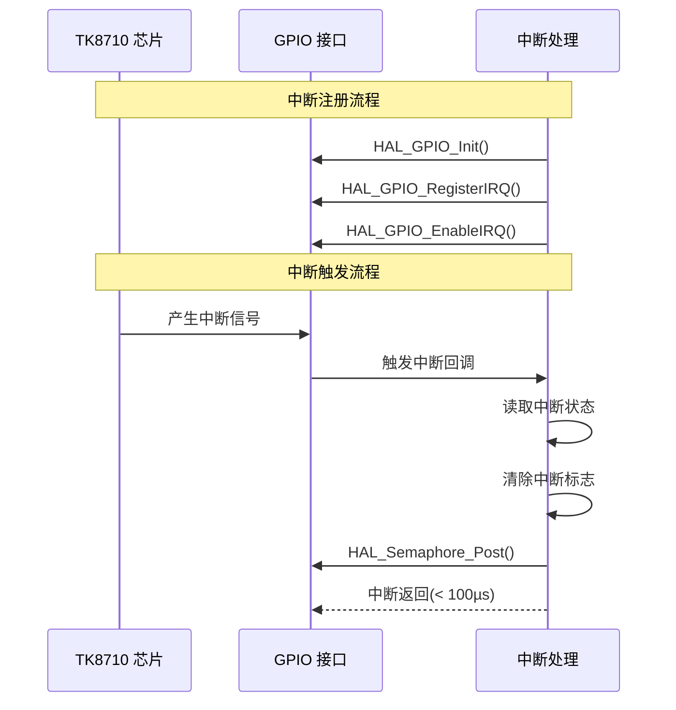
```mermaid
sequenceDiagram
    participant HW as TK8710 芯片
    participant GPIO as GPIO 接口
    participant ISR as 中断处理
    
    Note over HW,ISR: 中断注册流程
    ISR->>GPIO: HAL_GPIO_Init()
    ISR->>GPIO: HAL_GPIO_RegisterIRQ()
    ISR->>GPIO: HAL_GPIO_EnableIRQ()
    
    Note over HW,ISR: 中断触发流程
    HW->>GPIO: 产生中断信号
    GPIO->>ISR: 触发中断回调
    ISR->>ISR: 读取中断状态
    ISR->>ISR: 清除中断标志
    ISR->>GPIO: HAL_Semaphore_Post()
    ISR-->>GPIO: 中断返回(< 100µs)
```

#### 3.4.3 Timer 接口

**接口功能**：提供定时器和时间戳服务

**接口定义**：

```c
/* 获取系统时间戳（毫秒） */
uint32_t HAL_GetTick(void);

/* 获取系统时间戳（微秒） */
uint64_t HAL_GetTickUs(void);

/* 延时（毫秒） */
void HAL_Delay(uint32_t ms);

/* 延时（微秒） */
void HAL_DelayUs(uint32_t us);

/* 创建定时器 */
HAL_Timer HAL_Timer_Create(uint32_t periodMs, int repeat, void (*callback)(void*), void* arg);

/* 启动定时器 */
int HAL_Timer_Start(HAL_Timer timer);

/* 停止定时器 */
int HAL_Timer_Stop(HAL_Timer timer);

/* 删除定时器 */
void HAL_Timer_Delete(HAL_Timer timer);
```

**接口要求**：
- 时间戳精度：毫秒级（必需），微秒级（推荐）
- 定时器精度：≤ 10 ms
- 支持周期性和一次性定时器
- 定时器回调在定时器上下文中执行
- 时间戳溢出处理（32 位溢出周期约 49.7 天）

**平台适配**：
- FreeRTOS：使用 xTaskGetTickCount()、软件定时器
- Linux：使用 clock_gettime()、timerfd 或 POSIX 定时器

**调用时序**：

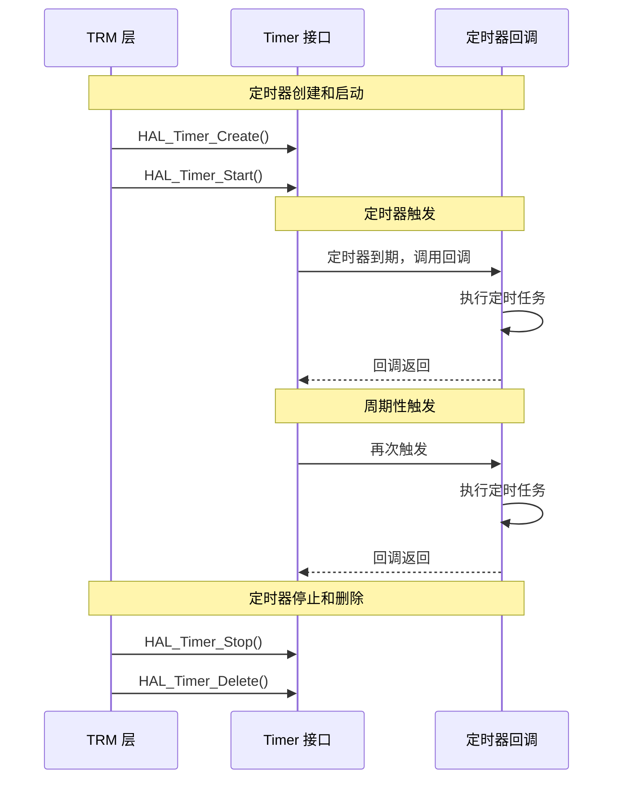
```mermaid
sequenceDiagram
    participant TRM as TRM 层
    participant TIMER as Timer 接口
    participant CB as 定时器回调
    
    Note over TRM,CB: 定时器创建和启动
    TRM->>TIMER: HAL_Timer_Create()
    TRM->>TIMER: HAL_Timer_Start()
    
    Note over TIMER,CB: 定时器触发
    TIMER->>CB: 定时器到期，调用回调
    CB->>CB: 执行定时任务
    CB-->>TIMER: 回调返回
    
    Note over TIMER,CB: 周期性触发
    TIMER->>CB: 再次触发
    CB->>CB: 执行定时任务
    CB-->>TIMER: 回调返回
    
    Note over TRM,CB: 定时器停止和删除
    TRM->>TIMER: HAL_Timer_Stop()
    TRM->>TIMER: HAL_Timer_Delete()
```

#### 3.4.4 DMA 接口

**接口功能**：提供 DMA 传输能力（可选，用于优化 SPI 性能）

**接口定义**：

```c
/* DMA 初始化 */
int HAL_DMA_Init(uint32_t channel, const HAL_DmaConfig* config);

/* DMA 传输启动 */
int HAL_DMA_Start(uint32_t channel, const void* src, void* dst, uint32_t len);

/* DMA 传输等待完成 */
int HAL_DMA_Wait(uint32_t channel, uint32_t timeout);

/* DMA 传输中止 */
void HAL_DMA_Abort(uint32_t channel);

/* DMA 去初始化 */
void HAL_DMA_DeInit(uint32_t channel);
```

**接口要求**：
- 支持内存到外设（Memory to Peripheral）传输
- 支持外设到内存（Peripheral to Memory）传输
- 支持传输完成中断
- 支持传输错误检测
- DMA 通道独占使用（避免冲突）

**使用场景**：
- SPI 大数据量传输（> 64 字节）
- 降低 CPU 占用率
- 提高实时性

**平台适配**：
- FreeRTOS：使用 DMA HAL 库
- Linux：通常不使用 DMA（由内核 SPI 驱动处理）

**调用时序**：

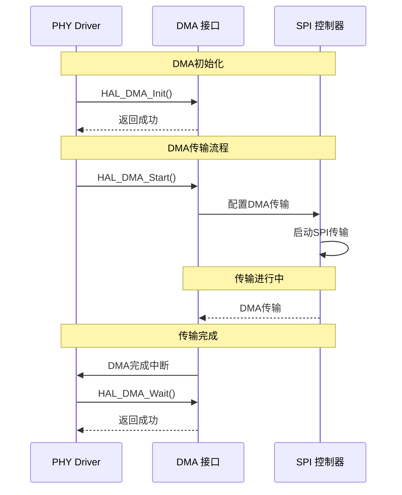
```mermaid
sequenceDiagram
    participant PHY as PHY Driver
    participant DMA as DMA 接口
    participant SPI as SPI 控制器
    
    Note over PHY,SPI: DMA初始化
    PHY->>DMA: HAL_DMA_Init()
    DMA-->>PHY: 返回成功
    
    Note over PHY,SPI: DMA传输流程
    PHY->>DMA: HAL_DMA_Start()
    DMA->>SPI: 配置DMA传输
    SPI->>SPI: 启动SPI传输
    
    Note over DMA,SPI: 传输进行中
    SPI-->>DMA: DMA传输
    
    Note over PHY,SPI: 传输完成
    DMA->>PHY: DMA完成中断
    PHY->>DMA: HAL_DMA_Wait()
    DMA-->>PHY: 返回成功
```

#### 3.4.5 中断和任务调度

**接口功能**：提供中断管理和任务调度能力

**接口定义**：

```c
/* 进入临界区 */
void HAL_EnterCritical(void);

/* 退出临界区 */
void HAL_ExitCritical(void);

/* 禁用中断 */
void HAL_DisableIRQ(void);

/* 使能中断 */
void HAL_EnableIRQ(void);

/* 创建任务/线程 */
HAL_Thread HAL_Thread_Create(const char* name, void (*entry)(void*), void* arg,
                             uint32_t stackSize, uint32_t priority);

/* 删除任务/线程 */
void HAL_Thread_Delete(HAL_Thread thread);

/* 任务延时 */
void HAL_Thread_Delay(uint32_t ms);

/* 任务让出 CPU */
void HAL_Thread_Yield(void);

/* 设置任务优先级 */
int HAL_Thread_SetPriority(HAL_Thread thread, uint32_t priority);

/* 设置任务 CPU 亲和性 */
int HAL_Thread_SetAffinity(HAL_Thread thread, uint32_t cpuMask);
```

**接口要求**：
- 支持抢占式调度
- 支持优先级调度（至少 8 个优先级）
- 支持 CPU 亲和性设置（多核平台）
- 临界区保护时间 < 100 µs
- 中断嵌套支持

**任务优先级建议**：
- 中断处理任务：最高优先级（90-99）
- SPI 收发任务：高优先级（80-89）
- TRM 调度任务：中优先级（70-79）
- 统计监控任务：低优先级（60-69）

**平台适配**：
- FreeRTOS：使用任务 API（xTaskCreate、vTaskDelay 等）
- Linux：使用 pthread 库

**调用时序**：

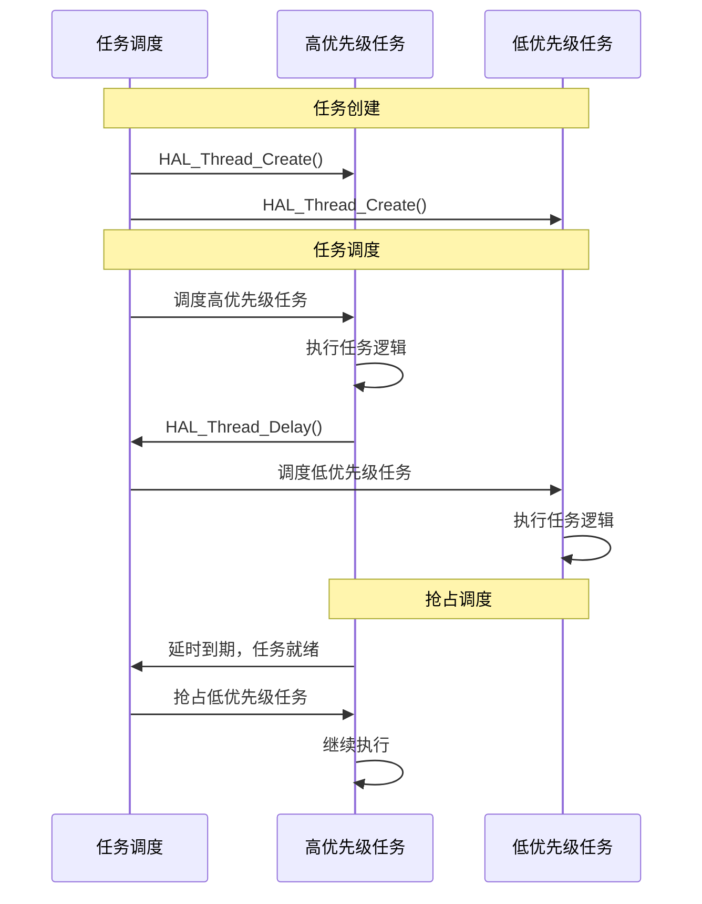
```mermaid
sequenceDiagram
    participant SCHED as 任务调度
    participant TASK1 as 高优先级任务
    participant TASK2 as 低优先级任务
    
    Note over SCHED,TASK2: 任务创建
    SCHED->>TASK1: HAL_Thread_Create()
    SCHED->>TASK2: HAL_Thread_Create()
    
    Note over SCHED,TASK2: 任务调度
    SCHED->>TASK1: 调度高优先级任务
    TASK1->>TASK1: 执行任务逻辑
    TASK1->>SCHED: HAL_Thread_Delay()
    
    SCHED->>TASK2: 调度低优先级任务
    TASK2->>TASK2: 执行任务逻辑
    
    Note over TASK1,TASK2: 抢占调度
    TASK1->>SCHED: 延时到期，任务就绪
    SCHED->>TASK1: 抢占低优先级任务
    TASK1->>TASK1: 继续执行
```

#### 3.4.6 同步和互斥

**接口功能**：提供线程同步和互斥保护能力

**接口定义**：

```c
/* 创建互斥锁 */
HAL_Mutex HAL_Mutex_Create(void);

/* 删除互斥锁 */
void HAL_Mutex_Delete(HAL_Mutex mutex);

/* 加锁 */
int HAL_Mutex_Lock(HAL_Mutex mutex, uint32_t timeout);

/* 解锁 */
void HAL_Mutex_Unlock(HAL_Mutex mutex);

/* 创建信号量 */
HAL_Semaphore HAL_Semaphore_Create(uint32_t initCount, uint32_t maxCount);

/* 删除信号量 */
void HAL_Semaphore_Delete(HAL_Semaphore sem);

/* 等待信号量 */
int HAL_Semaphore_Wait(HAL_Semaphore sem, uint32_t timeout);

/* 释放信号量 */
int HAL_Semaphore_Post(HAL_Semaphore sem);

/* 创建事件组 */
HAL_EventGroup HAL_EventGroup_Create(void);

/* 删除事件组 */
void HAL_EventGroup_Delete(HAL_EventGroup group);

/* 等待事件 */
uint32_t HAL_EventGroup_Wait(HAL_EventGroup group, uint32_t bits, 
                              int waitAll, uint32_t timeout);

/* 设置事件 */
void HAL_EventGroup_Set(HAL_EventGroup group, uint32_t bits);

/* 清除事件 */
void HAL_EventGroup_Clear(HAL_EventGroup group, uint32_t bits);
```

**接口要求**：
- 互斥锁支持递归锁（可选）
- 互斥锁支持优先级继承（避免优先级反转）
- 信号量支持计数信号量和二值信号量
- 支持超时等待（0 = 不等待，0xFFFFFFFF = 永久等待）
- 线程安全

**使用场景**：
- 互斥锁：保护共享资源（发送队列、波束表、统计信息）
- 信号量：任务间同步（中断通知任务、生产者-消费者）
- 事件组：多事件等待（中断事件、定时器事件）

**平台适配**：
- FreeRTOS：使用互斥锁、信号量、事件组 API
- Linux：使用 pthread_mutex、sem_t、条件变量

**调用时序**：

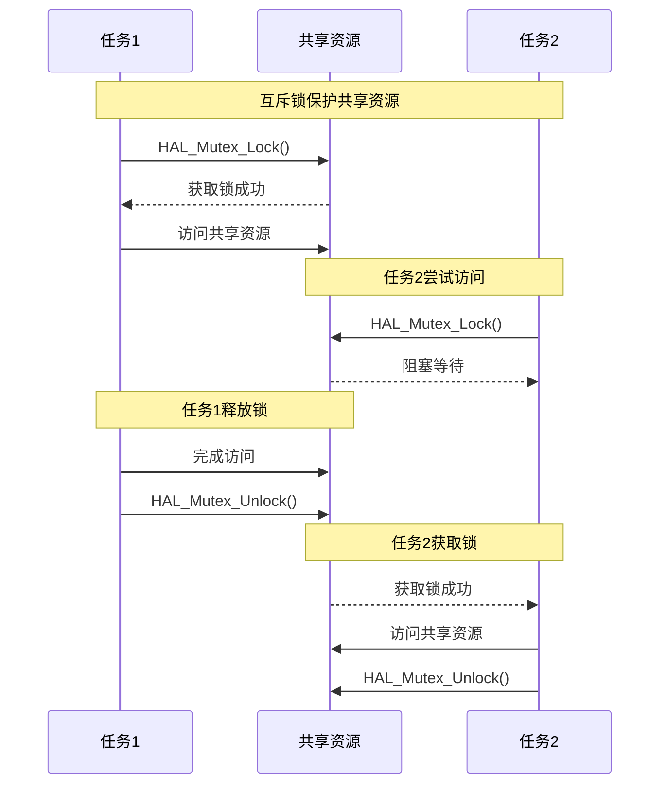
```mermaid
sequenceDiagram
    participant TASK1 as 任务1
    participant RESOURCE as 共享资源
    participant TASK2 as 任务2
    
    Note over TASK1,TASK2: 互斥锁保护共享资源
    TASK1->>RESOURCE: HAL_Mutex_Lock()
    RESOURCE-->>TASK1: 获取锁成功
    TASK1->>RESOURCE: 访问共享资源
    
    Note over TASK2,RESOURCE: 任务2尝试访问
    TASK2->>RESOURCE: HAL_Mutex_Lock()
    RESOURCE-->>TASK2: 阻塞等待
    
    Note over TASK1,RESOURCE: 任务1释放锁
    TASK1->>RESOURCE: 完成访问
    TASK1->>RESOURCE: HAL_Mutex_Unlock()
    
    Note over TASK2,RESOURCE: 任务2获取锁
    RESOURCE-->>TASK2: 获取锁成功
    TASK2->>RESOURCE: 访问共享资源
    TASK2->>RESOURCE: HAL_Mutex_Unlock()
```

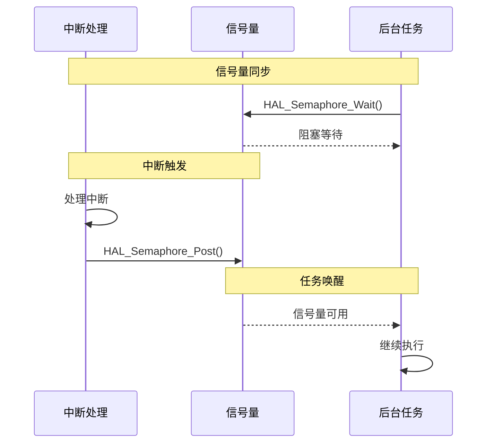
```mermaid
sequenceDiagram
    participant ISR as 中断处理
    participant SEM as 信号量
    participant TASK as 后台任务
    
    Note over ISR,TASK: 信号量同步
    TASK->>SEM: HAL_Semaphore_Wait()
    SEM-->>TASK: 阻塞等待
    
    Note over ISR,SEM: 中断触发
    ISR->>ISR: 处理中断
    ISR->>SEM: HAL_Semaphore_Post()
    
    Note over SEM,TASK: 任务唤醒
    SEM-->>TASK: 信号量可用
    TASK->>TASK: 继续执行
```

### 3.5 状态机设计

#### 3.5.1 TRM 工作状态机

TRM 层维护整体工作状态，状态转换由 HAL API 调用和内部事件触发。

**状态定义**：

```c
typedef enum {
    TRM_STATE_UNINIT = 0,    /* 未初始化 */
    TRM_STATE_INITED,        /* 已初始化 */
    TRM_STATE_CONFIGURED,    /* 已配置 */
    TRM_STATE_RUNNING,       /* 运行中 */
    TRM_STATE_STOPPED,       /* 已停止 */
    TRM_STATE_ERROR          /* 错误状态 */
} TrmState;
```

**状态转换图**：

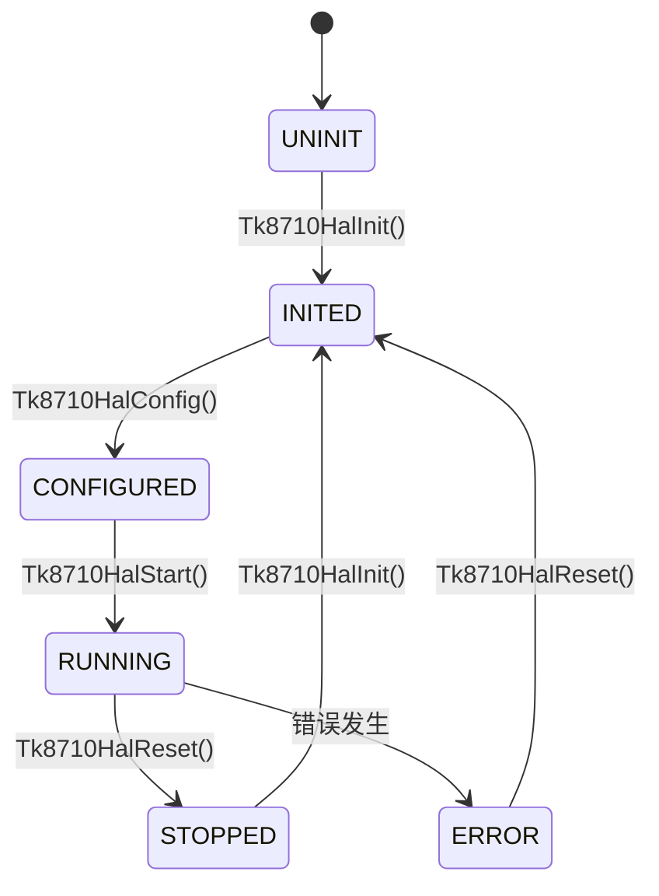
```mermaid
stateDiagram-v2
    [*] --> UNINIT
    UNINIT --> INITED: Tk8710HalInit()
    INITED --> CONFIGURED: Tk8710HalConfig()
    CONFIGURED --> RUNNING: Tk8710HalStart()
    RUNNING --> STOPPED: Tk8710HalReset()
    STOPPED --> INITED: Tk8710HalInit()
    RUNNING --> ERROR: 错误发生
    ERROR --> INITED: Tk8710HalReset()
```

**状态说明**：

| 状态 | 说明 | 允许的操作 |
|------|------|-----------|
| UNINIT | 未初始化，系统上电后的初始状态 | 只能调用 Init |
| INITED | 已初始化，资源已分配，硬件已就绪 | 可以调用 Config、Reset |
| CONFIGURED | 已配置，时隙参数已设置 | 可以调用 Start、Config、Reset |
| RUNNING | 运行中，可以收发数据 | 可以调用 SendData、GetStatus、Reset |
| STOPPED | 已停止，暂停收发 | 可以调用 Init、Reset |
| ERROR | 错误状态，需要复位恢复 | 只能调用 Reset |

**状态转换条件**：

- UNINIT → INITED：`Tk8710HalInit()` 成功
- INITED → CONFIGURED：`Tk8710HalConfig()` 成功
- CONFIGURED → RUNNING：`Tk8710HalStart()` 成功
- RUNNING → STOPPED：`Tk8710HalReset()` 或主动停止
- 任意状态 → ERROR：严重错误发生（SPI 失败、硬件异常）
- ERROR → INITED：`Tk8710HalReset()` 成功恢复

#### 3.5.2 PHY 控制状态机

PHY Driver 层维护硬件控制状态，与 TK8710 芯片状态同步。

**状态定义**：

```c
typedef enum {
    PHY_STATE_IDLE = 0,      /* 空闲 */
    PHY_STATE_INIT,          /* 初始化中 */
    PHY_STATE_READY,         /* 就绪 */
    PHY_STATE_TX,            /* 发送中 */
    PHY_STATE_RX,            /* 接收中 */
    PHY_STATE_BUSY,          /* 忙碌 */
    PHY_STATE_ERROR          /* 错误 */
} PhyState;
```

**状态转换图**：

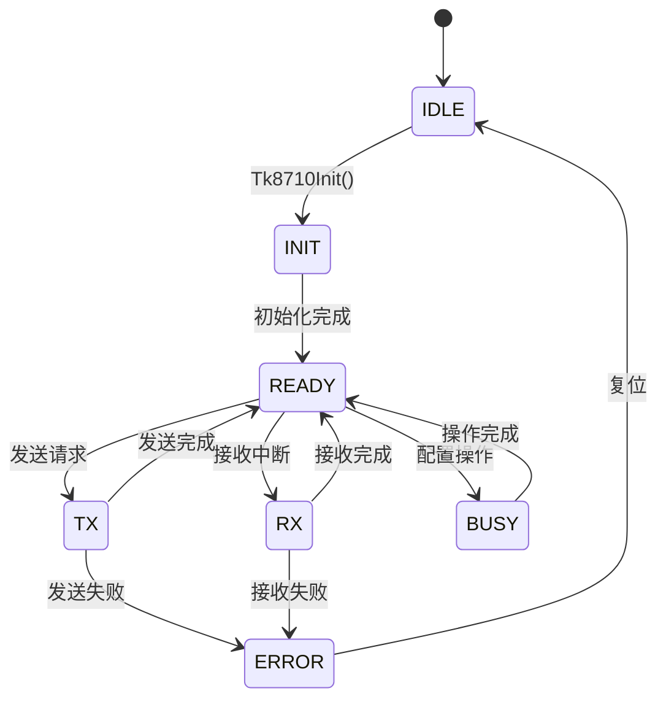
```mermaid
stateDiagram-v2
    [*] --> IDLE
    IDLE --> INIT: Tk8710Init()
    INIT --> READY: 初始化完成
    READY --> TX: 发送请求
    READY --> RX: 接收中断
    TX --> READY: 发送完成
    RX --> READY: 接收完成
    READY --> BUSY: 配置操作
    BUSY --> READY: 操作完成
    
    TX --> ERROR: 发送失败
    RX --> ERROR: 接收失败
    ERROR --> IDLE: 复位
```

**状态说明**：

| 状态 | 说明 | 持续时间 |
|------|------|---------|
| IDLE | 空闲，未初始化 | - |
| INIT | 初始化中，配置硬件 | < 100 ms |
| READY | 就绪，等待操作 | - |
| TX | 发送中，SPI 写数据 | < 10 ms |
| RX | 接收中，SPI 读数据 | < 10 ms |
| BUSY | 忙碌，配置或查询 | < 5 ms |
| ERROR | 错误，需要复位 | - |

### 3.6 缓冲和内存管理

#### 3.6.1 缓冲区设计

**接收缓冲区**：

```c
/* 接收缓冲区配置 */
#define RX_BUFFER_COUNT    128      /* 接收缓冲区数量（支持128用户） */
#define RX_BUFFER_SIZE     600      /* 单个缓冲区大小（字节） */

/* 接收缓冲区结构 */
typedef struct {
    uint8_t  data[RX_BUFFER_SIZE];  /* 数据缓冲 */
    uint16_t len;                    /* 数据长度 */
    uint32_t timestamp;              /* 时间戳 */
    uint8_t  inUse;                  /* 使用标志 */
} RxBuffer;

/* 接收缓冲区池 */
typedef struct {
    RxBuffer buffers[RX_BUFFER_COUNT];
    uint32_t allocCount;             /* 分配计数 */
    uint32_t freeCount;              /* 释放计数 */
    void*    mutex;                  /* 互斥锁 */
} RxBufferPool;
```

**发送队列**：

```c
/* 发送队列配置 */
#define TX_QUEUE_SIZE      256      /* 发送队列长度 */

/* 发送队列节点 */
typedef struct {
    uint32_t userId;                 /* 用户ID */
    uint8_t  downlinkType;           /* 下行类型 */
    uint8_t  txPower;                /* 发送功率 */
    uint8_t  beamType;               /* 波束类型 */
    uint8_t  targetRateMode;         /* 目标速率 */
    uint32_t frameNo;                /* 目标帧号 */
    uint16_t dataLen;                /* 数据长度 */
    uint8_t  data[600];              /* 数据 */
    uint32_t timestamp;              /* 入队时间 */
    uint8_t  retryCount;             /* 重试次数 */
} TxQueueNode;

/* 环形队列 */
typedef struct {
    TxQueueNode nodes[TX_QUEUE_SIZE];
    uint32_t head;                   /* 队列头 */
    uint32_t tail;                   /* 队列尾 */
    uint32_t count;                  /* 当前长度 */
    void*    mutex;                  /* 互斥锁 */
} TxQueue;
```

#### 3.6.2 内存管理策略

**静态分配**：
- 接收缓冲区池：静态分配，避免运行时内存碎片
- 发送队列：静态分配，固定大小环形队列
- 波束表：静态分配，固定容量

**动态分配**：
- 临时缓冲区：使用内存池分配，快速分配和释放
- 配置数据：初始化时分配，运行时不释放

**内存池设计**：

```c
/* 内存池配置 */
#define MEM_POOL_BLOCK_SIZE    64       /* 块大小 */
#define MEM_POOL_BLOCK_COUNT   32       /* 块数量 */

/* 内存池操作 */
MemPool* pool = HAL_MemPool_Create(MEM_POOL_BLOCK_SIZE, MEM_POOL_BLOCK_COUNT);
void* ptr = HAL_MemPool_Alloc(pool);
HAL_MemPool_Free(pool, ptr);
```

#### 3.6.3 接收缓冲区管理流程

**缓冲区分配和释放时序**：

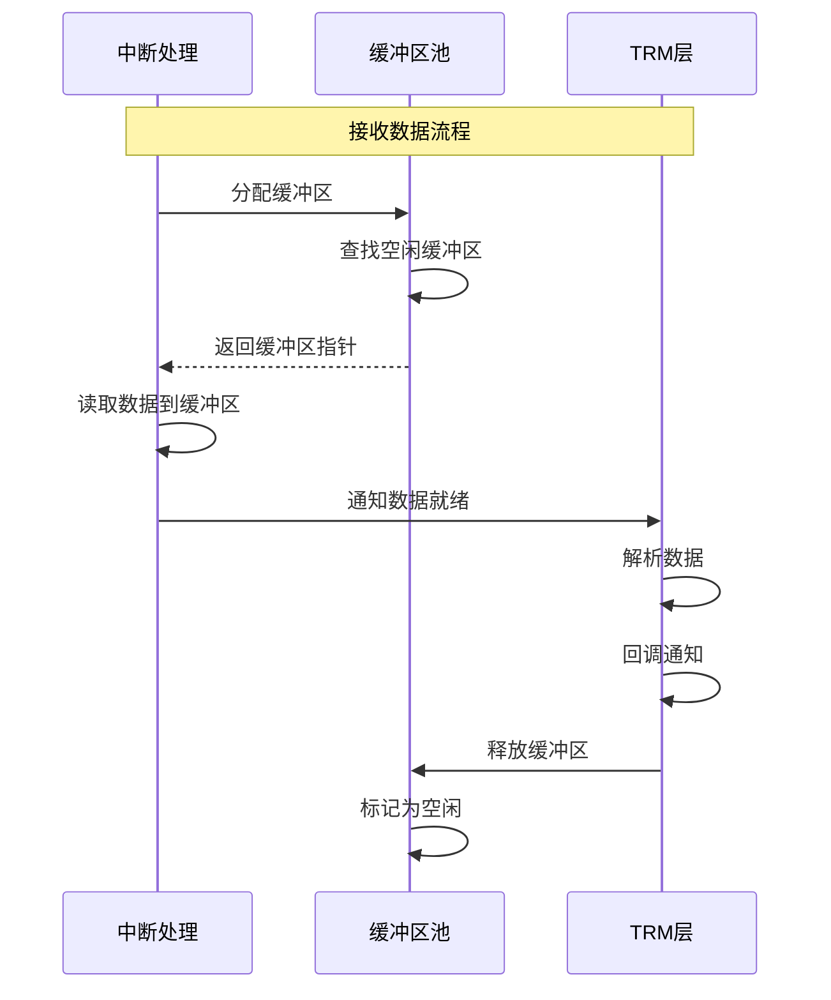
```mermaid
sequenceDiagram
    participant ISR as 中断处理
    participant POOL as 缓冲区池
    participant TRM as TRM层
    
    Note over ISR,TRM: 接收数据流程
    ISR->>POOL: 分配缓冲区
    POOL->>POOL: 查找空闲缓冲区
    POOL-->>ISR: 返回缓冲区指针
    ISR->>ISR: 读取数据到缓冲区
    ISR->>TRM: 通知数据就绪
    
    TRM->>TRM: 解析数据
    TRM->>TRM: 回调通知
    TRM->>POOL: 释放缓冲区
    POOL->>POOL: 标记为空闲
```

**缓冲区状态管理**：

```mermaid
stateDiagram-v2
    [*] --> FREE: 初始化
    FREE --> ALLOCATED: 分配
    ALLOCATED --> IN_USE: 填充数据
    IN_USE --> PROCESSING: 数据处理中
    PROCESSING --> FREE: 释放
    
    ALLOCATED --> FREE: 分配失败
    IN_USE --> FREE: 超时释放
```

#### 3.6.4 发送队列管理流程

**入队和出队时序**：

```mermaid
sequenceDiagram
    participant API as HAL API
    participant QUEUE as 发送队列
    participant TRM as TRM调度
    
    Note over API,TRM: 数据入队
    API->>QUEUE: Tk8710HalSendData()
    QUEUE->>QUEUE: 检查队列是否满
    QUEUE->>QUEUE: 写入队列尾部
    QUEUE->>QUEUE: tail++, count++
    
    Note over QUEUE,TRM: 数据出队和发送
    TRM->>QUEUE: 获取待发送数据
    QUEUE->>QUEUE: 读取队列头部
    QUEUE->>QUEUE: head++, count--
    QUEUE-->>TRM: 返回数据
    TRM->>TRM: 发送数据
    TRM->>API: 回调通知
```

**环形队列操作流程**：

```mermaid
flowchart TD
    START[开始] --> CHECK_FULL{队列是否满?}
    CHECK_FULL -->|是| DROP[丢弃]
    CHECK_FULL -->|否| WRITE[写入tail位置]
    WRITE --> UPDATE_TAIL[tail = tail+1 % SIZE]
    UPDATE_TAIL --> INC_COUNT[count++]
    INC_COUNT --> END[结束]
    DROP --> END
    
    START2[出队开始] --> CHECK_EMPTY{队列是否空?}
    CHECK_EMPTY -->|是| WAIT[返回空]
    CHECK_EMPTY -->|否| READ[读取head位置]
    READ --> UPDATE_HEAD[head = head+1 % SIZE]
    UPDATE_HEAD --> DEC_COUNT[count--]
    DEC_COUNT --> END2[结束]
    WAIT --> END2
```

### 3.7 并发和同步

### 3.8 时序要求

### 3.9 异常和容错处理

#### 3.9.1 异常类型

**硬件异常**：
- SPI 通信失败
- GPIO 中断丢失
- TK8710 芯片无响应

**软件异常**：
- 内存分配失败
- 队列满
- 波束信息缺失
- 参数错误

#### 3.9.2 错误处理策略

**SPI 异常**：

```c
int ret = HAL_SPI_Transfer(&transfer);
if (ret != 0) {
    // 重试3次
    for (int i = 0; i < 3; i++) {
        ret = HAL_SPI_Transfer(&transfer);
        if (ret == 0) break;
        HAL_Delay(10);
    }
    if (ret != 0) {
        // 上报错误，触发软复位
        TRM_HandleError(ERROR_SPI_FAILED);
    }
}
```

**队列满处理**：

```c
if (TxQueue_IsFull(&txQueue)) {
    // 丢弃低优先级数据
    TxQueue_DropLowPriority(&txQueue);
    // 或返回错误
    return TK8710_HAL_ERROR_BUSY;
}
```

**波束缺失处理**：

```c
BeamInfo* beam = BeamTable_Find(&beamTable, userId);
if (beam == NULL) {
    // 使用广播波束
    beam = &defaultBroadcastBeam;
    // 或返回发送失败
    return TX_NO_BEAM;
}
```

#### 3.9.3 容错机制

**自动恢复**：
- SPI 失败：自动重试 3 次
- 中断丢失：定时器轮询检测
- 队列满：丢弃旧数据或低优先级数据

**故障隔离**：
- PHY 层错误不影响 TRM 层状态
- 单个用户发送失败不影响其他用户
- 统计错误不影响数据收发

**降级策略**：
- 波束缺失时使用广播波束
- 队列满时降低接收速率
- 内存不足时限制并发用户数

### 3.10 可移植性设计

#### 3.10.1 平台抽象层

**目录结构**：
```
port/
├── port_os.h          # OS 接口定义
├── port_hw.h          # 硬件接口定义
├── freertos/
│   ├── port_freertos.c
│   └── port_freertos.h
└── linux/
    ├── port_linux.c
    └── port_linux.h
```

**接口隔离**：
- HAL 核心代码不直接调用平台 API
- 所有平台相关调用通过 port 层接口
- 编译时选择平台实现

#### 3.10.2 移植步骤

1. **实现 OS 接口**：实现 port_os.h 中定义的所有接口
2. **实现硬件接口**：实现 port_hw.h 中定义的所有接口
3. **配置编译**：修改 Makefile 或 CMakeLists.txt
4. **功能测试**：运行测试用例验证
5. **性能测试**：验证实时性要求

#### 3.10.3 平台差异处理

**字节序**：
```c
#if __BYTE_ORDER__ == __ORDER_LITTLE_ENDIAN__
    #define CPU_TO_LE16(x) (x)
#else
    #define CPU_TO_LE16(x) __builtin_bswap16(x)
#endif
```

**对齐**：
```c
#define HAL_ALIGNED(n) __attribute__((aligned(n)))
typedef struct HAL_ALIGNED(4) {
    uint32_t data;
} AlignedStruct;
```

**原子操作**：
```c
#ifdef __GNUC__
    #define ATOMIC_INC(ptr) __sync_add_and_fetch(ptr, 1)
#else
    #define ATOMIC_INC(ptr) (++(*ptr))
#endif
```

### 3.11 可观察和调试设计

#### 3.11.1 日志系统

**日志级别**：
```c
typedef enum {
    LOG_ERROR = 0,
    LOG_WARN,
    LOG_INFO,
    LOG_DEBUG,
    LOG_TRACE,
} LogLevel;

#define HAL_LOG_E(tag, fmt, ...) HAL_Log(LOG_ERROR, tag, fmt, ##__VA_ARGS__)
#define HAL_LOG_W(tag, fmt, ...) HAL_Log(LOG_WARN, tag, fmt, ##__VA_ARGS__)
#define HAL_LOG_I(tag, fmt, ...) HAL_Log(LOG_INFO, tag, fmt, ##__VA_ARGS__)
#define HAL_LOG_D(tag, fmt, ...) HAL_Log(LOG_DEBUG, tag, fmt, ##__VA_ARGS__)
```

**日志输出**：
```c
HAL_LOG_I("TRM", "Init success, version=%s", HAL_VERSION);
HAL_LOG_E("PHY", "SPI transfer failed, ret=%d", ret);
HAL_LOG_D("TRM", "TX queue: count=%u, remaining=%u", count, remaining);
```

#### 3.11.2 统计信息

**实时统计**：
```c
typedef struct {
    uint32_t txCount;
    uint32_t txSuccessCount;
    uint32_t txFailureCount;
    uint32_t rxCount;
    uint32_t rxDataCount;
    uint32_t spiErrorCount;
    uint32_t queueFullCount;
} HAL_Statistics;

/* 获取统计 */
HAL_Statistics stats;
Tk8710HalGetStatistics(&stats);
```

**性能监控**：
```c
/* 时延统计 */
uint32_t irqLatency;      /* 中断响应时延 */
uint32_t spiLatency;      /* SPI 传输时延 */
uint32_t txLatency;       /* 发送时延 */

/* CPU 占用 */
uint32_t cpuUsage;        /* CPU 占用率 (%) */
```

#### 3.11.3 调试接口

**寄存器读写**：
```c
/* 读寄存器 */
uint32_t value;
Tk8710HalDebug(DEBUG_READ_REG, &regAddr, &value);

/* 写寄存器 */
Tk8710HalDebug(DEBUG_WRITE_REG, &regAddr, &value);
```

**内部状态导出**：
```c
/* 导出TRM状态 */
TRM_State state;
Tk8710HalDebug(DEBUG_DUMP_TRM, &state, NULL);

/* 导出PHY状态 */
PHY_State phyState;
Tk8710HalDebug(DEBUG_DUMP_PHY, &phyState, NULL);
```

**Trace 功能**：
```c
#ifdef HAL_ENABLE_TRACE
    #define HAL_TRACE(fmt, ...) printf("[TRACE] " fmt "\n", ##__VA_ARGS__)
#else
    #define HAL_TRACE(fmt, ...)
#endif

HAL_TRACE("Enter TRM_SendData, userId=0x%08X", userId);
```

## 4 实现说明

本章节详细说明 HAL 层各个函数的实现要求，包括 HAL API 和 PHY API。

### 4.1. HAL API

#### 4.1.1 Tk8710HalInit

**函数原型**：
```c
Tk8710HalError Tk8710HalInit(const Tk8710HalInitConfig* config);
```

**功能描述**：
初始化 HAL 层，分配资源，准备硬件接口。完成 TRM 层和 PHY Driver 层的初始化。

**输入参数**：
- `config`：初始化配置指针，包含天线配置、射频参数、回调函数等。NULL 时使用默认配置。

**输出参数**：无

**上下文要求**：
- 任务上下文
- 不能在中断上下文中调用

**阻塞/非阻塞属性**：
- 阻塞调用
- 执行时间：< 500 ms

**前置条件**：
- 系统已完成基础初始化（OS、内存等）
- SPI 和 GPIO 硬件接口可用

**后置条件**：
- HAL 状态转换为 INITED
- 资源已分配（缓冲区、队列、互斥锁等）
- PHY Driver 已初始化
- TK8710 芯片已完成硬件初始化

**并发约束**：
- 不可重入
- 只能调用一次，重复调用返回错误

**返回值**：
- `TK8710_HAL_OK`：初始化成功
- `TK8710_HAL_ERROR_PARAM`：参数错误
- `TK8710_HAL_ERROR_INIT`：初始化失败
- `TK8710_HAL_ERROR_NO_MEM`：内存不足

**调用示例**：
```c
Tk8710HalInitConfig config = {
    .ant_en = 0xFF,
    .rf_en = 0xFF,
    .Freq = 503100000,
    .rxgain = 0x7e,
    .txgain = 0x2a,
    .OnRxData = MyRxHandler,
    .OnTxComplete = MyTxHandler,
};

Tk8710HalError ret = Tk8710HalInit(&config);
if (ret != TK8710_HAL_OK) {
    printf("HAL初始化失败: %d\n", ret);
    return -1;
}
```

#### 4.1.2 Tk8710HalConfig

**函数原型**：
```c
Tk8710HalError Tk8710HalConfig(const SlotCfg* slotConfig, uint32_t* sync);
```

**功能描述**：
配置 HAL 参数，设置 TDD 帧结构、速率模式、超帧参数。

**输入参数**：
- `slotConfig`：时隙配置指针，NULL 时使用默认配置

**输出参数**：
- `sync`：超帧周期（ms），配置成功后输出

**上下文要求**：
- 任务上下文
- 不能在中断上下文中调用

**阻塞/非阻塞属性**：
- 阻塞调用
- 执行时间：< 100 ms

**前置条件**：
- HAL 已初始化（状态为 INITED 或 CONFIGURED）

**后置条件**：
- HAL 状态转换为 CONFIGURED
- 时隙参数已配置到 TK8710 芯片
- 超帧周期已计算并返回

**并发约束**：
- 不可重入
- 不能在 RUNNING 状态下调用

**返回值**：
- `TK8710_HAL_OK`：配置成功
- `TK8710_HAL_ERROR_PARAM`：参数错误
- `TK8710_HAL_ERROR_CONFIG`：配置失败
- `TK8710_HAL_ERROR_NOT_READY`：状态不正确

**调用示例**：
```c
SlotCfg slotConfig = {
    .msMode = 0,
    .rateCount = 1,
    .rateModes[0] = 6,
    .FrameNum = 1,
};

uint32_t superFramePeriod;
Tk8710HalError ret = Tk8710HalConfig(&slotConfig, &superFramePeriod);
if (ret == TK8710_HAL_OK) {
    printf("配置成功，超帧周期=%u ms\n", superFramePeriod);
}
```

#### 4.1.3 Tk8710HalStart

**函数原型**：
```c
Tk8710HalError Tk8710HalStart(void);
```

**功能描述**：
启动 HAL，开始硬件工作，可以收发数据。

**输入参数**：无

**输出参数**：无

**上下文要求**：
- 任务上下文
- 不能在中断上下文中调用

**阻塞/非阻塞属性**：
- 阻塞调用
- 执行时间：< 50 ms

**前置条件**：
- HAL 已配置（状态为 CONFIGURED）

**后置条件**：
- HAL 状态转换为 RUNNING
- TK8710 芯片开始工作
- 可以调用 SendData 发送数据
- 可以接收上行数据

**并发约束**：
- 不可重入

**返回值**：
- `TK8710_HAL_OK`：启动成功
- `TK8710_HAL_ERROR_START`：启动失败
- `TK8710_HAL_ERROR_NOT_READY`：状态不正确

**调用示例**：
```c
Tk8710HalError ret = Tk8710HalStart();
if (ret != TK8710_HAL_OK) {
    printf("HAL启动失败: %d\n", ret);
    return -1;
}
printf("HAL启动成功，可以开始收发数据\n");
```

#### 4.1.4 Tk8710HalReset

**函数原型**：
```c
Tk8710HalError Tk8710HalReset(void);
```

**功能描述**：
复位 HAL，重新初始化硬件状态，清理系统资源。

**输入参数**：无

**输出参数**：无

**上下文要求**：
- 任务上下文
- 不能在中断上下文中调用

**阻塞/非阻塞属性**：
- 阻塞调用
- 执行时间：< 200 ms

**前置条件**：
- HAL 已初始化

**后置条件**：
- HAL 状态转换为 UNINIT
- 发送队列已清空
- 波束表已清空
- TK8710 芯片已复位
- 需要重新调用 Init 才能使用

**并发约束**：
- 不可重入
- 会中断正在进行的收发操作

**返回值**：
- `TK8710_HAL_OK`：复位成功
- `TK8710_HAL_ERROR_RESET`：复位失败

**调用示例**：
```c
Tk8710HalError ret = Tk8710HalReset();
if (ret != TK8710_HAL_OK) {
    printf("HAL复位失败: %d\n", ret);
    return -1;
}
printf("HAL复位完成，需要重新初始化\n");
```

#### 4.1.5 Tk8710HalSendData

**函数原型**：
```c
Tk8710HalError Tk8710HalSendData(
    TK8710DownlinkType downlinkType,
    uint32_t userIdBrdIndex,
    const uint8_t* data,
    uint16_t len,
    uint8_t txPower,
    uint32_t frameNo,
    uint8_t targetRateMode,
    uint8_t beamType
);
```

**功能描述**：
发送数据到目标设备，支持广播和单播。

**输入参数**：
- `downlinkType`：下行类型（DOWNLINK_A=slot1, DOWNLINK_B=slot3）
- `userIdBrdIndex`：用户 ID（单播）或广播索引（广播）
- `data`：数据指针
- `len`：数据长度（字节），最大 600
- `txPower`：发送功率
- `frameNo`：目标帧号（单播有效）
- `targetRateMode`：目标速率模式（单播有效）
- `beamType`：波束类型（0=广播，1=专用）

**输出参数**：无

**上下文要求**：
- 任务上下文
- 不能在中断上下文中调用

**阻塞/非阻塞属性**：
- 非阻塞调用（数据加入队列后立即返回）
- 执行时间：< 1 ms
- 实际发送结果通过回调通知

**前置条件**：
- HAL 处于 RUNNING 状态
- 发送队列未满

**后置条件**：
- 数据已加入发送队列
- 等待 TRM 调度发送
- 发送完成后通过 OnTxComplete 回调通知

**并发约束**：
- 可重入（内部有互斥锁保护）
- 多线程可同时调用

**返回值**：
- `TK8710_HAL_OK`：数据已加入队列
- `TK8710_HAL_ERROR_PARAM`：参数错误
- `TK8710_HAL_ERROR_SEND`：发送失败
- `TK8710_HAL_ERROR_BUSY`：队列满
- `TK8710_HAL_ERROR_NOT_READY`：状态不正确

**调用示例**：
```c
/* 发送广播数据 */
uint8_t broadcastData[] = {0x01, 0x02, 0x03, 0x04};
TK8710_HALError ret = Tk8710HalSendData(
    TK8710_DOWNLINK_A,
    0,
    broadcastData,
    sizeof(broadcastData),
    35,
    0, 0,
    TK8710_DATA_TYPE_BRD
);

/* 发送单播数据 */
uint8_t userData[] = {0x11, 0x12, 0x13};
ret = Tk8710HalSendData(
    TK8710_DOWNLINK_B,
    0x30000001,
    userData,
    sizeof(userData),
    30,
    100,
    6,
    TK8710_DATA_TYPE_DED
);
```

#### 4.1.6 Tk8710HalGetStatus

**函数原型**：
```c
Tk8710HalError Tk8710HalGetStatus(TrmStatus* status);
```

**功能描述**：
获取 HAL 当前状态和统计信息。

**输入参数**：无

**输出参数**：
- `stats`：统计信息输出指针

**上下文要求**：
- 任务上下文或中断上下文均可

**阻塞/非阻塞属性**：
- 非阻塞调用
- 执行时间：< 100 µs

**前置条件**：
- HAL 已初始化
- stats 指针非空

**后置条件**：
- stats 结构体已填充当前统计信息

**并发约束**：
- 可重入（内部有互斥锁保护）

**返回值**：
- `TK8710_HAL_OK`：获取成功
- `TK8710_HAL_ERROR_PARAM`：参数错误
- `TK8710_HAL_ERROR_STATUS`：状态查询失败

**调用示例**：
```c
TrmStatus status;
Tk8710HalError ret = Tk8710HalGetStatus(&status);
if (ret == TK8710_HAL_OK) {
    printf("运行状态: %d\n", status.state);
    printf("发送成功: %u\n", status.txSuccessCount);
    printf("接收数据: %u\n", status.rxDataCount);
    printf("剩余队列: %u\n", status.txQueueRemaining);
}
```

#### 4.1.7 Tk8710HalDebug

**函数原型**：
```c
Tk8710HalError Tk8710HalDebug(uint32_t type, void* para1, void* para2);
```

**功能描述**：
提供 HAL 层调试功能，支持寄存器读写、状态导出等。

**输入参数**：
- `type`：调试类型（0=系统调试，1=读寄存器，2=写寄存器）
- `para1`：参数1（根据 type 不同而变化）
- `para2`：参数2（根据 type 不同而变化）

**输出参数**：
- 根据 type 不同，para1 或 para2 可能作为输出

**上下文要求**：
- 任务上下文
- 不能在中断上下文中调用

**阻塞/非阻塞属性**：
- 阻塞调用
- 执行时间：根据操作类型不同

**前置条件**：
- HAL 已初始化

**后置条件**：
- 根据调试类型执行相应操作

**并发约束**：
- 不可重入
- 调试操作可能影响正常功能

**返回值**：
- `TK8710_HAL_OK`：调试操作成功
- `TK8710_HAL_ERROR_PARAM`：参数错误或不支持的调试类型

**调用示例**：
```c
/* 读寄存器 */
uint32_t regAddr = 0x1000;
uint32_t regValue;
Tk8710HalDebug(1, &regAddr, &regValue);
printf("寄存器[0x%04X] = 0x%08X\n", regAddr, regValue);

/* 写寄存器 */
regValue = 0x12345678;
Tk8710HalDebug(2, &regAddr, &regValue);
```

### 4.2 PHY API

#### 4.2.1 Tk8710Init

**函数原型**：
```c
int Tk8710Init(const ChipRfConfig* rfConfig, const ChipConfig* chipConfig);
```

**功能描述**：
初始化 TK8710 芯片，配置基本工作参数。

**输入参数**：
- `rfConfig`：RF 配置结构体指针
- `chipConfig`：芯片配置结构体指针

**输出参数**：无

**上下文要求**：
- 任务上下文

**阻塞/非阻塞属性**：
- 阻塞调用
- 执行时间：< 200 ms

**前置条件**：
- SPI 接口已初始化
- GPIO 已配置

**后置条件**：
- TK8710 芯片已初始化
- 射频参数已配置

**并发约束**：
- 不可重入

**返回值**：
- `TK8710_OK`：成功
- 其他：失败

**调用示例**：
```c
ChipRfConfig rfConfig = {
    .freq = 503100000,
    .rxGain = 0x7e,
    .txGain = 0x2a,
};

ChipConfig chipConfig = {
    .antEn = 0xFF,
    .rfEn = 0xFF,
};

int ret = Tk8710Init(&rfConfig, &chipConfig);
```

#### 4.2.2 Tk8710Config

**函数原型**：
```c
int Tk8710Config(const SlotCfg* slotConfig);
```

**功能描述**：
配置芯片工作时隙和通信参数。

**输入参数**：
- `slotConfig`：时隙配置结构体指针

**输出参数**：无

**上下文要求**：
- 任务上下文

**阻塞/非阻塞属性**：
- 阻塞调用
- 执行时间：< 50 ms

**前置条件**：
- 芯片已初始化

**后置条件**：
- 时隙参数已配置

**并发约束**：
- 不可重入

**返回值**：
- `TK8710_OK`：成功
- 其他：失败

**调用示例**：
```c
SlotCfg slotConfig = {
    .msMode = 0,
    .rateCount = 1,
};

int ret = Tk8710Config(&slotConfig);
```

#### 4.2.3 Tk8710Start

**函数原型**：
```c
int Tk8710Start(void);
```

**功能描述**：
启动芯片开始工作。

**输入参数**：无

**输出参数**：无

**上下文要求**：
- 任务上下文

**阻塞/非阻塞属性**：
- 阻塞调用
- 执行时间：< 20 ms

**前置条件**：
- 芯片已配置

**后置条件**：
- 芯片开始工作

**并发约束**：
- 不可重入

**返回值**：
- `TK8710_OK`：成功
- 其他：失败

**调用示例**：
```c
int ret = Tk8710Start();
```

#### 4.2.4 Tk8710Reset

**函数原型**：
```c
int Tk8710Reset(void);
```

**功能描述**：
复位芯片。

**输入参数**：无

**输出参数**：无

**上下文要求**：
- 任务上下文

**阻塞/非阻塞属性**：
- 阻塞调用
- 执行时间：< 100 ms

**前置条件**：
- 芯片已初始化

**后置条件**：
- 芯片已复位

**并发约束**：
- 不可重入

**返回值**：
- `TK8710_OK`：成功
- 其他：失败

**调用示例**：
```c
int ret = Tk8710Reset();
```

#### 4.2.5 Tk8710SetTxData

**函数原型**：
```c
int Tk8710SetTxData(TK8710DownlinkType downlinkType, uint8_t userIdBrdIndex,
                    const uint8_t* data, uint16_t len, uint8_t txPower, uint8_t beamType);
```

**功能描述**：
发送数据到 TK8710 芯片。

**输入参数**：
- `downlinkType`：下行发送位置: 0=slot1, 1=slot3
- `userIdBrdIndex`：用户 ID 或广播索引
- `data`：数据指针
- `len`：数据长度
- `txPower`：发送功率
- `beamType`：波束类型

**输出参数**：无

**上下文要求**：
- 任务上下文

**阻塞/非阻塞属性**：
- 阻塞调用
- 执行时间：< 5 ms

**前置条件**：
- 芯片处于运行状态

**后置条件**：
- 数据已写入芯片

**并发约束**：
- 需要 SPI 互斥锁保护

**返回值**：
- `TK8710_OK`：成功
- 其他：失败

**调用示例**：
```c
uint8_t data[] = {0x01, 0x02};
int ret = Tk8710SetTxData(TK8710_DOWNLINK_A, 0, data, 2, 35, 0);
```

#### 4.2.6 Tk8710ReadReg / Tk8710WriteReg

**函数原型**：
```c
int Tk8710ReadReg(uint32_t regAddr, uint32_t* regData);
int Tk8710WriteReg(uint32_t regAddr, uint32_t regData);
```

**功能描述**：
读写芯片寄存器。

**输入参数**：
- `regAddr`：寄存器地址
- `regData`：寄存器数据

**输出参数**：
- `regData`：读取的寄存器数据（ReadReg）

**上下文要求**：
- 任务上下文

**阻塞/非阻塞属性**：
- 阻塞调用
- 执行时间：< 1 ms

**前置条件**：
- 芯片已初始化

**后置条件**：
- 寄存器已读写

**并发约束**：
- 需要 SPI 互斥锁保护

**返回值**：
- `TK8710_OK`：成功
- 其他：失败

**调用示例**：
```c
uint32_t value;
Tk8710ReadReg(0x1000, &value);
Tk8710WriteReg(0x1000, 0x12345678);
```

## 5 实现性能和资源评估

### 5.1 内存占用

#### 5.1.1 静态内存分配

| 模块 | 数据结构 | 数量 | 单个大小 | 总大小 |
|------|---------|------|---------|--------|
| 接收缓冲区 | RxBuffer | 128 | 600 B | 76.8 KB |
| 发送队列 | TxQueueNode | 256 | 600 B | 153.6 KB |
| 波束表 | BeamInfo | 3000 | 64 B | 192 KB |
| TRM 核心 | TRM_Context | 1 | 4 KB | 4 KB |
| PHY Driver | PHY_Context | 1 | 2 KB | 2 KB |
| 互斥锁/信号量 | OS 对象 | 10 | 100 B | 1 KB |
| 静态内存总计 | - | - | - | 429.4 KB |

#### 5.1.2 动态内存分配

| 场景 | 分配大小 | 频率 | 峰值占用 |
|------|---------|------|---------|
| 临时缓冲区 | 64 B | 按需 | 2 KB |
| 配置数据 | 1 KB | 初始化 | 1 KB |
| 日志缓冲 | 4 KB | 初始化 | 4 KB |
| 内存池 | 2 KB | 初始化 | 2 KB |
| 动态内存总计 | - | - | 9 KB |

#### 5.1.3 总内存占用

| 类型 | 大小 | 说明 |
|------|------|------|
| 代码段（.text） | 80 KB | HAL 代码 |
| 只读数据（.rodata） | 10 KB | 常量、字符串 |
| 静态数据（.data + .bss） | 429.4 KB | 全局变量 |
| 动态内存（heap） | 9 KB | 运行时分配 |
| 栈空间（stack） | 16 KB | 任务栈（4个任务 × 4KB） |
| 总计 | 544.4 KB | 约 545 KB |

**结论**：
- 总内存占用约 545 KB
- 适合 512 MB 内存的嵌入式平台
- 内存使用率 < 0.2%

#### 5.1.4 内存优化建议

1. **减少波束表容量**：根据实际用户数调整（如 1000 用户）可节省 128 KB
2. **压缩数据结构**：使用位域和紧凑布局可节省 10-20%
3. **共享缓冲区**：接收和发送缓冲区复用可节省 50%
4. **延迟分配**：非关键资源按需分配

### 5.2 时延评估

#### 5.2.1 关键路径时延

**上行数据路径**：

| 阶段 | 时延 | 说明 |
|------|------|------|
| 中断响应 | 50 µs | GPIO 中断到回调 |
| SPI 读取 | 2 ms | 读取 600 字节数据 |
| 数据解析 | 500 µs | 解析 MAC 帧 |
| 波束提取 | 200 µs | 提取波束信息 |
| 回调通知 | 100 µs | 调用上层回调 |
| 总计 | 2.85 ms | 端到端时延 |

**下行数据路径**：

| 阶段 | 时延 | 说明 |
|------|------|------|
| API 调用 | 100 µs | 参数检查、入队 |
| 队列等待 | 0-100 ms | 等待调度（取决于队列长度） |
| 波束匹配 | 200 µs | 查找用户波束 |
| SPI 写入 | 2 ms | 写入 600 字节数据 |
| 发送完成 | 10 ms | 芯片发送时间 |
| 回调通知 | 100 µs | 调用上层回调 |
| 总计 | 12.4-112.4 ms | 端到端时延 |

#### 5.2.2 时延分布

| 时延类型 | P50 | P95 | P99 | 最大值 |
|---------|-----|-----|-----|--------|
| 上行时延 | 2.5 ms | 3 ms | 5 ms | 10 ms |
| 下行时延 | 15 ms | 50 ms | 100 ms | 200 ms |
| SPI 传输 | 1.5 ms | 2 ms | 2.5 ms | 5 ms |
| 队列等待 | 10 ms | 50 ms | 100 ms | 500 ms |

#### 5.2.3 实时性评估

**满足要求**：
- ✓ 中断响应 < 50 µs
- ✓ SPI 传输 < 2 ms
- ✓ 上行端到端 < 50 ms（要求 < 100 ms）
- ✓ 下行端到端 < 120 ms（要求 < 200 ms）

## 6 测试规划

### 6.1 测试目标/内容

#### 6.1.1 测试目标

1. **功能正确性**：验证所有 API 功能符合设计要求
2. **性能指标**：验证 CPU、内存、时延满足要求
3. **稳定性**：长时间运行无崩溃、无内存泄漏
4. **兼容性**：验证跨平台移植的正确性
5. **异常处理**：验证错误处理和恢复机制

#### 6.1.2 测试内容

| 测试类别 | 测试项 | 测试方法 |
|---------|--------|---------|
| 功能测试 | API 接口 | 单元测试 |
| 功能测试 | 数据收发 | 集成测试 |
| 功能测试 | 状态机 | 状态转换测试 |
| 性能测试 | 内存占用 | 内存分析工具 |
| 性能测试 | 时延测试 | 时间戳统计 |
| 压力测试 | 高并发 | 128 用户同时收发 |
| 压力测试 | 队列满 | 持续发送直到队列满 |
| 稳定性测试 | 长时间运行 | 7×24 小时测试 |
| 稳定性测试 | 内存泄漏 | Valgrind 检测 |
| 异常测试 | SPI 失败 | 模拟 SPI 错误 |
| 异常测试 | 中断丢失 | 模拟中断异常 |
| 兼容性测试 | FreeRTOS | 平台移植测试 |
| 兼容性测试 | Linux | 平台移植测试 |

### 6.2 测试用例

#### 6.2.1 功能测试用例

**TC-001：HAL 初始化测试**
- 前置条件：系统已启动
- 测试步骤：
  1. 调用 Tk8710HalInit(NULL)
  2. 检查返回值
  3. 检查 HAL 状态
- 预期结果：返回 TK8710_HAL_OK，状态为 INITED
- 优先级：P0

**TC-002：HAL 配置测试**
- 前置条件：HAL 已初始化
- 测试步骤：
  1. 准备时隙配置
  2. 调用 Tk8710HalConfig()
  3. 检查返回值和超帧周期
- 预期结果：返回 TK8710_HAL_OK，超帧周期正确
- 优先级：P0

**TC-003：数据发送测试**
- 前置条件：HAL 处于 RUNNING 状态
- 测试步骤：
  1. 准备测试数据
  2. 调用 Tk8710HalSendData()
  3. 等待发送完成回调
- 预期结果：返回 TK8710_HAL_OK，回调收到发送成功
- 优先级：P0

**TC-004：数据接收测试**
- 前置条件：HAL 处于 RUNNING 状态
- 测试步骤：
  1. 模拟上行数据
  2. 触发中断
  3. 等待接收回调
- 预期结果：回调收到正确的数据
- 优先级：P0

**TC-005：状态查询测试**
- 前置条件：HAL 已初始化
- 测试步骤：
  1. 调用 Tk8710HalGetStatus()
  2. 检查统计信息
- 预期结果：返回正确的统计信息
- 优先级：P1

#### 6.2.2 性能测试用例

**TC-101：内存占用测试**
- 测试步骤：
  1. 启动 HAL
  2. 记录内存占用
  3. 运行 1 小时后再次记录
- 预期结果：内存占用 < 600 KB，无内存泄漏
- 优先级：P0

**TC-102：上行时延测试**
- 测试步骤：
  1. 记录中断触发时间
  2. 记录回调通知时间
  3. 计算时延
- 预期结果：P95 时延 < 5 ms
- 优先级：P0

**TC-103：下行时延测试**
- 测试步骤：
  1. 记录 API 调用时间
  2. 记录发送完成回调时间
  3. 计算时延
- 预期结果：P95 时延 < 100 ms
- 优先级：P0

#### 6.2.3 压力测试用例

**TC-201：高并发测试**
- 测试步骤：
  1. 模拟 128 用户同时上行
  2. 同时发送 256 个下行数据
  3. 运行 10 分钟
- 预期结果：无丢包、无崩溃
- 优先级：P1

**TC-202：队列满测试**
- 测试步骤：
  1. 持续调用 SendData 直到队列满
  2. 检查返回值
  3. 等待队列消耗后再次发送
- 预期结果：队列满时返回 ERROR_BUSY，队列消耗后恢复正常
- 优先级：P1

#### 6.2.4 异常测试用例

**TC-301：SPI 失败测试**
- 测试步骤：
  1. 模拟 SPI 传输失败
  2. 检查重试机制
  3. 检查错误恢复
- 预期结果：自动重试 3 次，失败后上报错误
- 优先级：P1

**TC-302：中断丢失测试**
- 测试步骤：
  1. 模拟中断丢失
  2. 检查定时器轮询机制
  3. 检查数据恢复
- 预期结果：通过轮询检测到数据，正常处理
- 优先级：P2

### 6.3 验收要求

#### 6.3.1 功能验收标准

| 项目 | 标准 | 验收方法 |
|------|------|---------|
| API 功能 | 所有 API 功能正常 | 功能测试通过率 100% |
| 数据收发 | 收发正确无误 | 数据校验通过率 100% |
| 状态机 | 状态转换正确 | 状态机测试通过 |
| 回调机制 | 回调正确触发 | 回调测试通过 |

#### 6.3.2 性能验收标准

| 项目 | 标准 | 验收方法 |
|------|------|---------|
| CPU 占用 | 正常负载 < 20% | 性能监控 |
| 内存占用 | 总占用 < 600 KB | 内存分析 |
| 上行时延 | 95%的样本 < 5 ms | 时延统计 |
| 下行时延 | 95%的样本 < 100 ms | 时延统计 |
| 中断响应 | < 50 µs | 示波器测量 |

**说明**：
- "95%的样本"表示在所有测试样本中，至少95%的样本满足时延要求
- 例如：测试1000次上行传输，至少950次的时延应小于5ms

#### 6.3.3 稳定性验收标准

| 项目 | 标准 | 验收方法 |
|------|------|---------|
| 长时间运行 | 7×24 小时无崩溃 | 稳定性测试 |
| 内存泄漏 | 无内存泄漏 | Valgrind 检测 |
| 错误恢复 | 自动恢复成功率 > 95% | 异常测试 |

#### 6.3.4 兼容性验收标准

| 项目 | 标准 | 验收方法 |
|------|------|---------|
| FreeRTOS 平台 | 所有功能正常 | 平台测试 |
| Linux 平台 | 所有功能正常 | 平台测试 |
| 跨平台一致性 | 行为一致 | 对比测试 |

#### 6.3.5 文档验收标准

| 项目 | 标准 |
|------|------|
| 设计文档 | 完整、准确、清晰 |
| API 文档 | 所有接口有详细说明 |
| 移植指南 | 可按指南完成移植 |
| 测试报告 | 包含所有测试结果 |


## 7 附录

### 7.1 测试用例清单

#### 7.1.1 功能测试用例

| 用例编号 | 用例名称 | 优先级 | 测试类型 | 前置条件 | 测试步骤 | 预期结果 |
|---------|---------|--------|---------|---------|---------|---------|
| TC-001 | HAL初始化测试 | P0 | 功能 | 系统已启动 | 1. 调用Tk8710HalInit(NULL)<br>2. 检查返回值<br>3. 检查HAL状态 | 返回TK8710_HAL_OK，状态为INITED |
| TC-002 | HAL配置测试 | P0 | 功能 | HAL已初始化 | 1. 准备时隙配置<br>2. 调用Tk8710HalConfig()<br>3. 检查返回值和超帧周期 | 返回TK8710_HAL_OK，超帧周期正确 |
| TC-003 | HAL启动测试 | P0 | 功能 | HAL已配置 | 1. 调用Tk8710HalStart()<br>2. 检查返回值<br>3. 检查HAL状态 | 返回TK8710_HAL_OK，状态为RUNNING |
| TC-004 | 数据发送测试 | P0 | 功能 | HAL处于RUNNING | 1. 准备测试数据<br>2. 调用Tk8710HalSendData()<br>3. 等待发送完成回调 | 返回TK8710_HAL_OK，回调收到发送成功 |
| TC-005 | 数据接收测试 | P0 | 功能 | HAL处于RUNNING | 1. 模拟上行数据<br>2. 触发中断<br>3. 等待接收回调 | 回调收到正确的数据 |
| TC-006 | 状态查询测试 | P1 | 功能 | HAL已初始化 | 1. 调用Tk8710HalGetStatus()<br>2. 检查统计信息 | 返回正确的统计信息 |
| TC-007 | HAL复位测试 | P1 | 功能 | HAL已初始化 | 1. 调用Tk8710HalReset()<br>2. 检查返回值<br>3. 检查HAL状态 | 返回TK8710_HAL_OK，状态为UNINIT |
| TC-008 | 广播数据发送 | P1 | 功能 | HAL处于RUNNING | 1. 准备广播数据<br>2. 调用SendData(beamType=BRD)<br>3. 等待回调 | 广播数据发送成功 |
| TC-009 | 单播数据发送 | P1 | 功能 | HAL处于RUNNING | 1. 准备单播数据<br>2. 调用SendData(beamType=DED)<br>3. 等待回调 | 单播数据发送成功 |
| TC-010 | 参数错误测试 | P2 | 功能 | HAL已初始化 | 1. 传入NULL指针<br>2. 检查返回值 | 返回TK8710_HAL_ERROR_PARAM |

#### 7.1.2 性能测试用例

| 用例编号 | 用例名称 | 优先级 | 测试类型 | 测试步骤 | 预期结果 |
|---------|---------|--------|---------|---------|---------|
| TC-101 | CPU占用测试 | P0 | 性能 | 1. 启动HAL<br>2. 模拟正常负载(10用户)<br>3. 监控CPU占用率1分钟 | CPU占用 < 20% |
| TC-102 | 内存占用测试 | P0 | 性能 | 1. 启动HAL<br>2. 记录内存占用<br>3. 运行1小时后再次记录 | 内存占用 < 600KB，无内存泄漏 |
| TC-103 | 上行时延测试 | P0 | 性能 | 1. 记录中断触发时间<br>2. 记录回调通知时间<br>3. 计算时延 | 95%的样本 < 5ms |
| TC-104 | 下行时延测试 | P0 | 性能 | 1. 记录API调用时间<br>2. 记录发送完成回调时间<br>3. 计算时延 | 95%的样本 < 100ms |
| TC-105 | 中断响应测试 | P0 | 性能 | 1. 触发中断<br>2. 示波器测量响应时间 | 中断响应 < 50µs |
| TC-106 | SPI传输时延 | P1 | 性能 | 1. 记录SPI传输开始时间<br>2. 记录传输完成时间<br>3. 计算时延 | SPI传输 < 2ms |

#### 7.1.3 压力测试用例

| 用例编号 | 用例名称 | 优先级 | 测试类型 | 测试步骤 | 预期结果 |
|---------|---------|--------|---------|---------|---------|
| TC-201 | 高并发测试 | P1 | 压力 | 1. 模拟128用户同时上行<br>2. 同时发送256个下行数据<br>3. 运行10分钟 | 无丢包、无崩溃 |
| TC-202 | 队列满测试 | P1 | 压力 | 1. 持续调用SendData直到队列满<br>2. 检查返回值<br>3. 等待队列消耗后再次发送 | 队列满时返回ERROR_BUSY，队列消耗后恢复正常 |
| TC-203 | 长时间运行 | P1 | 压力 | 1. 启动HAL<br>2. 持续收发数据<br>3. 运行7×24小时 | 无崩溃、无内存泄漏 |
| TC-204 | 峰值负载测试 | P2 | 压力 | 1. 模拟峰值场景<br>2. 监控系统资源<br>3. 运行1小时 | CPU < 60%，内存稳定 |

#### 7.1.4 异常测试用例

| 用例编号 | 用例名称 | 优先级 | 测试类型 | 测试步骤 | 预期结果 |
|---------|---------|--------|---------|---------|---------|
| TC-301 | SPI失败测试 | P1 | 异常 | 1. 模拟SPI传输失败<br>2. 检查重试机制<br>3. 检查错误恢复 | 自动重试3次，失败后上报错误 |
| TC-302 | 中断丢失测试 | P2 | 异常 | 1. 模拟中断丢失<br>2. 检查定时器轮询机制<br>3. 检查数据恢复 | 通过轮询检测到数据，正常处理 |
| TC-303 | 波束缺失测试 | P2 | 异常 | 1. 发送数据但无波束信息<br>2. 检查处理机制 | 使用广播波束或返回发送失败 |
| TC-304 | 内存不足测试 | P2 | 异常 | 1. 模拟内存分配失败<br>2. 检查错误处理 | 返回ERROR_NO_MEM，系统稳定 |

#### 7.1.5 兼容性测试用例

| 用例编号 | 用例名称 | 优先级 | 测试类型 | 测试步骤 | 预期结果 |
|---------|---------|--------|---------|---------|---------|
| TC-401 | FreeRTOS平台测试 | P0 | 兼容性 | 1. 在FreeRTOS平台编译<br>2. 运行所有功能测试<br>3. 检查结果 | 所有功能正常 |
| TC-402 | Linux平台测试 | P0 | 兼容性 | 1. 在Linux平台编译<br>2. 运行所有功能测试<br>3. 检查结果 | 所有功能正常 |
| TC-403 | 跨平台一致性 | P1 | 兼容性 | 1. 在两个平台运行相同测试<br>2. 对比结果 | 行为一致 |

### 7.2 错误码列表

#### 7.2.1 HAL 错误码

| 错误码 | 数值 | 描述 | 可能原因 | 处理建议 |
|--------|------|------|---------|---------|
| TK8710_HAL_OK | 0 | 操作成功 | - | - |
| TK8710_HAL_ERROR_PARAM | -1 | 参数错误 | 传入NULL指针或无效参数 | 检查参数有效性 |
| TK8710_HAL_ERROR_INIT | -2 | 初始化失败 | SPI通信失败、芯片无响应 | 检查硬件连接和SPI配置 |
| TK8710_HAL_ERROR_CONFIG | -3 | 配置失败 | 配置参数无效 | 检查时隙配置参数 |
| TK8710_HAL_ERROR_START | -4 | 启动失败 | 芯片状态异常 | 尝试复位后重新初始化 |
| TK8710_HAL_ERROR_SEND | -5 | 发送失败 | 发送队列满、参数无效 | 检查队列状态和参数 |
| TK8710_HAL_ERROR_STATUS | -6 | 状态查询失败 | 系统未初始化 | 确保已调用Tk8710HalInit |
| TK8710_HAL_ERROR_RESET | -7 | 复位失败 | 硬件异常 | 检查硬件状态 |
| TK8710_HAL_ERROR_TIMEOUT | -8 | 超时 | SPI传输超时、操作超时 | 检查SPI通信和系统负载 |
| TK8710_HAL_ERROR_NO_MEM | -9 | 内存不足 | 内存分配失败 | 检查系统内存使用情况 |
| TK8710_HAL_ERROR_BUSY | -10 | 系统忙 | 队列满、资源被占用 | 等待后重试 |
| TK8710_HAL_ERROR_NOT_READY | -11 | 未就绪 | 状态不正确、未初始化 | 检查HAL状态 |

#### 7.2.2 PHY 错误码

| 错误码 | 数值 | 描述 | 可能原因 | 处理建议 |
|--------|------|------|---------|---------|
| TK8710_OK | 0 | 操作成功 | - | - |
| TK8710_ERROR | -1 | 一般错误 | 未知错误 | 查看日志获取详细信息 |
| TK8710_ERROR_SPI | -2 | SPI错误 | SPI通信失败 | 检查SPI配置和连接 |
| TK8710_ERROR_TIMEOUT | -3 | 超时 | 操作超时 | 增加超时时间或检查硬件 |
| TK8710_ERROR_INVALID | -4 | 无效操作 | 状态不正确 | 检查芯片状态 |
| TK8710_ERROR_CRC | -5 | CRC错误 | 数据校验失败 | 重试或检查数据完整性 |
