# TK8710 HAL 设计方案

**版本：** V0.2   
**创建日期：** 2026-03-10  
**最后更新：** 2026-03-17

---

## 修订记录

| 修订时间   | 修订版本 | 修订描述 | 修订人 |
| ---------- | -------- | -------- | ------ |
| 2026-03-17 | V0.2    | 按照初版修改意见和要求编写 |        |
|            |          |          |        |

---

<div style="page-break-before: always;"></div>

## 目录

[TOC]

---

<div style="page-break-before: always;"></div>

## 1 概述
TK8710 HAL（Hardware Abstraction Layer，硬件抽象层）是对PHY driver的封装，为应用开发者提供了一套简洁、统一的编程接口，屏蔽了底层硬件的复杂性。

TK8710 HAL 在整体架构中的分层关系如下图所示：

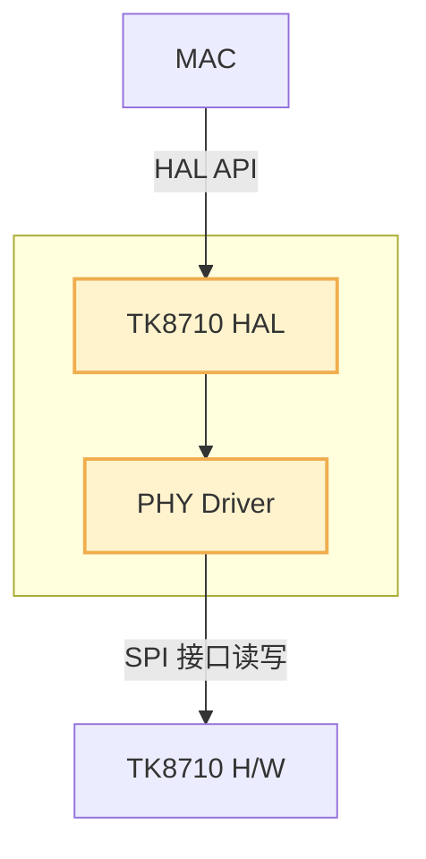
```mermaid
graph TB
    %% 第一层：MAC（单层节点）
    APP["MAC"]

    %% 第二层：HAL + PHY driver（标黄）
    subgraph MID[" "]
        HAL["TK8710 HAL"]
        PHY_DRV["PHY Driver"]
    end

    %% 第三层：TK8710 H/W（单层节点）
    TK8710["TK8710 H/W"]

    %% 调用关系
    APP -->|"HAL API"| HAL
    HAL --> PHY_DRV
    PHY_DRV -->|"SPI 接口读写"| TK8710

    %% 样式：HAL 和 PHY driver 标黄
    classDef halLayer fill:#fff3cd,stroke:#f0ad4e,stroke-width:2px;
    class HAL,PHY_DRV halLayer;
```

### 1.1 HAL 需求说明

- 向上层提供统一接口，屏蔽 TK8710 寄存器和 SPI 细节，抽象 8 通道、128 用户、时隙、频点、功率、波束等传输资源
- 向下层封装 PHY driver，管理 SPI 访问，处理中断事件并异步通知上层
- 满足实时性（中断响应 < 100 µs）、并发性（128 用户）、可靠性（错误恢复、故障隔离）要求
- 支持跨平台移植（OS 解耦）、调试诊断（日志、统计、Trace）

### 1.2 功能

| 功能模块 | 功能描述 |
| -------- | -------- |
| **初始化管理** | 芯片初始化、射频配置、日志系统配置 |
| **时隙配置** | TDD 帧结构配置、速率模式设置、天线配置、超帧配置 |
| **数据接收** | 上行数据接收（支持 128 用户并发）、接收缓冲区管理、数据解析与上报 |
| **数据发送** | 广播数据发送、用户专用数据发送 |
| **状态监控** | 运行状态查询、统计信息获取 |
| **系统控制** | 芯片启动、复位、调试（寄存器读写、PHY driver） |

### 1.3 非功能

| 非功能需求 | 具体要求 |
| ---------- | -------- |
| **实时性** | 中断响应 < 100 µs，单帧处理延迟 < 2 ms |
| **并发性** | 支持 128 用户同时接入 |
| **可靠性** | SPI 超时重试、CRC 校验、软复位恢复 |
| **可移植性** | OS 解耦，适配 Linux 等平台 |
| **可维护性** | 日志分级、Trace 开关、统计信息导出 |

### 1.4 接口

TK8710 HAL 提供两层接口：PHY API 封装芯片底层操作（初始化、配置、数据收发、寄存器读写），HAL API 向上层提供统一抽象接口（初始化、启动、复位、数据发送、状态查询、调试）。

#### 1.4.1 PHY API

| 接口                  | 功能描述                           |
| --------------------- | ---------------------------------- |
| TK8710PhyInit         | 初始化TK8710芯片，配置基本工作参数 |
| TK8710PhyCfg          | 配置芯片工作时隙和通信参数         |
| TK8710PhyStart        | 启动芯片                           |
| TK8710PhyReset        | 复位芯片                           |
| TK8710PhySendData     | 发送数据                           |
| TK8710PhyRecvData     | 接收数据                           |
| TK8710PhySetBeam      | 设置发送用户波束信息               |
| TK8710PhyGetBeam      | 获取接收用户波束信息               |
| TK8710PhyGetRxQuality | 获取接收信号质量信息               |
| TK8710PhyDebug        | 调试控制（发送Tone、校准等）       |
| TK8710PhyReadReg      | 读寄存器                           |
| TK8710PhyWriteReg     | 写寄存器                           |
| TK8710PhySetCbs       | 注册中断回调函数                   |

#### 1.4.2 HAL API

| API 函数           | 功能描述                                     |
| ------------------ | -------------------------------------------- |
| TK8710HalInit      | 初始化HAL层，分配资源，准备硬件接口；通过初始化配置参数传入接收数据回调和发送完成回调 |
| TK8710HalStart     | 启动HAL，开始硬件工作，可以收发数据          |
| TK8710HalReset     | 复位HAL，重新初始化硬件状态                  |
| TK8710HalSendData  | 发送数据                                     |
| TK8710HalGetBeam   | 获取用户的波束信息                           |
| TK8710HalGetStatus | 获取HAL当前状态信息                          |
| TK8710HalDebug     | 提供HAL层调试功能                            |
| TK8710HalSetRxCb   | 接收数据回调函数类型定义                     |
| TK8710HalSetTxCb   | 发送完成回调函数类型定义                     |

### 1.5 设计目标

- 硬件解耦，向 MAC 提供稳定、清晰、可扩展的抽象接口
- 实现对 TK8710 的可靠驱动和系统无线资源管理，满足实时性、并发性、稳定性等要求
- 异步非阻塞，支持中断回调（Callback）通知机制
- 支撑调试、测试和后续芯片版本演进
- 架构规范，支持在不同的 OS上快速迁移

### 1.6 约束、假设和运行条件

| 约束类型 | 具体说明 |
| -------- | -------- |
| **主控芯片** | RK3506B (ARM Cortex-A7 SMP Dual-Core + MCU) |
| **基带芯片** | TK8710 (TurMass™ PHY) |
| **存储资源** | 512MB DDR3 RAM / 8GB eMMC Flash |
| **系统约束** | Linux SMP 模式 |

## 2 总体架构和设计

TK8710 HAL 采用分层架构设计，由 HAL 层和硬件层组成。HAL 层内部包含 TRM 层和 PHY Driver 层，对外提供统一接口。

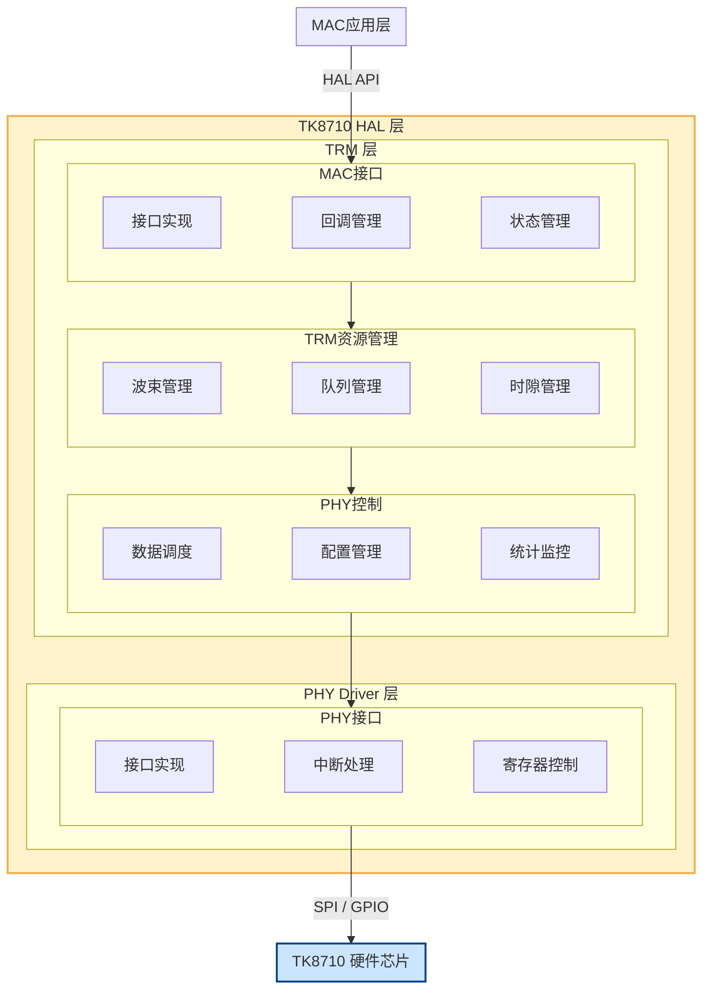
```mermaid
graph TB
    subgraph APP["MAC应用层"]
        direction LR
    end
    
    subgraph HAL["TK8710 HAL 层"]
        subgraph TRM["TRM 层"]
            direction TB
            subgraph HAL_IF["MAC接口"]
                H1["接口实现"] ~~~ H2["回调管理"] ~~~ H3["状态管理"]
            end
            subgraph TRM_RES["TRM资源管理"]
                R1["波束管理"] ~~~ R2["队列管理"] ~~~ R3["时隙管理"]
            end
            subgraph PHY_CTRL["PHY控制"]
                C1["数据调度"] ~~~ C2["配置管理"] ~~~ C3["统计监控"]
            end
        end
        
        subgraph PHY["PHY Driver 层"]
            direction TB
            subgraph PHY_IF["PHY接口"]
                P1["接口实现"] ~~~ P2["中断处理"] ~~~ P3["寄存器控制"]
            end
        end
    end
    
    subgraph HW["TK8710 硬件芯片"]
        direction LR
    end
    
    APP -->|"HAL API"| HAL_IF
    HAL_IF --> TRM_RES
    TRM_RES --> PHY_CTRL
    PHY_CTRL --> PHY_IF
    PHY_IF -->|"SPI / GPIO"| HW
    
    classDef halStyle fill:#fff3cd,stroke:#f0ad4e,stroke-width:2px
    classDef hwStyle fill:#cce5ff,stroke:#004085,stroke-width:2px
    
    class HAL halStyle
    class HW hwStyle
```

### 2.1 模块/层次功能定义

#### 2.1.1 MAC接口

**模块定位**：MAC接口层是TRM层对外的统一入口，实现1.4.2节定义的HAL API，负责接收MAC层调用、在初始化时保存回调函数、维护HAL运行状态。

**核心模块**：

| 模块 | 功能说明 |
|------|----------|
| **接口实现** | 实现HAL API（初始化、启动、复位、发送数据、获取波束、获取状态、调试），初始化时接收并保存回调配置 |
| **回调管理** | 保存并管理初始化时传入的回调函数（接收数据回调、发送完成回调），在TRM内部触发时通知MAC层 |
| **状态管理** | 维护HAL运行状态（未初始化/已初始化/运行中），对各接口调用进行状态合法性检查 |

**工作流程**：

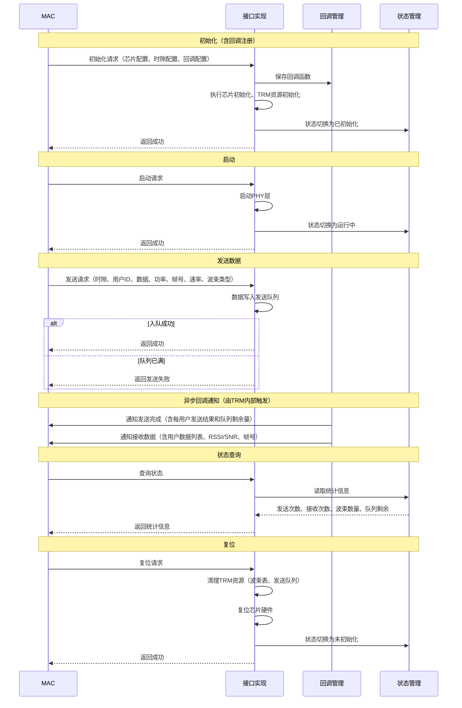
```mermaid
sequenceDiagram
    participant MAC as MAC
    participant IF as 接口实现
    participant CB as 回调管理
    participant SM as 状态管理

    Note over MAC,SM: 初始化（含回调注册）
    MAC->>IF: 初始化请求（芯片配置、时隙配置、回调配置）
    IF->>CB: 保存回调函数
    IF->>IF: 执行芯片初始化、TRM资源初始化
    IF->>SM: 状态切换为已初始化
    IF-->>MAC: 返回成功

    Note over MAC,SM: 启动
    MAC->>IF: 启动请求
    IF->>IF: 启动PHY层
    IF->>SM: 状态切换为运行中
    IF-->>MAC: 返回成功

    Note over MAC,SM: 发送数据
    MAC->>IF: 发送请求（时隙、用户ID、数据、功率、帧号、速率、波束类型）
    IF->>IF: 数据写入发送队列
    alt 入队成功
        IF-->>MAC: 返回成功
    else 队列已满
        IF-->>MAC: 返回发送失败
    end

    Note over MAC,SM: 异步回调通知（由TRM内部触发）
    CB->>MAC: 通知发送完成（含每用户发送结果和队列剩余量）
    CB->>MAC: 通知接收数据（含用户数据列表、RSSI/SNR、帧号）

    Note over MAC,SM: 状态查询
    MAC->>IF: 查询状态
    IF->>SM: 读取统计信息
    SM-->>IF: 发送次数、接收次数、波束数量、队列剩余
    IF-->>MAC: 返回统计信息

    Note over MAC,SM: 复位
    MAC->>IF: 复位请求
    IF->>IF: 清理TRM资源（波束表、发送队列）
    IF->>IF: 复位芯片硬件
    IF->>SM: 状态切换为未初始化
    IF-->>MAC: 返回成功
```

#### 2.1.2 TRM资源管理

**模块定位**：TRM资源管理层负责管理波束、发送队列、时隙超帧三类无线传输资源。波束管理为下行发送提供用户波束查询；队列管理按优先级缓存待发数据并在发送时隙中按帧号调度出队；时隙管理维护全局帧号并提供时隙长度计算。

**核心模块**：

| 模块 | 功能说明 |
|------|----------|
| **波束管理** | 4096槽黄金比例哈希表存储用户波束信息（频率、天线权值、导频功率），支持按用户ID查询、超时检查、延时释放（发送完成后延迟N帧清除） |
| **队列管理** | 4个优先级循环队列（各512项），入队时从MAC帧头提取QosPri决定优先级；出队时按优先级0→3处理，根据目标帧号匹配/过期/未到三种情况决定发送、丢弃或跳过 |
| **时隙管理** | 维护全局帧号（最后时隙结束时递增），提供超帧位置查询；支持按速率模式和包块数计算各时隙长度，并求最小间隔使帧周期为1秒整数倍 |

**波束管理流程**：

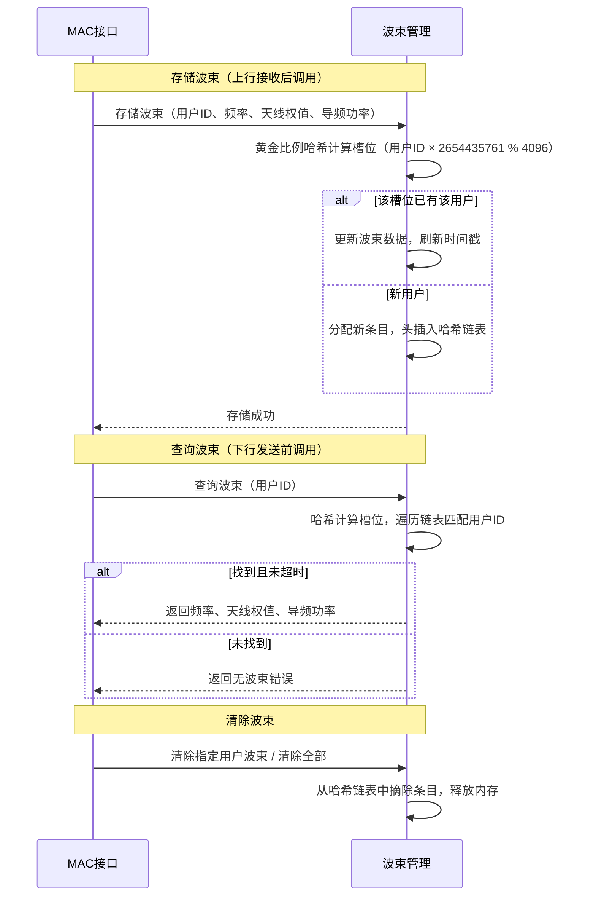
```mermaid
sequenceDiagram
    participant caller as MAC接口
    participant BM as 波束管理

    Note over caller,BM: 存储波束（上行接收后调用）
    caller->>BM: 存储波束（用户ID、频率、天线权值、导频功率）
    BM->>BM: 黄金比例哈希计算槽位（用户ID × 2654435761 % 4096）
    alt 该槽位已有该用户
        BM->>BM: 更新波束数据，刷新时间戳
    else 新用户
        BM->>BM: 分配新条目，头插入哈希链表
    end
    BM-->>caller: 存储成功

    Note over caller,BM: 查询波束（下行发送前调用）
    caller->>BM: 查询波束（用户ID）
    BM->>BM: 哈希计算槽位，遍历链表匹配用户ID
    alt 找到且未超时
        BM-->>caller: 返回频率、天线权值、导频功率
    else 未找到
        BM-->>caller: 返回无波束错误
    end

    Note over caller,BM: 清除波束
    caller->>BM: 清除指定用户波束 / 清除全部
    BM->>BM: 从哈希链表中摘除条目，释放内存
```

**队列管理流程**：

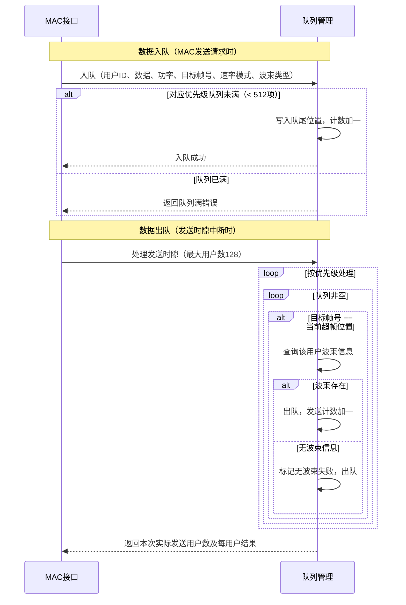
```mermaid
sequenceDiagram
    participant caller as MAC接口
    participant QM as 队列管理

    Note over caller,QM: 数据入队（MAC发送请求时）
    caller->>QM: 入队（用户ID、数据、功率、目标帧号、速率模式、波束类型）
    alt 对应优先级队列未满（< 512项）
        QM->>QM: 写入队尾位置，计数加一
        QM-->>caller: 入队成功
    else 队列已满
        QM-->>caller: 返回队列满错误
    end

    Note over caller,QM: 数据出队（发送时隙中断时）
    caller->>QM: 处理发送时隙（最大用户数128）
    loop 按优先级处理
        loop 队列非空
            alt 目标帧号 == 当前超帧位置
                QM->>QM: 查询该用户波束信息
                alt 波束存在
                    QM->>QM: 出队，发送计数加一
                else 无波束信息
                    QM->>QM: 标记无波束失败，出队
                end
            end
        end
    end
    QM-->>caller: 返回本次实际发送用户数及每用户结果
```

**时隙管理流程**：

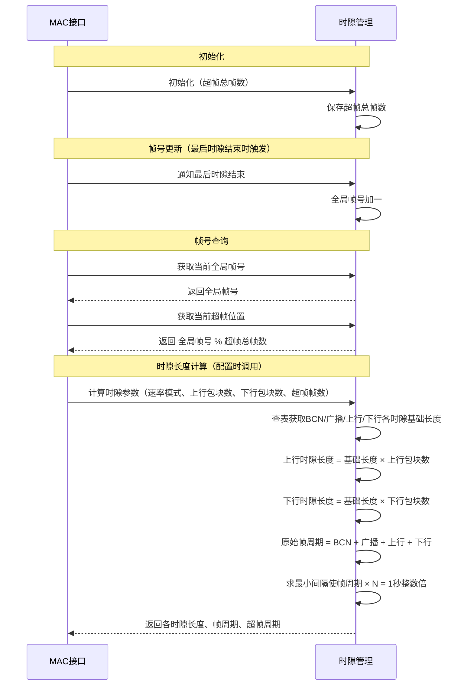
```mermaid
sequenceDiagram
    participant caller as MAC接口
    participant SM as 时隙管理

    Note over caller,SM: 初始化
    caller->>SM: 初始化（超帧总帧数）
    SM->>SM: 保存超帧总帧数

    Note over caller,SM: 帧号更新（最后时隙结束时触发）
    caller->>SM: 通知最后时隙结束
    SM->>SM: 全局帧号加一

    Note over caller,SM: 帧号查询
    caller->>SM: 获取当前全局帧号
    SM-->>caller: 返回全局帧号
    caller->>SM: 获取当前超帧位置
    SM-->>caller: 返回 全局帧号 % 超帧总帧数

    Note over caller,SM: 时隙长度计算（配置时调用）
    caller->>SM: 计算时隙参数（速率模式、上行包块数、下行包块数、超帧帧数）
    SM->>SM: 查表获取BCN/广播/上行/下行各时隙基础长度
    SM->>SM: 上行时隙长度 = 基础长度 × 上行包块数
    SM->>SM: 下行时隙长度 = 基础长度 × 下行包块数
    SM->>SM: 原始帧周期 = BCN + 广播 + 上行 + 下行
    SM->>SM: 求最小间隔使帧周期 × N = 1秒整数倍
    SM-->>caller: 返回各时隙长度、帧周期、超帧周期
```

#### 2.1.3 PHY控制

**模块定位**：PHY控制层在TRM层内部，是TRM资源管理与PHY接口之间的协调层。配置管理负责在初始化时驱动PHY接口完成芯片配置并注册中断回调；数据调度在中断回调中执行下行发送调度和上行接收处理；统计监控跟踪收发计数。

**核心模块**：

| 模块 | 功能说明 |
|------|----------|
| **配置管理** | 接收MAC接口的初始化/复位请求，依次调用PHY接口完成芯片初始化、时隙配置，将超帧周期同步给时隙管理，并向PHY接口注册中断回调 |
| **数据调度** | 响应PHY发送时隙中断，处理广播发送并按优先级调度发送队列；响应PHY上行数据中断，读取波束信息和接收数据，存入波束管理后触发接收回调 |
| **统计监控** | 每次发送/接收时更新计数，供状态查询接口返回 |

<div style="page-break-before: always;"></div>

**初始化配置流程**：

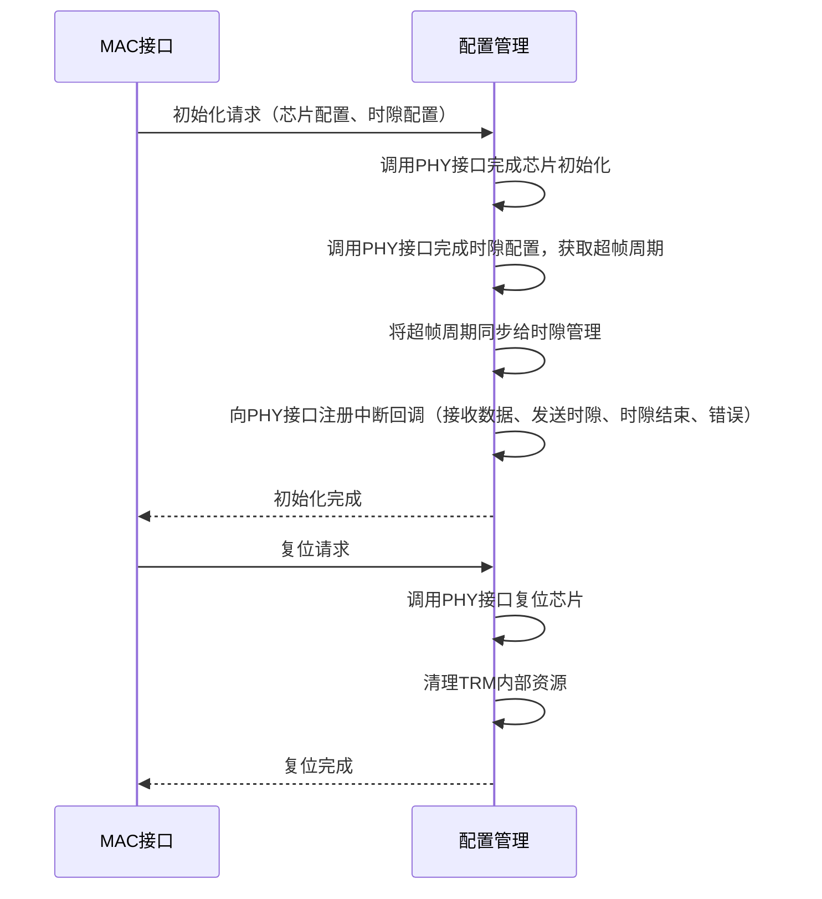
```mermaid
sequenceDiagram
    participant MI as MAC接口
    participant CM as 配置管理

    MI->>CM: 初始化请求（芯片配置、时隙配置）
    CM->>CM: 调用PHY接口完成芯片初始化
    CM->>CM: 调用PHY接口完成时隙配置，获取超帧周期
    CM->>CM: 将超帧周期同步给时隙管理
    CM->>CM: 向PHY接口注册中断回调（接收数据、发送时隙、时隙结束、错误）
    CM-->>MI: 初始化完成

    MI->>CM: 复位请求
    CM->>CM: 调用PHY接口复位芯片
    CM->>CM: 清理TRM内部资源
    CM-->>MI: 复位完成
```

<div style="page-break-before: always;"></div>

**下行发送流程**：

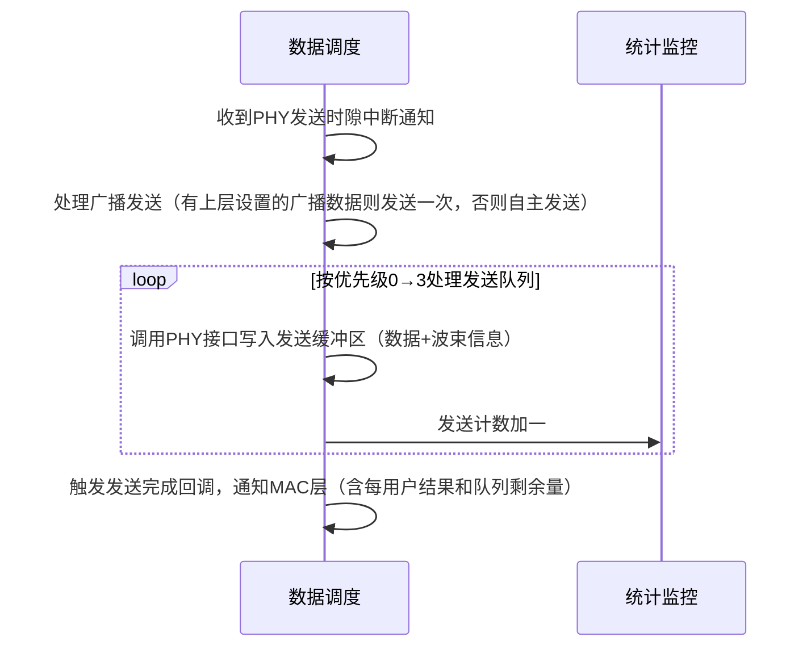
```mermaid
sequenceDiagram
    participant DS as 数据调度
    participant ST as 统计监控

    DS->>DS: 收到PHY发送时隙中断通知
    DS->>DS: 处理广播发送（有上层设置的广播数据则发送一次，否则自主发送）
    loop 按优先级0→3处理发送队列
        DS->>DS: 调用PHY接口写入发送缓冲区（数据+波束信息）
        DS->>ST: 发送计数加一
    end
    DS->>DS: 触发发送完成回调，通知MAC层（含每用户结果和队列剩余量）
```

<div style="page-break-before: always;"></div>

**上行接收流程**：

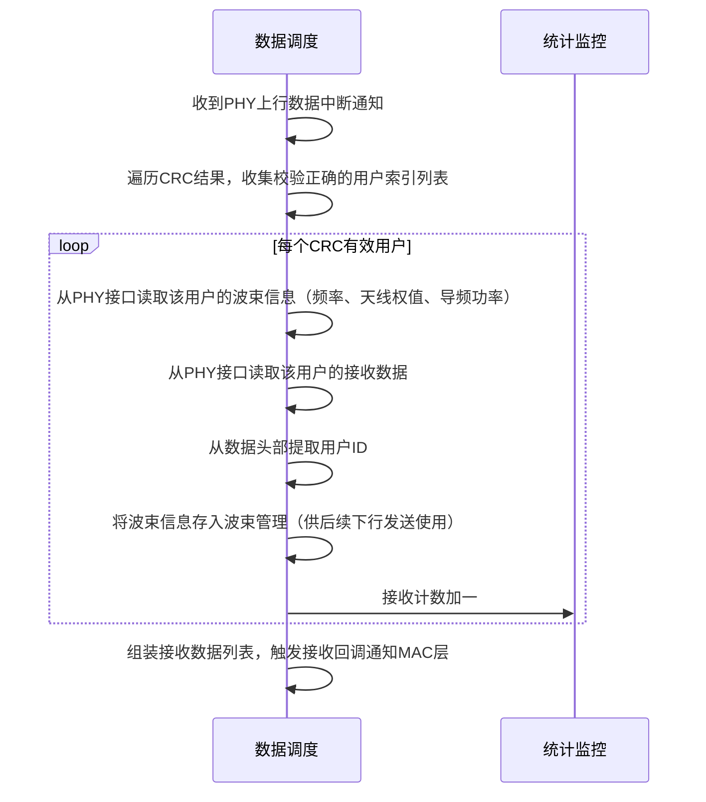
```mermaid
sequenceDiagram
    participant DS as 数据调度
    participant ST as 统计监控

    DS->>DS: 收到PHY上行数据中断通知
    DS->>DS: 遍历CRC结果，收集校验正确的用户索引列表
    loop 每个CRC有效用户
        DS->>DS: 从PHY接口读取该用户的波束信息（频率、天线权值、导频功率）
        DS->>DS: 从PHY接口读取该用户的接收数据
        DS->>DS: 从数据头部提取用户ID
        DS->>DS: 将波束信息存入波束管理（供后续下行发送使用）
        DS->>ST: 接收计数加一
    end
    DS->>DS: 组装接收数据列表，触发接收回调通知MAC层
```

#### 2.1.4 PHY接口

**模块定位**：PHY接口层实现1.4.1节定义的PHY API，直接与TK8710芯片交互。接口实现负责初始化、启动、复位及数据读写；寄存器控制负责将时隙参数写入芯片寄存器、读取时隙时间长度并执行ACM多天线增益校准；中断处理负责响应GPIO中断、解析中断类型并分发给PHY控制层。

**核心模块**：

| 模块 | 功能说明 |
|------|----------|
| **接口实现** | 初始化（SPI、芯片复位、基础寄存器、射频）、启动收发（配置中断使能、触发主动收发）、数据读写（发送/接收缓冲区、波束信息、信号质量）、复位（状态机/全复位） |
| **寄存器控制** | 将时隙配置写入芯片寄存器，读取各时隙时间长度，执行ACM多天线增益自动校准（关闭PA/LNA→配置校准信号→触发校准→读取SNR→更新增益） |
| **中断处理** | 响应GPIO上升沿，读取中断状态寄存器解析中断类型，分发至PHY控制层对应回调（下行发送、上行接收、用户信息、时隙结束） |

<div style="page-break-before: always;"></div>

**接口实现流程**：

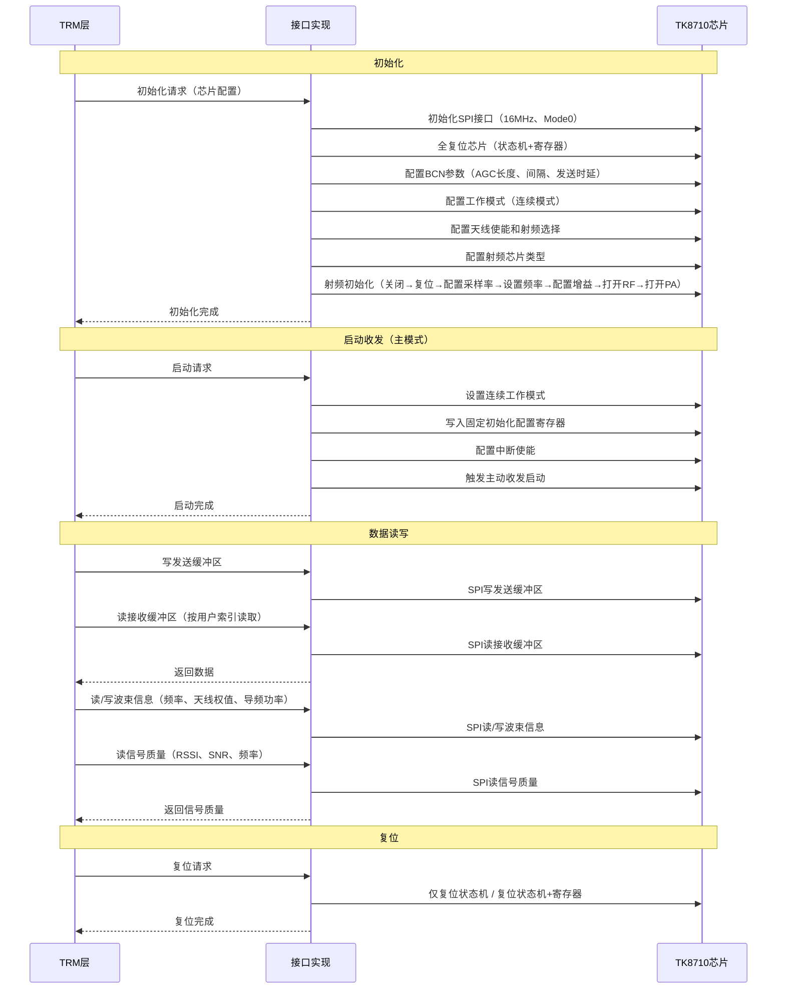
```mermaid
sequenceDiagram
    participant TRM as TRM层
    participant CC as 接口实现
    participant HW as TK8710芯片

    Note over TRM,HW: 初始化
    TRM->>CC: 初始化请求（芯片配置）
    CC->>HW: 初始化SPI接口（16MHz、Mode0）
    CC->>HW: 全复位芯片（状态机+寄存器）
    CC->>HW: 配置BCN参数（AGC长度、间隔、发送时延）
    CC->>HW: 配置工作模式（连续模式）
    CC->>HW: 配置天线使能和射频选择
    CC->>HW: 配置射频芯片类型
    CC->>HW: 射频初始化（关闭→复位→配置采样率→设置频率→配置增益→打开RF→打开PA）
    CC-->>TRM: 初始化完成

    Note over TRM,HW: 启动收发（主模式）
    TRM->>CC: 启动请求
    CC->>HW: 设置连续工作模式
    CC->>HW: 写入固定初始化配置寄存器
    CC->>HW: 配置中断使能
    CC->>HW: 触发主动收发启动
    CC-->>TRM: 启动完成

    Note over TRM,HW: 数据读写
    TRM->>CC: 写发送缓冲区
    CC->>HW: SPI写发送缓冲区
    TRM->>CC: 读接收缓冲区（按用户索引读取）
    CC->>HW: SPI读接收缓冲区
    CC-->>TRM: 返回数据
    TRM->>CC: 读/写波束信息（频率、天线权值、导频功率）
    CC->>HW: SPI读/写波束信息
    TRM->>CC: 读信号质量（RSSI、SNR、频率）
    CC->>HW: SPI读信号质量
    CC-->>TRM: 返回信号质量

    Note over TRM,HW: 复位
    TRM->>CC: 复位请求
    CC->>HW: 仅复位状态机 / 复位状态机+寄存器
    CC-->>TRM: 复位完成
```

<div style="page-break-before: always;"></div>

**中断处理流程**：

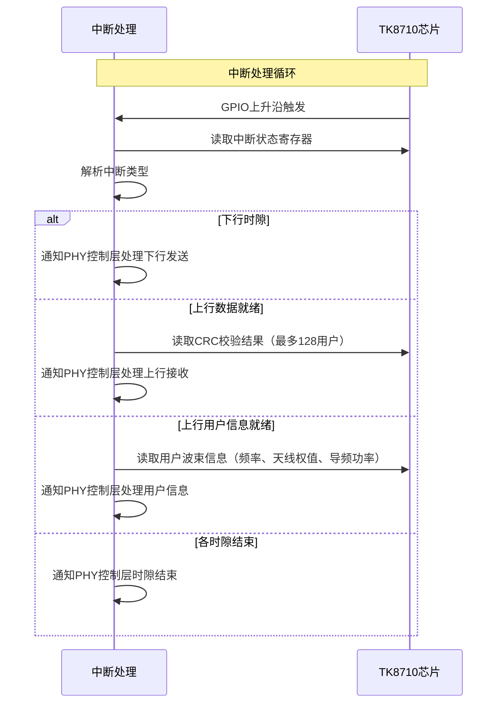
```mermaid
sequenceDiagram
    participant IH as 中断处理
    participant HW as TK8710芯片

    Note over IH,HW: 中断处理循环
    HW->>IH: GPIO上升沿触发
    IH->>HW: 读取中断状态寄存器
    IH->>IH: 解析中断类型
    alt 下行时隙
        IH->>IH: 通知PHY控制层处理下行发送
    else 上行数据就绪
        IH->>HW: 读取CRC校验结果（最多128用户）
        IH->>IH: 通知PHY控制层处理上行接收
    else 上行用户信息就绪
        IH->>HW: 读取用户波束信息（频率、天线权值、导频功率）
        IH->>IH: 通知PHY控制层处理用户信息
    else 各时隙结束
        IH->>IH: 通知PHY控制层时隙结束
    end
```

<div style="page-break-before: always;"></div>

**寄存器控制流程**：

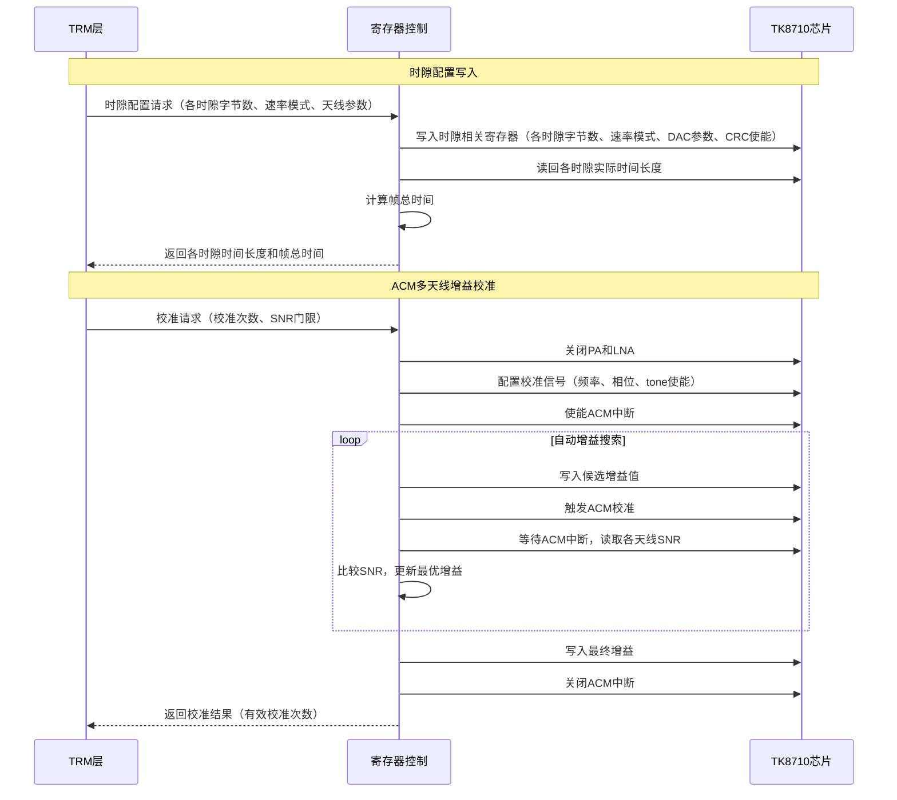
```mermaid
sequenceDiagram
    participant TRM as TRM层
    participant RC as 寄存器控制
    participant HW as TK8710芯片

    Note over TRM,HW: 时隙配置写入
    TRM->>RC: 时隙配置请求（各时隙字节数、速率模式、天线参数）
    RC->>HW: 写入时隙相关寄存器（各时隙字节数、速率模式、DAC参数、CRC使能）
    RC->>HW: 读回各时隙实际时间长度
    RC->>RC: 计算帧总时间
    RC-->>TRM: 返回各时隙时间长度和帧总时间

    Note over TRM,HW: ACM多天线增益校准
    TRM->>RC: 校准请求（校准次数、SNR门限）
    RC->>HW: 关闭PA和LNA
    RC->>HW: 配置校准信号（频率、相位、tone使能）
    RC->>HW: 使能ACM中断
    loop 自动增益搜索
        RC->>HW: 写入候选增益值
        RC->>HW: 触发ACM校准
        RC->>HW: 等待ACM中断，读取各天线SNR
        RC->>RC: 比较SNR，更新最优增益
    end
    RC->>HW: 写入最终增益
    RC->>HW: 关闭ACM中断
    RC-->>TRM: 返回校准结果（有效校准次数）
```

### 2.2 工作流程

#### 2.2.1 初始化流程

**目的**：完成 HAL 层的初始化，准备硬件接口

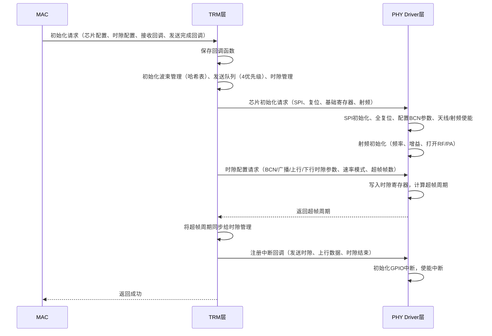
```mermaid
sequenceDiagram
    participant MAC as MAC
    participant TRM as TRM层
    participant PHY as PHY Driver层

    MAC->>TRM: 初始化请求（芯片配置、时隙配置、接收回调、发送完成回调）
    TRM->>TRM: 保存回调函数
    TRM->>TRM: 初始化波束管理（哈希表）、发送队列（4优先级）、时隙管理
    TRM->>PHY: 芯片初始化请求（SPI、复位、基础寄存器、射频）
    PHY->>PHY: SPI初始化、全复位、配置BCN参数、天线/射频使能
    PHY->>PHY: 射频初始化（频率、增益、打开RF/PA）
    TRM->>PHY: 时隙配置请求（BCN/广播/上行/下行时隙参数、速率模式、超帧帧数）
    PHY->>PHY: 写入时隙寄存器，计算超帧周期
    PHY-->>TRM: 返回超帧周期
    TRM->>TRM: 将超帧周期同步给时隙管理
    TRM->>PHY: 注册中断回调（发送时隙、上行数据、时隙结束）
    PHY->>PHY: 初始化GPIO中断，使能中断
    TRM-->>MAC: 返回成功
```

**关键步骤**：
1. MAC 传入芯片配置、时隙配置及回调函数，调用初始化接口
2. TRM 层保存回调，初始化波束管理、发送队列、时隙管理等内部资源
3. TRM 层驱动 PHY Driver 层完成芯片初始化（SPI、复位、基础寄存器、射频）
4. TRM 层驱动 PHY Driver 层完成时隙配置，获取超帧周期并同步给时隙管理
5. TRM 层向 PHY Driver 层注册中断回调，PHY Driver 层使能 GPIO 中断

<div style="page-break-before: always;"></div>

#### 2.2.2 配置流程

**目的**：配置 TDD 帧结构、速率模式、超帧参数

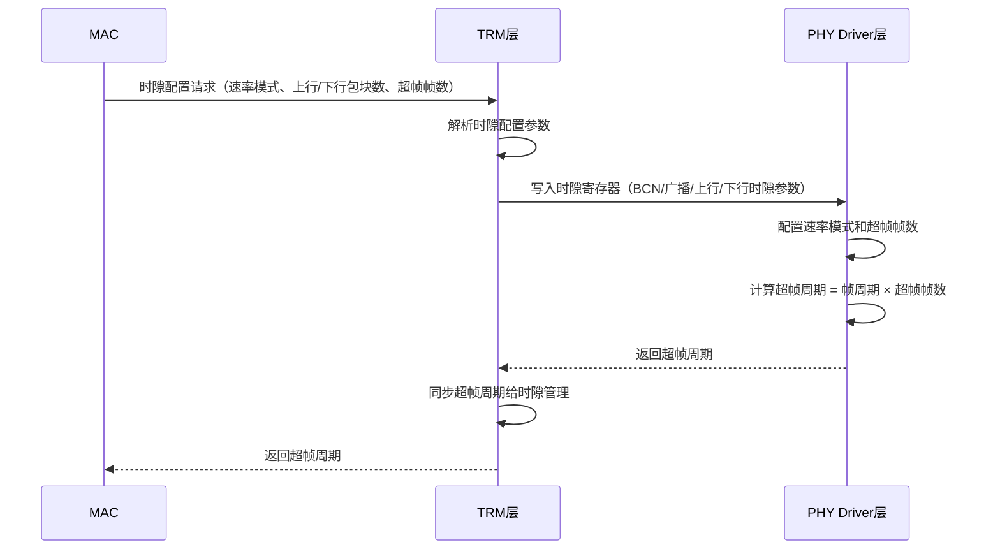
```mermaid
sequenceDiagram
    participant MAC as MAC
    participant TRM as TRM层
    participant PHY as PHY Driver层

    MAC->>TRM: 时隙配置请求（速率模式、上行/下行包块数、超帧帧数）
    TRM->>TRM: 解析时隙配置参数
    TRM->>PHY: 写入时隙寄存器（BCN/广播/上行/下行时隙参数）
    PHY->>PHY: 配置速率模式和超帧帧数
    PHY->>PHY: 计算超帧周期 = 帧周期 × 超帧帧数
    PHY-->>TRM: 返回超帧周期
    TRM->>TRM: 同步超帧周期给时隙管理
    TRM-->>MAC: 返回超帧周期
```

**关键步骤**：
1. MAC 传入速率模式、包块数、超帧帧数等时隙参数
2. TRM 层解析参数，驱动 PHY Driver 层写入时隙寄存器
3. PHY Driver 层计算超帧周期并返回
4. TRM 层将超帧周期同步给时隙管理，供发送调度使用

<div style="page-break-before: always;"></div>

#### 2.2.3 启动流程

**目的**：启动 HAL，开始硬件工作，可以收发数据

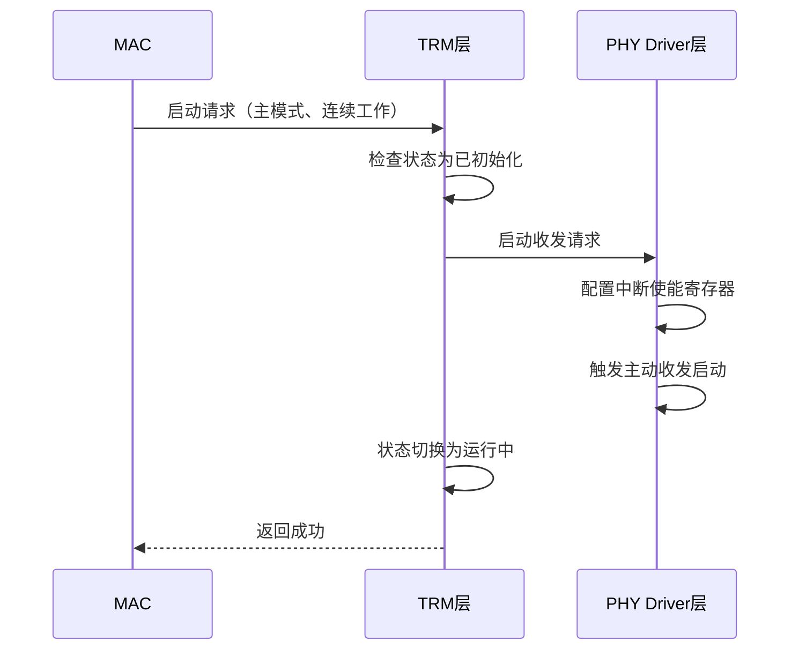
```mermaid
sequenceDiagram
    participant MAC as MAC
    participant TRM as TRM层
    participant PHY as PHY Driver层

    MAC->>TRM: 启动请求（主模式、连续工作）
    TRM->>TRM: 检查状态为已初始化
    TRM->>PHY: 启动收发请求
    PHY->>PHY: 配置中断使能寄存器
    PHY->>PHY: 触发主动收发启动
    TRM->>TRM: 状态切换为运行中
    TRM-->>MAC: 返回成功
```

**关键步骤**：
1. MAC 指定工作类型（主/从模式）和工作模式（连续/单次）
2. TRM 层检查状态合法性，驱动 PHY Driver 层启动收发
3. PHY Driver 层配置中断使能并触发芯片进入主动收发状态

<div style="page-break-before: always;"></div>

#### 2.2.4 发送数据流程

**目的**：发送广播数据或用户专用数据

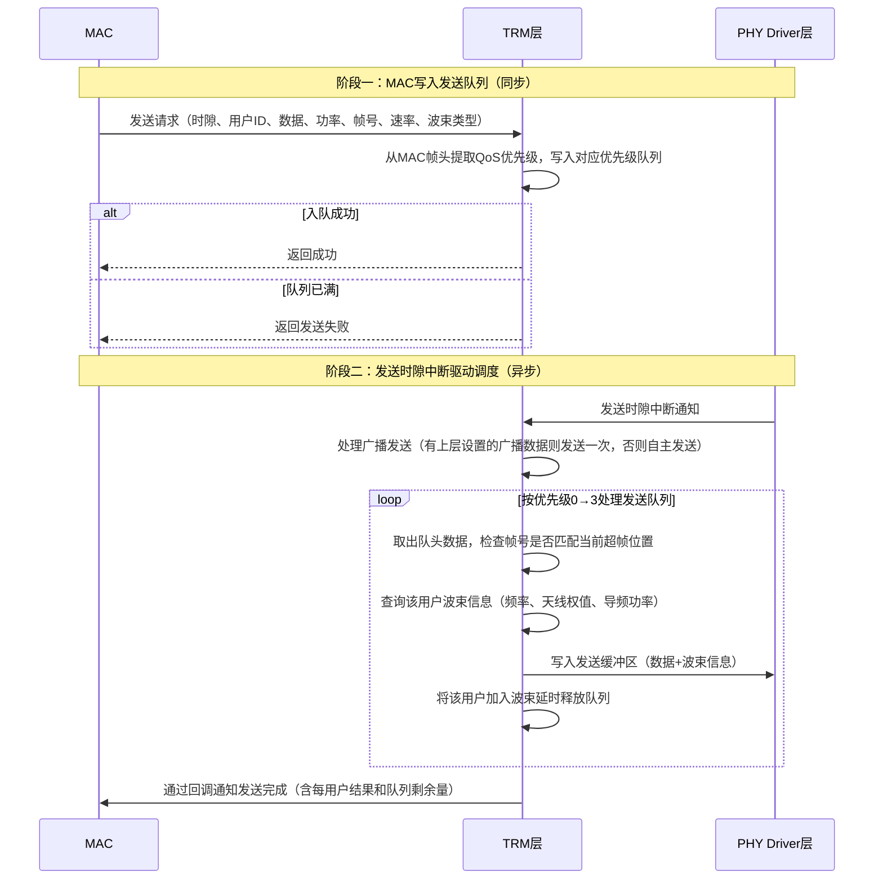
```mermaid
sequenceDiagram
    participant MAC as MAC
    participant TRM as TRM层
    participant PHY as PHY Driver层

    Note over MAC,PHY: 阶段一：MAC写入发送队列（同步）
    MAC->>TRM: 发送请求（时隙、用户ID、数据、功率、帧号、速率、波束类型）
    TRM->>TRM: 从MAC帧头提取QoS优先级，写入对应优先级队列
    alt 入队成功
        TRM-->>MAC: 返回成功
    else 队列已满
        TRM-->>MAC: 返回发送失败
    end

    Note over MAC,PHY: 阶段二：发送时隙中断驱动调度（异步）
    PHY->>TRM: 发送时隙中断通知
    TRM->>TRM: 处理广播发送（有上层设置的广播数据则发送一次，否则自主发送）
    loop 按优先级0→3处理发送队列
        TRM->>TRM: 取出队头数据，检查帧号是否匹配当前超帧位置
        TRM->>TRM: 查询该用户波束信息（频率、天线权值、导频功率）
        TRM->>PHY: 写入发送缓冲区（数据+波束信息）
        TRM->>TRM: 将该用户加入波束延时释放队列
    end
    TRM->>MAC: 通过回调通知发送完成（含每用户结果和队列剩余量）
```

**关键步骤**：
1. MAC 调用发送接口，数据写入对应优先级队列后立即返回（异步发送）
2. 发送时隙中断到来时，TRM 层按优先级从队列取数据，匹配帧号后查询波束信息
3. TRM 层将数据和波束信息写入 PHY Driver 层发送缓冲区
4. 发送完成后通过回调通知 MAC，携带每用户发送结果和队列剩余量

<div style="page-break-before: always;"></div>

#### 2.2.5 接收数据流程

**目的**：接收上行数据并通知应用层

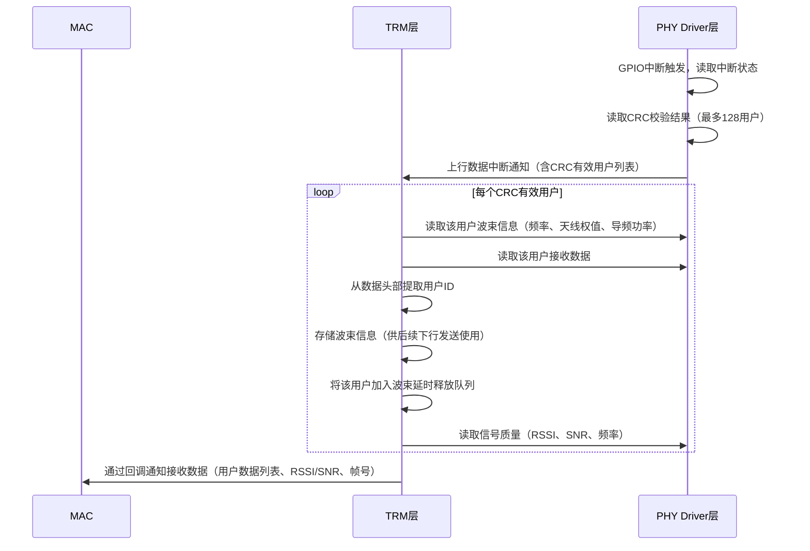
```mermaid
sequenceDiagram
    participant MAC as MAC
    participant TRM as TRM层
    participant PHY as PHY Driver层

    PHY->>PHY: GPIO中断触发，读取中断状态
    PHY->>PHY: 读取CRC校验结果（最多128用户）
    PHY->>TRM: 上行数据中断通知（含CRC有效用户列表）
    loop 每个CRC有效用户
        TRM->>PHY: 读取该用户波束信息（频率、天线权值、导频功率）
        TRM->>PHY: 读取该用户接收数据
        TRM->>TRM: 从数据头部提取用户ID
        TRM->>TRM: 存储波束信息（供后续下行发送使用）
        TRM->>TRM: 将该用户加入波束延时释放队列
        TRM->>PHY: 读取信号质量（RSSI、SNR、频率）
    end
    TRM->>MAC: 通过回调通知接收数据（用户数据列表、RSSI/SNR、帧号）
```

**关键步骤**：
1. PHY Driver 层 GPIO 中断触发，读取 CRC 校验结果，通知 TRM 层
2. TRM 层遍历 CRC 有效用户，逐一读取波束信息、接收数据、信号质量
3. TRM 层从数据头部提取用户 ID，将波束信息存入波束管理供后续下行使用
4. TRM 层组装接收数据列表，通过回调通知 MAC 层

<div style="page-break-before: always;"></div>

#### 2.2.6 异常/事件处理

**目的**：处理异常情况和事件通知

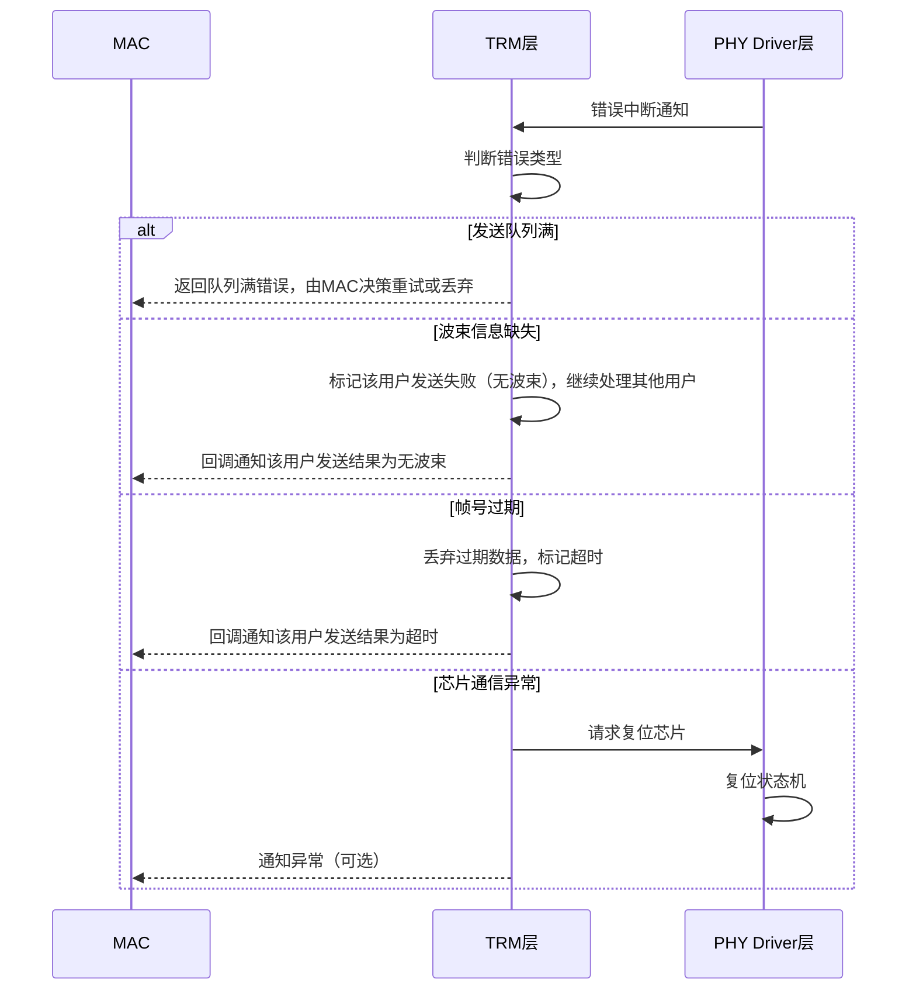
```mermaid
sequenceDiagram
    participant MAC as MAC
    participant TRM as TRM层
    participant PHY as PHY Driver层

    PHY->>TRM: 错误中断通知
    TRM->>TRM: 判断错误类型
    alt 发送队列满
        TRM-->>MAC: 返回队列满错误，由MAC决策重试或丢弃
    else 波束信息缺失
        TRM->>TRM: 标记该用户发送失败（无波束），继续处理其他用户
        TRM-->>MAC: 回调通知该用户发送结果为无波束
    else 帧号过期
        TRM->>TRM: 丢弃过期数据，标记超时
        TRM-->>MAC: 回调通知该用户发送结果为超时
    else 芯片通信异常
        TRM->>PHY: 请求复位芯片
        PHY->>PHY: 复位状态机
        TRM-->>MAC: 通知异常（可选）
    end
```

**异常类型及处理策略**：

| 异常类型 | 处理策略 |
|----------|----------|
| 发送队列满 | 返回队列满错误，由 MAC 层决策重试或丢弃 |
| 波束信息缺失 | 标记该用户发送失败，通过回调通知 MAC |
| 帧号过期 | 丢弃过期数据，通过回调通知 MAC 超时 |
| 芯片通信异常 | 请求复位状态机，恢复正常工作 |

#### 2.2.7 关闭或复位流程

**目的**：复位 HAL，重新初始化硬件状态

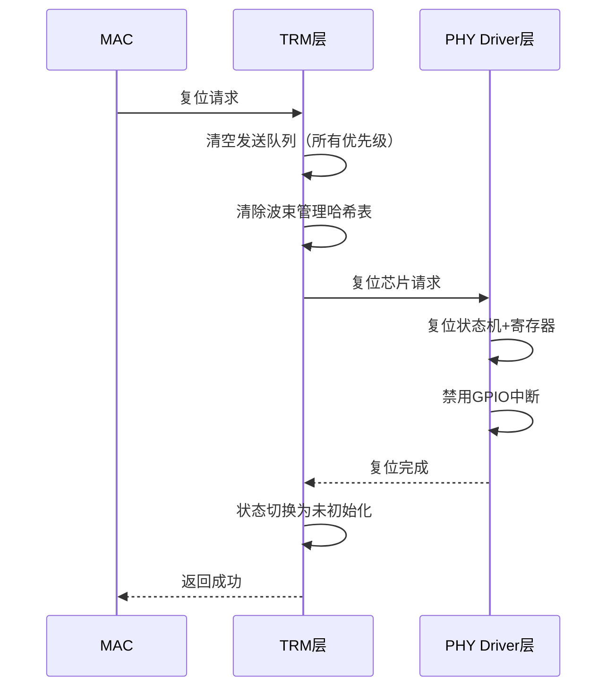
```mermaid
sequenceDiagram
    participant MAC as MAC
    participant TRM as TRM层
    participant PHY as PHY Driver层

    MAC->>TRM: 复位请求
    TRM->>TRM: 清空发送队列（所有优先级）
    TRM->>TRM: 清除波束管理哈希表
    TRM->>PHY: 复位芯片请求
    PHY->>PHY: 复位状态机+寄存器
    PHY->>PHY: 禁用GPIO中断
    PHY-->>TRM: 复位完成
    TRM->>TRM: 状态切换为未初始化
    TRM-->>MAC: 返回成功
```

**关键步骤**：
1. MAC 调用复位接口
2. TRM 层清空所有优先级发送队列，清除波束管理哈希表
3. TRM 层驱动 PHY Driver 层复位芯片（状态机+寄存器），禁用 GPIO 中断
4. TRM 层状态切换为未初始化，复位后需重新调用初始化接口才能使用

## 3 详细设计

### 3.1 子模块划分

TK8710 HAL 按照第2章架构图划分为 TRM 层和 PHY Driver 层，TRM 层内部细分为 MAC接口、TRM资源管理、PHY控制三个子层，PHY Driver 层对应 PHY接口子层。

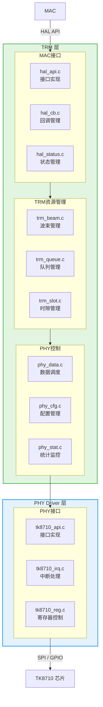
```mermaid
flowchart TD
    MAC["MAC"]

    subgraph TRM["TRM 层"]
        subgraph MAC_IF["MAC接口"]
            hal_api["hal_api.c\n接口实现"]
            hal_cb["hal_cb.c\n回调管理"]
            hal_status["hal_status.c\n状态管理"]
        end
        subgraph TRM_RES["TRM资源管理"]
            trm_beam["trm_beam.c\n波束管理"]
            trm_queue["trm_queue.c\n队列管理"]
            trm_slot["trm_slot.c\n时隙管理"]
        end
        subgraph PHY_CTRL["PHY控制"]
            phy_data["phy_data.c\n数据调度"]
            phy_cfg["phy_cfg.c\n配置管理"]
            phy_stat["phy_stat.c\n统计监控"]
        end
    end

    subgraph PHY["PHY Driver 层"]
        subgraph PHY_IF["PHY接口"]
            tk8710_api["tk8710_api.c\n接口实现"]
            tk8710_irq["tk8710_irq.c\n中断处理"]
            tk8710_reg["tk8710_reg.c\n寄存器控制"]
        end
    end

    HW["TK8710 芯片"]

    MAC -->|"HAL API"| MAC_IF
    MAC_IF --> TRM_RES
    TRM_RES --> PHY_CTRL
    PHY_CTRL --> PHY_IF
    PHY_IF -->|"SPI / GPIO"| HW

    classDef trmStyle fill:#e1f5e1,stroke:#4caf50,stroke-width:2px
    classDef phyStyle fill:#e3f2fd,stroke:#2196f3,stroke-width:2px
    class TRM trmStyle
    class PHY phyStyle
```

**TRM 层 — MAC接口**

| 模块 | 文件 | 职责 |
|------|------|------|
| 接口实现 | hal_api.c / hal_api.h | 实现1.4.2节定义的HAL API，作为MAC层调用的统一入口 |
| 回调管理 | hal_cb.c / hal_cb.h | 保存初始化时传入的接收数据回调和发送完成回调，在TRM内部触发时通知MAC层 |
| 状态管理 | hal_status.c / hal_status.h | 维护HAL运行状态（未初始化/已初始化/运行中），对各接口调用进行状态合法性检查，提供统计信息查询 |

**TRM 层 — TRM资源管理**

| 模块 | 文件 | 职责 |
|------|------|------|
| 波束管理 | trm_beam.c / trm_beam.h | 黄金比例哈希表（4096槽）存储用户波束信息，支持查询、超时检查、延时释放 |
| 队列管理 | trm_queue.c / trm_queue.h | 4个优先级循环队列（各512项）管理待发数据，支持按帧号调度出队，管理广播数据 |
| 时隙管理 | trm_slot.c / trm_slot.h | 维护全局帧号，计算超帧位置，提供时隙长度计算（查表+间隔对齐） |

**TRM 层 — PHY控制**

| 模块 | 文件 | 职责 |
|------|------|------|
| 数据调度 | phy_data.c / phy_data.h | 响应PHY发送时隙中断，驱动队列出队和PHY发送；响应PHY上行数据中断，读取数据和波束信息，存入TRM资源管理 |
| 配置管理 | phy_cfg.c / phy_cfg.h | 初始化时依次调用PHY接口完成芯片初始化、时隙配置，将超帧周期同步给时隙管理，注册PHY中断回调 |
| 统计监控 | phy_stat.c / phy_stat.h | 维护收发计数，提供统计信息供状态管理查询 |

**PHY Driver 层 — PHY接口**

| 模块 | 文件 | 职责 |
|------|------|------|
| 接口实现 | tk8710_api.c / tk8710_api.h | 实现PHY层初始化、启动、复位及数据读写接口，封装SPI寄存器操作和射频初始化 |
| 中断处理 | tk8710_irq.c / tk8710_irq.h | 响应GPIO中断，解析中断类型，分发至PHY控制层回调，统计中断处理时间 |
| 寄存器控制 | tk8710_reg.c / tk8710_reg.h | 将时隙配置写入芯片寄存器，读取各时隙实际时间长度，执行ACM多天线增益自动校准 |

### 3.2 文件结构

```
tk8710_hal/
├── inc/                             # 公共头文件目录
│   ├── hal_api.h                    # HAL API接口（对MAC暴露）
│   ├── phy/                         # PHY层头文件
│   │   ├── phy_api.h                # PHY API接口
│   │   ├── phy_irq.h                # 中断定义
│   │   ├── phy_regs.h               # 寄存器定义
│   │   ├── phy_log.h                # PHY日志接口
│   │   └── phy_test.h               # PHY测试接口
│   └── trm/                         # TRM层头文件
│       ├── trm_beam.h               # 波束管理接口
│       ├── trm_queue.h              # 队列管理接口
│       ├── trm_slot.h               # 时隙管理接口
│       ├── trm_log.h                # TRM日志接口
│       ├── phy_data.h               # PHY数据控制接口
│       ├── phy_cfg.h                # PHY配置管理接口
│       └── phy_stat.h               # PHY统计监控接口
│
├── src/                             # 源代码目录
│   ├── hal/                         # HAL接口层（MAC调用）
│   │   ├── hal_api.c                # 接口实现：HAL API入口
│   │   ├── hal_cb.c                 # 回调管理：保存和触发回调
│   │   └── hal_status.c             # 状态管理：状态维护和统计查询
│   ├── phy/                         # PHY层实现
│   │   ├── phy_api.c                # 接口实现：初始化/启动/复位/数据读写
│   │   ├── phy_irq.c                # 中断处理：GPIO中断/中断分发/时间统计
│   │   ├── phy_regs.c               # 寄存器控制：时隙配置/ACM校准
│   │   ├── phy_log.c                # PHY日志实现
│   │   └── phy_test.c               # PHY测试实现
│   ├── trm/                         # TRM层实现（资源管理 + PHY控制）
│   │   ├── trm_beam.c               # 波束管理：哈希存储/查询/延时释放
│   │   ├── trm_queue.c              # 队列管理：优先级队列/广播管理
│   │   ├── trm_slot.c               # 时隙管理：帧号维护/时隙长度计算
│   │   ├── trm_log.c                # TRM日志实现
│   │   ├── phy_data.c               # PHY数据控制：发送时隙调度/上行接收处理
│   │   ├── phy_cfg.c                # PHY配置管理：驱动PHY初始化/时隙配置/注册回调
│   │   └── phy_stat.c               # PHY统计监控：收发计数/状态数据维护
│   └── port/                        # 移植层
│       ├── port_api.h               # 移植层接口定义
│       └── port_rk3506.c            # RK3506 Linux平台适配实现
│
├── test/                            # 测试代码目录
│   ├── example/                     # 示例程序
│   └── phy_test/                    # PHY层测试
│
├── cmake/                           # 构建配置
│
└── docs/                            # 文档目录
```

### 3.3 核心数据结构

#### 3.3.1 HAL 层数据结构

**1. HAL 初始化配置结构体**

```c
/* HAL 初始化配置 */
typedef struct {
    uint8_t  antEn;          /* 数字处理天线数使能，8bit对应8根天线配置 */
    uint8_t  rfEn;           /* 射频天线使能，8bit对应8根天线配置 */
    uint8_t  txBcnAntEn;     /* 发送BCN天线使能，8bit对应8根天线配置 */
    uint8_t  txSync;         /* 本地同步 */
    uint8_t  contiMode;      /* 单次工作模式或者连续工作模式 */
    uint8_t  rfModel;        /* 射频芯片型号：1=SX1255, 2=SX1257 */
    uint8_t  bcnBits;        /* bcn携带信息 */
    uint32_t Freq;           /* 射频中心频率，单位hz */
    uint8_t  rxGain;         /* 射频接收增益 */
    uint8_t  txGain;         /* 射频发送增益 */
    void (*OnRxData)(const RxDataList* rxDataList);           /* 接收数据回调 */
    void (*OnTxComplete)(const TxCompleteResult* txResult);   /* 发送完成回调 */
} Tk8710HalInitCfg;
```

**2. 时隙配置结构体**

```c
/* 时隙配置 */
typedef struct {
    uint8_t  msMode;           /* 主/从模式（主：发送bcn，从：接收bcn），0：主，1：从 */
    uint8_t  plCrcEn;          /* Payload CRC使能，0：disable，1：enable */
    uint8_t  rateCount;        /* 速率个数 */
    uint8_t  rateModes[4];     /* 每个速率的模式 */
    uint8_t  upBlockNum[4];    /* 每个模式上行（slot2）包块数 */
    uint8_t  downBlockNum[4];  /* 每个模式下行（slot3）包块数 */
    uint8_t  frameNum;         /* 超帧个数 */
    uint8_t  freqGroupNum;     /* 频域分区总数 */
    uint8_t  pointFreqNum;     /* 指定频率总数 */
    uint8_t  frametype;        /* 时隙结构配置 */
} SlotCfg;
```

**3. 接收数据结构体**

```c
/* 单个用户接收数据 */
typedef struct {
    uint32_t userId;           /* 用户ID */
    uint8_t  slotIndex;        /* 时隙索引 */
    uint32_t frameNo;          /* 帧号 */
    int8_t   rssi;             /* 信号强度 (dBm) */
    int8_t   snr;              /* 信噪比 */
    uint32_t freq;             /* 频点 (Hz) */
    uint8_t  rateMode;         /* 速率模式 */
    uint8_t  antIndex;         /* 天线索引 */
    uint16_t dataLen;          /* 数据长度 */
    uint8_t* data;             /* 数据指针 */
    void*    beamInfo;         /* 波束信息指针 */
} TrmRxUserData;

/* 接收数据列表 */
typedef struct {
    uint8_t  slotIndex;        /* 时隙索引 */
    uint8_t  userCount;        /* 用户数量 */
    uint16_t reserved;
    uint32_t frameNo;          /* 帧号 */
    TRM_RxUserData* users;     /* 用户数据数组 */
} TrmRxDataList;
```

**4. 发送完成结构体**

```c
/* 发送结果枚举 */
typedef enum {
    TX_OK = 0,              /* 发送成功 */
    TX_NO_BEAM,             /* 无波束信息 */
    TX_TIMEOUT,             /* 发送超时 */
    TX_ERROR,               /* 发送错误 */
} TxResult;

/* 单个用户发送结果 */
typedef struct {
    uint32_t userId;         /* 用户ID */
    TxResult result;         /* 发送结果 */
} TxUserResult;

/* 发送完成回调结果 */
typedef struct {
    uint32_t totalUsers;           /* 发送用户总数 */
    uint32_t remainingQueue;       /* 剩余发送队列数量 */
    uint32_t userCount;            /* 结果数组中的用户数量 */
    const TxUserResult* users;     /* 用户结果数组指针 */
} TxCompleteResult;
```

#### 3.3.2 TRM 层数据结构

**1. 超帧管理结构体**

```c
/* 超帧配置 */
typedef struct {
    uint32_t superFramePeriod;   /* 超帧周期 (ms) */
    uint32_t frameCount;          /* 超帧内帧数 */
    uint32_t currentFrame;        /* 当前帧号 */
    uint32_t slotDuration;        /* 时隙长度 (ms) */
    uint8_t  slotCount;           /* 时隙数量 */
} TrmSuperFrameCfg;
```

**2. 发送队列结构体**

```c
/* 发送队列节点 */
typedef struct {
    uint32_t userId;              /* 用户ID */
    uint8_t  downlinkType;        /* 下行类型：slot1/slot3 */
    uint8_t  txPower;             /* 发送功率 */
    uint8_t  beamType;            /* 波束类型 */
    uint8_t  targetRateMode;      /* 目标速率模式 */
    uint32_t frameNo;             /* 目标帧号 */
    uint16_t dataLen;             /* 数据长度 */
    uint8_t  data[512];           /* 数据缓冲区（最大512字节） */
    uint32_t timestamp;           /* 入队时间戳 */
    uint8_t  retryCount;          /* 重试次数 */
} TrmTxQueueNode;

/* 发送队列 */
typedef struct {
    TRM_TxQueueNode* nodes;       /* 队列节点数组 */
    uint32_t capacity;            /* 队列容量 */
    uint32_t head;                /* 队列头 */
    uint32_t tail;                /* 队列尾 */
    uint32_t count;               /* 当前队列长度 */
    void*    mutex;               /* 互斥锁 */
} TrmTxQueue;

/* 波束延时释放队列节点 */
typedef struct {
    uint32_t userId;              /* 用户ID */
    uint32_t releaseFrame;        /* 目标释放帧号（当前帧号 + 延迟帧数） */
    uint8_t  valid;               /* 有效标志 */
} BeamReleaseItem;
```

**3. 波束管理结构体**

```c
/* 波束信息 */
typedef struct {
    uint32_t userId;              /* 用户ID */
    uint8_t  beamData[64];        /* 波束数据 */
    uint32_t timestamp;           /* 更新时间戳 */
    uint32_t frameNo;             /* 帧号 */
    int8_t   rssi;                /* 信号强度 */
    int8_t   snr;                 /* 信噪比 */
    uint8_t  valid;               /* 有效标志 */
} TrmBeamInfo;

/* 波束管理表 */
typedef struct {
    TrmBeamInfo* beams;          /* 波束信息数组 */
    uint32_t capacity;            /* 容量 */
    uint32_t count;               /* 当前数量 */
    uint32_t timeoutMs;           /* 超时时间 (ms) */
    void*    mutex;               /* 互斥锁 */
} TrmBeamTable;
```

#### 3.3.3 PHY Driver 层数据结构

**1. PHY 配置结构体**

```c
/* 射频配置 */
typedef struct {
    uint32_t freq;                /* 中心频率 (Hz) */
    uint8_t  rxGain;              /* 接收增益 */
    uint8_t  txGain;              /* 发送增益 */
    uint8_t  rfModel;             /* 射频芯片型号 */
} ChipRfCfg;

/* 芯片配置 */
typedef struct {
    uint32_t bcnAgc;       /**< BCN AGC长度，默认32 */
    uint32_t interval;     /**< Intval长度，默认32 */
    uint8_t  txDly;        /**< 下行发送时使用前几个上行ram中的信息，默认1 */
    uint8_t  txFixInfo;    /**< TX是否固定频点，默认0 */
    int32_t  offsetAdj;    /**< BCN sync窗口微调，默认0，单位us */
    int32_t  txPre;        /**< 发送数据窗口调整，默认0，单位us */
    uint8_t  contiMode;    /**< 连续工作模式使能，默认1 */
    uint8_t  bcnScan;      /**< BCN SCAN模式使能，默认0 */
    uint8_t  antEn;        /**< 天线使能，默认0xFF */
    uint8_t  rfSel;        /**< 射频使能，默认0xFF */
    uint8_t  txBcnEn;      /**< 发送BCN使能，默认1 */
    uint8_t  tsSync;       /**< 本地同步，默认0 */
    uint8_t  rfModel;      /**< 射频芯片型号：1=SX1255，2=SX1257 */
    uint8_t  bcnBits;      /**< 信标标识位，共5bit */
    uint32_t anoiseThe1;   /**< 用户检测anoiseTh1门限，默认0 */
    uint32_t power2rssi;   /**< RSSI换算 */
    uint32_t irqCtrl0;     /**< 中断使能 */
    uint32_t irqCtrl1;     /**< 中断清理 */
    void*    spiCfg;       /**< SPI接口配置（SpiConfig*），NULL使用默认16MHz/Mode0 */
    void*    rfCfg;        /**< 射频初始化配置（ChiprfConfig*），NULL时跳过射频配置 */
} ChipCfg;
```

**2. 中断事件结构体**

```c
/* 中断类型枚举 */
typedef enum {
    PHY_IRQ_NONE = 0,            /* 无中断 */
    PHY_IRQ_RX_BCN,              /* 接收BCN */
    PHY_IRQ_RX_DATA,             /* 接收数据 */
    PHY_IRQ_TX_DONE,             /* 发送完成 */
    PHY_IRQ_ERROR,               /* 错误中断 */
} PhyIrqType;

/* 中断事件 */
typedef struct {
    PHY_IrqType type;            /* 中断类型 */
    uint32_t    timestamp;       /* 时间戳 */
    uint32_t    param;           /* 参数 */
} PhyIrqEvent;
```

### 3.4 对 OS 和硬件的接口依赖

HAL 需要依赖底层操作系统和硬件平台提供的基础服务。本节定义了 HAL 对 OS 和硬件的接口依赖。

#### 3.4.1 SPI 接口

提供与 TK8710 芯片的 SPI 通信能力，配置为 16MHz、Mode 0、8位、MSB First，实现寄存器读写、Buffer读写和信息获取。

| HAL操作 | SPI命令 | 说明 |
|---------|---------|------|
| 初始化 | 配置 Mode0/16MHz/8bit/MSB | 初始化 spidev 设备，设置协议参数 |
| 写寄存器 | CMD=0x01 + 2字节地址 + N×4字节数据 | 配置芯片寄存器（时隙参数、中断使能、启动触发等） |
| 读寄存器 | CMD=0x02 + 2字节地址，全双工读回 N×4字节 | 读取中断状态、时隙时间长度、芯片状态等 |
| 写发送缓冲区 | CMD=0x03 + 1字节索引 + N字节数据 | 下行发送时写入用户数据（索引0-127）或广播数据（索引128-143） |
| 读接收缓冲区 | CMD=0x04 + 1字节索引，全双工读回N字节 | 上行接收时读取用户数据 |
| 设置波束信息 | CMD=0x06 + 1字节类型 + N字节数据 | 写入发送用户的频率、AH权值、导频功率 |
| 获取波束/信号质量 | CMD=0x07 + 1字节类型，全双工读回N字节 | 读取接收用户的频率、AH权值、SNR/RSSI等 |
| 复位芯片 | CMD=0x00 + 1字节复位类型 | 复位状态机（类型1）或复位状态机+寄存器（类型2） |

#### 3.4.2 GPIO 接口

提供 GPIO 控制和中断处理能力，使用 CAN0_RX/RM_IO20（即引脚29）作为 TK8710 中断输入。TK8710 芯片每完成一个时隙动作（发送时隙到来、上行数据就绪、时隙结束等）就会拉高中断线，GPIO 捕获上升沿后触发 HAL 内部处理：

| HAL阶段 | GPIO操作 | 说明 |
|---------|----------|------|
| 初始化 | `TK8710GpioInit(0, 上升沿, callback, NULL)` | 配置上升沿监听，注册中断回调 |
| 启动 | `TK8710GpioIrqEnable(0, 1)` | 创建 IRQ pthread 线程，开始监听 GPIO 事件 |
| 运行中 | IRQ线程等待上升沿 → 调用回调 → `TK8710_IRQHandler()` | Slot1：触发下行发送调度<br>MD_DATA：触发上行接收处理<br>Slot0/Slot2/Slot3：时隙结束，Slot3触发帧号递增 |
| 复位 | `TK8710GpioIrqEnable(0, 0)` | 设置退出标志，`pthread_join` 等待 IRQ 线程退出，释放 GPIO 资源 |

#### 3.4.3 Timer 接口

通过 Linux 系统调用`gettimeofday`（微秒时间戳）、`usleep`（延时）实现时间戳和延时功能

| Linux系统调用 | HAL中的用途 |
|--------------|------------|
| `gettimeofday` | 波束存储时记录微秒时间戳，用于判断超时（>3000ms）<br> 中断处理时间统计（记录每次中断的处理耗时）|
| `usleep` | 射频初始化序列中的等待：复位后等待10ms、RF打开后等待20ms、PA稳定等待10ms |

#### 3.4.4 DMA 接口

由于SPI数据都通过硬件Buffer存储，所以不使用DMA

#### 3.4.5 中断和任务调度

```mermaid
sequenceDiagram
    participant HAL as HAL初始化
    participant IRQ as IRQ线程
    participant HW as TK8710芯片
    participant CB as 中断回调

    HAL->>IRQ: GpioIrqEnable(1)<br/>pthread_create
    loop 循环等待
        IRQ->>HW: gpiod_line_event_wait（超时1秒）
        alt 超时
            IRQ->>IRQ: 继续等待
        else GPIO上升沿触发
            HW->>IRQ: 上升沿事件
            IRQ->>IRQ: gpiod_line_event_read
            IRQ->>CB: 调用 g_halIrqCallback()
            CB->>CB: TK8710_IRQHandler()<br/>读中断状态寄存器<br/>解析并分发中断类型
        end
    end
    HAL->>IRQ: GpioIrqEnable(0)<br/>g_irqThreadRunning=0<br/>pthread_join
```

#### 3.4.6 同步和互斥

HAL 存在 IRQ线程（接收流程）和接口调用线程（发送流程）两个并发流程，需要对共享资源进行保护。通过 `TK8710EnterCritical()` / `TK8710ExitCritical()` 接口封装，保护以下两类共享资源：

| 共享资源 | 并发场景 | 保护范围 |
|---------|---------|---------|
| 波束哈希表 | IRQ线程写入波束，接口调用线程查询波束 | 写入和清除操作加锁 |
| 发送队列 | 接口调用线程入队，IRQ线程出队 | 入队、清除、出队调度均加锁 |

### 3.5 状态机设计

#### 3.5.1 HAL 工作状态机

HAL 层维护整体运行状态，状态转换由 HAL API 调用触发。

```mermaid
stateDiagram-v2
    classDef stateStyle fill:#cce5ff,stroke:#004085,color:#000
    classDef apiStyle fill:#fff3cd,stroke:#856404,color:#000

    [*] --> UNINIT状态
    UNINIT状态 --> INIT状态: TK8710HalInit
    INIT状态 --> RUNNING状态: TK8710HalStart
    RUNNING状态 --> UNINIT状态: TK8710HalReset
    INIT状态 --> UNINIT状态: TK8710HalReset

    class UNINIT状态,INIT状态,RUNNING状态 stateStyle
```

#### 3.5.2 PHY 接口状态机

PHY接口层维护芯片硬件状态，与TK8710芯片工作状态同步。

**状态转换图**：

```mermaid
stateDiagram-v2
    [*] --> UNINIT状态
    UNINIT状态 --> INIT状态: TK8710PhyInit
    INIT状态 --> RUNNING状态: TK8710PhyStart
    RUNNING状态 --> UNINIT状态: TK8710PhyReset
    INIT状态 --> UNINIT状态: TK8710PhyReset
```

**运行中的中断驱动循环**：

```mermaid
stateDiagram-v2
    RUNNING状态 --> TX_COMPLETE状态: 发送时隙中断
    TX_COMPLETE状态 --> RUNNING状态: 发送调度完成
    RUNNING状态 --> RX_DATA状态: 上行数据就绪
    RX_DATA状态 --> RUNNING状态: 接收处理完成
    RUNNING状态 --> SLOT_END状态: 最后时隙结束
    SLOT_END状态 --> RUNNING状态: 帧号更新完成
```

### 3.6 缓冲和内存管理

HAL 中的缓冲和内存管理分为三类：发送队列（静态分配）、波束哈希表（动态分配）、接收数据缓冲（PHY芯片内部Buffer，通过SPI读取）。

#### 3.6.1 发送队列

发送队列采用4个优先级的循环队列，每个队列静态分配512项，每项包含用户ID、数据（最大512字节）、功率、帧号、速率模式、波束类型等字段。优先级从MAC帧头的QosPri字段（bit7:6）提取，0为最高优先级。

| 参数 | 值 | 说明 |
|------|-----|------|
| 优先级数量 | 4 | 0（最高）~ 3（最低） |
| 每队列容量 | 512项 | 静态数组，固定大小 |
| 单项最大数据 | 512字节 | 静态内嵌数组 |

队列满时返回错误，由MAC层决策重试或丢弃。出队时按优先级0→3依次处理，根据目标帧号匹配/过期/未到三种情况决定发送、丢弃或跳过。

#### 3.6.2 波束哈希表

波束信息采用动态分配，通过黄金比例哈希（`userId × 2654435761 % 4096`）定位槽位，冲突时使用链表解决。

| 参数 | 值 | 说明 |
|------|-----|------|
| 哈希表槽位 | 4096 | 固定大小 |
| 最大用户数 | 3000（默认） | 可配置 |
| 超时时间 | 3000ms（默认） | 可配置 |
| 延时释放队列 | 2048项 | 静态数组 |

写入时加锁，发送完成后将用户加入延时释放队列，延迟N帧后清除波束条目，防止发送过程中波束被提前回收。

#### 3.6.3 接收数据缓冲

接收数据存储在TK8710芯片内部Buffer中，PHY接口层通过SPI读取（CMD=0x04）。TRM层在接收到数据的中断处理时按用户索引逐一读取，处理完成后释放芯片侧Buffer。HAL层不维护独立的接收缓冲区池，数据在回调中直接传递给MAC层。

### 3.7 并发和同步

HAL 运行时存在两个并发流程：

- **IRQ线程**（接收流程）：由GPIO中断驱动，负责读取接收数据、存储波束信息、触发接收回调
- **接口调用线程**（发送流程）：由MAC层调用 `TK8710HalSendData` 触发，负责数据入队

两个流程共享波束哈希表和发送队列，通过3.4.6节描述的互斥锁（`TK8710EnterCritical/ExitCritical`）保护写操作。

发送时隙的出队调度在IRQ线程内执行，因此入队（接口调用线程）和出队（IRQ线程）之间需要加锁保护队列状态一致性。

### 3.8 事件回调机制

HAL 采用异步回调机制通知MAC层，回调函数在初始化时通过配置参数传入，保存在MAC接口层（hal_cb）中。

**两类回调**：

| 回调 | 触发时机 | 携带数据 |
|------|---------|---------|
| 接收数据回调（OnRxData） | 接收到数据中断处理完成后，在IRQ线程中触发 | 用户数量、帧号、每用户的数据/RSSI/SNR/频率/波束信息 |
| 发送完成回调（OnTxComplete） | 发送时隙发送完成后，在IRQ线程中触发 | 发送用户总数、队列剩余量、每用户发送结果（成功/无波束/超时/错误） |

### 3.9 时序要求

#### 3.9.1 队列和调度时序

| 参数 | 值 | 说明 |
|------|-----|------|
| 发送调度周期 | 每个广播时隙触发一次 | 由TDD帧结构决定，与速率模式和时隙配置相关 |
| 帧号更新周期 | 每个下行时隙触发一次 | 全局帧号递增，超帧位置 = 帧号 % 超帧总帧数 |
| 入队到发送最大延迟 | 取决于目标帧号 | 数据入队时指定目标帧号，在对应超帧位置的广播时隙发送；帧号过期则丢弃 |

#### 3.9.2 波束超时

| 参数 | 默认值 | 说明 |
|------|-------|------|
| 波束超时时间 | 3000ms | 波束信息存储后超过此时间未更新则判定超时，查询时返回无波束错误 |
| 波束延时释放（发送完成后） | 发送完成后4帧 | 用户数据发送完成后，延迟4帧再清除波束，防止发送过程中波束被提前回收 |
| 波束延时释放（接收后） | 接收后30帧 | 上行接收到用户数据后，延迟30帧再清除波束 |

### 3.10 异常和容错处理

| 异常类型 | 发生场景 | 容错处理 |
|---------|---------|---------|
| 发送队列满 | MAC层入队速率超过发送时隙处理速率 | 当次入队失败，返回错误给MAC层 |
| 波束信息缺失 | 用户波束超时（>3000ms未更新）或首次发送前未收到上行 | 该用户本次发送失败 |
| 帧号过期 | 数据在队列中等待时间过长，目标帧号已过 | 该条数据被丢弃 |
| 波束表满 | 并发用户数超过最大限制（默认3000） | 新用户波束无法存储 |
| SPI通信失败 | 硬件连接异常或时序问题 | PHY接口操作失败，返回错误码 |
| GPIO中断停止 | IRQ线程异常退出 | 收发完全停止 |

### 3.11 配置设计

HAL 的可配置参数分为两类：初始化时通过配置结构体传入的运行参数，以及编译时固定的容量参数。

#### 3.11.1 运行时配置参数

通过 `TK8710HalInit` 的初始化配置结构体传入，支持默认值（传 NULL 使用默认配置）：

**芯片初始化配置**：

| 参数 | 默认值 | 说明 |
|------|-------|------|
| ant_en | 0xFF | 数字处理天线使能（8bit对应8根天线） |
| rf_en | 0xFF | 射频天线使能 |
| tx_bcnant_en | 0x7F | 发送BCN天线使能 |
| tx_sync | 0 | 本地同步模式 |
| conti_mode | 1 | 连续工作模式（1=连续，0=单次） |
| rf_model | 1 | 射频芯片型号（1=SX1255，2=SX1257） |
| Freq | 503100000 | 射频中心频率（Hz），来源于网络配置 |
| rxgain | 0x7E | 射频接收增益 |
| txgain | 0x2A | 射频发送增益 |
| OnRxData | NULL | 接收数据回调函数 |
| OnTxComplete | NULL | 发送完成回调函数 |

**时隙配置**：

| 参数 | 默认值 | 说明 |
|------|-------|------|
| msMode | 0（主模式） | 主/从模式 |
| plCrcEn | 0 | Payload CRC使能 |
| rateCount | 1 | 速率个数（1~4） |
| rateModes[4] | {6} | 各速率模式 |
| upBlockNum[4] | {1} | 各模式上行包块数 |
| downBlockNum[4] | {1} | 各模式下行包块数 |
| FrameNum | 1 | 超帧帧数 |
| freqGroupNum | 0 | 频域分区总数 |

**TRM初始化配置**：

| 参数 | 默认值 | 说明 |
|------|-------|------|
| beamMaxUsers | 3000 | 最大波束用户数 |
| beamTimeoutMs | 3000 | 波束超时时间（ms） |
| maxFrameCount | 100 | 最大帧数（超帧计算用） |

#### 3.11.2 编译时容量参数

以下参数在源码中以宏定义固定，修改需重新编译：

| 参数 | 值 | 位置 | 说明 |
|------|-----|------|------|
| TX_QUEUE_SIZE | 512 | trm_queue.c | 每个优先级队列容量 |
| TX_QUEUE_PRIORITY_COUNT | 4 | trm_queue.c | 优先级队列数量 |
| TX_DATA_MAX_LEN | 512字节 | trm_queue.c | 单条发送数据最大长度 |
| BEAM_RELEASE_QUEUE_SIZE | 2048 | trm_queue.c | 波束延时释放队列容量 |
| BEAM_TABLE_SIZE | 4096 | trm_beam.c | 波束哈希表槽位数 |

### 3.12 可移植性设计

HAL 通过 port 层（`src/port/`）隔离所有平台相关代码，TRM层、PHY接口层只调用 `port/port_api.h` 中定义的接口，不直接依赖任何平台 API。

#### 3.12.1 移植层接口

`port/port_api.h` 定义了需要平台实现的所有接口：

| 接口类别 | 接口 | 说明 |
|---------|------|------|
| SPI | `TK8710SpiInit` / `TK8710SpiWrite` / `TK8710SpiRead` / `TK8710SpiTransfer` | SPI设备初始化和读写 |
| SPI协议 | `TK8710SpiReset` / `TK8710SpiWriteReg` / `TK8710SpiReadReg` / `TK8710SpiWriteBuffer` / `TK8710SpiReadBuffer` / `TK8710SpiSetInfo` / `TK8710SpiGetInfo` | TK8710 SPI协议层封装 |
| GPIO | `TK8710GpioInit` / `TK8710GpioIrqEnable` / `TK8710GpioWrite` / `TK8710GpioRead` | GPIO控制和中断 |
| 时间 | `TK8710GetTickMs` / `TK8710GetTimeUs` / `TK8710DelayMs` / `TK8710DelayUs` | 时间戳和延时 |
| 互斥锁 | `TK8710EnterCritical` / `TK8710ExitCritical` | 互斥保护 |

#### 3.12.2 移植到新平台的步骤

1. 新建 `src/port/port_<platform>.c`
2. 实现 `port/port_api.h` 中定义的所有接口
3. 验证SPI通信（16MHz/Mode0/MSB）和GPIO中断（上升沿）是否正常

### 3.13 可观察和调试设计

#### 3.13.1 日志系统

两套独立的日志系统，分别服务于 PHY 层和 TRM 层，互不耦合：

**PHY 层日志（phy_log）**：

| 要素 | 说明 |
|------|------|
| 日志级别 | NONE / ERROR / WARN / INFO / DEBUG / TRACE（6级） |
| 模块掩码 | CORE / CONFIG / IRQ / HAL（4个模块，可按模块过滤） |
| 输出格式 | 包含时间戳、模块名、文件名、行号、函数名 |
| 日志宏 | `TK8710_LOG_CORE_INFO` / `TK8710_LOG_IRQ_DEBUG` 等模块特定宏 |

**TRM 层日志（trm_log）**：

| 要素 | 说明 |
|------|------|
| 日志级别 | NONE / ERROR / WARN / INFO / DEBUG / TRACE（6级） |
| 输出格式 | 包含时间戳、模块名（固定为"TRM"）、文件名、行号、函数名 |
| 日志宏 | `TRM_LOG_ERROR` / `TRM_LOG_INFO` / `TRM_LOG_DEBUG` 等 |

两套日志均支持自定义回调，可重定向到文件或其他输出。

#### 3.13.2 统计信息

通过 `TK8710HalGetStatus(TrmStatus* status)` 获取运行统计：

| 统计项 | 说明 |
|-------|------|
| txCount | 总发送次数 |
| txSuccessCount | 发送成功次数 |
| rxCount | 总接收次数 |
| beamCount | 当前波束哈希表中的用户数 |
| memAllocCount / memFreeCount | 波束条目分配/释放次数 |
| txQueueRemaining | 当前发送队列剩余容量 |

#### 3.13.3 调试接口

通过 `TK8710HalDebug(type, param1, param2)` 提供调试功能：

| type | 功能 |
|------|------|
| 0 | 系统调试（输出内部状态） |
| 1 | 读寄存器（param1=地址，param2=输出数据） |
| 2 | 写寄存器（param1=地址，param2=写入数据） |

## 4 实现说明

本章按对外接口（API函数）和内部实现（非API函数）两个维度，逐层说明各模块的函数定义、职责和调用关系。

### 4.1 函数表

本节汇总各层核心函数，便于快速查阅。

#### 4.1.1 HAL 接口函数表

参见1.4.2章节

#### 4.1.2 TRM 资源管理函数表

**波束管理（trm_beam.c）**

| 函数 | 说明 |
|------|------|
| `TRM_BeamInit` | 初始化4096槽哈希表 |
| `TRM_BeamDeinit` | 释放所有波束条目内存 |
| `TRM_SetBeamInfo` | 新建或更新波束条目，加锁 |
| `TRM_GetBeamInfo` |查询波束，超时返回错误 |
| `TRM_ClearBeamInfo` | 删除波束条目，加锁 |
| `TRM_SetBeamTimeout` | 设置全局波束超时时间 |

**队列管理（trm_queue.c）**

| 函数 | 说明 |
|------|------|
| `TRM_DataInit` | 初始化所有队列和广播数据 |
| `TRM_DataDeinit` | 清空所有队列和广播数据 |
| `TRM_SetTxData` | 数据入队（广播/用户数据）|
| `TRM_ProcessTxSlot` | 按优先级出队，查波束，调PHY发送，触发回调 |
| `TRM_ProcessRxUserDataBatch` | 批量读波束/数据/信号质量，触发接收回调 |
| `TRM_ManageBroadcast` | 管理广播发送 |
| `TRM_ScheduleBeamRamRelease` | 加入波束延时释放队列 |
| `TRM_ProcessBeamRamRelease` | 处理到期的波束释放 |
| `TRM_ClearTxData` | 清空发送队列，加锁 |

**时隙管理（trm_slot.c）**

| 函数 | 说明 |
|------|------|
| `TRM_SetCurrentFrame` | 更新全局帧号 |
| `TRM_GetCurrentFrame` | 获取当前全局帧号 |
| `TRM_GetSuperFramePosition` | 返回当前超帧位置 |
| `TRM_SetMaxFrameCount` | 设置超帧总帧数 |

#### 4.1.3 PHY 控制函数表

**配置管理（phy_cfg.c）**

| 函数 | 说明 |
|------|------|
| `TRM_Init` | 初始化TRM系统：初始化波束/队列/时隙管理，注册PHY回调 |
| `TRM_Deinit` | 清理TRM资源：释放波束表、清空队列 |
| `TRM_Reset` | 轻量复位：清空波束表和发送队列，不重新初始化 |
| `TRM_RegisterDriverCbs` | 向PHY注册4个中断回调适配器，适配器定义在下文数据调度模块中 |

**数据调度（phy_data.c）**

| 函数 | 说明 |
|------|------|
| `TRM_OnDriverTxSlotAdapter` | 广播时隙中断适配器：先调广播管理，再驱动发送队列出队调度 |
| `TRM_OnDriverSlotRxAdapter` | 接收数据中断适配器：收集CRC有效用户，驱动批量接收处理 |
| `TRM_OnDriverSlotEndAdapter` | 最后时隙中断适配器：递增全局帧号 |
| `TRM_OnDriverErrorAdapter` | 错误中断适配器：记录日志，按中断类型分类处理 |

**统计监控（phy_stat.c）**

| 函数 | 说明 |
|------|------|
| `TRM_GetStatus` | 读取运行统计信息（收发计数、波束数量、队列剩余量） |

#### 4.1.4 PHY 接口函数表

参见1.4.1章节

### 4.2 API函数实现

#### 4.2.1 HAL API

HAL API定义在 `inc/hal_api.h`，实现在 `src/hal/hal_api.c`，是MAC层与HAL层之间的接口。

##### 4.2.1.1 TK8710HalInit

```c
TK8710HalError TK8710HalInit(const TK8710HalInitCfg* cfg);
```

```mermaid
sequenceDiagram
    participant MAC as MAC
    participant HAL as HAL API<br/>(hal_api.c)
    participant TRM as TRM<br/>(trm目录)
    participant PHY as PHY API<br/>(phy_api.c)

    MAC->>HAL: TK8710HalInit()
    HAL->>PHY: TK8710PhyInit()
    PHY->>PHY: TK8710SpiInit()
    PHY->>PHY: 配置时隙寄存器
    PHY->>PHY: TK8710GpioInit() / TK8710GpioIrqEnable()
    PHY-->>HAL: 返回成功
    HAL->>TRM: TRM_Init()
    TRM->>TRM: TRM_BeamInit()
    TRM->>TRM: TRM_DataInit()
    TRM->>TRM: TRM_SetMaxFrameCount()
    TRM->>PHY: TK8710PhySetCbs()
    TRM-->>HAL: 返回成功
    HAL-->>MAC: TK8710_HAL_OK
```

| 参数 | 类型 | 说明 |
|------|------|------|
| cfg | `const TK8710HalInitCfg*` | 参见3.3.1章节 |

**返回值**：`TK8710_HAL_OK` / `TK8710_HAL_ERROR_INIT`

**前置条件**：HAL状态为UNINIT；**后置条件**：HAL状态为INIT

---

##### 4.2.1.2 TK8710HalStart

```c
TK8710HalError TK8710HalStart(void);
```

```mermaid
sequenceDiagram
    participant MAC as MAC
    participant HAL as HAL API<br/>(hal_api.c)
    participant PHY as PHY API<br/>(phy_api.c)

    MAC->>HAL: TK8710HalStart()
    HAL->>PHY: TK8710PhyStart()
    PHY->>PHY: 配置连续模式()
    PHY->>PHY: 配置中断使能()
    PHY-->>HAL: 返回成功
    HAL-->>MAC: TK8710_HAL_OK
```

**返回值**：`TK8710_HAL_OK` / `TK8710_HAL_ERROR_START`

**前置条件**：HAL状态为INIT；**后置条件**：HAL状态为RUNNING

---

##### 4.2.1.3 TK8710HalReset

```c
TK8710HalError TK8710HalReset(void);
```

```mermaid
sequenceDiagram
    participant MAC as MAC
    participant HAL as HAL API<br/>(hal_api.c)
    participant TRM as TRM<br/>(trm目录)
    participant PHY as PHY API<br/>(phy_api.c)

    MAC->>HAL: TK8710HalReset()
    HAL->>TRM: TRM_Deinit()
    TRM->>TRM: TRM_BeamDeinit()（清除波束哈希表）
    TRM->>TRM: TRM_DataDeinit()（清空发送队列）
    TRM-->>HAL: 返回成功
    HAL->>PHY: TK8710PhyReset()
    PHY->>PHY: TK8710GpioIrqEnable()
    PHY->>PHY: 设置退出标志，等待IRQ线程退出
    PHY-->>HAL: 返回成功
    HAL->>HAL: 清理平台资源
    HAL-->>MAC: TK8710_HAL_OK
```

**返回值**：`TK8710_HAL_OK` / `TK8710_HAL_ERROR_RESET`

**后置条件**：HAL状态为UNINIT，需重新调用 `TK8710HalInit` 才能使用

---

##### 4.2.1.4 TK8710HalSendData

```c
TK8710HalError TK8710HalSendData(TK8710DownlinkType downlinkType, uint32_t userId,const uint8_t* data, uint16_t len, uint8_t txPower,uint32_t frameNo, uint8_t targetRateMode, uint8_t dataType);
```

```mermaid
sequenceDiagram
    participant MAC as MAC
    participant HAL as HAL API<br/>(hal_api.c)
    participant TRM_D as TRM队列管理<br/>(trm_queue.c)
    participant TRM_C as PHY数据控制<br/>(phy_data.c)
    participant PHY as PHY API<br/>(phy_api.c)

    Note over MAC,PHY: 阶段一：MAC写入发送队列（同步）
    MAC->>HAL: TK8710HalSendData()
    HAL->>TRM_D: TRM_SetTxData()
    alt 广播数据
        TRM_D->>TRM_D: 存入广播缓存
    else 用户数据
        TRM_D->>TRM_D: 从MHDR提取QosPri，写入对应优先级队列
    end
    TRM_D-->>HAL: TRM_OK
    HAL-->>MAC: TK8710_HAL_OK

    Note over MAC,PHY: 阶段二：广播时隙中断驱动发送（异步）
    PHY->>TRM_C: onTxSlot回调()
    TRM_C->>TRM_D: TRM_ManageBroadcast()
    TRM_D->>PHY: TK8710PhySendData(广播数据)
    TRM_C->>TRM_D: TRM_ProcessTxSlot()
    TRM_D->>TRM_D: TRM_ProcessBeamRamRelease()
    loop 按优先级0→3出队
        TRM_D->>TRM_D: TRM_GetBeamInfo(userId)
        TRM_D->>PHY: TK8710PhySetBeam()
        TRM_D->>PHY: TK8710PhySendData(用户数据)
    end
    TRM_D->>MAC: OnTxComplete回调（含每用户结果和队列剩余量）
```

| 参数 | 类型 | 说明 |
|------|------|------|
| downlinkType | `TK8710DownlinkType` | `DOWNLINK_A`=广播(slot1)，`DOWNLINK_B`=用户数据(slot3) |
| userId | `uint32_t` | 用户ID（用户数据）或广播索引0-15（广播） |
| data | `const uint8_t*` | 数据指针 |
| len | `uint16_t` | 数据长度（≤512字节） |
| txPower | `uint8_t` | 发送功率 |
| frameNo | `uint32_t` | 目标帧号（广播时忽略） |
| targetRateMode | `uint8_t` | 目标速率模式（广播时忽略） |
| dataType | `uint8_t` | 波束类型：`TK8710_DATA_TYPE_BRD`=广播波束，`TK8710_DATA_TYPE_DED`=专用波束 |

**返回值**：`TK8710_HAL_OK` / `TK8710_HAL_ERROR_SEND`（队列满时）

---

##### 4.2.1.5 TK8710HalGetBeam

```c
TK8710HalError TK8710HalGetBeam(uint32_t userId, TrmBeamInfo* beamInfo);
```

```mermaid
sequenceDiagram
    participant MAC as MAC
    participant HAL as HAL API<br/>(hal_api.c)
    participant TRM_B as TRM波束管理<br/>(trm_beam.c)

    MAC->>HAL: TK8710HalGetBeam()
    HAL->>TRM_B: TRM_GetBeamInfo()
    TRM_B->>TRM_B: 黄金比例哈希定位槽位
    TRM_B->>TRM_B: 链表遍历匹配userId
    alt 找到且未超时
        TRM_B-->>HAL: 返回波束信息()
        HAL-->>MAC: TK8710_HAL_OK
    else 未找到或已超时
        TRM_B-->>HAL: TRM_ERR_NO_BEAM
        HAL-->>MAC: TK8710_HAL_ERROR_STATUS
    end
```

| 参数 | 类型 | 说明 |
|------|------|------|
| userId | `uint32_t` | 用户ID |
| beamInfo | `TrmBeamInfo*` | 输出波束信息，不可为NULL |

`TrmBeamInfo` 字段说明：

| 字段 | 类型 | 说明 |
|------|------|------|
| userId | `uint32_t` | 用户ID |
| freq | `uint32_t` | 频率（26位格式） |
| ahData[16] | `uint32_t` | AH数据：8天线×2(I/Q) |
| pilotPower | `uint64_t` | Pilot功率 |
| timestamp | `uint32_t` | 更新时间戳（微秒） |
| valid | `uint8_t` | 有效标志 |

**返回值**：`TK8710_HAL_OK` / `TK8710_HAL_ERROR_PARAM` / `TK8710_HAL_ERROR_STATUS`（用户不存在或波束超时）

---

##### 4.2.1.6 TK8710HalGetStatus

```c
TK8710HalError TK8710HalGetStatus(TrmStatus* status);
```

```mermaid
sequenceDiagram
    participant MAC as MAC
    participant HAL as HAL API<br/>(hal_api.c)
    participant TRM_C as PHY统计监控<br/>(trm_stat.c)

    MAC->>HAL: TK8710HalGetStatus()
    HAL->>TRM_C: TRM_GetStatus()
    TRM_C->>TRM_C: 复制状态数据
    TRM_C-->>HAL: 返回状态数据
    HAL-->>MAC: TK8710_HAL_OK
```

`TrmStatus` 字段定义参见3.13.2章节

**返回值**：`TK8710_HAL_OK` / `TK8710_HAL_ERROR_PARAM` / `TK8710_HAL_ERROR_STATUS`

---

##### 4.2.1.7 TK8710HalDebug

```c
TK8710HalError TK8710HalDebug(uint32_t type, void* param1, void* param2);
```

```mermaid
sequenceDiagram
    participant MAC as MAC
    participant HAL as HAL API<br/>(hal_api.c)
    participant PHY as PHY API<br/>(phy_api.c)

    MAC->>HAL: TK8710HalDebug(type, param1, param2)
    alt type=1（读寄存器）
        HAL->>PHY: TK8710PhyReadReg(param1, param2)
        PHY->>PHY: TK8710SpiReadReg(regAddr)
        PHY-->>HAL: 返回寄存器数据
    else type=2（写寄存器）
        HAL->>PHY: TK8710PhyWriteReg(param1, param2)
        PHY->>PHY: TK8710SpiWriteReg(regAddr, regData)
        PHY-->>HAL: 返回成功
    else type=0（系统调试）
        HAL->>PHY: 输出内部状态信息
        PHY-->>HAL: 返回成功
    end
    HAL-->>MAC: TK8710_HAL_OK
```

| 参数 | 类型 | 说明 |
|------|------|------|
| type | `uint32_t` | 调试类型：0=系统调试，1=读寄存器，2=写寄存器 |
| param1 | `void*` | 参数1（读/写寄存器时为地址） |
| param2 | `void*` | 参数2（读寄存器时为输出数据，写寄存器时为写入数据） |

**返回值**：`TK8710_HAL_OK` / `TK8710_HAL_ERROR_PARAM`

#### 4.2.2 PHY API

PHY API定义在 `inc/phy/phy_api.h`，实现在 `src/phy/phy_api.h`，供TRM层调用，直接操作TK8710芯片。

##### 4.2.2.1 TK8710PhyInit

```c
int TK8710PhyInit(const ChipCfg* initCfg);
```

```mermaid
sequenceDiagram
    participant HAL as HAL API<br/>(hal_api.c)
    participant PHY as PHY API<br/>(phy_api.c)
    participant HW as TK8710芯片

    HAL->>PHY: TK8710PhyInit()
    PHY->>HW: TK8710SpiInit(16MHz/Mode0/MSB)
    HW-->>PHY: SPI就绪
    PHY->>HW: 配置时隙寄存器
    HW-->>PHY: 写入成功
    PHY->>PHY: TK8710GpioInit(上升沿, IRQ回调)
    PHY->>PHY: TK8710GpioIrqEnable(0, 1)（启动IRQ线程）
    PHY->>PHY: TK8710RfCfg()
    PHY->>HW: RF关闭→复位(等10ms)→配置采样率/带宽/时钟
    PHY->>HW: 设置RX/TX频率
    PHY->>HW: 配置增益→打开RF(等20ms)→打开PA(等10ms)
    HW-->>PHY: 射频就绪
    PHY-->>HAL: 0=成功
```

`ChipCfg` 字段定义参见3.3.3章节

**返回值**：0=成功，1=失败，2=超时

---

##### 4.2.2.2 TK8710PhyCfg

```c
int TK8710PhyCfg(TK8710CfgType type, const void* params);
```

| 参数 | 类型 | 说明 |
|------|------|------|
| type | `TK8710CfgType` | 配置类型，当前支持 `TK8710_CFG_TYPE_SLOT_CFG` |
| params | `const void*` | TK8710_CFG_TYPE_SLOT_CFG时，params对应 `SlotCfg*`，定义参见3.3.1章节 |

**返回值**：0=成功，1=失败，2=超时

---

##### 4.2.2.3 TK8710PhyStart

```c
int TK8710PhyStart(uint8_t workType, uint8_t workMode);
```

| 参数 | 类型 | 说明 |
|------|------|------|
| workType | `uint8_t` | 工作类型：0=Slave，1=Master，2=Loopback |
| workMode | `uint8_t` | 工作模式：1=连续，2=单次 |

**返回值**：0=成功，1=失败，2=超时

---

##### 4.2.2.4 TK8710PhyReset

```c
int TK8710PhyReset(uint8_t rstType);
```

复位TK8710芯片。通过SPI发送复位命令（CMD=0x00）。

| 参数 | 类型 | 说明 |
|------|------|------|
| rstType | `uint8_t` | 1=仅复位状态机，2=复位状态机+寄存器 |

**返回值**：0=成功，1=失败，2=超时

---

##### 4.2.2.5 TK8710PhySendData

```c
int TK8710PhySendData(TK8710DownlinkType downlinkType, uint8_t index, const uint8_t* data, uint16_t dataLen, uint8_t txPower, uint8_t beamType);
```

将发送数据写入芯片发送缓冲区（SPI CMD=0x03）。

| 参数 | 类型 | 说明 |
|------|------|------|
| downlinkType | `TK8710DownlinkType` | 0=slot1发送（广播），1=slot3发送（用户数据） |
| index | `uint8_t` | DOWNLINK_A时范围0-15，DOWNLINK_B时范围0-127 |
| data | `const uint8_t*` | 数据指针 |
| dataLen | `uint16_t` | 数据长度 |
| txPower | `uint8_t` | 发送功率 |
| beamType | `uint8_t` | 0=广播波束，1=专用数据波束 |

**返回值**：0=成功，1=失败

---

##### 4.2.2.6 TK8710PhyRecvData

```c
int TK8710PhyRecvData(uint8_t userIndex, uint8_t** data, uint16_t* dataLen);
```

从内部接收Buffer读取指定用户的数据指针和长度。数据在 MD_DATA 中断处理时填充。

| 参数 | 类型 | 说明 |
|------|------|------|
| userIndex | `uint8_t` | 用户索引（0-127） |
| data | `uint8_t**` | 输出数据指针 |
| dataLen | `uint16_t*` | 输出数据长度 |

**返回值**：0=成功，1=失败

---

##### 4.2.2.7 TK8710PhySetBeam

```c
int TK8710PhySetBeam(uint8_t userBufferIdx, uint32_t freqInfo, const uint32_t* ahInfo, uint64_t pilotPowerInfo);
```

设置发送用户的波束信息（SPI SetInfo CMD=0x06），用于指定信息发送模式。

| 参数 | 类型 | 说明 |
|------|------|------|
| userBufferIdx | `uint8_t` | 用户索引（0-127） |
| freqInfo | `uint32_t` | 频率信息（26位格式） |
| ahInfo | `const uint32_t*` | AH数据数组（16个32位，8天线×2 I/Q） |
| pilotPowerInfo | `uint64_t` | Pilot功率信息 |

**返回值**：0=成功，1=失败

---

##### 4.2.2.8 TK8710PhyGetBeam

```c
int TK8710PhyGetBeam(uint8_t userBufferIdx, uint32_t* freqInfo, uint32_t* ahInfo, uint64_t* pilotPowerInfo);
```

| 参数 | 类型 | 说明 |
|------|------|------|
| userBufferIdx | `uint8_t` | 用户索引（0-127） |
| freqInfo | `uint32_t*` | 输出频率信息 |
| ahInfo | `uint32_t*` | 输出AH数据数组（16个32位） |
| pilotPowerInfo | `uint64_t*` | 输出Pilot功率信息 |

**返回值**：0=成功，1=失败

---

##### 4.2.2.9 TK8710PhyGetRxQuality

```c
int TK8710PhyGetRxQuality(uint8_t userIndex, uint32_t* rssi, uint8_t* snr, uint32_t* freq);
```

| 参数 | 类型 | 说明 |
|------|------|------|
| userIndex | `uint8_t` | 用户索引（0-127） |
| rssi | `uint32_t*` | 输出RSSI值 |
| snr | `uint8_t*` | 输出SNR值 |
| freq | `uint32_t*` | 输出频率值 |

**返回值**：0=成功，1=失败

---

##### 4.2.2.10 TK8710PhyDebug

```c
int TK8710PhyDebug(TK8710DebugCtrlType ctrlType, CtrlOptType optType, const void* inputParams, void* outputParams);
```

调试控制接口，对应 `TK8710DebugCtrl` 实现。

| 参数 | 类型 | 说明 |
|------|------|------|
| ctrlType | `TK8710DebugCtrlType` | 调试控制类型，见下表 |
| optType | `CtrlOptType` | 操作类型：0=Set，1=Get，2=Exe |
| inputParams | `const void*` | 输入参数指针（Set/Exe时使用） |
| outputParams | `void*` | 输出参数指针（Get时使用） |

`TK8710DebugCtrlType` 枚举值：

| 枚举值 | 说明 | 支持操作 | inputParams类型 |
|--------|------|---------|----------------|
| `TK8710_DBG_TYPE_TX_TONE` | 发送Tone信号，配置8根天线的Tone频率和增益，写入tx_config_31/33寄存器 | Set | `TxToneCfg*` |
| `TK8710_DBG_TYPE_FFT_OUT` | 获取FFT输出数据 | Get | - |
| `TK8710_DBG_TYPE_CAPTURE_DATA` | 获取捕获数据 | Get | - |
| `TK8710_DBG_TYPE_ACM_CAL_FACTOR` | 获取ACM校准因子 | Get | - |
| `TK8710_DBG_TYPE_ACM_SNR` | 获取ACM SNR数据 | Get | - |

`TxToneCfg` 结构体定义：

```c
typedef struct {
    uint32_t freq;   /* Tone频点（Hz），各天线依次偏移167772写入tx_config_31寄存器 */
    uint8_t  gain;   /* Tone增益，写入tx_config_33寄存器，如0x40=64 */
} TxToneCfg;
```

**返回值**：0=成功，1=失败，2=超时

---

##### 4.2.2.11 TK8710PhyReadReg

```c
int TK8710PhyReadReg(uint32_t regAddr, uint32_t* regData);
```

读取芯片寄存器，用于调试和特殊配置场景。内部调用 `TK8710SpiReadReg`。

| 参数 | 类型 | 说明 |
|------|------|------|
| regAddr | `uint32_t` | 寄存器地址 |
| regData | `uint32_t*` | 输出寄存器数据 |

**返回值**：0=成功，1=失败，2=超时

---

##### 4.2.2.12 TK8710PhyWriteReg

```c
int TK8710PhyWriteReg(uint32_t regAddr, uint32_t regData);
```

写入芯片寄存器，用于调试和特殊配置场景。内部调用 `TK8710SpiWriteReg`。

| 参数 | 类型 | 说明 |
|------|------|------|
| regAddr | `uint32_t` | 寄存器地址 |
| regData | `uint32_t` | 写入数据 |

**返回值**：0=成功，1=失败，2=超时

---

##### 4.2.2.13 TK8710PhySetCbs

```c
void TK8710PhySetCbs(const TK8710DriverCbs* cbs);
```

注册PHY Driver层的中断回调函数，由IRQ线程在中断处理完成后调用。

| 参数 | 类型 | 说明 |
|------|------|------|
| cbs | `const TK8710DriverCbs*` | 回调函数结构体指针，NULL时清除所有回调 |

`TK8710DriverCbs` 字段说明：

| 字段 | 触发中断 | 说明 |
|------|---------|------|
| onRxData | MD_DATA | 上行数据就绪，携带CRC结果和用户索引列表 |
| onTxSlot | S1 | 下行发送时隙到来，触发发送调度 |
| onSlotEnd | S0/S2/S3 | 时隙结束，S3时触发帧号递增 |
| onError | 其他 | 错误中断，携带中断类型信息 |

### 4.3 非API函数

#### 4.3.1 TRM资源管理

TRM资源管理层（`src/trm/`）管理波束、队列、时隙三类无线传输资源，由PHY控制层在中断回调中驱动。

##### 4.3.1.1 波束管理（trm_beam.c）

###### 4.3.1.1.1 TRM_BeamInit

```c
void TRM_BeamInit(uint32_t maxUsers, uint32_t timeoutMs);
```

初始化波束哈希表。将4096槽的 `TrmBeamTable` 清零（TrmBeamTable定义参见3.3.2章节），设置最大用户数和超时时间。由 `TRM_Init` 在初始化阶段调用。

| 参数 | 类型 | 说明 |
|------|------|------|
| maxUsers | `uint32_t` | 最大波束用户数，默认3000 |
| timeoutMs | `uint32_t` | 波束超时时间（ms），默认3000 |

---

###### 4.3.1.1.2 TRM_BeamDeinit

```c
void TRM_BeamDeinit(void);
```

释放波束哈希表所有内存。遍历4096个槽位，对每个链表节点调用 `free`，清零计数器。由 `TRM_Deinit` 调用。

---

###### 4.3.1.1.3 TRM_SetBeamInfo

```c
int TRM_SetBeamInfo(uint32_t userId, const TrmBeamInfo* beamInfo);
```

新建或更新用户波束条目。黄金比例哈希（`userId × 2654435761 % 4096`）定位槽位，若已存在则更新数据和时间戳，否则 `malloc` 新条目头插入链表。

| 参数 | 类型 | 说明 |
|------|------|------|
| userId | `uint32_t` | 用户ID |
| beamInfo | `const TrmBeamInfo*` | 波束信息，定义参见4.2.1.5章节 |

**返回值**：`TRM_OK` / `TRM_ERR_PARAM` / `TRM_ERR_NO_MEM`（波束表已满）

---

###### 4.3.1.1.4 TRM_GetBeamInfo

```c
int TRM_GetBeamInfo(uint32_t userId, TrmBeamInfo* beamInfo);
```

查询用户波束信息。哈希定位槽位后遍历链表匹配 `userId`，检查时间戳是否超时（`TK8710GetTimeUs` 差值 > `timeoutMs × 1000`）。

| 参数 | 类型 | 说明 |
|------|------|------|
| userId | `uint32_t` | 用户ID |
| beamInfo | `TrmBeamInfo*` | 输出波束信息 |

**返回值**：`TRM_OK` / `TRM_ERR_NO_BEAM`（未找到或已超时）

---

###### 4.3.1.1.5 TRM_ClearBeamInfo

```c
int TRM_ClearBeamInfo(uint32_t userId);
```

删除指定用户的波束条目。传入 `0xFFFFFFFF` 时清除全部。从哈希链表摘除节点并 `free`，更新计数器。

| 参数 | 类型 | 说明 |
|------|------|------|
| userId | `uint32_t` | 用户ID，`0xFFFFFFFF` 表示清除全部 |

**返回值**：`TRM_OK`

---

###### 4.3.1.1.6 TRM_SetBeamTimeout

```c
int TRM_SetBeamTimeout(uint32_t timeoutMs);
```

设置全局波束超时时间。

| 参数 | 类型 | 说明 |
|------|------|------|
| timeoutMs | `uint32_t` | 超时时间（ms），默认3000 |

**返回值**：`TRM_OK`

##### 4.3.1.2 队列管理（trm_queue.c）

###### 4.3.1.2.1 TRM_DataInit

```c
void TRM_DataInit(void);
```

初始化所有队列和广播数据缓存。

---

###### 4.3.1.2.2 TRM_DataDeinit

```c
void TRM_DataDeinit(void);
```

清空所有队列和广播数据缓存。

---

###### 4.3.1.2.3 TRM_SetTxData

```c
int TRM_SetTxData(TK8710DownlinkType downlinkType, uint32_t userId, const uint8_t* data, uint16_t len, uint8_t txPower, uint32_t frameNo, uint8_t targetRateMode, uint8_t beamType);
```

统一发送入口。广播数据（`DOWNLINK_A`）存入广播数据缓存；用户数据（`DOWNLINK_B`）从MAC帧头MHDR第2字节提取QosPri（bit7:6），写入对应优先级队列（0=最高）。

| 参数 | 类型 | 说明 |
|------|------|------|
| downlinkType | `TK8710DownlinkType` | `DOWNLINK_A`=广播，`DOWNLINK_B`=用户数据 |
| userId | `uint32_t` | 用户ID或广播索引 |
| data | `const uint8_t*` | 数据指针 |
| len | `uint16_t` | 数据长度（≤512字节） |
| txPower | `uint8_t` | 发送功率 |
| frameNo | `uint32_t` | 目标帧号 |
| targetRateMode | `uint8_t` | 目标速率模式 |
| beamType | `uint8_t` | 0=广播波束，1=专用波束 |

**返回值**：`TRM_OK` / `TRM_ERR_QUEUE_FULL`

---

###### 4.3.1.2.4 TRM_ProcessTxSlot

```c
int TRM_ProcessTxSlot(uint8_t slotIndex, uint8_t maxUserCount, TK8710IrqResult* irqResult);
```

```mermaid
sequenceDiagram
    participant PHY_C as PHY数据控制<br/>(phy_data.c)
    participant QM as TRM队列管理<br/>(trm_queue.c)
    participant BM as TRM波束管理<br/>(trm_beam.c)
    participant PHY as PHY API<br/>(phy_api.c)

    PHY_C->>QM: TRM_ProcessTxSlot()
    QM->>QM: TRM_ProcessBeamRamRelease()（处理到期波束释放）
    loop 按优先级0→3遍历队列
        QM->>QM: 取队头数据，检查目标帧号
        alt 帧号匹配当前超帧位置
            QM->>BM: TRM_GetBeamInfo(userId)
            alt 波束存在
                BM-->>QM: 返回freq/ahData/pilotPower
                QM->>PHY: TK8710PhySetBeam()
                QM->>PHY: TK8710PhySendData()
                QM->>QM: 出队，记录发送成功
            else 无波束信息
                QM->>QM: 出队，记录无波束失败
            end
        else 帧号已过期
            QM->>QM: 出队，记录超时丢弃
        else 帧号未到
            QM->>QM: 跳过，保留队列
        end
    end
    QM->>PHY_C: 返回实际发送用户数
    PHY_C->>PHY_C: OnTxComplete回调（含每用户结果和队列剩余量）
```

| 参数 | 类型 | 说明 |
|------|------|------|
| slotIndex | `uint8_t` | 时隙索引（固定为1） |
| maxUserCount | `uint8_t` | 最大用户数（固定为128） |
| irqResult | `TK8710IrqResult*` | 中断结果，用于获取当前速率信息 |

`TK8710IrqResult` 关键字段说明：

| 字段 | 类型 | 说明 |
|------|------|------|
| irqType | `IrqType` | 中断类型（S1时此处为 `TK8710_IRQ_S1`） |
| currentRateIndex | `uint8_t` | 当前速率序号，用于查表获取速率模式 |
| mdDataValid | `uint8_t` | MD_DATA数据有效性 |
| crcValidCount | `uint8_t` | CRC正确的用户数量 |
| crcErrorCount | `uint8_t` | CRC错误的用户数量 |
| maxUsers | `uint8_t` | 当前速率模式最大用户数 |
| crcResults[128] | `TK8710CrcResult` | CRC结果数组，最多128个用户 |

`TK8710CrcResult` 字段说明：

| 字段 | 类型 | 说明 |
|------|------|------|
| userIndex | `uint8_t` | 用户索引（0-127） |
| crcValid | `uint8_t` | CRC有效性：1=正确，0=错误 |
| dataValid | `uint8_t` | 数据有效性：1=已读取，0=未读取 |

`IrqType` 枚举值：

| 枚举值 | 值 | 触发条件 |
|--------|-----|---------|
| `TK8710_IRQ_RX_BCN` | 0 | BCN检测成功 |
| `TK8710_IRQ_BRD_UD` | 1 | 广播时隙UD中断（Slave接收） |
| `TK8710_IRQ_BRD_DATA` | 2 | 广播时隙数据中断（Slave接收） |
| `TK8710_IRQ_MD_UD` | 3 | 上行时隙UD中断，用户波束信息就绪 |
| `TK8710_IRQ_MD_DATA` | 4 | 上行时隙数据中断，用户数据就绪 |
| `TK8710_IRQ_S0` | 5 | Slot0（BCN时隙）结束 |
| `TK8710_IRQ_S1` | 6 | Slot1（下行时隙）结束，触发发送调度 |
| `TK8710_IRQ_S2` | 7 | Slot2（上行时隙）结束 |
| `TK8710_IRQ_S3` | 8 | Slot3（下行时隙）结束，触发帧号递增 |
| `TK8710_IRQ_ACM` | 9 | ACM校准结束 |

**返回值**：实际发送的用户数

---

###### 4.3.1.2.5 TRM_ProcessRxUserDataBatch

```c
int TRM_ProcessRxUserDataBatch(uint8_t* userIndices, uint8_t userCount, TK8710CrcResult* crcResults, TK8710IrqResult* irqResult);
```

```mermaid
sequenceDiagram
    participant PHY_C as PHY数据控制<br/>(trm_data.c)
    participant QM as TRM队列管理<br/>(trm_queue.c)
    participant BM as TRM波束管理<br/>(trm_beam.c)
    participant PHY as PHY API<br/>(phy_api.c)

    PHY_C->>QM: TRM_ProcessRxUserDataBatch()
    loop 每个CRC有效用户
        QM->>PHY: TK8710PhyGetBeam()
        PHY-->>QM: 返回波束信息
        QM->>PHY: TK8710PhyRecvData()
        PHY-->>QM: 返回数据指针和长度
        QM->>QM: 从数据头部提取userId（MHDR字段）
        QM->>BM: TRM_SetBeamInfo()
        BM-->>QM: 存储成功
        QM->>QM: TRM_ScheduleBeamRamRelease()
        QM->>PHY: TK8710PhyGetRxQuality()
        PHY-->>QM: 返回RSSI/SNR/频率
    end
    QM->>PHY_C: 返回TRM_OK
    PHY_C->>PHY_C: OnRxData回调（含用户数据列表、信号质量、帧号）
```

| 参数 | 类型 | 说明 |
|------|------|------|
| userIndices | `uint8_t*` | CRC有效用户索引数组 |
| userCount | `uint8_t` | 有效用户数量 |
| crcResults | `TK8710CrcResult*` | CRC结果数组，定义参见4.3.1.2.4章节 |
| irqResult | `TK8710IrqResult*` | 中断结果，定义参见4.3.1.2.4章节 |

**返回值**：`TRM_OK`

---

###### 4.3.1.2.6 TRM_ManageBroadcast

```c
int TRM_ManageBroadcast(void);
```

S1时隙前由PHY控制层调用，发送广播数据，如有payload发送一次，并清空payload。

**返回值**：`TRM_OK`

---

###### 4.3.1.2.7 TRM_ScheduleBeamRamRelease

```c
void TRM_ScheduleBeamRamRelease(uint32_t userId, uint32_t delayFrames);
```

将用户加入波束延时释放队列。若该用户已在队列中则更新释放帧号；否则在队尾新增条目。

| 参数 | 类型 | 说明 |
|------|------|------|
| userId | `uint32_t` | 用户ID |
| delayFrames | `uint32_t` | 延迟帧数（发送后4帧，接收后30帧） |

---

###### 4.3.1.2.8 TRM_ProcessBeamRamRelease

```c
void TRM_ProcessBeamRamRelease(void);
```

由 `TRM_ProcessTxSlot` 在每次发送时隙开始时调用。从队头遍历释放队列，对到期的条目调用 `TRM_ClearBeamInfo` 并出队，遇到未到期条目则停止。

---

###### 4.3.1.2.9 TRM_ClearTxData

```c
int TRM_ClearTxData(uint32_t userId);
```

清空发送队列。传入 `0xFFFFFFFF` 时清空全部4个优先级队列和广播数据；否则从各队列中移除指定用户的所有条目。

| 参数 | 类型 | 说明 |
|------|------|------|
| userId | `uint32_t` | 用户ID，`0xFFFFFFFF` 表示清空全部 |

**返回值**：`TRM_OK`

##### 4.3.1.3 时隙管理（trm_slot.c）

###### 4.3.1.3.1 TRM_SetCurrentFrame

```c
void TRM_SetCurrentFrame(uint32_t frameNo);
```

更新全局帧号。在S3时隙结束中断时由PHY控制层调用，将递增后的帧号写入。

| 参数 | 类型 | 说明 |
|------|------|------|
| frameNo | `uint32_t` | 新的全局帧号 |

---

###### 4.3.1.3.2 TRM_GetCurrentFrame

```c
uint32_t TRM_GetCurrentFrame(void);
```

返回当前全局帧号 ，供队列调度和超帧位置计算使用。

**返回值**：当前全局帧号

---

###### 4.3.1.3.3 TRM_GetSuperFramePosition

```c
uint32_t TRM_GetSuperFramePosition(void);
```

返回当前超帧位置：`当前帧号 % 超帧数`。队列出队时用于匹配目标帧号。

**返回值**：0 ~ `超帧数 - 1`

---

###### 4.3.1.3.4 TRM_SetMaxFrameCount

```c
void TRM_SetMaxFrameCount(uint32_t maxCount);
```

设置超帧数，由 `TRM_Init` 根据 `TRM_InitCfg.maxFrameCount` 调用。

| 参数 | 类型 | 说明 |
|------|------|------|
| maxCount | `uint32_t` | 超帧数 |

#### 4.3.2 PHY控制

PHY控制层（`src/trm/`）是TRM层的核心，负责初始化TRM系统、向PHY Driver注册中断回调，并在回调中驱动数据收发调度。

##### 4.3.2.1 配置管理（phy_cfg.c）

###### 4.3.2.1.1 TRM_Init

```c
int TRM_Init(const TRM_InitCfg* cfg);
```

```mermaid
sequenceDiagram
    participant HAL as HAL API<br/>(hal_api.c)
    participant CFG as TRM配置管理<br/>(phy_data.c)
    participant BM as TRM波束管理<br/>(trm_beam.c)
    participant QM as TRM队列管理<br/>(trm_queue.c)
    participant PHY as PHY API<br/>(phy_api.c)

    HAL->>CFG: TRM_Init()
    CFG->>BM: TRM_BeamInit()
    BM->>BM: 清零4096槽哈希表，设置参数
    BM-->>CFG: 完成
    CFG->>QM: TRM_DataInit()
    QM->>QM: 清零4个优先级队列和广播数据缓存
    QM-->>CFG: 完成
    CFG->>CFG: TRM_SetMaxFrameCount()
    CFG->>CFG: 状态切换为INIT
    CFG->>PHY: TRM_RegisterDriverCbs()
    PHY->>PHY: TK8710RegisterDriverCbs(4个适配器回调)
    PHY-->>CFG: 完成
    CFG-->>HAL: TRM_OK
```

| 参数 | 类型 | 说明 |
|------|------|------|
| config | `const TRM_InitCfg*` | TRM初始化配置，不可为NULL |

**返回值**：`TRM_OK` / `TRM_ERR_PARAM` / `TRM_ERR_STATE`

---

###### 4.3.2.1.2 TRM_Deinit

```c
int TRM_Deinit(void);
```

清理TRM资源。调用 `TRM_BeamDeinit` 和 `TRM_DataDeinit`，将状态切换为UNINIT。若已是UNINIT则直接返回成功。

**返回值**：`TRM_OK`

---

###### 4.3.2.1.3 TRM_Reset

```c
int TRM_Reset(void);
```

轻量复位，不重新初始化资源。调用 `TRM_ClearBeamInfo(0xFFFFFFFF)` 清空波束表，`TRM_ClearTxData(0xFFFFFFFF)` 清空发送队列。用于内部错误恢复。

**返回值**：`TRM_OK`

---

###### 4.3.2.1.4 TRM_RegisterDriverCbs

```c
int TRM_RegisterDriverCbs(void);
```

向PHY Driver注册4个中断回调适配器，适配器定义参见4.1.3章节。

**返回值**：`TRM_OK` / `TRM_ERR_STATE`（TRM未初始化时）

##### 4.3.2.2 数据调度（phy_data.c）

PHY控制层向PHY Driver注册4个适配器回调，由IRQ线程在中断处理完成后调用：

###### 4.3.2.2.1 TRM_OnDriverTxSlotAdapter

```c
static void TRM_OnDriverTxSlotAdapter(TK8710IrqResult* irqResult);
```

S1中断适配器。调用 `TRM_OnDriverTxSlot`：先执行 `TRM_ManageBroadcast`，再调 `TRM_ProcessTxSlot()`，并增加发送计数。

| 参数 | 类型 | 说明 |
|------|------|------|
| irqResult | `TK8710IrqResult*` | 中断结果，含当前速率索引（`currentRateIndex`） |

---

###### 4.3.2.2.2 TRM_OnDriverSlotRxAdapter

```c
static void TRM_OnDriverSlotRxAdapter(TK8710IrqResult* irqResult);
```

MD_DATA中断适配器。增加接收计数，调用 `TRM_OnDriverSlotRx`：遍历 `irqResult->crcResults[128]`，收集 `dataValid=1` 的用户索引，批量调用 `TRM_ProcessRxUserDataBatch`。

| 参数 | 类型 | 说明 |
|------|------|------|
| irqResult | `TK8710IrqResult*` | 中断结果，含CRC结果数组（`crcResults[128]`）和有效用户数（`crcValidCount`） |

---

###### 4.3.2.2.3 TRM_OnDriverSlotEndAdapter

```c
static void TRM_OnDriverSlotEndAdapter(TK8710IrqResult* irqResult);
```

S0/S2/S3时隙结束中断适配器。解析 `irqResult->irq_type`，S3时调用 `TRM_OnDriverSlotEnd`：增加帧号并通过 `TRM_SetCurrentFrame` 更新全局帧号。

| 参数 | 类型 | 说明 |
|------|------|------|
| irqResult | `TK8710IrqResult*` | 中断结果，含中断类型（`irq_type`：`TK8710_IRQ_S0/S2/S3`） |

---

###### 4.3.2.2.4 TRM_OnDriverErrorAdapter

```c
static void TRM_OnDriverErrorAdapter(TK8710IrqResult* irqResult);
```

错误中断适配器。记录错误日志，按 `irqResult->irq_type` 分类处理（BCN接收错误、广播错误、MD错误、ACM错误等）。

```mermaid
sequenceDiagram
    participant PHY as PHY Driver<br/>(phy_irq.c)
    participant ERR as PHY数据调度<br/>(phy_data.c)

    PHY->>ERR: TRM_OnDriverErrorAdapter(irqResult)
    ERR->>ERR: 记录错误日志(irq_type, errorCode)
    alt TK8710_IRQ_RX_BCN
        ERR->>ERR: 记录BCN接收错误日志
    else TK8710_IRQ_BRD_UD
        ERR->>ERR: 记录广播UD错误日志
    else TK8710_IRQ_BRD_DATA
        ERR->>ERR: 记录广播DATA错误日志
    else TK8710_IRQ_MD_UD
        ERR->>ERR: 记录MD UD错误日志
    else TK8710_IRQ_ACM
        ERR->>ERR: 记录ACM校准错误日志
    end
```

| 参数 | 类型 | 说明 |
|------|------|------|
| irqResult | `TK8710IrqResult*` | 中断结果，含中断类型（`irq_type`）用于错误分类 |

##### 4.3.2.3 统计监控（phy_stat.c）

###### 4.3.2.3.1 TRM_GetStatus

```c
int TRM_GetStatus(TrmStatus* status);
```

读取TRM运行统计信息，TrmStatus定义参见3.13.2章节

**返回值**：`TRM_OK` / `TRM_ERR_PARAM`

## 5 实现性能和资源评估

### 5.1 内存占用

#### 5.1.1 静态内存分配

| 模块 | 数据结构 | 单个大小 | 数量 | 总大小 |
|------|---------|------|---------|--------|
| 接收缓冲区 | RxBuffer | 600 B | 128 | 76.8 KB |
| 发送队列 | TrmTxQueueNode（参见3.3.2章节）| 536 B | 4×512 | 1073 KB |
| 波束哈希表指针数组 | TrmBeamInfo* | 4 B | 4096 | 16 KB |
| 波束延时释放队列 | BeamReleaseItem（参见3.3.2章节）| 12 B | 2048 | 24 KB |
| 静态内存总计 | - | - | - | 1190 KB |

#### 5.1.2 动态内存分配

| 模块 | 数据结构 | 单次分配 | 最大数量 | 峰值占用 |
|------|---------|------|---------|--------|
| 波束哈希表 | TrmBeamInfo（参见3.3.2章节）| 96 B | 4096 | 384 KB |
| 动态内存总计 | - | - | - | 384 KB |

#### 5.1.3 总内存占用

| 类型 | 大小 | 说明 |
|------|------|------|
| 代码段（.text） | 80 KB | HAL 代码 |
| 只读数据（.rodata） | 10 KB | 常量、字符串 |
| 静态数据（.data + .bss） | 1190 KB | 发送队列（1073 KB）+ 接收缓冲区（76.8 KB）+ 波束哈希表指针数组（16 KB）+ 波束延时释放队列（24 KB） |
| 动态内存（heap） | 384 KB（峰值）| 波束哈希表，最多4096个×96B，随用户上行动态分配/释放 |
| 栈空间（stack） | 16 KB | IRQ线程栈等 |
| 总计 | 1680 KB | 约 1.6 MB（峰值）|

### 5.2 时延评估

#### 5.2.1 上行数据路径时延

上行路径从 TK8710 芯片完成上行时隙接收、拉高 GPIO 中断线开始，到 HAL 触发 `OnRxData` 回调通知 MAC 层结束。

```mermaid
sequenceDiagram
    participant MAC as MAC
    participant TRM as TRM层
    participant IRQ as IRQ线程
    participant HW as TK8710芯片

    HW->>IRQ: GPIO上升沿（MD_DATA中断）
    Note right of IRQ: ① GPIO中断响应：50 µs<br/>（Linux gpiod线程唤醒延迟）
    IRQ->>IRQ: 读irq_res寄存器（1次SPI读，5字节）
    Note right of IRQ: ② SPI读中断状态：2.5 µs<br/>（5B ÷ 2MB/s）
    IRQ->>IRQ: 读CRC结果（128用户×4B=512B）
    Note right of IRQ: ③ SPI读CRC结果：256 µs<br/>（512B ÷ 2MB/s）
    loop 每个CRC有效用户（最多128个）
        IRQ->>HW: TK8710PhyGetBeam（40B/用户）
        IRQ->>HW: TK8710PhyRecvData（最大512B/用户）
        Note right of IRQ: ④ SPI读波束+数据：<br/>276 µs/用户（552B ÷ 2MB/s）
        IRQ->>TRM: TRM_SetBeamInfo（哈希写入）
        Note right of IRQ: ⑤ 波束存储：5 µs/用户
    end
    TRM->>MAC: OnRxData回调
    Note right of TRM: ⑥ 回调通知：5 µs
```

**单用户上行时延估算**（依据：SPI 16MHz，传输速率 2MB/s）：

| 阶段 | 时延 | 依据 |
|------|------|------|
| ① GPIO中断响应 | 50 µs | Linux gpiod线程从 `poll` 唤醒的典型延迟 |
| ② SPI读中断状态 | 2.5 µs | 5B ÷ 2MB/s |
| ③ SPI读CRC结果 | 256 µs | 128用户×4B=512B ÷ 2MB/s |
| ④ SPI读波束+数据（单用户） | 276 µs | 波束40B + 数据512B = 552B ÷ 2MB/s |
| ⑤ 波束存储（单用户） | 5 µs | 哈希计算+链表操作 |
| ⑥ 回调通知 | 5 µs | 函数调用开销 |
| 单用户总计 | 595 µs | ①+②+③+④+⑤+⑥ |
| 128用户总计（最坏情况） | 35 ms | ①+②+③+(④+⑤)×128+⑥ |

#### 5.2.2 下行数据路径时延

下行路径从 MAC 调用 `TK8710HalSendData` 入队开始，到 `OnTxComplete` 回调通知 MAC 结束，分为同步入队和异步发送两个阶段。

```mermaid
sequenceDiagram
    participant MAC as MAC
    participant HAL as HAL API
    participant TRM as TRM层
    participant HW as TK8710芯片

    MAC->>HAL: TK8710HalSendData()
    HAL->>TRM: TRM_SetTxData()（入队）
    Note right of HAL: ① 入队：10 µs<br/>（参数检查+队列写入）
    HAL-->>MAC: 立即返回

    Note over TRM,HW: 等待下一个S1时隙中断（异步）
    Note right of TRM: ② 队列等待：0 ~ 1个帧周期<br/>（取决于当前时隙位置）

    HW->>TRM: S1时隙中断
    TRM->>TRM: TRM_GetBeamInfo（哈希查询）
    Note right of TRM: ③ 波束查询：5 µs
    loop 每个待发用户
        TRM->>HW: TK8710PhySetBeam（波束，40B）
        TRM->>HW: TK8710PhySendData（数据，最大512B）
        Note right of TRM: ④ SPI写波束+数据：<br/>276 µs/用户（552B ÷ 2MB/s）
    end
    TRM->>MAC: OnTxComplete回调
    Note right of TRM: ⑤ 回调通知：5 µs
```

**下行时延估算**（依据：SPI 16MHz，传输速率 2MB/s）：

| 阶段 | 时延 | 依据 |
|------|------|------|
| ① 入队 | 10 µs | 参数检查 + 加锁 + 队列写入 |
| ② 队列等待 | 0 ~ 1帧周期 | 取决于入队时刻距下一个S1时隙的距离 |
| ③ 波束查询（单用户） | 5 µs | 哈希计算+链表遍历 |
| ④ SPI写波束+数据（单用户） | 276 µs | 波束40B + 数据512B = 552B ÷ 2MB/s |
| ⑤ 回调通知 | 5 µs | 函数调用开销 |
| 单用户总计（不含队列等待） | 296 µs | ①+③+④+⑤ |
| 128用户总计（不含队列等待） | 35 ms | ①+(③+④)×128+⑤ |

#### 5.2.3 实时性评估

| 指标 | 要求（1.3节） | 估算值 | 结论 |
|------|------------|--------|------|
| 中断响应 | < 100 µs | 50 µs | ✓ 满足 |
| 单帧处理延迟 | < 2 ms | 595 µs（单用户） | ✓ 满足 |
| 上行端到端（单用户） | - | 595 µs | - |
| 上行端到端（128用户） | - | 35 ms | - |
| 下行入队到发送 | - | 296 µs（单用户） | - |

## 6 测试规划

### 6.1 测试目标/内容

#### 6.1.1 测试目标

1. **功能正确性**：验证所有 HAL API 和 PHY API 功能符合 1.4 节接口定义
2. **性能指标**：验证内存占用和时延满足 1.3 节非功能需求及第5章评估结果
3. **稳定性**：长时间运行无崩溃、无内存泄漏（TrmBeamInfo 动态分配/释放平衡）
4. **异常处理**：验证 3.10 节定义的各类异常容错处理机制

#### 6.1.2 测试内容

| 测试类别 | 测试项 | 测试方法 |
|---------|--------|---------|
| 功能测试 | HAL API 接口（6个函数） | 单元测试 |
| 功能测试 | 数据收发（广播/单播） | 集成测试 |
| 功能测试 | HAL 状态机（UNINIT→INIT→RUNNING） | 状态转换测试 |
| 功能测试 | 回调机制（OnRxData/OnTxComplete） | 回调触发验证 |
| 性能测试 | 内存占用（静态+动态峰值） | 内存分析工具 |
| 性能测试 | 上行/下行时延 | 时间戳统计（`TK8710GetTimeUs`） |
| 性能测试 | 中断响应时间 | 示波器测量 |
| 压力测试 | 高并发（128用户同时收发） | 持续收发测试 |
| 压力测试 | 发送队列满（4×512项） | 持续入队测试 |
| 稳定性测试 | 长时间运行 | 7×24 小时测试 |
| 稳定性测试 | 波束内存泄漏 | Valgrind 检测 |
| 异常测试 | SPI 通信失败 | 模拟 SPI 错误 |
| 异常测试 | 波束信息缺失 | 不发上行直接下行 |
| 异常测试 | 帧号过期 | 设置过期帧号入队 |

### 6.2 测试用例

#### 6.2.1 功能测试用例

| 用例编号 | 用例名称 | 优先级 | 前置条件 | 测试步骤 | 预期结果 |
|---------|---------|--------|---------|---------|---------|
| TC-001 | HAL初始化测试 | P0 | 系统已启动 | 1. 调用 `TK8710HalInit(NULL)`<br>2. 检查返回值<br>3. 检查HAL状态 | 返回 `TK8710_HAL_OK`，TRM状态为INIT |
| TC-002 | HAL启动测试 | P0 | HAL已初始化 | 1. 调用 `TK8710HalStart()`<br>2. 检查返回值<br>3. 检查IRQ线程已启动 | 返回 `TK8710_HAL_OK`，TRM状态为RUNNING |
| TC-003 | 广播数据发送测试 | P0 | HAL处于RUNNING | 1. 调用 `TK8710HalSendData(DOWNLINK_A, 0, data, len, ...)`<br>2. 等待S1时隙中断<br>3. 等待 `OnTxComplete` 回调 | 返回 `TK8710_HAL_OK`，回调收到发送成功 |
| TC-004 | 用户数据发送测试 | P0 | HAL处于RUNNING，已收到上行（有波束） | 1. 调用 `TK8710HalSendData(DOWNLINK_B, userId, data, len, ...)`<br>2. 等待S1时隙中断<br>3. 等待 `OnTxComplete` 回调 | 返回 `TK8710_HAL_OK`，回调收到发送成功 |
| TC-005 | 数据接收测试 | P0 | HAL处于RUNNING | 1. 终端发送上行数据<br>2. 等待MD_DATA中断<br>3. 等待 `OnRxData` 回调 | 回调收到正确的userId、数据、RSSI/SNR |
| TC-006 | 状态查询测试 | P1 | HAL已初始化 | 1. 调用 `TK8710HalGetStatus(stats)`<br>2. 检查各统计字段 | 返回 `TK8710_HAL_OK`，txCount/rxCount/beamCount正确 |
| TC-007 | HAL复位测试 | P1 | HAL处于RUNNING | 1. 调用 `TK8710HalReset()`<br>2. 检查返回值<br>3. 检查TRM状态 | 返回 `TK8710_HAL_OK`，TRM状态为UNINIT，队列和波束表已清空 |
| TC-008 | 无波束发送测试 | P1 | HAL处于RUNNING，无上行记录 | 1. 调用 `TK8710HalSendData(DOWNLINK_B, userId, ...)`<br>2. 等待 `OnTxComplete` 回调 | 回调中该用户结果为 `TRM_TX_NO_BEAM` |
| TC-009 | 参数错误测试 | P2 | HAL已初始化 | 1. 调用 `TK8710HalGetStatus(NULL)`<br>2. 检查返回值 | 返回 `TK8710_HAL_ERROR_PARAM` |

#### 6.2.2 性能测试用例

| 用例编号 | 用例名称 | 优先级 | 测试步骤 | 预期结果 |
|---------|---------|--------|---------|---------|
| TC-101 | 静态内存占用测试 | P0 | 1. 启动HAL<br>2. 使用 `/proc/pid/maps` 记录内存占用 | 静态内存 < 1200 KB（参见5.1.1） |
| TC-102 | 动态内存峰值测试 | P0 | 1. 模拟128用户持续上行<br>2. 记录heap占用峰值 | 动态内存峰值 < 400 KB（参见5.1.2） |
| TC-103 | 上行时延测试（单用户） | P0 | 1. 记录GPIO中断触发时间<br>2. 记录 `OnRxData` 回调时间<br>3. 计算差值 | 单用户时延 < 1 ms（参见5.2.1） |
| TC-104 | 上行时延测试（128用户） | P0 | 1. 模拟128用户同时上行<br>2. 记录中断到回调总时延 | 128用户时延 < 50 ms（参见5.2.1） |
| TC-105 | 下行时延测试（单用户） | P0 | 1. 记录 `TK8710HalSendData` 调用时间<br>2. 记录 `OnTxComplete` 回调时间<br>3. 计算差值（不含队列等待） | 单用户时延 < 1 ms（参见5.2.2） |
| TC-106 | 中断响应测试 | P0 | 1. 示波器测量GPIO上升沿到IRQ线程响应时间 | 中断响应 < 100 µs（参见1.3节） |

#### 6.2.3 压力测试用例

| 用例编号 | 用例名称 | 优先级 | 测试步骤 | 预期结果 |
|---------|---------|--------|---------|---------|
| TC-201 | 高并发收发测试 | P1 | 1. 模拟128用户同时上行<br>2. 同时对128用户下行<br>3. 运行10分钟 | 无崩溃，`OnRxData`/`OnTxComplete` 回调均正常触发 |
| TC-202 | 发送队列满测试 | P1 | 1. 持续调用 `TK8710HalSendData` 直到队列满（4×512项）<br>2. 检查返回值<br>3. 等待队列消耗后再次发送 | 队列满时返回 `TK8710_HAL_ERROR_SEND`，消耗后恢复正常 |
| TC-203 | 长时间运行测试 | P1 | 1. 启动HAL<br>2. 持续收发数据<br>3. 运行7×24小时 | 无崩溃，TrmBeamInfo 分配/释放次数相等（无内存泄漏） |

#### 6.2.4 异常测试用例

| 用例编号 | 用例名称 | 优先级 | 测试步骤 | 预期结果 |
|---------|---------|--------|---------|---------|
| TC-301 | SPI通信失败测试 | P1 | 1. 断开SPI连接<br>2. 调用 `TK8710HalInit(NULL)`<br>3. 检查返回值 | 返回 `TK8710_HAL_ERROR_INIT` |
| TC-302 | 波束缺失发送测试 | P1 | 1. 不发上行（无波束记录）<br>2. 调用 `TK8710HalSendData(DOWNLINK_B, userId, ...)`<br>3. 等待 `OnTxComplete` 回调 | 回调中该用户结果为 `TRM_TX_NO_BEAM` |
| TC-303 | 帧号过期测试 | P2 | 1. 入队时设置已过期的目标帧号<br>2. 等待 `OnTxComplete` 回调 | 回调中该用户结果为 `TRM_TX_TIMEOUT` |
| TC-304 | 波束超时测试 | P2 | 1. 收到上行后等待 > 3000 ms<br>2. 再调用 `TK8710HalSendData(DOWNLINK_B, userId, ...)`<br>3. 等待 `OnTxComplete` 回调 | 回调中该用户结果为 `TRM_TX_NO_BEAM` |

### 6.3 验收要求

#### 6.3.1 功能验收标准

| 项目 | 标准 | 验收方法 |
|------|------|---------|
| HAL API 功能 | 6个HAL API全部功能正常 | TC-001~TC-009 通过率100% |
| 数据收发 | 广播和单播收发正确 | TC-003~TC-005 数据校验通过 |
| 状态机 | UNINIT→INIT→RUNNING→UNINIT 转换正确 | TC-001/002/007 通过 |
| 回调机制 | `OnRxData`/`OnTxComplete` 正确触发 | TC-003~TC-005 回调验证通过 |
| 异常处理 | 波束缺失/帧号过期/SPI失败均有正确返回 | TC-301~TC-304 通过 |

#### 6.3.2 性能验收标准

| 项目 | 标准 | 依据 | 验收方法 |
|------|------|------|---------|
| 静态内存占用 | < 1200 KB | 5.1.1 静态内存总计 1190 KB | TC-101 |
| 动态内存峰值 | < 400 KB | 5.1.2 峰值 384 KB | TC-102 |
| 中断响应 | < 100 µs | 1.3节非功能需求 | TC-106 |
| 上行时延（单用户） | < 1 ms | 5.2.1 估算 595 µs | TC-103 |
| 上行时延（128用户） | < 50 ms | 5.2.1 估算 35 ms | TC-104 |
| 下行时延（单用户，不含等待） | < 1 ms | 5.2.2 估算 296 µs | TC-105 |

#### 6.3.3 稳定性验收标准

| 项目 | 标准 | 验收方法 |
|------|------|---------|
| 长时间运行 | 7×24 小时无崩溃 | TC-203 |
| 内存泄漏 | TrmBeamInfo 分配/释放次数相等 | Valgrind 检测，`TRM_Stats.memAllocCount == TRM_Stats.memFreeCount` |
| 异常恢复 | SPI失败/波束缺失/帧号过期均有正确错误码返回 | TC-301~TC-304 |

## 7 附录

### 7.1 测试用例清单

| 用例编号 | 用例名称 | 类别 | 优先级 |
|---------|---------|------|--------|
| TC-001 | HAL初始化测试 | 功能 | P0 |
| TC-002 | HAL启动测试 | 功能 | P0 |
| TC-003 | 广播数据发送测试 | 功能 | P0 |
| TC-004 | 用户数据发送测试 | 功能 | P0 |
| TC-005 | 数据接收测试 | 功能 | P0 |
| TC-006 | 状态查询测试 | 功能 | P1 |
| TC-007 | HAL复位测试 | 功能 | P1 |
| TC-008 | 无波束发送测试 | 功能 | P1 |
| TC-009 | 参数错误测试 | 功能 | P2 |
| TC-101 | 静态内存占用测试 | 性能 | P0 |
| TC-102 | 动态内存峰值测试 | 性能 | P0 |
| TC-103 | 上行时延测试（单用户） | 性能 | P0 |
| TC-104 | 上行时延测试（128用户） | 性能 | P0 |
| TC-105 | 下行时延测试（单用户） | 性能 | P0 |
| TC-106 | 中断响应测试 | 性能 | P0 |
| TC-201 | 高并发收发测试 | 压力 | P1 |
| TC-202 | 发送队列满测试 | 压力 | P1 |
| TC-203 | 长时间运行测试 | 压力 | P1 |
| TC-301 | SPI通信失败测试 | 异常 | P1 |
| TC-302 | 波束缺失发送测试 | 异常 | P1 |
| TC-303 | 帧号过期测试 | 异常 | P2 |
| TC-304 | 波束超时测试 | 异常 | P2 |

### 7.2 错误码列表

#### 7.1.1 HAL 错误码（TK8710HalError）

定义在 `inc/hal_api.h`，对应 4.5 节。

| 错误码 | 数值 | 描述 | 可能原因 | 处理建议 |
|--------|------|------|---------|---------|
| `TK8710_HAL_OK` | 0 | 操作成功 | - | - |
| `TK8710_HAL_ERROR_PARAM` | -1 | 参数错误 | 传入NULL指针或无效参数 | 检查参数有效性 |
| `TK8710_HAL_ERROR_INIT` | -2 | 初始化失败 | SPI通信失败、芯片无响应、TRM初始化失败 | 检查硬件连接和SPI配置 |
| `TK8710_HAL_ERROR_CONFIG` | -3 | 配置失败 | 时隙配置参数无效 | 检查 `slotCfg_t` 参数 |
| `TK8710_HAL_ERROR_START` | -4 | 启动失败 | 芯片状态异常，`TK8710Start` 失败 | 尝试复位后重新初始化 |
| `TK8710_HAL_ERROR_SEND` | -5 | 发送失败 | 发送队列满（4×512项已满） | 等待队列消耗后重试 |
| `TK8710_HAL_ERROR_STATUS` | -6 | 状态查询失败 | TRM未初始化 | 确保已调用 `TK8710HalInit` |
| `TK8710_HAL_ERROR_RESET` | -7 | 复位失败 | `TRM_Deinit` 或 `TK8710Reset` 失败 | 检查硬件状态 |

#### 7.1.2 TRM 错误码

定义在 `inc/trm/trm_api.h`，对应 4.5 节。

| 错误码 | 数值 | 描述 | 可能原因 | 处理建议 |
|--------|------|------|---------|---------|
| `TRM_OK` | 0 | 成功 | - | - |
| `TRM_ERR_PARAM` | -1 | 参数错误 | 传入NULL指针 | 检查参数 |
| `TRM_ERR_STATE` | -2 | 状态错误 | 重复初始化或未初始化时操作 | 检查TRM状态 |
| `TRM_ERR_TIMEOUT` | -3 | 超时 | 操作超时 | 检查系统负载 |
| `TRM_ERR_NO_MEM` | -4 | 内存不足 | TrmBeamInfo malloc失败（超过4096个） | 检查波束表使用情况 |
| `TRM_ERR_NOT_INIT` | -5 | 未初始化 | 未调用 `TRM_Init` | 先调用 `TRM_Init` |
| `TRM_ERR_QUEUE_FULL` | -6 | 队列满 | 4个优先级队列均已满（各512项） | 等待队列消耗后重试 |
| `TRM_ERR_NO_BEAM` | -7 | 无波束信息 | 未收到上行或波束已超时（>3000ms） | 等待终端上行后再下行 |
| `TRM_ERR_DRIVER` | -8 | PHY Driver操作失败 | SPI通信异常 | 检查SPI连接 |

#### 7.1.3 PHY Driver 返回码

定义在 `inc/driver/tk8710_types.h`。

| 返回码 | 数值 | 描述 | 处理建议 |
|--------|------|------|---------|
| `TK8710_OK` | 0 | 操作成功 | - |
| `TK8710_ERR` | 1 | 一般错误 | 查看日志获取详细信息 |
| `TK8710_ERR_PARAM` | 2 | 参数错误 | 检查传入参数 |
| `TK8710_ERR_STATE` | 3 | 状态错误 | 检查芯片状态 |
| `TK8710_TIMEOUT` | 4 | 超时 | 检查SPI通信和系统负载 |

#### 7.1.4 TRM 发送结果枚举（TRM_TxResult）

定义在 `inc/trm/trm_api.h`，通过 `OnTxComplete` 回调的 `TRM_TxUserResult.result` 字段返回。

| 枚举值 | 数值 | 描述 |
|--------|------|------|
| `TRM_TX_OK` | 0 | 发送成功 |
| `TRM_TX_NO_BEAM` | 1 | 无波束信息（未收到上行或已超时） |
| `TRM_TX_TIMEOUT` | 2 | 帧号过期，数据被丢弃 |
| `TRM_TX_ERROR` | 3 | 发送错误 |
