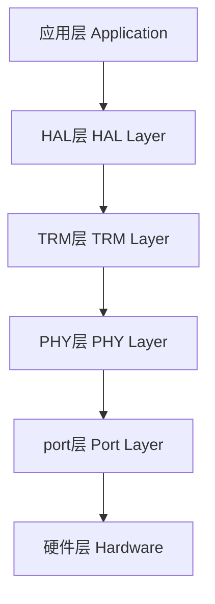

# TK8710 HAL 概要设计文档

## 1. 项目概述

### 1.1 项目简介
TK8710 HAL 是 TK8710 无线通信芯片的硬件抽象层，当前工程已经收敛为 `HAL / TRM / PHY / port` 分层结构。项目主要面向 RK3506 Linux 平台和 Windows JTOOL 开发环境。

### 1.2 设计目标
- **接口统一**：向上层暴露 HAL API，屏蔽底层芯片与平台细节
- **资源管理**：TRM 负责波束、队列、时隙、统计等资源调度
- **底层封装**：PHY 层负责芯片初始化、中断、寄存器与数据收发
- **跨平台支持**：通过 port 层适配 RK3506 与 JTOOL 平台
- **可维护性**：头文件边界清晰，旧兼容壳头已收敛删除

## 2. 系统架构

### 2.1 分层架构



### 2.2 层次职责

| 层级 | 职责 |
|------|------|
| HAL层 | 对上层提供统一抽象接口，维护回调和状态 |
| TRM层 | 管理波束、发送队列、时隙、统计等资源 |
| PHY层 | 封装芯片初始化、配置、寄存器访问、中断处理 |
| port层 | 提供 SPI、GPIO、中断、时间、临界区等平台适配 |

## 3. 核心模块

### 3.1 HAL层

| 模块 | 文件 | 主要功能 |
|------|------|----------|
| 接口实现 | `src/hal/hal_api.c` | 实现 `TK8710Hal*` 接口 |
| 回调管理 | `src/hal/hal_cb.c` | 保存并转发接收/发送完成回调 |
| 状态管理 | `src/hal/hal_status.c` | 维护 HAL 运行状态 |

### 3.2 TRM层

| 模块 | 文件 | 主要功能 |
|------|------|----------|
| 核心控制 | `src/trm/trm_core.c` | TRM 生命周期与核心调度 |
| 波束管理 | `src/trm/trm_beam.c` | 波束信息管理 |
| 数据管理 | `src/trm/trm_data.c` | 发送/接收数据处理 |
| 队列接口 | `src/trm/trm_queue.c` | 队列状态访问 |
| PHY配置编排 | `src/trm/phy_cfg.c` | TRM 到 PHY 的初始化/配置/启动编排 |
| PHY数据编排 | `src/trm/phy_data.c` | TRM 到 PHY 的发送/波束获取编排 |
| PHY统计 | `src/trm/phy_stat.c` | 统计信息汇总 |
| 日志系统 | `src/trm/trm_log.c` | TRM 日志 |

### 3.3 PHY层

| 模块 | 文件 | 主要功能 |
|------|------|----------|
| PHY API | `src/phy/phy_api.c` | 实现 `TK8710Phy*` 接口 |
| 中断处理 | `src/phy/phy_irq.c` | 回调注册和中断封装 |
| 寄存器控制 | `src/phy/phy_regs.c` | 寄存器读写与调试控制 |
| 日志系统 | `src/phy/phy_log.c` | PHY 日志配置 |

### 3.4 底层 Driver 承载

当前 `src/driver/*` 仍保留，用作 PHY 层的底层实现承载：

- `tk8710_config.c`
- `tk8710_core.c`
- `tk8710_irq.c`
- `tk8710_log.c`

## 4. API 设计

### 4.1 HAL API

对外主入口头文件：`inc/hal_api.h`

| 函数 | 功能 |
|------|------|
| `TK8710HalInit()` | 初始化 HAL |
| `TK8710HalCfg()` | 配置 HAL/时隙 |
| `TK8710HalStart()` | 启动 HAL |
| `TK8710HalReset()` | 复位 HAL |
| `TK8710HalSendData()` | 发送数据 |
| `TK8710HalGetBeam()` | 获取波束信息 |
| `TK8710HalGetStatus()` | 获取状态 |
| `TK8710HalDebug()` | 调试接口 |

### 4.2 TRM API

公共头文件：`inc/trm/trm_api.h`

| 函数 | 功能 |
|------|------|
| `TRM_Init()` | 初始化 TRM |
| `TRM_Start()` | 启动 TRM |
| `TRM_SetTxData()` | 发送数据 |
| `TRM_GetBeamInfo()` | 获取波束信息 |
| `TRM_GetStats()` | 获取统计信息 |
| `TRM_GetCurrentFrame()` | 获取当前帧号 |

### 4.3 PHY API

公共头文件：`inc/phy/phy_api.h`

| 函数 | 功能 |
|------|------|
| `TK8710PhyInit()` | 初始化 PHY |
| `TK8710PhyCfg()` | 配置 PHY |
| `TK8710PhyStart()` | 启动 PHY |
| `TK8710PhyReset()` | 复位 PHY |
| `TK8710PhySendData()` | 发送数据 |
| `TK8710PhyRecvData()` | 获取接收数据 |
| `TK8710PhySetBeam()` | 设置发送波束 |
| `TK8710PhyGetBeam()` | 获取接收波束 |
| `TK8710PhyGetRxQuality()` | 获取信号质量 |
| `TK8710PhyDebug()` | 调试控制 |
| `TK8710PhyReadReg()` | 读寄存器 |
| `TK8710PhyWriteReg()` | 写寄存器 |
| `TK8710PhySetCbs()` | 注册回调 |

## 5. 构建系统

### 5.1 RK3506 构建

推荐在 WSL Ubuntu 中编译：

```bash
source /home/huhengzhuo/arm-buildroot-linux-gnueabihf_sdk-buildroot/environment-setup
cd /mnt/f/opencode/02-new-projects/02-embedded-software/tk8710
./cmake/build_rk3506.sh
```

### 5.2 Windows JTOOL 构建

```bash
mingw32-make -f cmake/Makefile.jtool clean
mingw32-make -f cmake/Makefile.jtool all
```

## 6. 当前工程状态

### 6.1 已完成的结构收敛

已删除的旧兼容壳头：

- `inc/trm/trm_config.h`
- `inc/trm/trm.h`
- `inc/driver/tk8710.h`

### 6.2 当前主入口头文件

- `inc/hal_api.h`
- `inc/phy/phy_api.h`
- `inc/phy/phy_irq.h`
- `inc/phy/phy_regs.h`
- `inc/trm/trm_api.h`
- `inc/trm/trm_internal.h`
- `inc/trm/trm_beam.h`
- `inc/trm/trm_data.h`
- `inc/trm/trm_queue.h`
- `inc/trm/phy_cfg.h`
- `inc/trm/phy_data.h`
- `inc/trm/phy_stat.h`

### 6.3 当前验证结果

当前工程已经验证：

1. RK3506 全量编译通过
2. JTOOL 主构建链通过
3. 删除兼容壳头后，RK3506 全量编译仍通过
