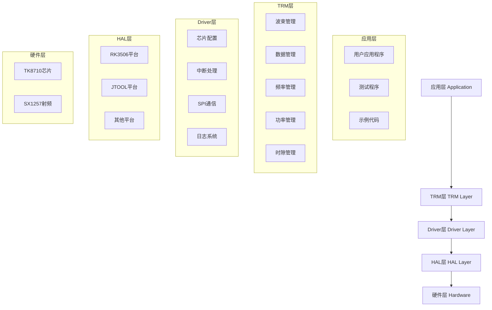
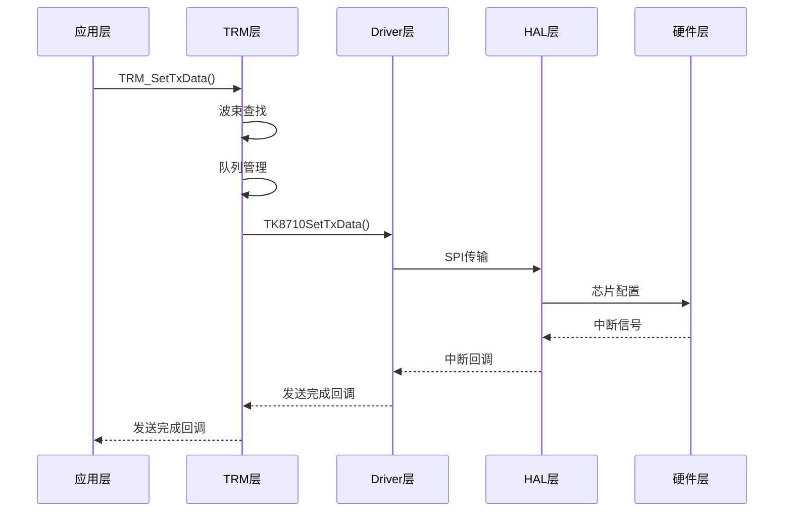
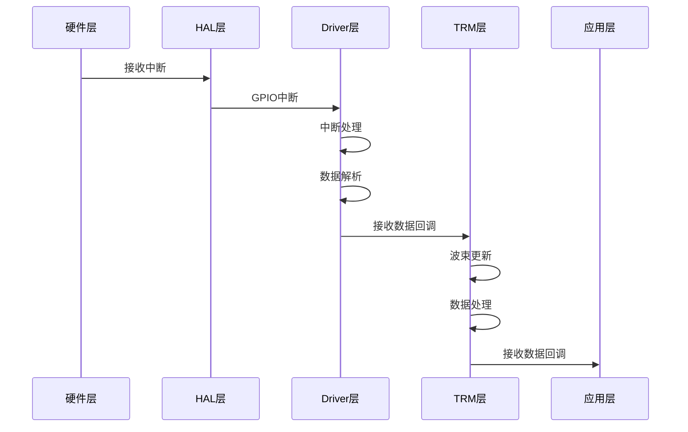

# TK8710 HAL v1.3 概要设计文档

## 1. 项目概述

### 1.1 项目简介
TK8710 HAL v1.3 是TK8710无线通信芯片的硬件抽象层（Hardware Abstraction Layer），提供分层独立的软件架构用于控制TK8710芯片。项目采用分层设计，支持跨平台部署，主要面向RK3506 Linux平台和Windows JTOOL开发环境。

### 1.2 设计目标
- **分层独立**：TRM API和Driver API完全独立，可单独使用
- **跨平台支持**：支持RK3506 Linux和Windows JTOOL平台
- **高性能**：采用黄金比例哈希、延时释放等优化算法
- **易于移植**：提供清晰的HAL接口，便于移植到新平台
- **完整测试**：包含88个测试用例，覆盖核心功能

### 1.3 版本信息
- **当前版本**：v1.3
- **发布日期**：2026-02-25
- **许可证**：内部使用

## 2. 系统架构

### 2.1 分层架构设计



### 2.2 模块独立性

| 层级 | 独立性 | 说明 | 可替换性 |
|------|--------|------|----------|
| TRM层 | ✅ 完全独立 | 业务逻辑层，可单独使用 | 可替换不同的业务实现 |
| Driver层 | ✅ 完全独立 | 硬件控制层，可单独使用 | 可替换不同的Driver实现 |
| HAL层 | ✅ 平台适配 | 硬件抽象层，平台相关 | 可移植到不同平台 |

## 3. 核心模块设计

### 3.1 TRM层（Transmission Resource Management）

#### 3.1.1 功能概述
TRM层是高级业务逻辑层，提供完整的无线通信资源管理功能，包括波束管理、数据收发、队列处理等。

#### 3.1.2 核心组件

| 模块 | 文件 | 主要功能 |
|------|------|----------|
| 波束管理 | `trm_beam.c` | 黄金比例哈希波束查找、延时释放机制 |
| 数据管理 | `trm_data.c` | 发送队列管理、接收数据处理 |
| 频率管理 | `trm_freq.c` | 频率规划和管理 |
| 功率管理 | `trm_power.c` | 功率控制和优化 |
| 时隙管理 | `trm_slot.c` | 时隙分配和同步 |
| 核心控制 | `trm_core.c` | TRM系统初始化和控制 |
| 日志系统 | `trm_log.c` | TRM层日志记录 |

#### 3.1.3 关键算法

**黄金比例哈希波束管理：**
```c
static uint32_t BeamHashFunc(uint32_t userId) {
    return (userId * 2654435761U) % BEAM_TABLE_SIZE;
}
```

**延时释放机制：**
```c
TRM_ScheduleBeamRamRelease(userId, 16);  // 16帧后释放
```

### 3.2 Driver层（硬件驱动层）

#### 3.2.1 功能概述
Driver层是底层硬件控制层，提供TK8710芯片的直接控制功能，包括SPI通信、中断处理、芯片配置等。

#### 3.2.2 核心组件

| 模块 | 文件 | 主要功能 |
|------|------|----------|
| 芯片配置 | `tk8710_config.c` | 芯片参数配置、寄存器操作 |
| 核心功能 | `tk8710_core.c` | Driver核心功能、状态管理 |
| 中断处理 | `tk8710_irq.c` | GPIO中断处理、中断时间统计 |
| 日志系统 | `tk8710_log.c` | Driver层日志记录 |

#### 3.2.3 关键特性

**中断时间统计：**
- 提供详细的中断处理时间统计
- 支持最大、最小、平均时间分析
- 用于性能监控和优化

**调试接口：**
- FFT输出数据获取
- 捕获数据读取
- 强制处理模式（测试用）

### 3.3 HAL层（硬件抽象层）

#### 3.3.1 功能概述
HAL层提供平台无关的硬件抽象接口，实现跨平台支持。

#### 3.3.2 平台支持

| 平台 | 实现文件 | 说明 |
|------|----------|------|
| RK3506 | `port/rk3506/tk8710_rk3506.c` | RK3506 Linux平台实现 |
| JTOOL | `port/jtool/tk8710_jtool.c` | Windows JTOOL平台实现 |

#### 3.3.3 HAL接口

**SPI接口：**
```c
int TK8710_Port_SpiInit(void);
int TK8710_Port_SpiTransfer(const uint8_t* tx, uint8_t* rx, uint16_t len);
```

**GPIO中断接口：**
```c
int TK8710_Port_GpioIrqInit(TK8710_GpioIrqCallback callback, void* userData);
```

**系统接口：**
```c
void TK8710_Port_DelayMs(uint32_t ms);
uint64_t TK8710_Port_GetTimeUs(void);
void TK8710_Port_EnterCritical(void);
void TK8710_Port_ExitCritical(void);
```

## 4. API设计

### 4.1 HAL API（统一接口）

HAL API提供统一的硬件抽象接口，简化应用层调用。

| 函数 | 功能 | 参数说明 |
|------|------|----------|
| `hal_init()` | HAL初始化 | 配置参数指针 |
| `hal_config()` | HAL配置 | 时隙配置参数 |
| `hal_start()` | HAL启动 | 无参数 |
| `hal_reset()` | HAL复位 | 无参数 |
| `hal_sendData()` | 发送数据 | 下行类型、用户ID、数据等 |
| `hal_getStatus()` | 获取状态 | 状态信息输出 |

### 4.2 TRM API（高级业务接口）

TRM API提供完整的业务逻辑功能，适合需要完整功能的应用。

| 函数 | 功能 | 特性 |
|------|------|------|
| `TRM_Init()` | 初始化TRM系统 | 配置波束、时隙、回调等 |
| `TRM_Start()` | 启动TRM系统 | 启动中断处理、数据收发 |
| `TRM_SetTxData()` | 发送数据 | 统一发送接口，支持用户和广播 |
| `TRM_GetBeamInfo()` | 获取波束信息 | 线程安全读取 |
| `TRM_GetStats()` | 获取统计信息 | 性能监控 |

### 4.3 Driver API（底层硬件接口）

Driver API提供直接的硬件控制功能，适合需要精细控制的应用。

| 函数 | 功能 | 特性 |
|------|------|------|
| `TK8710Init()` | 初始化Driver | SPI、中断、基础配置 |
| `TK8710RfConfig()` | 射频配置 | 频率、增益、直流校准 |
| `TK8710SetTxData()` | 设置下行数据 | 统一下行数据发送接口 |
| `TK8710GetRxUserData()` | 获取接收数据 | 用户数据读取 |
| `TK8710RegisterCallbacks()` | 注册回调 | 多回调架构 |

## 5. 数据流设计

### 5.1 发送数据流



### 5.2 接收数据流



## 6. 构建系统

### 6.1 支持的构建方式

| 构建方式 | 配置文件 | 适用平台 |
|----------|----------|----------|
| CMake | `CMakeLists.txt` | 跨平台 |
| Makefile | `Makefile.rk3506` | RK3506 Linux |
| 脚本 | `build_rk3506.sh` | RK3506 Linux |

### 6.2 编译配置

**RK3506交叉编译：**
```bash
source ~/arm-buildroot-linux-gnueabihf_sdk-buildroot/environment-setup
./cmake/build_rk3506.sh
```

**Windows JTOOL编译：**
```bash
compile_test.bat
```

### 6.3 依赖库

| 平台 | 依赖库 | 用途 |
|------|--------|------|
| RK3506 | pthread, gpiod | 多线程、GPIO控制 |
| Windows | jtool.dll | JTOOL接口 |

## 7. 测试体系

### 7.1 测试结构

```
test/
├── DriverTest/          # Driver层测试
│   ├── TestDriverSlave.c
│   ├── test_file_read.c
│   └── test_gwrxah_packing.c
├── example/             # 示例程序
│   ├── test8710main_3506.c
│   ├── test8710main_jtool.c
│   └── trm_tx_validator.c
├── unit/                # 单元测试（预留）
└── integration/         # 集成测试（预留）
```

### 7.2 测试覆盖

- **Driver单元测试**：25个测试用例
- **TRM集成测试**：22个测试用例
- **边界/压力测试**：41个测试用例
- **总计**：88个测试用例，全部通过

### 7.3 测试结果

```
测试结果：88/88 通过
- Driver单元测试: 25/25 通过
- TRM集成测试: 22/22 通过  
- 边界/压力测试: 41/41 通过
```

## 8. 性能特性

### 8.1 核心算法性能

| 特性 | 性能指标 | 说明 |
|------|----------|------|
| 波束查找 | O(1)平均时间复杂度 | 黄金比例哈希优化 |
| 内存管理 | 自动延时释放 | 防止内存泄漏 |
| 并发安全 | 读写分离锁 | 支持高并发 |
| 队列管理 | 循环队列 | 高效内存使用 |

### 8.2 实时监控

- **队列状态监控**：实时显示队列使用情况
- **处理统计**：每帧处理统计信息
- **中断时间统计**：详细的中断性能分析
- **系统状态**：TRM运行状态监控

### 8.3 优化机制

**黄金比例哈希：**
- 减少波束查找冲突
- 提高查找效率
- 支持大规模用户

**延时释放机制：**
- 自动管理波束RAM资源
- 防止内存泄漏
- 优化资源利用率

## 9. 平台移植

### 9.1 移植要求

移植到新平台需要实现以下HAL接口：

| 接口类型 | 必需接口 | 说明 |
|----------|----------|------|
| SPI接口 | `SpiInit`, `SpiTransfer` | SPI通信初始化和数据传输 |
| GPIO中断 | `GpioIrqInit` | GPIO中断初始化和回调 |
| 系统接口 | `DelayMs`, `GetTimeUs` | 延时和时间获取 |
| 临界区 | `EnterCritical`, `ExitCritical` | 临界区保护 |
| 内存接口 | `Malloc`, `Free` | 内存分配和释放 |

### 9.2 移植步骤

1. **实现HAL接口**：参考`port/rk3506/tk8710_rk3506.c`
2. **配置构建系统**：添加平台特定的编译选项
3. **适配中断处理**：实现平台相关的中断处理逻辑
4. **测试验证**：运行完整的测试套件
5. **性能调优**：根据平台特性进行优化

### 9.3 移植示例

**RK3506平台实现：**
```c
// SPI初始化
int TK8710_Port_SpiInit(void) {
    // 实现SPI初始化逻辑
    return 0;
}

// SPI数据传输
int TK8710_Port_SpiTransfer(const uint8_t* tx, uint8_t* rx, uint16_t len) {
    // 实现SPI数据传输逻辑
    return 0;
}
```

## 10. 使用指南

### 10.1 API选择指南

**选择TRM API当：**
- 需要完整的业务逻辑
- 需要自动波束管理
- 需要队列和缓存管理
- 快速开发应用

**选择Driver API当：**
- 需要精细硬件控制
- 实现自定义业务逻辑
- 性能要求极高
- 学习硬件协议

### 10.2 典型使用场景

**网关应用：**
```c
// 使用TRM API快速构建网关应用
TRM_Init(&trmConfig);
TRM_Start();
TRM_SetTxData(downlinkType, userId, data, len, power, frameNo, rateMode, beamType);
```

**硬件测试：**
```c
// 使用Driver API进行硬件测试
TK8710Init(&chipConfig);
TK8710RfConfig(&rfConfig);
TK8710SetTxData(downlinkType, index, data, dataLen, txPower, beamType);
```

### 10.3 配置建议

**生产环境配置：**
- 日志级别：WARNING或ERROR
- 波束模式：完整存储模式
- 最大用户数：根据实际需求
- 超时时间：3000ms

**开发调试配置：**
- 日志级别：DEBUG
- 启用所有模块日志
- 启用性能统计
- 启用调试接口

## 11. 版本历史

### 11.1 v1.3 (2026-02-25)

**新增功能：**
- ✨ TRM API和Driver API分层独立
- ✨ 黄金比例哈希波束管理
- ✨ 延时释放机制
- ✨ 队列实时监控

**修复问题：**
- 🐛 修复波束查找冲突问题
- 🐛 修复并发访问死锁问题

**性能优化：**
- 🔧 发送队列大小可配置
- 🔧 日志系统模块化

### 11.2 v1.0 (2026-02-09)

**初始版本：**
- 🎉 Driver层：SPI协议、中断处理、芯片配置
- 📦 TRM层：波束管理、数据收发
- 📦 平台支持：RK3506 Linux、Windows JTOOL
- 📦 日志系统、调试功能
- 📦 88个测试用例

## 12. 总结

TK8710 HAL v1.3是一个设计优良、功能完整的硬件抽象层项目。其分层独立的架构设计、高性能的算法实现、完善的测试体系和跨平台支持，使其成为一个可靠、高效的TK8710芯片控制解决方案。

### 12.1 项目优势

1. **架构清晰**：分层设计，模块独立，易于维护和扩展
2. **性能优异**：黄金比例哈希、延时释放等优化算法
3. **跨平台**：支持RK3506 Linux和Windows JTOOL
4. **测试完善**：88个测试用例，全面覆盖核心功能
5. **文档齐全**：详细的API文档和使用指南

### 12.2 适用场景

- 卫星物联网网关开发
- 无线通信系统测试
- TK8710芯片应用开发
- 无线通信算法研究

### 12.3 发展方向

- 支持更多硬件平台
- 增加更多业务功能
- 优化性能和稳定性
- 完善开发工具链

---

*文档版本：v1.0*  
*编写日期：2026-03-13*  
*作者：系统分析*
