

# **TurMass™ MAC 协议规范**

版本：v3.10

 

# 文档目的

本文档主要完成以下目标：

1. **MAC层功能定义**：明确定义TurMass™ Link系统中MAC层的完整功能体系，包括RLC无线链路控制、LLC逻辑链路控制、网络接入管理等功能模块的职责和接口。
2. **协议栈设计**：设计完整的MAC层协议栈架构，定义各层之间的交互关系、数据流转机制和协议处理流程，确保协议栈的层次清晰、职责明确。
3. **协议帧设计**：定义完整的MAC协议帧结构，包括帧头、帧体、帧尾等字段设计，支持LAN/WAN不同网络模式，满足各种业务场景的通信需求。

通过本文档，为TurMass™ MAC3.0协议的实现、测试和应用开发提供完整的技术规范和设计指导。

# 修订记录

| 修订时间   | 修订版本 | 修订描述                                                     | 修订人 |
| ---------- | -------- | ------------------------------------------------------------ | ------ |
| 2026/03/05 | V3.10    | - 调整部分内容描述 - 原第二章节拆分为两个章节 - 增加第七章节工作流程 | 黄家豪 |
| 2026/03/03 | V3.09    | - 删除MAC API和HAL API章节 - 第3章节增加与协议帧对应关系及策略说明 - 第5章节增加MAC协议帧格式图 | 黄家豪 |
| 2026/02/12 | V3.08    | - 更新文档目的 - 修复章节序号错误 - 更新RLC和LLC章节内容 | 黄家豪 |
| 2026/02/09 | V3.07    | - 删除TRM相关内容，TRM属于物理层 - 调整协议栈分层       | 黄家豪 |
| 2026/01/30 | V3.06    | - 修改T层命名为TRM：Transmission Resource Management，传输资源管理 - 调整协议栈分层 | 黄家豪 |
| 2026/01/26 | V3.05    | - 新增多速率相关字段定义 - 附录中增加LAN和WAN字段差异整理 | 黄家豪 |
| 2026/01/19 | V3.04    | - 明确T层与MAC层关系 - 新增T层功能定义 - 帧结构中，WAN网络模式下，新增Payload长度字段 | 黄家豪 |
| 2026/01/05 | V3.03    | - MAC子层无线资源管理完善；补充多天线时隙分组与管理、多天线频域分组与管理 | 黄家豪 |
| 2025/12/31 | V3.02    | - MAC协议架构更新，区分MAC（介质控制访问层）和LLC（逻辑链路控制层） - 调整目录章节，区分MAC子层功能定义和LLC子层功能定义 - 补充MAC子层无线资源管理中多天线波束管理和时隙调度与管理 | 黄家豪 |
| 2025/12/30 | V3.01    | - 调整目录章节，MAC协议栈功能单独列为一章 - 完善MAC架构中MAC数据流向图 - 补充MAC协议栈功能不足（见附录） | 黄家豪 |
| 2025/12/5  | V3.00    | - 文档命名修改：TurMass™ MAC协议规范 -V3.0 - 去除mesh协议相关内容，mesh协议单独实现； - 调整了系统部分章节与内容描述； - 在LAN的字段基础上，新增WAN的协议字段； - 新增功率控制描述； - 更新信道选择与跳频机制描述； - 更新速率控制机制描述； - 新增广播/组播机制描述； - 新增Qos服务机制描述； - 新增频率规划及信道划分； | 黄家豪 |
| 2025/4/29  | V0.9     | - 增加第5章网关与NS间交互协议（TGMP） - 修改部分MAC帧定义 | 李子豪 |
| 2025/4/3   | V0.8     | - FOpts扩展域增加携带4字节休眠唤醒参数配置 - 入网时删除网关通道号申请  - MHDR固定增加1字节跳数信息  - 入网携带0/8字节休眠唤醒配置 | 李子豪 |
| 2025/4/3   | V0.7     | - 跳频策略删除伪随机序列跳频，添加随机信道跳频（基于BCNBits和基于广播两种策略） - 添加广播消息FPayload描述 | 李子豪 |
| 2025/4/1   | V0.6     | - 添加信道划分策略（附录） - 速率控制删除自动速率控制，添加任意速率控制  - 跳频增加伪随机序列跳频、自适应跳频两种模式 | 李子豪 |
| 2025/3/31  | V0.5     | - 添加信道访问方式描述 - 添加Fopts中关于多级中继转发的字段描述  - 完善部分主要功能说明描述细节 | 李子豪 |
| 2025/3/21  | V0.4     | - 添加终端、中继、网关（多通道、多天线）MAC实现描述 - 添加网络拓扑示意图  - 添加实现思路和开发计划 | 李子豪 |
| 2025/3/19  | V0.3     | 修改部分帧类型定义 添加MAC API和HAL接口描述 增加分工安排 | 李子豪 |
| 2025/3/13  | V0.2     | 完善各章节内容                                               | 李子豪 |
| 2025/1/6   | V0.1     | 第一个版本                                                   | 何辉   |

注：修订按倒叙记录（最近的在最前面）。

# 目录

[TOC]

# 1 TurMass™ Link 系统简述

TurMass™ Link是一种高效、灵活的无线通信系统，专为满足多种物联网场景的需求而设计，支持多种组网形态和拓扑结构，提供可靠的通信能力和高效的资源管理。

## 1.1 组网架构

TurMass™ Link的组网架构如下图所示：

**LAN网络：**

特点：局域覆盖与高频次交互

- 可控的局部空间内，追求通信的实时性和可靠性
- 高效的时隙调度（TDMA），减少碰撞和重传

**WAN网络：**

特点：广域覆盖与高容量

- 用低成本，覆盖广域空间
- 增加空间维度，提高系统容量
- 利用多天线技术，提高链路预算，降低干扰

## 1.2适用场景

- 无线抄表
- 农业
- 无线语音
- 高并发应用

## 1.3 与现有产品的关系

基于TurMass技术的芯片、模组和网关，面向多模态的组网应用和场景，定义一套完整的协议规范，TurMass MAC协议，构建统一的TurMass Link通信系统，适用于各种LPWAN应用场景。

## 1.4 术语和缩略语

| 全称                                                   | 缩略语      | 含义                                     |
| ------------------------------------------------------ | ----------- | ---------------------------------------- |
| Access Layer                                           | ACL         | 接入层                                   |
| Acknowledgment                                         | ACK         | 确认帧                                   |
| Adaptive Data Rate                                     | ADR         | 自适应数据速率                           |
| Advanced Encryption Standard 128                       | AES128      | 128位高级加密标准                        |
| Application Layer                                      | AL          | 应用层                                   |
| Application Server                                     | AS          | 应用服务器                               |
| Application Session Key                                | AppSKey     | 应用会话密钥                             |
| Automatic Repeat Request                               | ARQ         | 自动重传请求                             |
| Beacon                                                 | BCN         | 信标帧，用于终端与网关之间的时间频率同步 |
| Carrier Sense Multiple Access with Collision Avoidance | CSMA/CA     | 载波侦听多路访问/冲突避免                |
| Cipher-based Message Authentication Code               | CMAC        | 基于密码的消息认证码                     |
| Clear To Send                                          | CTS         | 清除发送                                 |
| Device Address                                         | DevAddr     | 设备网络地址                             |
| Device EUI                                             | DevEUI      | 设备唯一标识符                           |
| Device Random Nonce                                    | DevNonce    | 设备随机数                               |
| Device Type                                            | DevType     | 设备类型                                 |
| Frame Control                                          | FCtrl       | 帧控制字段                               |
| Frame Counter                                          | FCnt        | 帧序号/帧计数器                          |
| Frame Header                                           | FHDR        | 帧头                                     |
| Frame Payload                                          | FPayload    | 帧负载                                   |
| Frame Port                                             | FPort       | 帧端口                                   |
| Frequency Hopping                                      | FH          | 跳频                                     |
| General Purpose Input/Output                           | GPIO        | 通用输入输出端口                         |
| Hardware Abstraction Layer                             | HAL         | 硬件抽象层，屏蔽不同底层芯片的差异       |
| Industrial, Scientific and Medical                     | ISM         | 工业、科学和医疗频段                     |
| Internet of Things                                     | IoT         | 物联网                                   |
| Join Random Nonce                                      | JoinNonce   | 入网随机数                               |
| Listen Before Talk                                     | LBT         | 先听后说                                 |
| Local Area Network                                     | LAN         | 局域网                                   |
| Logical Link Control Layer                             | LLC         | 逻辑链路控制层，负责端到端逻辑链路管理   |
| MAC Header                                             | MHDR        | MAC帧头                                  |
| MAC Payload                                            | MACPayload  | MAC负载                                  |
| Media Access Control                                   | MAC         | 媒体访问控制                             |
| Message Integrity Code                                 | MIC         | 消息完整性校验码                         |
| Message Queuing Telemetry Transport                    | MQTT        | 消息队列遥测传输协议                     |
| Negative Acknowledgment                                | NACK        | 否定确认帧                               |
| Network Address                                        | NwkAddr     | 设备网络地址                             |
| Network Identifier                                     | NwkID       | 网络标识符                               |
| Network Server                                         | NS          | 网络服务器                               |
| Network Session Key                                    | NwkSKey     | 网络会话密钥                             |
| Over The Air                                           | OTA         | 空中下载                                 |
| Packet Error Rate                                      | PER         | 丢包率                                   |
| Physical Layer                                         | PHY         | 物理层，负责底层物理信号的传输与接收     |
| Quality of Service                                     | QoS         | 服务质量                                 |
| Radio Frequency                                        | RF          | 射频                                     |
| Radio Link Control                                     | RLC         | 无线链路控制层，负责接入控制和调度策略   |
| Received Signal Strength Indicator                     | RSSI        | 接收信号强度指示                         |
| Request To Send                                        | RTS         | 请求发送                                 |
| Root Key                                               | RootKey     | 根密钥                                   |
| Signal to Noise Ratio                                  | SNR         | 信噪比                                   |
| Software Development Kit                               | SDK         | 软件开发工具包                           |
| State Radio Regulatory Commission                      | SRRC        | 国家无线电管理委员会                     |
| Time Division Duplex                                   | TDD         | 时分双工                                 |
| Time Division Multiple Access                          | TDMA        | 时分多址                                 |
| Tiny Encryption Algorithm                              | TEA         | 微型加密算法                             |
| Transmission Resource Management                       | TRM         | 传输资源管理                             |
| TurMass™ Gateway Management Protocol                  | TGMP        | TurMass™网关管理协议                    |
| TurMass™ Link                                         | TML         | TurMass™无线通信系统                    |
| User Datagram Protocol                                 | UDP         | 用户数据报协议                           |
| Wide Area Network                                      | WAN         | 广域网                                   |

# 2 设计需求与原则

## 2.1 背景

随着物联网（IoT）技术的快速发展，应用场景从传统的低功耗传感器网络扩展到高并发、低延迟的工业物联网和智慧城市等复杂场景。当前主流的无线通信协议（如LoRa、Zigbee等）在特定场景下表现优异，但在应对多样化组网需求和复杂部署环境时仍存在局限性。因此开发一套具备灵活组网能力、高效资源管理和强大适应性的MAC协议栈，成为满足未来物联网需求的关键。

## 2.2 设计目标

TML MAC 旨在构建一个兼容所有 TurMass™ 系统组网形态的高效通信架构，兼容低功耗、高可靠性和可扩展性等特性。通过时隙调度、动态路由、抗干扰机制和数据加密等操作，确保网络在复杂环境中的稳定性和安全性，同时支持大规模节点部署和灵活扩展。

## 2.3 系统定位

MAC层在TML系统中处于关键位置，承担着连接物理层与上层（如应用层）的桥梁作用。具体而言，MAC层在TML系统中的定位包括以下几个方面：

**资源管理与分配**：负责对无线信道资源进行高效管理和动态分配，确保大量终端设备能够公平、高效地共享有限的无线资源。

**接入控制与调度**：实现终端设备的接入控制机制，协调终端设备的接入请求，避免或减少接入碰撞，提升网络整体接入效率。

**数据传输控制**：负责数据包的封装、拆封、传输控制和差错控制，确保数据传输的可靠性和有效性。

**功耗管理**：通过优化终端设备的休眠和唤醒机制，降低终端设备的功耗，延长终端设备的电池寿命。

**Qos保障**：提供服务质量（Qos）保障机制，满足不同业务场景对延迟、可靠性、吞吐量等方面的差异化需求。

**安全性支持**：提供必要的安全机制，保障数据传输的安全性和完整性，防止非法接入和数据篡改。

综上所述，MAC层在TurMass™ Link系统中起着承上启下的关键作用，直接影响系统的整体性能和用户体验，是实现TurMass™ Link系统高效、可靠、低功耗运行的重要保障。

## 2.4 设计原则

**高效资源利用：**优化调度和资源分配算法，最大化频谱和能量资源利用率；

**模块化：**协议栈各功能组件可独立开发和测试，提高可维护性；

**低功耗优化：**基于休眠唤醒策略，最大限度地延长终端设备电池寿命。

**灵活性和可扩展性：**协议设计应具备良好的适应性，以支持不同的网络拓扑、应用场景和未来技术演进。

# 3 MAC协议架构

本小节将展开介绍 TurMass™ Link 系统协议栈分层、数据流向图和接口定义。

## 3.1 协议栈分层

图3-1展示了 TurMass™ Link 系统协议的分层示意图。

​													**图3-1 TurMass™ Link 系统协议的分层示意图**

各层划分原则与核心功能：

| 层次          | 划分原则           | 核心功能                                                                              | 作用范围             |
| :------------ | :----------------- | :------------------------------------------------------------------------------------ | :------------------- |
| **LLC** | 端到端逻辑链路管理 | 帧封装/解封装、分包/组包、确认重传、加密/校验、入网/离网、Qos服务                     | **终端 ↔ NS** |
| **RLC** | 端到端资源调度策略 | 信道接入控制、时隙调度分配、跳频/信道选择、速率控制、波束分配、专注接入控制和调度策略 | **终端 ↔ NS** |

## 3.2 协议数据流向图

图3-2为TurMass™ MAC数据流向图（NS云部署）

​														**图3-2 TurMass™ MAC数据流向图（NS云部署）**

图3-3为TurMass™ MAC数据流向图（NS嵌入式部署）

​										**图3-3 TurMass™ MAC数据流向图（NS嵌入式部署）**

说明：

**-PHY(Physical Layer)**:负责无线/物理信号的调制与传输，实现设备之间的基础物理连接;

**-MAC(MediaAccess -Control Layer)**:TurMass™ 组网核心层，负责系统组网中相关设备的通信和控制逻辑;

**-ACL(Access Layer)**:网关和 NS 间的接入层，通过标准协议(UDP/MQTT)承载 TGMP 消息（NS外部部署时存在）

**-AL(Application Layer)**:业务数据的应用解释层，将 MAC 提供的业务数据转换为具体应用逻辑。

## 3.3 MAC接口定义

### 3.3.1 接口设计原则

MAC协议的各模块接口应遵循表3-1所提供的设计原则。

**表3-1：MAC接口分类表**

| **接口分类** | **描述**                                                                       |
| ------------------ | ------------------------------------------------------------------------------------ |
| 初始化接口         | 负责MAC协议栈的初始化操作，包括参数初始化、事件回调注册、定时器初始化等 |
| 配置接口           | 负责参数配置的设置和获取                                                             |
| 数据接口           | 负责数据的发送和接收，以及数据收发事件保存                                           |
| 状态和事件处理接口 | 负责系统运行中的事件处理和状态上报                                                   |
| 控制接口           | 负责各分层中必要的控制操作，如休眠唤醒、扫频等                                       |
| 调试接口           | 预留调试过程涉及的操作                                                               |

### 3.3.2 与上层（应用层）的接口

MAC层对上层提供的主要接口和功能列表如表3-2所示：

**表3-2：MAC 对上接口设计分类表**

| **分类** | **描述**                                                                                                         | **补充说明**                   |
| -------------- | ---------------------------------------------------------------------------------------------------------------------- | ------------------------------------ |
| 初始化接口     | 初始化协议栈参数，启动MAC协议栈                                                                                        |                                      |
| 数据接口       | MAC帧传输，包括分包、重传、加密等                                                                                      |                                      |
| 配置接口       | 配置MAC层参数                                                                                      | 如ADR开关、工作模式、最大重传次数等  |
| 控制接口       | 设备管理：处理设备的激活，去激活  网络管理：管理网络参数，如频率、数据速率、功率等  安全控制：管理加密密钥，认证等安全 |                                      |
| 查询接口     | 提供设备连接状态，信号强度等信息；提供网络连接状态，信号质量等                                                         |                                      |
| 事件通知接口   | 通知上层特定事件                                                                                                       | 如设备加入网络，数据发送成功或失败等 |
| 调试与诊断接口 | 提供MAC层操作的日志信息，提供网络和设备的诊断信息                                                                      |                                      |

### 3.3.3 与下层（物理层/HAL）的接口

物理层主要由HAL接口和PHY API组成，其中HAL用于屏蔽不同底层芯片的差异，向MAC层提供统一的接口。HAL层对MAC层提供的主要接口和功能列表如表2-3所示：

**表3-3：MAC 对下调用接口设计分类表**

| **分类** | **描述**             | **补充说明**                         |
| -------------- | -------------------------- | ------------------------------------------ |
| 初始化接口     | 初始化物理层参数，开启射频 |                                            |
| 数据接口       | 物理层数据传输             | 传入数据应为封装后的MAC帧                  |
| 配置接口       | 设置/查询物理层参数        | 包含时隙结构、工作模式等                   |
| 控制接口       | 物理层控制命令下发         | 使/禁能射频、信道扫描等                    |
| 状态接口       | 主动上报物理层状态参数     | 休眠条件下，被无线唤醒后，可以主动上报状态 |
| 调试与诊断接口 | 提供物理层日志信息         | 提供时隙配置、数据收发等日志               |

# 4 RLC功能定义

## 4.1 功能概述

RLC的核心职责是进行无线通信资源的调度策略，实现高效的介质访问控制。主要功能包括：

| **序号** | **功能名称** | **功能描述**                                      |
| -------------- | ------------------ | ------------------------------------------------------- |
| 1              | 信道接入           | 支持基于LBT的CSMA/CA冲突避免机制，支持同步/异步接入策略 |
| 2              | 资源调度           | 时域、频域、空域资源的统一调度策略                      |
| 3              | 链路适配           | 功率控制、速率控制等链路参数自适应策略                  |
| 4              | 低功耗设计         | 支持低功耗模式，支持定时唤醒、I/O唤醒和无线唤醒         |

## 4.2 信道接入策略

信道接入策略定义了设备如何获得无线信道使用权的方法和规则，是RLC层的核心功能之一。其目标是在保证公平接入的前提下，最大化信道利用率，支持不同业务场景的接入需求，同时避免冲突和干扰。

### 4.2.1 时域接入策略

| **接入方式**         | **技术原理**                                          | **适用场景**           | **LAN/WAN支持**                           |
| -------------------------- | ----------------------------------------------------------- | ---------------------------- | ----------------------------------------------- |
| **异步随机接入**     | 基于CSMA/CA的冲突避免机制，设备先侦听后发送，忙碌则随机退避 | 低流量场景，确保设备快速接入 | LAN：单天线CSMA/CA  WAN：多天线CSMA/CA   |
| **同步时隙调度接入** | 为高并发业务提供稳定时间窗口，节点申请时隙，网关分配管理    | 高并发或时延敏感业务         | LAN：单天线时隙调度  WAN：多天线时隙调度 |

**多天线异步随机接入：本文档未定义具体策略**

### 4.2.2 频域接入策略

**信道选择策略**

| **接入方式**     | **技术原理**                               | **适用场景** | **特点**               |
| ---------------------- | ------------------------------------------------ | ------------------ | ---------------------------- |
| **固定信道接入** | 网关和终端在固定信道通信                         | 小规模网络         | 配置简单，易于部署           |
| **跳频接入**     | 基于共享种子和算法同步跳频，不同终端使用不同序列 | 复杂电磁环境       | 减少碰撞和干扰，提升系统容量 |

LAN\WAN参考信道规划使用固定信道列表接入

跳频接入：本文档未定义具体策略

**带宽利用策略**

| **系统模式** | **带宽利用方式** | **技术原理**                              | **支持用户数**                   |
| ------------------ | ---------------------- | ----------------------------------------------- | -------------------------------------- |
| **LAN模式**  | 单用户独占信道         | 通过时分复用方式支持多用户接入                  | 每次接入处理单个信道上的一个用户       |
| **WAN模式**  | 多用户共享信道带宽     | 通过频分\空分复用技术在单个信道内同时处理多用户 | 在单个信道的一定带宽内同时处理多个用户 |

### 4.2.3 空域接入策略（WAN特有）

**空分复用接入** ：在同一时频资源上通过空间分离支持多个设备同时接入 ，适用于频谱资源紧张场景  大幅提升系统容量

本文档暂不定义空域接入策略

## 4.3 资源调度策略

资源调度策略定义了无线资源在时域、频域、空域维度上的分配和管理方法，是提升系统容量的关键技术。其目标是实现资源的最优配置，满足不同业务的Qos需求，最大化网络吞吐量和用户容量。

### 4.3.1 时域调度策略

**时间架构设计如下图**：

**LAN时隙分配机制：**

待相关设计实现人员帮忙补充；

**WAN时域分配策略：**

单速率支持超帧，入网只在第一个时帧，其他业务随机分配接入时帧（不含第一个帧）

多速率只支持单帧

| **分配场景**   | **时帧总数** | **分配方式** | **终端MAC协议栈行为**                                       | **NS上MAC协议栈行为**                                             | **协议字段**                                                                                                                                        |
| -------------------- | ------------------ | ------------------ | ----------------------------------------------------------------- | ----------------------------------------------------------------------- | --------------------------------------------------------------------------------------------------------------------------------------------------------- |
| **多时帧模式** | TddFrameNum > 1   | 静态预分配（针对高并发应用） | 入网前：固定使用1号时帧进行入网  入网后：按分配的固定时帧通信 | 提前分配每个终端的上行/下行时帧序号  通过Join Accept响应告知终端 | TddFrameNum：时帧总数  UpTddFrameIdx：分配上行的时帧序号 DownTddFrameIdx：分配下行的时帧序号（0xFF，则表示下行未分配，上行发送后进入接收） |
| **单时帧模式** | TddFrameNum = 1   | 竞争接入           | 所有终端可直接发送上行/接收下行                                   | 在同一时帧内处理多终端接入                                              | TddFrameNum = 1 UpTddFrameIdx = 0 DownTddFrameIdx=0xFF                                                                                       |

**时域调度协议栈设计对应关系**：

| **时域概念** | **协议字段**               | **所在章节** | **功能说明** |
| ------------------ | -------------------------------- | ------------------ | ------------------ |
| 时帧总数           | TddFrameNum                     | [5.2.2](#522-join-accept)、[5.2.7](#527-broadcastwan) | 定义时帧总个数     |
| 时帧序号           | UpTddFrameIdx、DownTddFrameIdx | [5.2.2](#522-join-accept)、[5.2.7](#527-broadcastwan)       | 标识当前时帧位置   |

### 4.3.2 频域调度策略（WAN特有）

利用多天线网关可以在单个信道的一定带宽内同时处理多个用户的能力，可支持对频域资源进行调度

**频域资源分配方式**：

| **分配方式** | **技术原理**                       | **适用场景** | **优势** |
| ------------------ | ---------------------------------------- | ------------------ | -------------- |
| **子带分配** | 将连续频谱划分为子带分配给不同用户或业务 | 精细化频谱资源管理 | 实现资源隔离   |
| **频点分配** | 为不同用户分配不同的频点                 | 优化整体频谱利用   | 提升频谱效率   |

**频域资源分配策略**：

| **分配场景**     | **频域配置** | **分配方式** | **终端MAC协议栈行为**                                                       | NS上MAC协议栈行为            | **协议字段**                                                                  |
| ---------------------- | ------------------ | ------------------ | --------------------------------------------------------------------------------- | ---------------------------- | ----------------------------------------------------------------------------------- |
| **子带分配模式** | 多子带配置         | 静态子带分配       | 未入网前：在系统工作带宽内随机选择频率接入  入网后：根据分配的接入信息接入 | 提前分配好每个终端接入的子带 | FreqGroupNum：子带总数，最大支持4个子带，如果终端检测到子带总数变化，重新入网 FreqGroupIdx：接入子带序号 |
| **子带分配模式** | 多子带配置         | 动态子带分配       | 待定                                                                              | 待定                         | FreqGroupNum：子带总数 FreqGroupIdx：接入子带序号                              |
| **频点分配模式** | 多频点配置         | 静态频点分配       | 未入网前：在系统工作带宽内随机选择频率接入  入网后：根据分配的接入信息接入 | 提前分配好每个终端接入的频点 | PointFreqNum：可分配频点总数，最大支持128个分配频点 PointFreqIdx：接入频点序号 |
| **频点分配模式** | 多频点配置         | 动态频点分配       | 待定                                                                              | 待定                         | PointFreqNum：可分配频点总数 PointFreqIdx：接入频点序号                        |

**频域调度协议栈设计对应关系**：

| **频域概念** | **协议字段**         | **所在章节** | **功能说明**                                                             |
| ------------------ | -------------------------- | ------------------ | ------------------------------------------------------------------------------ |
| 频域分组           | FreqGroupNum、FreqGroupIdx | [5.2.2](#522-join-accept)、[5.2.7](#527-broadcastwan)       | FreqGroupNum定义频域子带总数，FreqGroupIdx标识接入频域子带序号，支持子带分配模式   |
| 指定频点           | PointFreqNum、PointFreqIdx | [5.2.2](#522-join-accept)、[5.2.7](#527-broadcastwan)       | PointFreqNum定义可分配频点总数，PointFreqIdx标识接入频点序号，支持频点分配模式 |

### 4.3.3 空域调度策略（WAN特有）

利用多天线网关的多天线能力和波束成形技术，通过空间分离实现多用户并行通信，提升系统容量。

**网关广播调度**：

| **调度方式**       | **技术原理**                                        | **适用场景**   | **优势**       | 终端MAC协议栈行为 |
| ------------------------ | --------------------------------------------------------- | -------------------- | -------------------- | -------------------- |
| **天线轮发广播**   | 网关发送BCN和广播时按照天线配置轮流发送，获得空间分集增益 | 网络初始化、系统广播 | 提升广播覆盖范围     | 需要考虑搜网、掉线的超时事件 |

**波束信息管理**：

波束信息管理由网关HAL层的TRM模块完成，负责波束信息的获取、维护和管理。

**下行波束分配策略**：

| **分配方式**         | **技术原理**                     | **适用场景** | **增益**   |
| -------------------------- | -------------------------------------- | ------------------ | ---------------- |
| **空间分离用户配对** | 将空间分离性高的用户分配到相同时频资源 | 高密度部署         | 实现空分复用增益 |
| **干扰避免分配**     | 避免空间位置相近的用户使用相同资源     | 干扰敏感场景       | 降低用户间干扰   |

**当前支持情况**：

- **下行波束分配**：暂不支持，目前下行用户间波束不进行分配。波束信息与MAC帧中的用户地址绑定，目前暂不提供分配策略
- **波束信息管理**：由网关统一管理，波束信息与MAC帧中的用户地址绑定
- **上行波束信息**：通过上行接收信号获取，用于网关侧波束管理
- **广播调度**：支持天线轮发。多天线轮发广播通过网关配置参数设置，网关自动进行，具体帧结构中不需要定义

## 4.4 链路适配策略

链路适配策略定义了根据信道条件动态调整链路参数的方法和机制，是保障通信质量的重要手段。其目标是适应无线信道的变化特性，在保证可靠通信的前提下，优化传输效率和系统性能。

### 4.4.1 功率控制策略

支持根据数据包类型、优先级等进行功率策略选择，包括指定功率和闭环功控策略。

**指定功率**：根据业务需求直接指定发送功率，适用于特殊应用场景。

**闭环功控**：基于接收端反馈进行功率调整，实现精确功率控制。

**功率控制分配机制**：

| **分配场景**     | **功率配置** | **分配方式** | **终端MAC协议栈行为**                                  | **NS上MAC协议栈行为**        | **协议字段**                                       |
| ---------------------- | ------------------ | ------------------ | ------------------------------------------------------------ | ---------------------------------- | -------------------------------------------------------- |
| **开环功控模式** | 自行开环功控 | 默认开启 | 根据接收广播或Data的RSSI自行调整上行发送功率 | 无 | 无 |
| **指定功率模式** | 指定功率           | 手动功率配置       | 使用指定的功率发送                                           | 无                                 | 无                                                       |
| **闭环功控模式** | 动态功率调整       | 动态功率控制       | 上行：填入当前发送功率 下行：解析期望功率并按该功率发送 | 根据RSSI情况计算期望功率并通知终端 | PowerControlType：闭环功控 TxPowerIdx：发送功率索引 |

**功率控制协议栈设计对应关系**：

| **功率控制概念** | **协议字段** | **所在章节** | **功能说明**                                         |
| ---------------------- | ------------------ | ------------------ | ---------------------------------------------------------- |
| 功控类型               | PowerControlType   | [5.1.1](#511-mhdr)              | 功控类型：闭环功控/指定功率                                |
| 发送功率索引           | TxPowerIdx         | [5.1.2.1](#5121-fhdr)            | 发送功率索引，-40+TxPowerIdx*4 dBm，支持闭环功控和指定功率 |

（LAN中也可以考虑一下开环功控，可以节省功耗。）

### 4.4.2 速率控制策略

**手动速率控制**：

支持通过网关命令或配置接口手动调整通信速率，适用于固定速率配置场景。

**自动速率控制(ADR)**：

**核心目标**：让每个终端使用刚好够用的最高速率，既保证可靠通信，又最大化网络容量。

**决策机制**：基于链路质量统计（RSSI、SNR、丢包率）计算链路余量，根据阈值决策升速、降速或保持当前速率。

**保护机制**：

- 边缘终端保护：最低速率保底，确保可达性
- 网络容量均衡：速率分组调度，避免低速率终端挤占资源
- 速率调整稳定性：迟滞机制、连续触发要求、调整冷却期

**LAN多速率分配策略：**

待相关设计实现人员帮忙补充；

**WAN多速率分配策略：**

多速率只支持单帧，默认使用配置的最低速率入网，入网响应中NS给出工作速率指导，终端MAC协议栈自行进行自适应速率

| **分配场景**         | **速率配置** | **分配方式** | **终端MAC协议栈行为**                                  | **NS上MAC协议栈行为**          | **协议字段**               |
| -------------------------- | ------------------ | ------------------ | ------------------------------------------------------------ | ------------------------------------ | -------------------------------- |
| **单速率模式**       | 单一速率配置       | 静态速率分配       | 使用默认速率接入                                             | 下行的速率与上行一致 | WorkRateMode：指定接入的速率模式 |
| **自适应速率模式**   | 多速率配置         | 动态速率调整       | 终端MAC协议栈自行控制，见MAC协议实现方案                          | 下行的速率与上行一致                      |                                  |

**速率控制协议栈设计对应关系**：

| **速率概念** | **协议字段**                                                                                                                     | **所在章节** | **功能说明**                      |
| ------------------ | -------------------------------------------------------------------------------------------------------------------------------------- | ------------------ | --------------------------------------- |
| 速率模式配置       | WorkRateMode                                                                                                                           | [5.2.2](#522-join-accept)              | 入网指定接入的速率模式                  |
| 速率个数           | RateNum                                                                                                                                | [5.2.7](#527-broadcastwan)              | 系统当前的支持速率总数，最多支持4种速率 |
| 每个速率的模式     | Rate0Mode、Rate1Mode、Rate2Mode、Rate3Mode                                                                                             | [5.2.7](#527-broadcastwan)              | 每个速率的模式                          |
| 每个速率的配置     | Rate0UpBlockNum~Rate3UpBlockNum Rate0DownBlockNum~Rate3DownBlockNum | [5.2.7](#527-broadcastwan)              | 每个速率的配置                          |

## 4.5 低功耗设计策略

低功耗设计策略定义了终端设备在不同工作模式下的功耗管理方法，是延长电池寿命的关键技术。其目标是在保证通信可靠性的前提下，最大限度降低设备功耗，满足物联网设备的长期运行需求。

**I/O唤醒**：外部事件触发唤醒，实现事件驱动模式。

**定时唤醒**：固定工作周期，休眠时关闭射频模块。

**无线唤醒**：网关发送特定唤醒信号，唤醒远端休眠节点。

**功耗优化策略**：

- **深度休眠**：在空闲时段进入最低功耗状态
- **快速唤醒**：优化唤醒时序，减少唤醒延迟
- **智能调度**：根据业务模式优化工作周期

## 4.6 相关帧字段汇总表

| **RLC功能**        | **具体操作** | **对应帧字段** | **所在章节** | **功能说明**               |
| ------------------------ | ------------------ | -------------------- | ------------------ | -------------------------------- |
| **时域调度**   | 时帧总数配置   | TddFrameNum      | [5.2.2](#522-join-accept)、[5.2.7](#527-broadcastwan)     | 定义时帧总个数             |
| **时域调度**   | 上行时帧分配   | UpTddFrameIdx      | [5.2.2](#522-join-accept)     | 分配上行的时帧序号             |
| **时域调度**   | 下行时帧分配   | DownTddFrameIdx      | [5.2.2](#522-join-accept)     | 分配下行的时帧序号             |
| **时域调度**   | 当前时帧序号   | TddFrameIdx      | [5.2.7](#527-broadcastwan)     | 广播中标识当前时帧位置             |
| **频域调度**   | 频域分组总数   | FreqGroupNum      | [5.2.2](#522-join-accept)、[5.2.7](#527-broadcastwan)     | 定义频域子带总数             |
| **频域调度**   | 频域分组序号   | FreqGroupIdx      | [5.2.2](#522-join-accept)、[5.2.7](#527-broadcastwan)     | 标识接入频域子带序号             |
| **频域调度**   | 指定频点总数   | PointFreqNum      | [5.2.2](#522-join-accept)、[5.2.7](#527-broadcastwan)     | 定义可分配频点总数             |
| **频域调度**   | 指定频点序号   | PointFreqIdx      | [5.2.2](#522-join-accept)     | 标识接入频点序号             |
| **空域调度**   | 多址接入总数   | MultiAccessNum      | [5.2.7](#527-broadcastwan)     | 多址接入的总个数             |
| **空域调度**   | 多址接入序号   | MultiAccessIdx      | [5.2.7](#527-broadcastwan)     | 当前广播多址的序号             |
| **功率控制**   | 功控类型   | PowerControlType      | [5.1.1](#511-mhdr)     | 功控类型：闭环功控/指定功率             |
| **功率控制**   | 发送功率索引   | TxPowerIdx      | [5.1.2.1](#5121-fhdr)     | 发送功率索引，-40+TxPowerIdx*4 dBm             |
| **速率控制**   | 工作速率模式   | WorkRateMode      | [5.2.2](#522-join-accept)     | 入网指定接入的速率模式             |
| **速率控制**   | 速率个数   | RateNum      | [5.2.7](#527-broadcastwan)     | 系统当前支持速率总数             |
| **速率控制**   | 速率模式配置   | Rate0Mode~Rate3Mode      | [5.2.7](#527-broadcastwan)     | 每个速率的模式             |
| **速率控制**   | 上行包块数   | Rate0UpBlockNum~Rate3UpBlockNum      | [5.2.7](#527-broadcastwan)     | 每个速率的上行包块数             |
| **速率控制**   | 下行包块数   | Rate0DownBlockNum~Rate3DownBlockNum      | [5.2.7](#527-broadcastwan)     | 每个速率的下行包块数             |

# 5 LLC功能定义

LLC子层负责端到端逻辑链路管理和数据传输可靠性。

## 5.1 功能概述

LLC子层确保数据传输可靠性和逻辑链路有效管理，主要功能包括：

| **序号** | **功能名称** | **功能描述**                             |
| -------------- | ------------------ | ---------------------------------------------- |
| 1              | 工作机制           | 星型组网和中继拓扑的入网、数据传输、广播等流程 |
| 2              | 帧封装             | MAC帧的封装与解析                              |
| 3              | 分包组包           | 动态分包策略，根据时隙长度调整分包大小         |
| 4              | 确认与重传         | 丢包数据重传策略                               |
| 5              | 广播/组播          | 系统全员广播和分组组播策略                     |
| 6              | 安全机制           | 数据加密、帧完整性校验、防重放攻击             |
| 7              | Qos服务机制        | 可配置Qos管理，重要业务优先保障                |
| 8              | 接入与设备管理     | 并发节点动态入网/离网机制，设备状态维护        |

## 5.2 工作机制

### 5.2.1 星型组网

所有终端节点直接与网关通信，适用于小规模、低功耗物联网场景。

**部署模式**：

- **网关+网络服务器模式**：网关负责数据转发，MAC功能由NS实现
- **网关独立模式**：网关独立运行MAC功能，处理后上传到AS

**主要流程**：

- **入网流程**：设备白名单注册→节点启动→入网请求→入网应答→入网完成
- **数据传输**：支持上行/下行数据传输和确认重传机制
- **广播机制**：网关向所有终端发送网络配置、时间同步等信息
- **网络管理**：支持主动/被动离网，释放网络资源

### 5.2.2 中继拓扑

中继设备扩展网络覆盖范围，支持远距离通信。

**主要流程**：

- **入网流程**：中继先入网→终端搜索网关/中继→终端通过中继入网
- **数据转发**：终端↔中继↔网关的双向数据转发，支持确认重传
- **层级管理**：预配置设备层级，避免冲突和环路

## 5.3 帧封装与解析

支持MAC帧的封装与解析，包括帧头、帧体、帧尾的组装和拆解，确保数据格式一致性。

**对应帧字段**：

- **MHDR**（[6.1.1](#611-mhdr)）：MAC帧头，包含帧类型、设备类型、协议版本等信息
- **FHDR**（[6.1.2.1](#6121-fhdr)）：帧头，包含地址、控制、序号等字段
- **MIC**（[6.1](#61-帧格式)）：消息完整性校验码，用于数据完整性验证

## 5.4 分包与组包策略

根据时隙长度和数据包大小，支持动态分包策略：

- **分包策略**：大包分小包，适应时隙限制
  - **对应帧字段**：**SubPkg Field**（[6.1.2.1](#6121-fhdr)）：指示分包域存在，支持大包分小包
- **组包策略**：小包组装成完整数据包
- **序号管理**：确保包序连续性和完整性
  - **对应帧字段**：**FCnt**（[6.1.2.1](#6121-fhdr)）：帧序号，确保包序连续性

## 5.5 确认与重传机制

**确认机制**：

- **ACK确认**：接收方正确接收后发送确认
  - **对应帧字段**：**FCtrl.ACK**（[6.1.2.1](#6121-fhdr)）：确认标识，支持确认帧
- **NACK确认**：接收方检测到错误时发送否定确认

**重传策略**：

- **超时重传**：发送方未在规定时间内收到确认时重传
- **选择性重传**：仅重传丢失或损坏的数据包
  - **对应帧字段**：**FCtrl.Retran_Pkg**（[6.1.2.1](#6121-fhdr)）：指示重传域存在
  - **对应帧字段**：**Retrans Field**（[6.1.2.1](#6121-fhdr)）：重传域，标识重传包
- **重传次数限制**：避免无限重传造成网络拥塞

## 5.6 广播与组播

**广播机制**：

- **全网广播**：网关向所有终端发送相同信息
  - **对应帧字段**：**FrameType=0101**（[6.1.1](#611-mhdr)）：广播帧类型标识
- **广播时隙**：专用时隙用于广播消息传输

**组播机制**：**（待定）**

## 5.7 安全机制

**数据加密**：

- **端到端加密**：数据传输过程中全程加密
  - **对应帧字段**：**SecurityMode**（[6.1.1](#611-mhdr)）：安全模式，支持TEA/AES128加密
- **密钥管理**：支持网络会话密钥、应用会话密钥管理

**完整性校验**：

- **MIC校验**：消息完整性校验码验证数据完整性
  - **对应帧字段**：**MIC**（[6.1](#61-帧格式)）：消息完整性校验码
- **防篡改**：检测数据传输过程中的篡改

**防重放攻击**：

- **序列号机制**：基于序列号检测重放攻击
  - **对应帧字段**：**FCnt**（[6.1.2.1](#6121-fhdr)）：帧序号，检测重放攻击
- **时间戳验证**：防止旧消息重放

## 5.8 Qos服务机制

**优先级管理**：

- **业务分级**：按业务重要性设置不同优先级
  - **对应帧字段**：**QosPri**（[6.1.1](#611-mhdr)）：Qos优先级，业务重要性分级
- **优先级队列**：高优先级业务优先处理

**资源保障**：

- **时隙优先**：高优先级业务优先获得时隙资源
  - **对应帧字段**：**QosTTL**（[6.1.1](#611-mhdr)）：Qos生存时间等级

上行：终端多缓存，按优先级发送

下行：网关中支持4个优先级队列，按队列优先级发送

## 5.9 接入与设备管理

**设备标识体系**：

- **DevEUI**：设备唯一标识（8字节）
- **DevAddr**：网络地址（2/4字节）
- **DevType**：设备类型标识（1字节）
  - **对应帧字段**：**DevType**（[6.1.1](#611-mhdr)）：设备类型：终端/网关/中继

**设备发现**：

- **被动发现**：通过入网请求发现新设备
- **主动发现**：网关广播探测，终端响应

**设备状态维护**：

- **在线监测**：心跳/保活机制监测设备状态
- **状态管理**：在线、离线、休眠、故障等状态
- **生命周期管理**：设备添加、更新、删除、老化清理

**资源管理**：

- **时隙绑定**：设备入网后分配专用时隙
- **资源回收**：超时自动释放时隙等网络资源

**地址管理**：

- **对应帧字段**：**Src Addr/Dst Addr**（[6.1.2.1](#6121-fhdr)）：源/目标设备地址
- **对应帧字段**：**AddrMode**（[6.1.1](#611-mhdr)）：地址模式：短地址/长地址

**网络模式管理**：

- **对应帧字段**：**NwkMode**（[6.1.1](#611-mhdr)）：网络模式：LAN/WAN/Satellite/Mesh

**中继拓扑支持**：

- **对应帧字段**：**HopNum、HopCnt**（[6.1.1](#611-mhdr)）：最大跳数/当前跳数，支持中继

**入网流程管理**：

- **对应帧字段**：**FrameType=0000/0001**（[6.1.1](#611-mhdr)）：Join Request/Accept帧类型

**离网管理**：

- **对应帧字段**：**FrameType=0010**（[6.1.1](#611-mhdr)）：Disassociation帧类型

## 5.10 相关帧字段汇总

| **LLC功能**        | **具体操作** | **对应帧字段** | **所在章节** | **功能说明**               |
| ------------------------ | ------------------ | -------------------- | ------------------ | -------------------------------- |
| **帧封装与解析**   | MAC帧封装/解封装   | MHDR、FHDR、MIC      | [6.1.1](#611-mhdr)、[5.1.2.1](#5121-fhdr)  | 完整帧结构组装和解析             |
| **分包与组包**     | 动态分包策略       | SubPkg Field         | [6.1.2.1](#6121-fhdr)          | 指示分包域存在，支持大包分小包   |
| **分包与组包**     | 包序号管理         | FCnt                 | [6.1.2.1](#6121-fhdr)          | 帧序号，确保包序连续性           |
| **确认与重传**     | ACK确认机制        | FCtrl.ACK            | [6.1.2.1](#6121-fhdr)          | 确认标识，支持确认帧             |
| **确认与重传**     | 重传指示           | FCtrl.Retran_Pkg     | [6.1.2.1](#6121-fhdr)          | 指示重传域存在                   |
| **确认与重传**     | 重传域管理         | Retrans Field        | [6.1.2.1](#6121-fhdr)          | 重传域，标识重传包               |
| **广播与组播**     | 全网广播           | FrameType=0101       | [6.1.1](#611-mhdr)            | 广播帧类型标识                   |
| **安全机制**       | 数据加密           | SecurityMode         | [6.1.1](#611-mhdr)            | 安全模式，支持TEA/AES128加密     |
| **安全机制**       | 完整性校验         | MIC                  | [6.1](#61-帧格式)              | 消息完整性校验码                 |
| **安全机制**       | 防重放攻击         | FCnt                 | [6.1.2.1](#6121-fhdr)          | 帧序号，检测重放攻击             |
| **Qos服务机制**    | 业务分级           | QosPri               | [6.1.1](#611-mhdr)            | Qos优先级，业务重要性分级        |
| **Qos服务机制**    | Qos生存时间        | QosTTL               | [6.1.1](#611-mhdr)            | Qos生存时间等级                  |
| **接入与设备管理** | 设备类型标识       | DevType              | [6.1.1](#611-mhdr)            | 设备类型：终端/网关/中继         |
| **接入与设备管理** | 地址管理           | Src Addr、Dst Addr   | [6.1.2.1](#6121-fhdr)          | 源/目标设备地址                  |
| **接入与设备管理** | 地址模式           | AddrMode             | [6.1.1](#611-mhdr)            | 地址模式：短地址/长地址          |
| **接入与设备管理** | 网络模式           | NwkMode              | [6.1.1](#611-mhdr)            | 网络模式：LAN/WAN/Satellite |
| **接入与设备管理** | 中继拓扑           | HopNum、HopCnt       | [6.1.1](#611-mhdr)            | 最大跳数/当前跳数，支持中继      |
| **接入与设备管理** | 入网流程           | FrameType=0000/0001  | [6.1.1](#611-mhdr)            | Join Request/Accept帧类型        |
| **接入与设备管理** | 离网管理           | FrameType=0010       | [6.1.1](#611-mhdr)            | Disassociation帧类型             |

# 6 协议帧设计

## 6.1 帧格式

### 6.1.1 MHDR

**表6-1：MHDR字段说明表**

| **Bit**            | **字段名称**         | **字段长度（bits）** | **说明**                                                                                                                                                       |
| ------------------------- | -------------------------- | -------------------------- | -------------------------------------------------------------------------------------------------------------------------------------------------------------------- |
| 第一个字节  7:4           | FrameType                  | 4                          | 帧类型：  0000：Join Request  0001：Join Accept  0010：Disassociation  0011：Confirm Data Up/Down  0100：UnConfirm Data  Up/Down  0101：Broadcast  0110：MAC Command |
| 第一个字节  3:2           | DevType                    | 2                          | 设备类型：  00：终端  01：多通道网关  10：多天线网关  11：中继                                                                                                       |
| 第一个字节  1:0           | Version                    | 2                          | 协议版本： 00：MAC 3.0                                                                                                                                          |
| **第二个字节  7:6** | **QosPri**           | **2**                | **Qos优先级**                                                                                                                                                  |
| **第二个字节  5:4** | **QosTTL**           | **2**                | **Qos生存时间等级**                                                                                                                                            |
| **第二个字节  3:2** | **HopNum**           | **2**                | **最大跳数**                                                                                                                                                   |
| **第二个字节  1:0** | **HopCnt**           | **2**                | **数据当前所经跳数 /设备层级**                                                                                                                                 |
| 第三个字节  7:5           | SecurityMode               | 3                          | 安全模式：  000：不带MIC且不加密  001：MIC校验且不加密  010：不带MIC且TEA加密  011：MIC校验且TEA加密  100：不带MIC且AES128加密  101：MIC校验且AES128加密             |
| 第三个字节  4             | AddrMode                   | 1                          | 地址模式：  0：Short Address  1：Long Address                                                                                                                        |
| 第三个字节  3:2           | NwkMode                    | 2                          | 网络模式：  00：LAN Network  01：WAN Network  10：Satellite Network  11：MeshNetwork                                                                                 |
| **第三个字节  1**   | **PowerControlType** | **1**                | **功控类型：  0：默认开环功控  1：闭环功控[[H5\]](#_msocom_5)**                                                                                                   |
| 第三个字节  0             | RFU                        | 1                          | 保留                                                                                                                                                                 |

 [[H5\]](#_msoanchor_5)WAN新增功控类型，默认开环功控；设置为闭环功控，则FHDR中含有闭环功控字段

MHDR部分字段说明如下：

**AddrMode– 地址类型字段：**

- 0：短地址模式，此模式下FHDR的Src/Dst Addr填充2字节NwkAddr；
- 1：长地址模式，此模式下FHDR的Src/Dst Addr填充4字节NwkID+NwkAddr；

默认情况源地址和目标地址填充2字节，短地址模式下选择NwkAddr作为地址。

**HopLimit – 跳数限制字段：**

- 当网络类型为星型网络时，HopLimit字段默认填充全0；
- 当网络类型为Mesh网络时，HopLimit字段定义为网络最大跳数限制，若路由节点检测到当前所经跳数达到最大跳数限制，对该数据包作丢弃处理。

**HopCnt – 数据跳数/设备层级字段：**

- 当网络类型为星型网络且设备与网关直连时，HopCount字段应为全0；
- 当网络类型为星型网络且设备通过中继与网关通信时（中继拓扑），HopCount字段表示当前数据所经中继转发层级；
- 当网络类型为Mesh网络时，HopCount字段表示数据当前所经路由转发跳数

**NwkMode - 网络模式**

- 当网络模式为WAN时

  - MHDR中HopNum和HopCnt均为2bit，新增2bit的QosPri和2bit的QosTTL。
  - MACPayload中含PayLoadLen字段（**PHY对Payload不做32bit的crc**）
  - 入网accept中，使用**WRSBGroup**字段
  - 广播中使用**BroadcastGroup（WAN）**字段
- 当网络模式为LAN时

  - MHDR中HopNum和HopCnt均为4bit
- 当网络模式为Satellite Network时

  - 字段只有3byte的MHDR、FHDR中只有4byte的Src Addr、2byte的PayLoadLen

### 6.1.2 MACPayload

| FHDR      | Fport | PayLoadLen | PayLoad     |
| --------- | ----- | ---------- | ----------- |
| 6-27Bytes | 1Byte | 0/2Byte    | 0-2048Bytes |

#### 6.1.2.1 FHDR

**表6-2：FHDR字段说明表**

| **Bytes/Bit** | **字段名称** | **字段长度（bits**） | **说明**                                                                                                                                   |
| -------------------- | ------------------ | ------------------------------ | ------------------------------------------------------------------------------------------------------------------------------------------------ |
| 2/4                  | Src Addr           | /                              | 源设备地址                                                                                                                                       |
| 1                    | FCtrl              | /                              | 帧控制                                                                                                                                           |
| 1                    | FCnt               | /                              | 帧序号                                                                                                                                           |
| 0/1                  | SubPkg Field       | /                              | 分包域                                                                                                                                           |
| 0/1                  | Retrans Field      | /                              | 重传域                                                                                                                                           |
| 0~15                 | FOpts              | /                              | 扩展域                                                                                                                                           |
| 0/1（7：4）          | TxPowerIdx         | 4                              | 发送功率：（闭环功控使用：上行时终端填入当前发送功率、下行时网关根据RSSI情况，填入期望终端发送的功率，终端解析并按该功率发送）  -40+TxPowerIdx*4 |
| 0/1（3：0）          | RFU                | 4                              | 保留                                                                                                                                             |

FHDR部分字段说明如下：

**Dst Addr - 目标设备地址**

- LAN和WAN网络模式下，业务数据包中Dst Addr长度为0

**FCtrl – 帧控制字段：**

| **Bit** | **字段名称** | **字段长度（bits）** | **说明**                                                                    |
| -------------- | ------------------ | -------------------------- | --------------------------------------------------------------------------------- |
| 7              | ACK                | 1                          | 确认标识：  0：非确认帧  1：确认帧 WAN对所有包一起回ACK，不在分包中回ACK |
| 6:3            | FOptsNum           | 4                          | 扩展信息数量                                                                      |
| 2              | Retran_Pkg         | 1                          | 指示FHDR中重传域是否存在 0：不存在 1：存在                              |
| 1              | Sub_Pkg            | 1                          | 指示FHDR中分包域是否存在 0：不存在 1：存在                              |
| 0              | RFU                | 1                          | 预留                                                                              |

**SubPkg Field – 分包域**

- 分包域仅在数据帧（Confirm/Unconfirm Data）中存在，具体设置如下：

| **Bit** | **字段名称** | **字段长度（bits）** | **说明**                             |
| -------------- | ------------------ | -------------------------- | ------------------------------------------ |
| 7:4            | SubPkgIdx          | 4                          | 当前分包序号。从1开始，即第一个分包序号为1 |
| 3:0            | SubPkgNum          | 4                          | 总分包数                                   |

**Retrans Field – 重传域**

- 重传域仅在数据帧（Confirm/Unconfirm Data）中存在，具体设置如下：

| **Bit** | **字段名称** | **字段长度（bits）** | **说明** |
| -------------- | ------------------ | -------------------------- | -------------- |
| 7:4            | RetransIdx         | 4                          | 当前重传序号   |
| 3:0            | RetransNum         | 4                          | 总重传数       |

**FOpts – 扩展域**

- 扩展域仅当FCtrl的FOptsNum字段非零时存在，标识当前帧携带的扩展信息
- 扩展域定义遵循TLV（Type-Length-Value）格式，根据FCtrl中的FoptsNum字段决定携带多少种扩展信息，具体定义如下：

| **Bytes/Bit** | **字段名称** | **字段长度（bits）** | **说明**    |
| -------------------- | ------------------ | -------------------------- | ----------------- |
| 2                    | OptsCtrl_1         | /                          | 扩展信息1控制字段 |
| 1~8                  | OptsPayload_1      | /                          | 扩展信息1负载信息 |
| …                   |                    |                            |                   |
| 2                    | OptsCtrl_N         | /                          | 扩展信息N控制字段 |
| 1~8                  | OptsPayload_N      | /                          | 扩展信息N负载信息 |

- 其中OptsCtrl字段的定义如下：

| **Bit** | **字段名称** | **字段长度（bits）** | **说明**                                                                                                                     |
| -------------- | ------------------ | -------------------------- | ---------------------------------------------------------------------------------------------------------------------------------- |
| 15:9           | OptsType           | 7                          | 扩展信息类型：  0000000：设置时隙结构  0000001：主通道频点列表  0000010：从通道频点列表  0000011：上行占位bit表  0000100：唤醒配置 |
| 8:0            | OptsLen            | 9                          | 扩展信息长度                                                                                                                       |

0000100：扩展域携带8字节的低功耗设备唤醒配置参数，定义如下：

| **Bytes/Bit** | **字段名称** | **字段长度（bits） ** | **说明**                 |
| -------------------- | ------------------ | --------------------- | ------------------------------ |
| 2                    | WakeUpCtrl         | /                     | 唤醒控制，包括唤醒ID和唤醒模式 |
| 2                    | WakeUpTime         | /                     | 唤醒时长，单位ms               |
| 4                    | WakeUpFreq         | /                     | 唤醒频点                       |

- 其中WakeUpCtrl字段定义如下：

| **Bytes/Bit** | **字段名称** | **字段长度（bits）** | **说明**                                         |
| -------------------- | ------------------ | -------------------------- | ------------------------------------------------------ |
| 15:12                | WakeUpMode         | 4                          | 取值0~3，对应唤醒模式的1~4                            |
| 11:2                 | WakeUpID           | 10                         | 唤醒ID，当设备类型为低功耗设备携带，为满足唤醒指定终端 |
| 1:0                  | RFU                | 2                          | 保留                                                   |

#### 6.1.2.2 FPort

FPort用于上层区分不同的应用场景。

端口号（FPort）定义如下：

| Fport   | 描述                   |
| ------- | ---------------------- |
| 0~201   | 建议应用使用           |
| 202     | 时间同步               |
| 203-223 | RFU                    |
| 224     | MAC 协议测试模式       |
| 225-255 | 预留新生标准化应用扩展 |

#### 6.1.2.3 FPayload

FPayload为上层（应用层）或MAC命令的具体数据包。

### 6.1.3 MIC

MIC校验采用AES128 + cmac算法对MAC帧进行完整性验证，MIC校验模式由MHDR的MICType字段决定，校验部分为MHDR + MACPayload两个部分。

## 6.2 帧类型说明

本小节将介绍不同MAC协议帧类型的具体定义。MAC协议帧中，只有数据帧支持分包/组包，其他帧类型均只支持单包，最大包长限制为600字节；

### 6.2.1 Join Request

Join Request用于节点向网络发起入网/注册请求，对应的MAC Payload定义如下：

**表6-3：Join Request字段说明表**

| **Bytes/Bit** | **字段名称** | **字段长度（bits）** | **说明** |
| -------------------- | ------------------ | -------------------------- | -------------- |
| 1                    | Capacity           | /                          | 设备能力       |
| 8                    | DevEUI             | /                          | 设备唯一标识号 |
| 2                    | DevNonce           | /                          | 入网随机数     |

Join Request部分字段说明如下：

**Capacity – 设备能力：**

| **Bit** | **字段名称** | **字段长度（bits）** | **说明**                                                   |
| -------------- | ------------------ | -------------------------- | ---------------------------------------------------------------- |
| 7:6            | JoinType           | 2                          | 入网类型：  00：无线唤醒低功耗设备  01：常供电设备  10：中继设备 |
| 5:2            | ResNum             | 4                          | 申请资源块个数，WAN默认1个资源块                                 |
| 1              | ResType            | 1                          | 资源类型：  0：LAN时域资源  1：WAN资源（时域、频域）             |
| 0              | RFU                | 1                          | 保留                                                             |

**DevNonce – 入网随机数：**

设备每进行一次网络注册请求，该值自动增1，设备需保存当前DevNonce

### 6.2.2 Join Accept

Join Accept是网络节点对设备入网请求的响应帧，对应的MAC Payload定义如下：

**表6-4：Join Accept字段说明表**

| **Bytes/Bit** | **字段名称** | **字段长度（bits）** | **说明**                                                               |
| -------------------- | ------------------ | -------------------------- | ---------------------------------------------------------------------------- |
| 1                    | JoinResult         | /                          | 时隙资源块分配结果                                                           |
| 8                    | DevEUI             | /                          | 设备唯一识别号                                                               |
| 3                    | JoinNonce          | /                          | 网络随机数，用于会话密钥生成                                                 |
| 2                    | NwkID              | /                          | 网络标识符，标识设备加入的网络                                               |
| 2                    | NwkAddr            | /                          | 设备网络地址                                                                 |
| 0~30/7               | SRBGroup           | /                          | 时隙资源块组，LAN：0-30，WAN：7                                              |
| 0/8                  | GWID               | /                          | 网关唯一标识号，仅LAN有                                                      |
| 0/8                  | WakeUpCfg          | /                          | 低功耗设备携带，标识当前休眠唤醒配置信息，定义参考3.1.2.1章节扩展域，仅LAN有 |

Join Accept部分字段说明如下：

**JoinResult – 入网结果：**

- 其中SRBNum和Status是由网关（或NS）根据设备申请入网时携带的时隙资源请求和当前网络容量计算出的时隙分配结果

| **Bit** | **字段名称** | **字段长度（bits）** | **说明**                                   |
| -------------- | ------------------ | -------------------------- | ------------------------------------------------ |
| 7              | Status             | 1                          | 时隙资源申请结果：  0 – 申请成功  1 – 申请失败 |
| 6              | AddrMode           | 1                          | 地址模式：  0 – 2字节地址  1 – 4字节地址       |
| 5:2            | ResNum             | 4                          | 申请成功的时隙资源数量                           |
| 1:0            | RFU                | 2                          | 保留                                             |

**ResGroup – 时隙资源块组：**（LAN）

- 时隙资源块组是具体分配的时隙资源信息，该组包含ResNum个Res块，Res块的字段定义如下：

| **Bytes/Bit** | **字段名称** | **字段长度（bits）** | **说明** |
| -------------------- | ------------------ | -------------------------- | -------------- |
| 1                    | ULSlotIdx          | /                          | 上行时隙号     |
| 1                    | DLSlotIdx          | /                          | 下行时隙号     |

**JoinNonce – 网络随机数：**

- JoinNonce是由网络生成的一个随机数，终端设备将用其衍生两个会话密钥：NwkSkey和AppSkey。

**WRBGroup--WAN资源组**

a)     频域资源组具体信息如下：**（多速率相关字段）**

| **Bytes/Bit** | **字段名称** | **字段长度（bits**） | **说明**                                           |
| -------------------- | ------------------ | -------------------------- | -------------------------------------------------------- |
| 1                    | TddFrameNum       | 8                          | 时帧总个数                                               |
| 1                    | UpTddFrameIdx     | 8                          | 上行接入时帧序号                                         |
| 1                    | DownTddFrameIdx   | 8                          | 下行接入时帧序号，为0xFF，则表示上行发送后就进入下行接收 |
| 1                    | PointFreqIdx       | 8                          | 指定接入的序号，0表示不指定                                    |
| 1（7：6）            | FreqGroupIdx       | 2                          | 频域接入组号                                             |
| 1（5：2）            | TxPowerIdx         | 4                          | 发送功率：  -40+TxPowerIdx*4，闭环功控时配置             |
| 1（1：0）            | RFU                | 2                          | 保留                                                     |
| 1（7:4）             | WorkRateMode       | 4                          | 多速率时，指定接入的速率模式                             |
| 1（3:0）             | RFU                | 4                          | 保留                                                     |
| 1                    | RFU                | 8                          | 保留                                                     |

### 6.2.3 Disassociation

- Disassociation用于设备主动或被动离开网络，被动离网应为NS对指定终端下发被动离网帧，对应的MAC Payload定义如下：

  **表6-5：Disassociation字段说明表**

  | **Bytes/Bit** | **字段名称** | **字段长度（bits）** | **说明** |
  | -------------------- | ------------------ | -------------------------- | -------------- |
  | 8                    | DevEUI             | /                          | 设备唯一识别号 |
  | 1                    | Status             | /                          | 退出状态       |

  Disassociation部分字段说明如下：

**Status – 离网状态：**

| **Bit** | **字段名称** | **字段长度（bits）** | **说明**                         |
| -------------- | ------------------ | -------------------------- | -------------------------------------- |
| 7:6            | LeaveMode          | 2                          | 退出模式：  00：主动离网  01：被动离网 |
| 5:0            | RFU                | 6                          | 保留                                   |

### 6.2.4 Confirm Data Up/Down

Confirm Data Up/Down用于可靠的数据传输，发送端需要接收端回复带有ACK标识的确认帧，对应的MAC Payload定义见5.1.2小节的描述。

### 6.2.5 UnConfirm Data Up/Down

UnConfirm Data Up/Down用于快速的数据交互，接收端无需向发送端回复确认帧，对应的MAC Payload定义见5.1.2小节的描述。

### 6.2.6 Broadcast（LAN）

Broadcast用于节点向网络中的所有节点发送广播消息，广播消息的Dst Addr目标地址应填充为全F，对应的MAC Payload定义见5.1.2小节的描述。

为保障不同业务场景节点入网、数据收发的可靠性，TML MAC应支持在广播中携带部分扩展信息（如网关当前时隙配置），从而实现在有干扰环境下网络节点也能够通过网关广播信息动态调整运行策略，其中广播的FPayload字段定义如下：

| **Bytes/Bit** | **字段名称** | **字段长度（bits）** | **说明**          |
| -------------------- | ------------------ | -------------------------- | ----------------------- |
| 1                    | BroadcastCtrl      | /                          | 广播控制字段            |
| 0~599                | BroadcastGroup     | /                          | 广播信息组，WAN：固定15 |

其中广播FPayload部分字段定义如下：

**BroadcastCtrl – 广播控制字段：**

| **Bit** | **字段名称** | **字段长度（bits）** | **说明**                     |
| -------------- | ------------------ | -------------------------- | ---------------------------------- |
| 7:4            | RFU                | 4                          | 保留                               |
| 3:0            | BGroupNum          | 4                          | 广播携带信息类型数量，WAN：固定为1 |

**BroadcastGroup – 广播信息组（LAN）：**

- 广播信息组仅当BGroupNum字段非零时存在，标识当前帧携带的广播信息
- 广播信息组定义遵循TLV（Type-Length-Value）格式，根据BGroupNum字段决定携带多少种扩展信息，具体定义如下：

| **Bytes/Bit** | **字段名称** | **字段长度（bits）** | **说明**    |
| -------------------- | ------------------ | -------------------------- | ----------------- |
| 2                    | BOptsCtrl_1        | /                          | 广播信息1控制字段 |
| 1~599                | BOptsPayload_1     | /                          | 广播信息1负载信息 |
| …                   |                    |                            |                   |
| 2                    | BOptsCtrl_N        | /                          | 广播信息N控制字段 |
| 1~599                | BOptsPayload_N     | /                          | 广播信息N负载信息 |

- 其中BGroupCtrl字段的定义如下：

| **Bit** | **字段名称** | **字段长度（bits）** | **说明**                                                                                                                     |
| -------------- | ------------------ | -------------------------- | ---------------------------------------------------------------------------------------------------------------------------------- |
| 15:9           | BOptsType          | 7                          | 扩展信息类型：  0000000：设置时隙结构  0000001：主通道频点列表  0000010：从通道频点列表  0000011：上行占位bit表  0000100：唤醒配置 |
| 8:0            | BOptsLen           | 9                          | 扩展信息长度                                                                                                                       |

- 其中对于不同BOptsType，具体的BOptsPayload定义如下：

**0000000 – 网关时隙结构：**

- 网关时隙结构按照每个时隙2 bytes进行传输，根据BOptsLength字段指示，即可自动计算时隙数量，具体一个时隙结构字段定义如下：

| **Bit** | **字段名称** | **字段长度（bits**） | **说明**                                                                                                         |
| -------------- | ------------------ | -------------------------- | ---------------------------------------------------------------------------------------------------------------------- |
| 15:13          | SlotType           | 3                          | 时隙类型：  000：TX_BCN  001：RX_BCN  010：TX_DATA  011：RX_DATA  100：MS_IDLE  101：BCN_IDLE                          |
| 12:10          | SlotRate           | 3                          | 时隙速率：  000：RATE_6  001：RATE_7  010：RATE_8  011：RATE_9  100：RATE_10  101：RATE_11  110：RATE_18  111：RATE_24 |
| 9:0            | SlotLen            | 10                         | 时隙长度                                                                                                               |

- 其中BCN_IDLE和DATA_IDLE为配置为字节长度的IDLE，根据速率模式和字节长度计算IDLE时隙长度，MS_IDLE为配置为时间长度的IDLE（单位ms）

**0000001 –**主通道频点列表**：**

- 本网关从通道频点是当前主通道携带的从通道中心频点，终端节点将优先遍历从通道频点进行入网流程，按照每个频点4bytes进行传输，可自动计算从通道频点数量，频点字段定义如下：

| **Bytes/Bit** | **字段名称** | **字段长度（bits）** | **说明** |
| -------------------- | ------------------ | -------------------------- | -------------- |
| 4                    | SChanFreq          | /                          | 从通道频点     |

**0000010 –**从通道频点列表**：**

- 其他网关从通道频点是其他从网关携带的自身所有主通道携带的部分从通道频点（如首个从通道频点），终端在遍历本网关全部从通道频点后，若无有效时隙可占用，则继续遍历其他网关从通道频点，频点定义字段同本网关从信道频点。

**0000011 – 占位符信息：**

- 占位符信息旨在描述当前本网关的上行时隙占位信息，采用bitmap形式，对每一个上行时隙保留1bit的占位信息，若终端节点解析到当前上行时隙已被占用，则自动切换到下一个从通道频点进行入网流程。
- 占位符的长度（字节数）由当前网关全时隙数量决定，如网关当前有8个上行时隙，则占位符长度为1字节；若网关当前有10个时隙，则占位符长度为2字节。

### 6.2.7 Broadcast（WAN）

Broadcast用于节点向网络中的所有节点发送广播消息，广播消息的Dst Addr目标地址应填充为全F

WAN广播包帧格式

| MHDR   | BroadcastGroup | BrocastPayloadLen | BrocastPayload |
| ------ | -------------- | ----------------- | -------------- |
| 3Bytes | 13Byte         | 1                 | 0-35Byte       |

 其中BroadcastGroup字段的定义如下：

| **Bytes/Bit** | **字段名称** | **字段长度（bits）** | **说明**                                                                                                                                |
| -------------------- | ------------------ | -------------------------- | --------------------------------------------------------------------------------------------------------------------------------------------- |
| 1                    | TddFrameNum       | 8                          | 时域分组总数（TDD总数）                                                                                                                       |
| 1                    | TddFrameIdx       | 8                          | 当前时域序号                                                                                                                                  |
| 1                    | PointFreqNum       | 8                          | 指定频率总数（多速率时所有速率均相同）                                                                                                          |
| 1（7：6）            | MultiAccessNum    | 2                          | 多址接入的总个数                                                                                                                              |
| 1（5：4）            | MultiAccessIdx    | 2                          | 当前广播多址的序号                                                                                                                            |
| 1（3：2）            | FreqGroupNum       | 2                          | 频域分组总数（所有帧均相同）                                                                                                                  |
| 1（1：0）            | RateNum            | 2                          | 速率个数 00：单速率 01：两个速率，对应速率0、1配置 10：三个速率，对应速率0、1、2配置 11：四个速率，对应速率0、1、2、3配置 |
| 1（7：4）            | Rate0Mode          | 4                          | 速率0帧模式                                                                                                                                   |
| 1（3：0）            | Rate1Mode          | 4                          | 速率1帧模式                                                                                                                                   |
| 1（7：4）            | Rate2Mode          | 4                          | 速率2帧模式                                                                                                                                   |
| 1（3：0）            | Rate3Mode          | 4                          | 速率3帧模式                                                                                                                                   |
| 1（7：4）            | Rate0UpBlockNum     | 4                          | 速率0帧上行包块数，最大支持16个包块                                                                                                           |
| 1（3：0）            | Rate0DownBlockNum   | 4                          | 速率0帧下行包块数，最大支持16个包块                                                                                                           |
| 1（7：4）            | Rate1UpBlockNum     | 4                          | 速率1帧上行包块数，最大支持16个包块                                                                                                           |
| 1（3：0）            | Rate1DownBlockNum   | 4                          | 速率1帧下行包块数，最大支持16个包块                                                                                                           |
| 1（7：4）            | Rate2UpBlockNum     | 4                          | 速率2帧上行包块数，最大支持16个包块                                                                                                           |
| 1（3：0）            | Rate2DownBlockNum   | 4                          | 速率2帧下行包块数，最大支持16个包块                                                                                                           |
| 1（7：4）            | Rate3UpBlockNum     | 4                          | 速率3帧上行包块数，最大支持16个包块                                                                                                           |
| 1（3：0）            | Rate3DownBlockNum   | 4                          | 速率3帧下行包块数，最大支持16个包块                                                                                                           |
| 3                    | RFU                | 24                         | 保留                                                                                                                                          |

### 6.2.8 MAC Command

MAC Command用于网络的管理和控制操作，对应的MAC Payload定义见5.1.2小节的描述，对应的FPayload定义如下，遵循TLV标准格式：

**表6-6：MAC Command FPayload字段说明表**

| **Bytes/Bit** | **字段名称** | **字段长度（bits**） | **说明** |
| -------------------- | ------------------ | -------------------------- | -------------- |
| 1                    | CmdCtrl            | /                          | 命令控制       |
| 1~255                | CmdGroup           | /                          | 命令组         |

- 其中MAC Command FPayload字段说明如下：

**CmdCtrl – 命令控制：**

- 为保证高效命令传输，TML MAC应支持多命令同时下发机制，CmdCtrl为指示CmdGroup命令数量而设计，具体字段组成如下：

| **Bit** | **字段名称** | **字段长度（bits）** | **说明** |
| -------------- | ------------------ | -------------------------- | -------------- |
| 7:4            | RFU                | 4                          | 保留           |
| 3:0            | CmdNum             | 4                          | 命令数量       |

**CmdGroup – 命令组：**

- MAC命令组旨在实现在同一帧命令消息中携带多条MAC命令，根据CmdCtrl中的CmdNum命令数量指示组中命令数量，同时根据MHDR中的NetworkType区分不同组网形态的命令类型，具体字段如下：

| **Bytes/Bit** | **字段名称** | **字段长度（bits）** | **说明**                                                                                    |
| -------------------- | ------------------ | -------------------------- | ------------------------------------------------------------------------------------------------- |
| 1                    | CmdType            | /                          | 命令类型  0000：Route Request  0001：Route Reply  0010：Slot Assignment  0011：Neighbor Discovery |
| 1                    | CmdLen             | /                          | 命令负载长度                                                                                      |
| 0~16                 | CmdPayload         | /                          | 命令负载字段                                                                                      |

- 下面小节将逐个介绍不同MAC CmdPayload的定义。

## 6.3 物理层要求说明

1.要求物理层能自己计算有效载荷长度，直接给出的数据是完整的MAC帧格式，不能有冗余数据；（LAN）

2.要求物理层单次最大传输600字节；（LAN）

# 7 工作流程

本章描述TurMass™ MAC协议的主要工作流程，包括搜网、入网、数据传输、离网、广播、重传和低功耗唤醒等流程。

## 7.1 搜网流程

终端上电后搜索网关广播信号，获取网络配置信息。

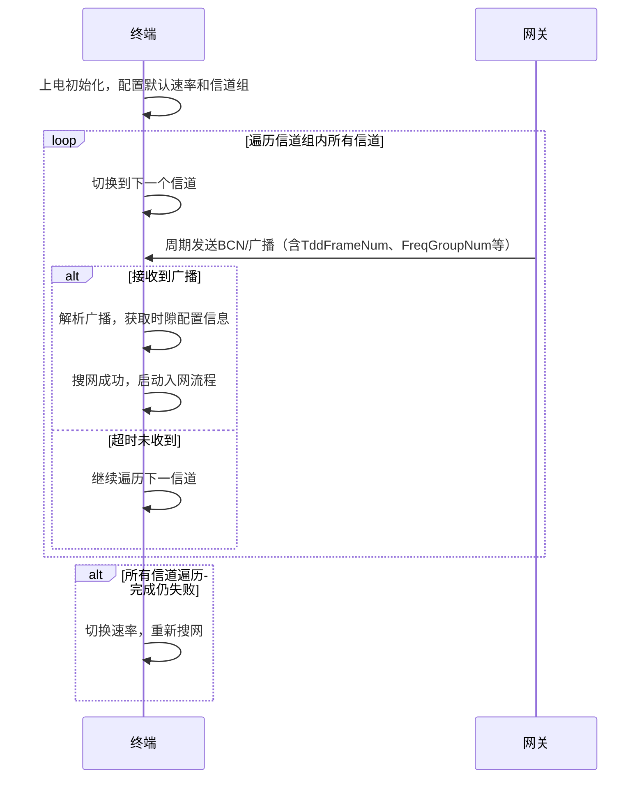
```mermaid
sequenceDiagram
    participant TE as 终端
    participant GW as 网关
    
    TE->>TE: 上电初始化，配置默认速率和信道组
    
    loop 遍历信道组内所有信道
        TE->>TE: 切换到下一个信道
        GW->>TE: 周期发送BCN/广播（含TddFrameNum、FreqGroupNum等）
        
        alt 接收到广播
            TE->>TE: 解析广播，获取时隙配置信息
            TE->>TE: 搜网成功，启动入网流程
        else 超时未收到
            TE->>TE: 继续遍历下一信道
        end
    end
    
    alt 所有信道遍历完成仍失败
        TE->>TE: 切换速率，重新搜网
    end
```

## 7.2 入网流程

终端向网关/NS发起入网请求，获取网络地址和资源分配。

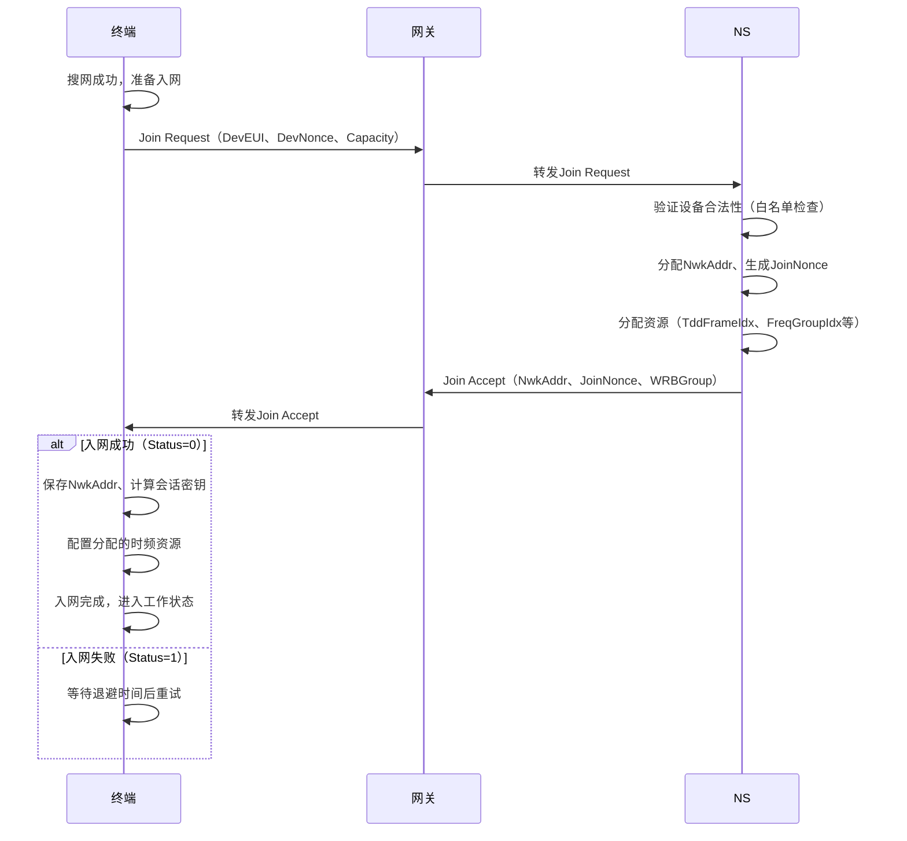
```mermaid
sequenceDiagram
    participant TE as 终端
    participant GW as 网关
    participant NS as NS
    
    TE->>TE: 搜网成功，准备入网
    TE->>GW: Join Request（DevEUI、DevNonce、Capacity）
    GW->>NS: 转发Join Request
    
    NS->>NS: 验证设备合法性（白名单检查）
    NS->>NS: 分配NwkAddr、生成JoinNonce
    NS->>NS: 分配资源（TddFrameIdx、FreqGroupIdx等）
    
    NS->>GW: Join Accept（NwkAddr、JoinNonce、WRBGroup）
    GW->>TE: 转发Join Accept
    
    alt 入网成功（Status=0）
        TE->>TE: 保存NwkAddr、计算会话密钥
        TE->>TE: 配置分配的时频资源
        TE->>TE: 入网完成，进入工作状态
    else 入网失败（Status=1）
        TE->>TE: 等待退避时间后重试
    end
```

## 7.3 离网流程

终端主动离网或被NS强制离网，释放网络资源。

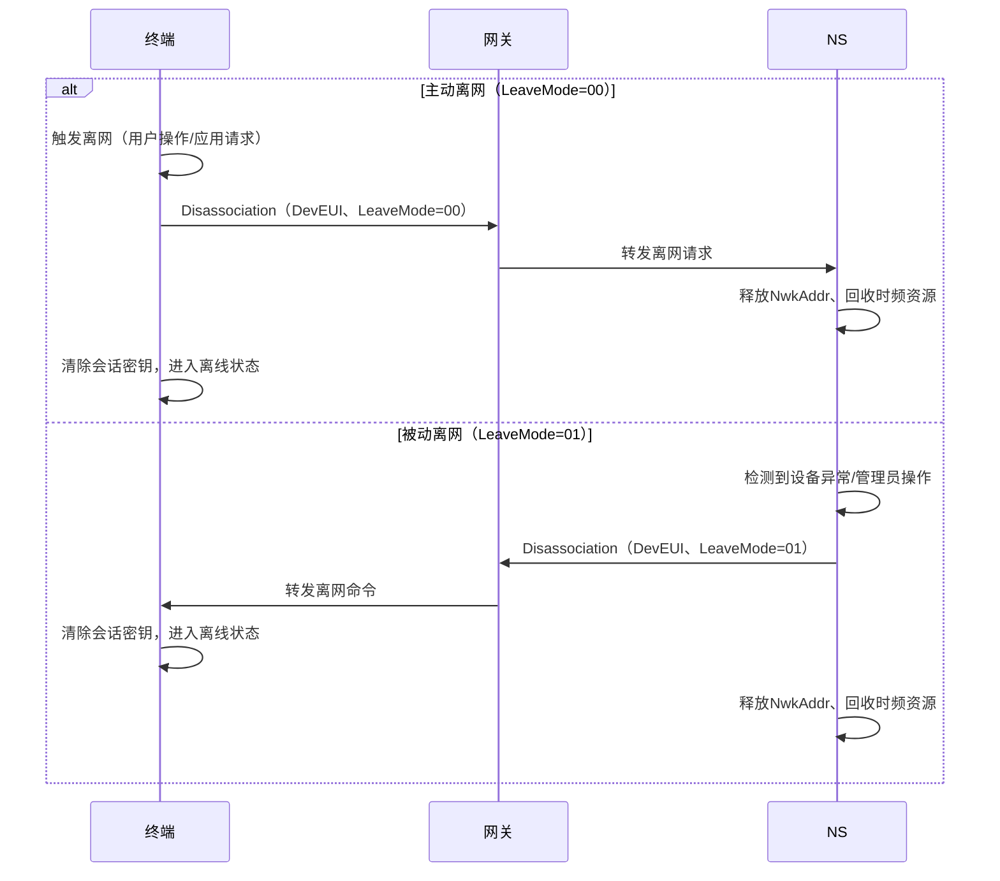
```mermaid
sequenceDiagram
    participant TE as 终端
    participant GW as 网关
    participant NS as NS
    
    alt 主动离网（LeaveMode=00）
        TE->>TE: 触发离网（用户操作/应用请求）
        TE->>GW: Disassociation（DevEUI、LeaveMode=00）
        GW->>NS: 转发离网请求
        NS->>NS: 释放NwkAddr、回收时频资源
        TE->>TE: 清除会话密钥，进入离线状态
        
    else 被动离网（LeaveMode=01）
        NS->>NS: 检测到设备异常/管理员操作
        NS->>GW: Disassociation（DevEUI、LeaveMode=01）
        GW->>TE: 转发离网命令
        TE->>TE: 清除会话密钥，进入离线状态
        NS->>NS: 释放NwkAddr、回收时频资源
    end
```

## 7.4 单包数据上行流程

终端向网关发送业务数据，支持确认和非确认模式。（针对确认模式：WAN对所有分包一起回ACK）

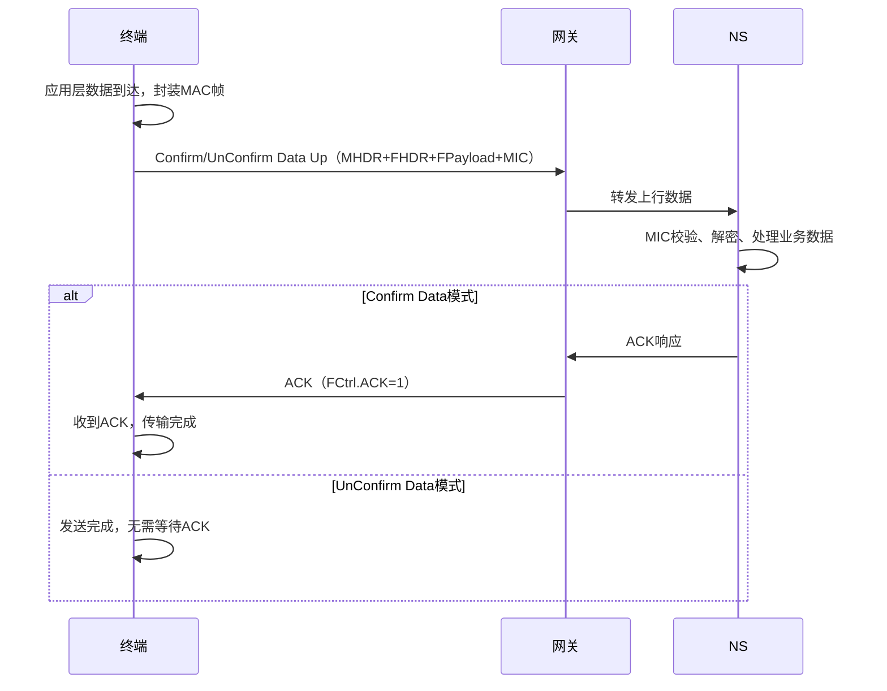
```mermaid
sequenceDiagram
    participant TE as 终端
    participant GW as 网关
    participant NS as NS
    
    TE->>TE: 应用层数据到达，封装MAC帧

    TE->>GW: Confirm/UnConfirm Data Up（MHDR+FHDR+FPayload+MIC）
    GW->>NS: 转发上行数据
    NS->>NS: MIC校验、解密、处理业务数据
    
    alt Confirm Data模式
        NS->>GW: ACK响应
        GW->>TE: ACK（FCtrl.ACK=1）
        TE->>TE: 收到ACK，传输完成
    else UnConfirm Data模式
        TE->>TE: 发送完成，无需等待ACK
    end
```

## 7.5 单包数据下行流程

NS向终端发送业务数据或控制命令。

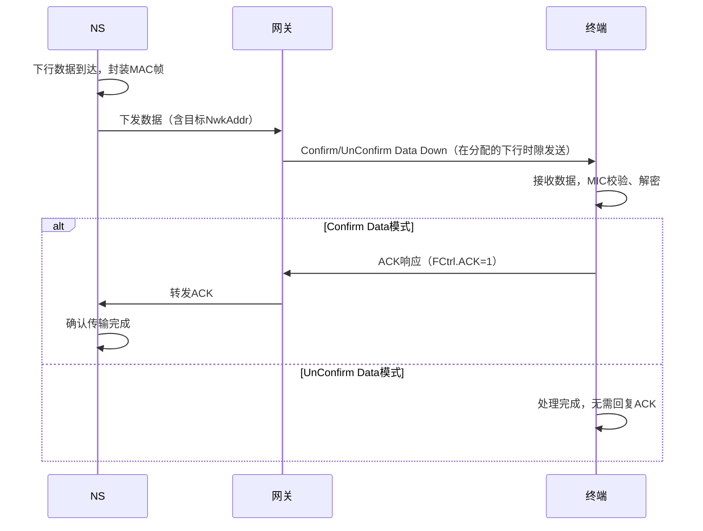
```mermaid
sequenceDiagram
    participant NS as NS
    participant GW as 网关
    participant TE as 终端
    
    NS->>NS: 下行数据到达，封装MAC帧
    
    NS->>GW: 下发数据（含目标NwkAddr）
    GW->>TE: Confirm/UnConfirm Data Down（在分配的下行时隙发送）
    TE->>TE: 接收数据，MIC校验、解密
    
    alt Confirm Data模式
        TE->>GW: ACK响应（FCtrl.ACK=1）
        GW->>NS: 转发ACK
        NS->>NS: 确认传输完成
    else UnConfirm Data模式
        TE->>TE: 处理完成，无需回复ACK
    end
```

## 7.6 广播发送流程

网关周期性发送广播消息，用于网络同步和配置下发。支持两种模式：网关自主管理广播和NS下发Payload广播。

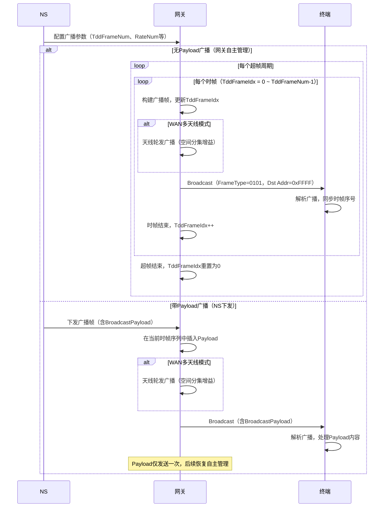
```mermaid
sequenceDiagram
    participant NS as NS
    participant GW as 网关
    participant TE as 终端
    
    NS->>GW: 配置广播参数（TddFrameNum、RateNum等）
    
    alt 无Payload广播（网关自主管理）
        loop 每个超帧周期
            loop 每个时帧（TddFrameIdx = 0 ~ TddFrameNum-1）
                GW->>GW: 构建广播帧，更新TddFrameIdx
                
                alt WAN多天线模式
                    GW->>GW: 天线轮发广播（空间分集增益）
                end
                
                GW->>TE: Broadcast（FrameType=0101，Dst Addr=0xFFFF）
                TE->>TE: 解析广播，同步时帧序号
                GW->>GW: 时帧结束，TddFrameIdx++
            end
            GW->>GW: 超帧结束，TddFrameIdx重置为0
        end
        
    else 带Payload广播（NS下发）
        NS->>GW: 下发广播帧（含BroadcastPayload）
        GW->>GW: 在当前时帧序列中插入Payload
        
        alt WAN多天线模式
            GW->>GW: 天线轮发广播（空间分集增益）
        end
        
        GW->>TE: Broadcast（含BroadcastPayload）
        TE->>TE: 解析广播，处理Payload内容
        Note over GW: Payload仅发送一次，后续恢复自主管理
    end
```

## 7.7 分包/重传流程

**WAN特殊说明**：WAN对所有分包只做一次ACK，只在最后一个分包传输完成后进行确认，而不对各个分包单独回复ACK

### 7.7.1 分包流程

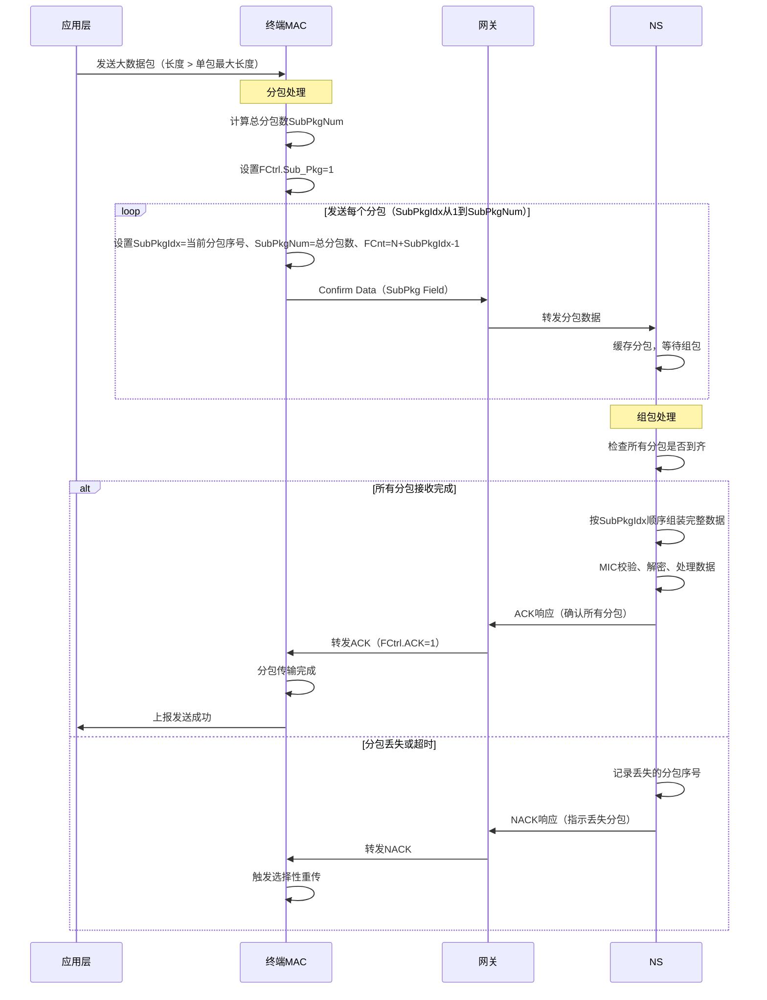
```mermaid
sequenceDiagram
    participant APP as 应用层
    participant TE as 终端MAC
    participant GW as 网关
    participant NS as NS
    APP->>TE: 发送大数据包（长度 > 单包最大长度）
    Note over TE: 分包处理
    TE->>TE: 计算总分包数SubPkgNum
    TE->>TE: 设置FCtrl.Sub_Pkg=1
    loop 发送每个分包（SubPkgIdx从1到SubPkgNum）
        TE->>TE: 设置SubPkgIdx=当前分包序号、SubPkgNum=总分包数、FCnt=N+SubPkgIdx-1
        TE->>GW: Confirm Data（SubPkg Field）
        GW->>NS: 转发分包数据
        NS->>NS: 缓存分包，等待组包
    end
    Note over NS: 组包处理
    NS->>NS: 检查所有分包是否到齐
    alt 所有分包接收完成
        NS->>NS: 按SubPkgIdx顺序组装完整数据
        NS->>NS: MIC校验、解密、处理数据
        NS->>GW: ACK响应（确认所有分包）
        GW->>TE: 转发ACK（FCtrl.ACK=1）
        TE->>TE: 分包传输完成
        TE->>APP: 上报发送成功
    else 分包丢失或超时
        NS->>NS: 记录丢失的分包序号
        NS->>GW: NACK响应（指示丢失分包）
        GW->>TE: 转发NACK
        TE->>TE: 触发选择性重传
    end
```

### 7.7.2 重传流程

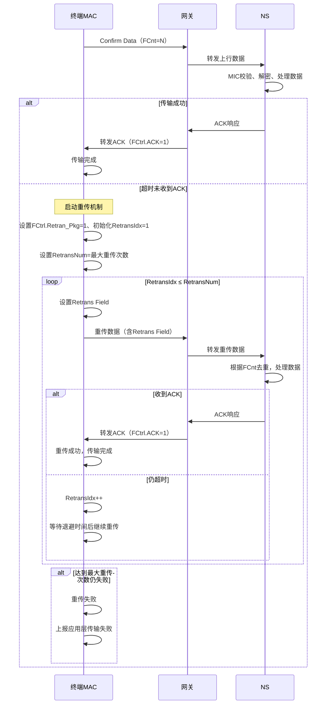
```mermaid
sequenceDiagram
    participant TE as 终端MAC
    participant GW as 网关
    participant NS as NS
    
    TE->>GW: Confirm Data（FCnt=N）
    GW->>NS: 转发上行数据
    NS->>NS: MIC校验、解密、处理数据
    
    alt 传输成功
        NS->>GW: ACK响应
        GW->>TE: 转发ACK（FCtrl.ACK=1）
        TE->>TE: 传输完成
        
    else 超时未收到ACK
        Note over TE: 启动重传机制
        TE->>TE: 设置FCtrl.Retran_Pkg=1、初始化RetransIdx=1
        TE->>TE: 设置RetransNum=最大重传次数
        
        loop RetransIdx ≤ RetransNum
            TE->>TE: 设置Retrans Field
            TE->>GW: 重传数据（含Retrans Field）
            GW->>NS: 转发重传数据
            NS->>NS: 根据FCnt去重，处理数据
            
            alt 收到ACK
                NS->>GW: ACK响应
                GW->>TE: 转发ACK（FCtrl.ACK=1）
                TE->>TE: 重传成功，传输完成
            else 仍超时
                TE->>TE: RetransIdx++
                TE->>TE: 等待退避时间后继续重传
            end
        end
        
        alt 达到最大重传次数仍失败
            TE->>TE: 重传失败
            TE->>TE: 上报应用层传输失败
        end
    end
```

### 7.7.3 分包重传流程（选择性重传）

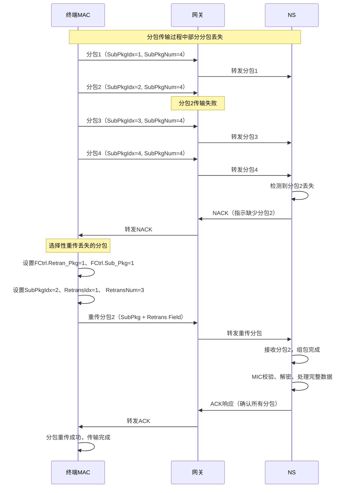
```mermaid
sequenceDiagram
    participant TE as 终端MAC
    participant GW as 网关
    participant NS as NS
    
    Note over TE,NS: 分包传输过程中部分分包丢失
    
    TE->>GW: 分包1（SubPkgIdx=1, SubPkgNum=4）
    GW->>NS: 转发分包1
    TE->>GW: 分包2（SubPkgIdx=2, SubPkgNum=4）
    Note over GW: 分包2传输失败
    TE->>GW: 分包3（SubPkgIdx=3, SubPkgNum=4）
    GW->>NS: 转发分包3
    TE->>GW: 分包4（SubPkgIdx=4, SubPkgNum=4）
    GW->>NS: 转发分包4
    
    NS->>NS: 检测到分包2丢失
    NS->>GW: NACK（指示缺少分包2）
    GW->>TE: 转发NACK
    
    Note over TE: 选择性重传丢失的分包
    TE->>TE: 设置FCtrl.Retran_Pkg=1、FCtrl.Sub_Pkg=1
    TE->>TE: 设置SubPkgIdx=2、RetransIdx=1、 RetransNum=3
    
    TE->>GW: 重传分包2（SubPkg + Retrans Field）
    GW->>NS: 转发重传分包
    
    NS->>NS: 接收分包2，组包完成
    NS->>NS: MIC校验、解密、处理完整数据
    NS->>GW: ACK响应（确认所有分包）
    GW->>TE: 转发ACK
    TE->>TE: 分包重传成功，传输完成
```

## 7.8 低功耗唤醒流程

休眠终端的唤醒与恢复通信流程。

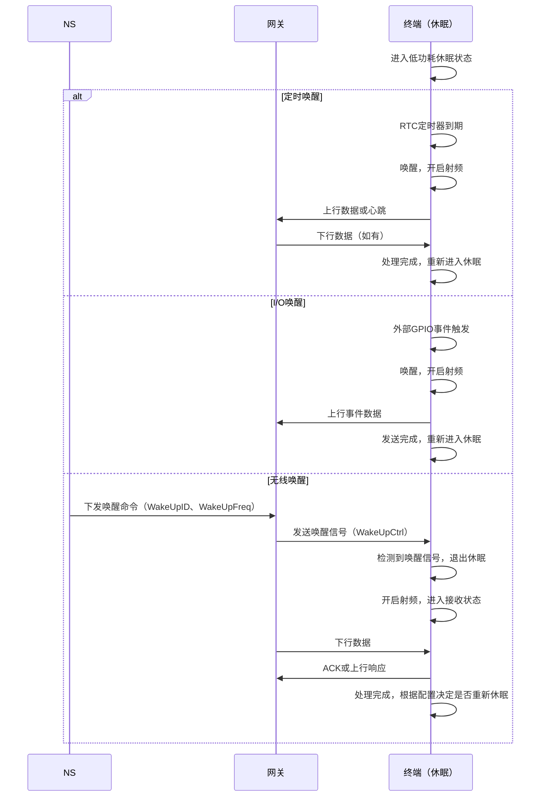
```mermaid
sequenceDiagram
    participant NS as NS
    participant GW as 网关
    participant TE as 终端（休眠）
    
    TE->>TE: 进入低功耗休眠状态
    
    alt 定时唤醒
        TE->>TE: RTC定时器到期
        TE->>TE: 唤醒，开启射频
        TE->>GW: 上行数据或心跳
        GW->>TE: 下行数据（如有）
        TE->>TE: 处理完成，重新进入休眠
        
    else I/O唤醒
        TE->>TE: 外部GPIO事件触发
        TE->>TE: 唤醒，开启射频
        TE->>GW: 上行事件数据
        TE->>TE: 发送完成，重新进入休眠
        
    else 无线唤醒
        NS->>GW: 下发唤醒命令（WakeUpID、WakeUpFreq）
        GW->>TE: 发送唤醒信号（WakeUpCtrl）
        TE->>TE: 检测到唤醒信号，退出休眠
        TE->>TE: 开启射频，进入接收状态
        GW->>TE: 下行数据
        TE->>GW: ACK或上行响应
        TE->>TE: 处理完成，根据配置决定是否重新休眠
    end
```

## 7.9 速率调整流程

终端MAC协议栈根据链路质量自适应调整通信速率，NS在入网响应中提供参考工作速率。

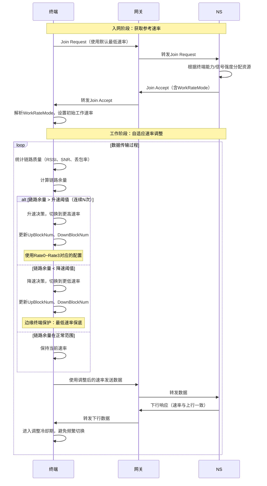
```mermaid
sequenceDiagram
    participant TE as 终端
    participant GW as 网关
    participant NS as NS
    
    Note over TE,NS: 入网阶段：获取参考速率
    TE->>GW: Join Request（使用默认最低速率）
    GW->>NS: 转发Join Request
    NS->>NS: 根据终端能力/信号强度分配资源
    NS->>GW: Join Accept（含WorkRateMode）
    GW->>TE: 转发Join Accept
    TE->>TE: 解析WorkRateMode，设置初始工作速率
    
    Note over TE,NS: 工作阶段：自适应速率调整
    loop 数据传输过程
        TE->>TE: 统计链路质量（RSSI、SNR、丢包率）
        TE->>TE: 计算链路余量
        
        alt 链路余量 > 升速阈值（连续N次）
            TE->>TE: 升速决策，切换到更高速率
            TE->>TE: 更新UpBlockNum、DownBlockNum
            Note over TE: 使用Rate0~Rate3对应的配置
            
        else 链路余量 < 降速阈值
            TE->>TE: 降速决策，切换到更低速率
            TE->>TE: 更新UpBlockNum、DownBlockNum
            Note over TE: 边缘终端保护：最低速率保底
            
        else 链路余量在正常范围
            TE->>TE: 保持当前速率
        end
        
        TE->>GW: 使用调整后的速率发送数据
        GW->>NS: 转发数据
        NS->>GW: 下行响应（速率与上行一致）
        GW->>TE: 转发下行数据
        
        TE->>TE: 进入调整冷却期，避免频繁切换
    end
```

## 7.10 闭环功控流程

基于接收端反馈进行功率调整，实现精确功率控制。

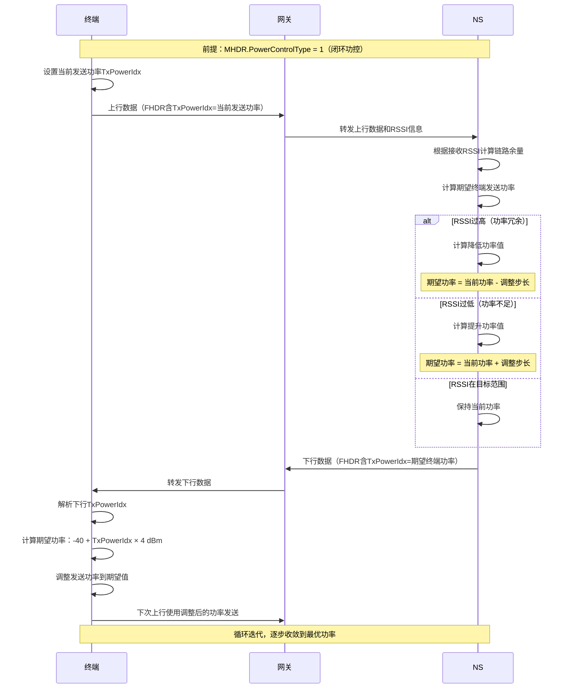
```mermaid
sequenceDiagram
    participant TE as 终端
    participant GW as 网关
    participant NS as NS
    
    Note over TE,NS: 前提：MHDR.PowerControlType = 1（闭环功控）
    
    TE->>TE: 设置当前发送功率TxPowerIdx
    TE->>GW: 上行数据（FHDR含TxPowerIdx=当前发送功率）
    GW->>NS: 转发上行数据和RSSI信息
    
    NS->>NS: 根据接收RSSI计算链路余量
    NS->>NS: 计算期望终端发送功率
    
    alt RSSI过高（功率冗余）
        NS->>NS: 计算降低功率值
        Note over NS: 期望功率 = 当前功率 - 调整步长
        
    else RSSI过低（功率不足）
        NS->>NS: 计算提升功率值
        Note over NS: 期望功率 = 当前功率 + 调整步长
        
    else RSSI在目标范围
        NS->>NS: 保持当前功率
    end
    
    NS->>GW: 下行数据（FHDR含TxPowerIdx=期望终端功率）
    GW->>TE: 转发下行数据
    
    TE->>TE: 解析下行TxPowerIdx
    TE->>TE: 计算期望功率：-40 + TxPowerIdx × 4 dBm
    TE->>TE: 调整发送功率到期望值
    
    TE->>GW: 下次上行使用调整后的功率发送
    Note over TE,NS: 循环迭代，逐步收敛到最优功率
```

## 7.11 QoS服务流程

基于业务优先级的服务质量保障机制，确保重要业务优先传输。

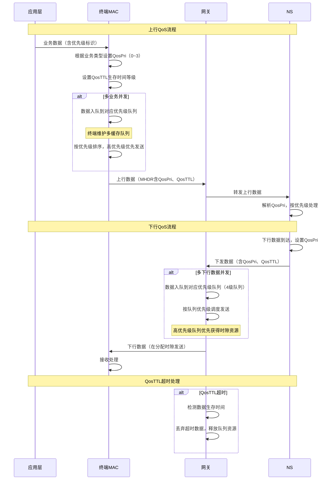
```mermaid
sequenceDiagram
    participant APP as 应用层
    participant TE as 终端MAC
    participant GW as 网关
    participant NS as NS
    
    Note over APP,NS: 上行QoS流程
    
    APP->>TE: 业务数据（含优先级标识）
    TE->>TE: 根据业务类型设置QosPri（0~3）
    TE->>TE: 设置QosTTL生存时间等级
    
    alt 多业务并发
        TE->>TE: 数据入队到对应优先级队列
        Note over TE: 终端维护多缓存队列
        TE->>TE: 按优先级排序，高优先级优先发送
    end
    
    TE->>GW: 上行数据（MHDR含QosPri、QosTTL）
    GW->>NS: 转发上行数据
    NS->>NS: 解析QosPri，按优先级处理
    
    Note over APP,NS: 下行QoS流程
    
    NS->>NS: 下行数据到达，设置QosPri
    NS->>GW: 下发数据（含QosPri、QosTTL）
    
    alt 多下行数据并发
        GW->>GW: 数据入队到对应优先级队列（4级队列）
        GW->>GW: 按队列优先级调度发送
        Note over GW: 高优先级队列优先获得时隙资源
    end
    
    GW->>TE: 下行数据（在分配时隙发送）
    TE->>TE: 接收处理
    
    Note over APP,NS: QosTTL超时处理
    
    alt QosTTL超时
        GW->>GW: 检测数据生存时间
        GW->>GW: 丢弃超时数据，释放队列资源
    end
```

## 7.12 漫游切换流程

### 7.12.1 被动漫游切换流程

当原网关故障或无响应时，终端被动切换到新网关。LAN和WAN网络均支持此流程。

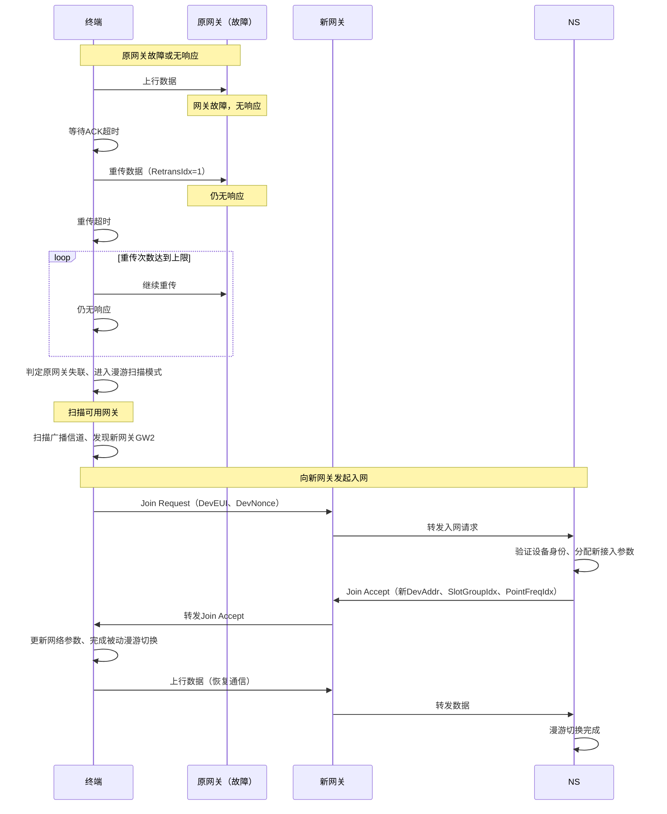
```mermaid
sequenceDiagram
    participant TE as 终端
    participant GW1 as 原网关（故障）
    participant GW2 as 新网关
    participant NS as NS
    
    Note over TE,GW1: 原网关故障或无响应
    
    TE->>GW1: 上行数据
    Note over GW1: 网关故障，无响应
    TE->>TE: 等待ACK超时
    
    TE->>GW1: 重传数据（RetransIdx=1）
    Note over GW1: 仍无响应
    TE->>TE: 重传超时
    
    loop 重传次数达到上限
        TE->>GW1: 继续重传
        TE->>TE: 仍无响应
    end
    
    TE->>TE: 判定原网关失联、进入漫游扫描模式
    
    Note over TE: 扫描可用网关
    TE->>TE: 扫描广播信道、发现新网关GW2
    
    Note over TE,NS: 向新网关发起入网
    TE->>GW2: Join Request（DevEUI、DevNonce）
    GW2->>NS: 转发入网请求
    NS->>NS: 验证设备身份、分配新接入参数
    
    NS->>GW2: Join Accept（新DevAddr、SlotGroupIdx、PointFreqIdx）
    GW2->>TE: 转发Join Accept
    TE->>TE: 更新网络参数、完成被动漫游切换
    
    TE->>GW2: 上行数据（恢复通信）
    GW2->>NS: 转发数据
    NS->>NS: 漫游切换完成
```

### 7.12.2 无缝漫游流程（WAN同频同步组网）

WAN网络采用同频同步组网，多个网关使用相同的频率和时隙结构，终端无需重新入网即可实现无缝漫游。

**WAN同频同步组网特点**：

- 所有网关使用相同的工作频率和时隙结构
- 终端入网参数（SlotGroupIdx、PointFreqIdx）在整个网络内有效
- NS统一管理所有网关，终端数据可被任意覆盖范围内的网关接收
- 终端无感知切换，无需重新入网

**无缝漫游关键机制**：

- **同频配置**：所有网关配置相同的工作频率，终端无需切换频率
- **同步时隙**：所有网关使用统一的时隙结构，终端按原有时隙发送
- **全网有效参数**：入网时分配的SlotGroupIdx、PointFreqIdx在整个网络内有效
- **NS统一调度**：NS根据接收数据的网关自动更新终端关联关系
- **最优下行选择**：NS选择信号质量最优的网关进行下行数据发送

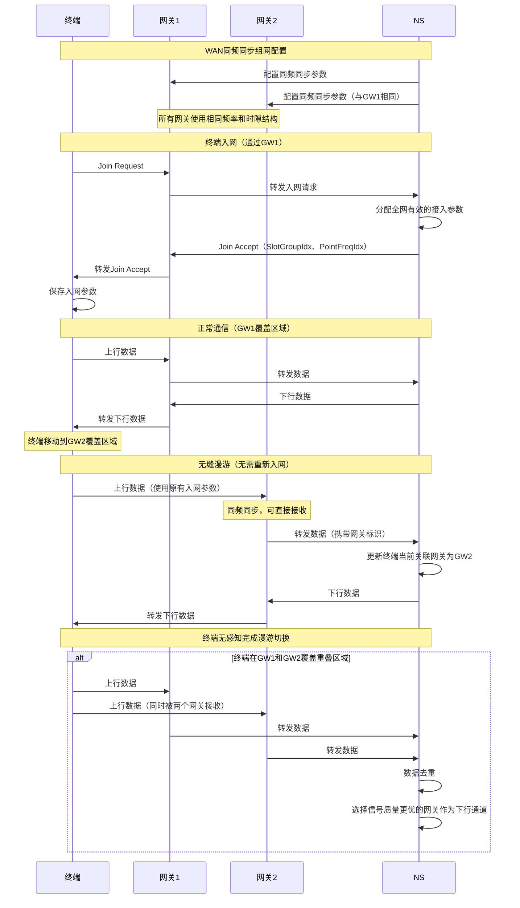
```mermaid
sequenceDiagram
    participant TE as 终端
    participant GW1 as 网关1
    participant GW2 as 网关2
    participant NS as NS
    
    Note over TE,NS: WAN同频同步组网配置
    
    NS->>GW1: 配置同频同步参数
    NS->>GW2: 配置同频同步参数（与GW1相同）
    Note over GW1,GW2: 所有网关使用相同频率和时隙结构
    
    Note over TE,NS: 终端入网（通过GW1）
    TE->>GW1: Join Request
    GW1->>NS: 转发入网请求
    NS->>NS: 分配全网有效的接入参数
    NS->>GW1: Join Accept（SlotGroupIdx、PointFreqIdx）
    GW1->>TE: 转发Join Accept
    TE->>TE: 保存入网参数
    
    Note over TE,NS: 正常通信（GW1覆盖区域）
    TE->>GW1: 上行数据
    GW1->>NS: 转发数据
    NS->>GW1: 下行数据
    GW1->>TE: 转发下行数据
    
    Note over TE: 终端移动到GW2覆盖区域
    
    Note over TE,NS: 无缝漫游（无需重新入网）
    TE->>GW2: 上行数据（使用原有入网参数）
    Note over GW2: 同频同步，可直接接收
    GW2->>NS: 转发数据（携带网关标识）
    NS->>NS: 更新终端当前关联网关为GW2
    NS->>GW2: 下行数据
    GW2->>TE: 转发下行数据
    
    Note over TE,NS: 终端无感知完成漫游切换
    
    alt 终端在GW1和GW2覆盖重叠区域
        TE->>GW1: 上行数据
        TE->>GW2: 上行数据（同时被两个网关接收）
        GW1->>NS: 转发数据
        GW2->>NS: 转发数据
        NS->>NS: 数据去重
        NS->>NS: 选择信号质量更优的网关作为下行通道
    end
```

# 8 附录

## 8.1 频率规划和信道划分表

参考《TurMass™ WAN 系统定义.pdf》文档中频率规划和信道划分表

## 8.2 LAN、WAN的字段差异

### 8.2.1 数据帧格式差异

数据帧结构（LAN）：

| MHDR   | MACPayload | MIC      |
| ------ | ---------- | -------- |
| 3Bytes | 7-597Bytes | 0/2Bytes |

数据帧结构（WAN）：

| MHDR   | PayLoadLen | MACPayload | MIC      |
| ------ | ---------- | ---------- | -------- |
| 3Bytes | 2Bytes     | 7-597Bytes | 0/2Bytes |

### 8.2.2 字段差异

| MHDR字段         | LAN                                                    | WAN                                                                                                       |
| ---------------- | ------------------------------------------------------ | --------------------------------------------------------------------------------------------------------- |
| HopCnt           | 4bit                                                   | 2bit                                                                                                      |
| HopNum           | 4bit                                                   | 2bit                                                                                                      |
| QosPri           | 无                                                     | 新增2bit QosPri：Qos优先级                                                                                |
| QosTTL           | 无                                                     | 新增2bit QosTTL:Qos生存时间等级                                                                           |
| PowerControlType | 无                                                     | 新增1bit功控类型： 0：开环功控 1：闭环功控                                                      |
| NwkMode          | 当NwkMode为LAN时，入网accept及广播中，使用LANGroup字段 | 当NwkMode为WAN时，入网accept和广播中，使用WANGroup资源组 当NwkMode为WAN时，新增2byte的PayloadLen字段 |

| FHDR字段   | LAN                           | WAN                                                                                                |
| ---------- | ----------------------------- | -------------------------------------------------------------------------------------------------- |
| TxPowerIdx | 无                            | MHDR中功控类型为闭环，则新增4bit闭环功控的字段，上行时添当前发送功率；下行时填期望终端上行发送功率 |
| ACK        | 有ACK时，LAN对每个分包都回ACK | 有ACK时，WAN对所有包一起回ACK，不在分包中回ACK                                                     |

### 8.2.4 入网accept帧类型差异

| **字段名称** | LAN                                                                          | WAN                        |
| ------------------ | ---------------------------------------------------------------------------- | -------------------------- |
| JoinResult         | 时隙资源块分配结果                                                           | 时隙、频域等资源块分配结果 |
| SRBGroup           | LAN：时隙资源块组：0-30bytes                                                 | WAN时隙资源块：7bytes      |
| GWID               | 网关唯一标识号，仅LAN有                                                      | 无                         |
| WakeUpCfg          | 低功耗设备携带，标识当前休眠唤醒配置信息，定义参考3.1.2.1章节扩展域，仅LAN有 | 无                         |

### 8.2.5 广播帧类型差异

广播帧结构（LAN）：

| MHDR   | BroadcastCtrl | BroadcastGroup |
| ------ | ------------- | -------------- |
| 3Bytes | 1Byte         | 0~599Byte      |

广播帧结构（WAN）：

| MHDR   | BroadcastGroup | BrocastPayloadLen | BrocastPayload |
| ------ | -------------- | ----------------- | -------------- |
| 3Bytes | 13Byte         | 1                 | 0-35Byte       |
